# Mermaid Diagram Guidelines

Use Mermaid diagrams to make documentation clearer, more maintainable, and easier to understand. Mermaid enables text-based diagrams that can be version-controlled alongside code.

## Core Principle: Visualize for Clarity

**Use Mermaid diagrams when:**
- Visual representation makes concepts clearer than prose alone
- Showing relationships, flows, or structures
- Documenting processes, architectures, or interactions
- Explaining complex logic or decision trees
- Illustrating system behavior or state transitions

**Avoid diagrams when:**
- Simple text or a list is equally clear
- The diagram would be overly complex (>20 nodes typically)
- Information is better suited for tables or code examples

---

## Diagram Types and Use Cases

### Flowcharts
**Purpose:** Visualize processes, algorithms, decision logic, and workflows

**Use flowcharts for:**
- Algorithm steps and control flow
- Business processes and procedures
- Decision trees and conditional logic
- System workflows and pipelines
- Troubleshooting guides
- User journeys through features

**Syntax:**
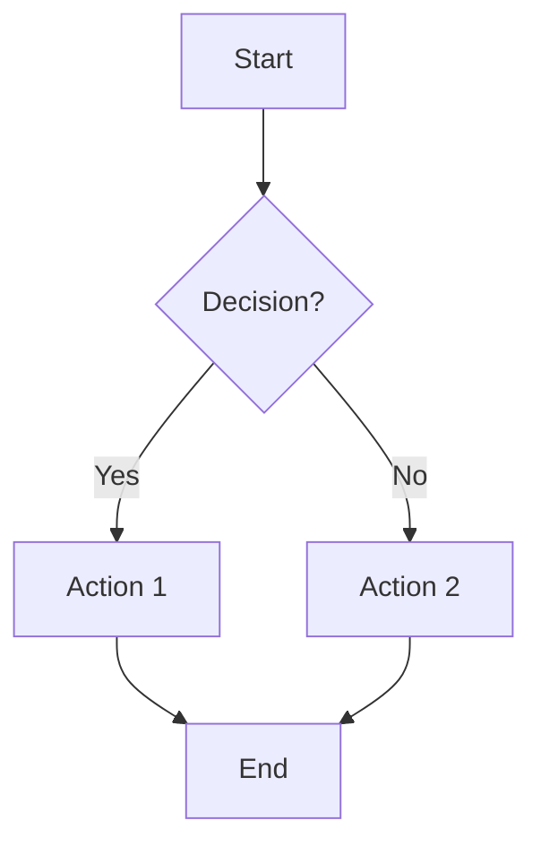

**Best practices:**
- Use `TD` (top-down) or `LR` (left-right) based on content flow
- Keep nodes descriptive but concise
- Use shapes meaningfully: rectangles for steps, diamonds for decisions, rounded for start/end
- Limit branches to maintain readability
- Add labels to edges for clarity on decision paths

---

### Sequence Diagrams
**Purpose:** Show interactions between actors/systems over time

**Use sequence diagrams for:**
- API request/response flows
- Authentication/authorization workflows
- Service-to-service communication
- Multi-step processes with multiple actors
- Error handling and edge cases
- Message passing between components

**Syntax:**
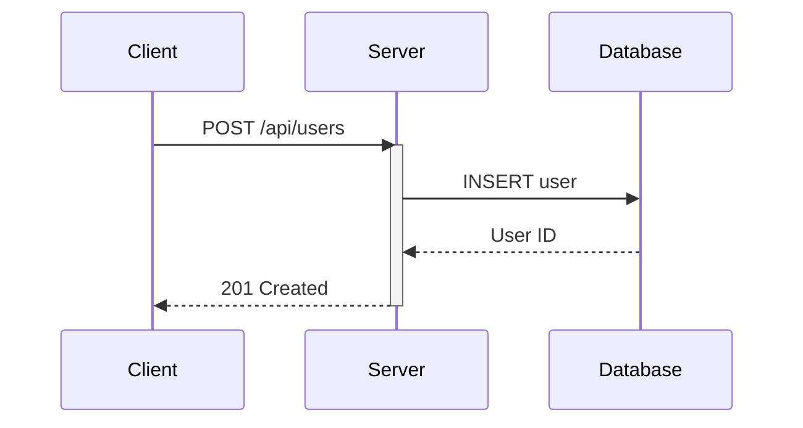

**Best practices:**
- Order participants logically (left to right by call frequency)
- Use `activate`/`deactivate` to show processing time
- Add `autonumber` for step references
- Use notes for important context: `Note over Server: Validates input`
- Show both success and error paths with `alt`/`else`
- Use `par` for parallel operations
- Group related actors with `box`

---

### Class Diagrams
**Purpose:** Model object-oriented structure, relationships, and data models

**Use class diagrams for:**
- Code architecture and class structure
- Database schema visualization
- API data models
- Design patterns
- Inheritance hierarchies
- Interface definitions

**Syntax:**
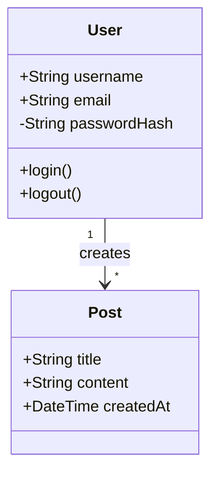

**Best practices:**
- Use visibility modifiers: `+` public, `-` private, `#` protected
- Show key attributes and methods only (avoid clutter)
- Indicate relationships clearly: inheritance `<|--`, composition `*--`, aggregation `o--`
- Add cardinality for relationships: `"1"`, `"*"`, `"0..1"`
- Group related classes
- Use interfaces/abstract classes with `<<interface>>`

---

### State Diagrams
**Purpose:** Visualize state machines and transitions

**Use state diagrams for:**
- Application state management
- Order/workflow status
- UI component states
- Connection states (connected/disconnected/error)
- Document approval workflows
- Game states
- Protocol state machines

**Syntax:**
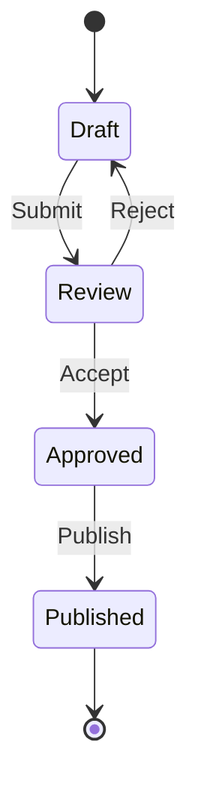

**Best practices:**
- Start with `[*]` for initial state
- Label transitions clearly
- Use notes for complex conditions
- Consider composite states for nested state machines
- Keep states at similar abstraction levels

---

### Gantt Charts
**Purpose:** Project timelines, schedules, and task dependencies

**Use Gantt charts for:**
- Project planning and milestones
- Release schedules
- Task dependencies and timelines
- Sprint planning visualization
- Roadmap communication

**Syntax:**
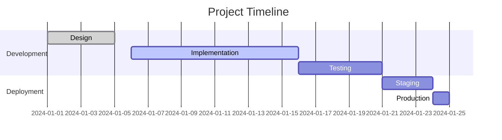

**Best practices:**
- Use clear section names for grouping
- Mark completed tasks as `:done`
- Show active tasks with `:active`
- Use `after` for dependencies
- Set realistic date formats
- Add milestones with `:milestone`

---

### Entity Relationship Diagrams (ERD)
**Purpose:** Database schema design and relationships

**Use ER diagrams for:**
- Database schema documentation
- Data model design
- Entity relationships and cardinality
- Schema evolution tracking

**Syntax:**
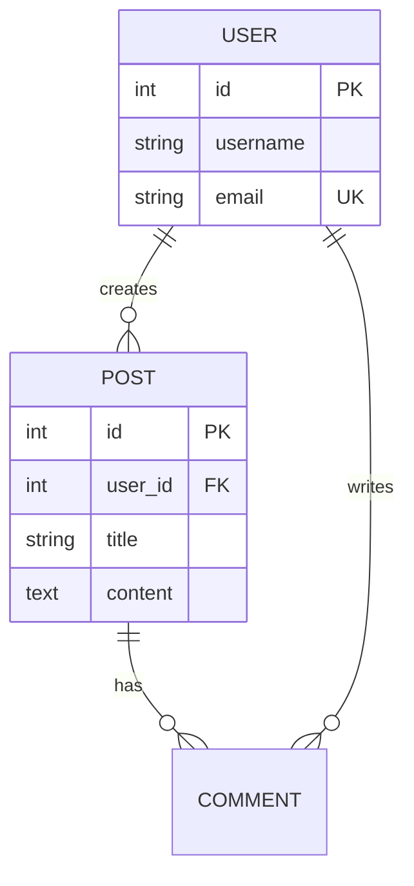

**Best practices:**
- Use cardinality correctly: `||--||` one-to-one, `||--o{` one-to-many, `}o--o{` many-to-many
- Mark primary keys with `PK`
- Mark foreign keys with `FK`
- Mark unique constraints with `UK`
- Keep entity names singular and uppercase

---

### Git Graphs
**Purpose:** Visualize Git branching and merging strategies

**Use Git graphs for:**
- Explaining branching strategies
- Documenting Git workflows
- Release management processes
- Merge/rebase demonstrations

**Syntax:**
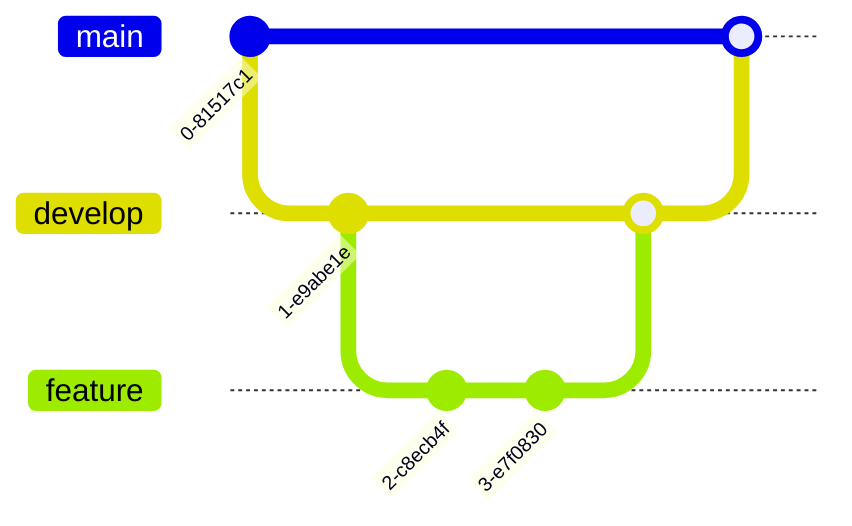

**Best practices:**
- Show realistic workflows
- Use `commit id: "message"` for important commits
- Demonstrate branch naming conventions
- Show merge vs rebase patterns
- Keep graphs focused on key concepts

---

### User Journey Diagrams
**Purpose:** Map user experiences and satisfaction through processes

**Use user journey diagrams for:**
- UX research documentation
- Customer experience mapping
- Feature adoption flows
- Onboarding processes

**Syntax:**
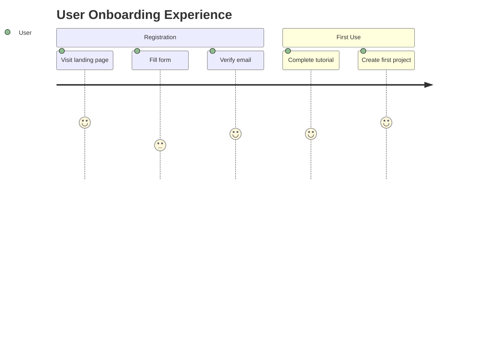

---

### Pie and XY Charts
**Purpose:** Simple data visualization

**Use charts for:**
- Proportional data (pie)
- Metrics and statistics
- Trend visualization (XY)
- Quick data insights

**Syntax:**
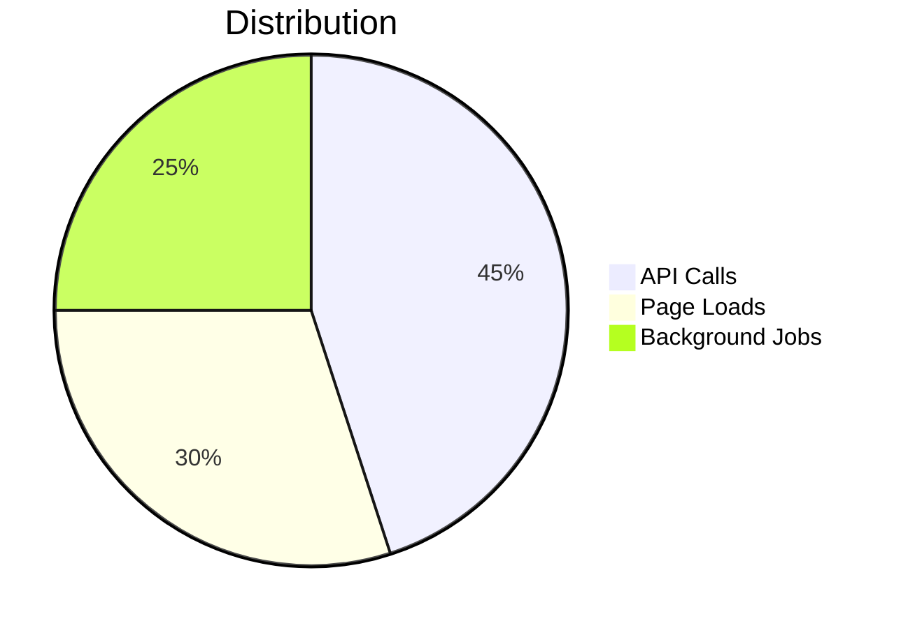

---

## General Best Practices

### When to Create Diagrams
- **Documentation**: Explain architecture, APIs, processes
- **Planning**: Design before implementation
- **Communication**: Share complex ideas with team
- **Debugging**: Map out system behavior
- **Onboarding**: Help new team members understand systems

### Diagram Quality Standards
1. **Clarity over completeness**: Show what matters, hide details
2. **Consistent naming**: Use project terminology
3. **Appropriate abstraction**: Match detail level to audience
4. **Self-documenting**: Diagram should be understandable without extensive external explanation
5. **Keep it simple**: If diagram has >20 nodes, consider breaking it up

### Formatting Conventions
- Use descriptive node/entity names
- Add notes for important context
- Apply consistent styling within project
- Use subgraphs/sections to organize large diagrams
- Include titles for context: `---\ntitle: My Diagram\n---`

### Comments and Maintenance
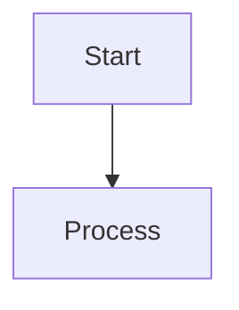

- Add comments to explain complex logic
- Update diagrams when code changes
- Date-stamp significant diagram updates in comments
- Include diagram purpose in comment header

---

## Common Patterns

### API Documentation Pattern
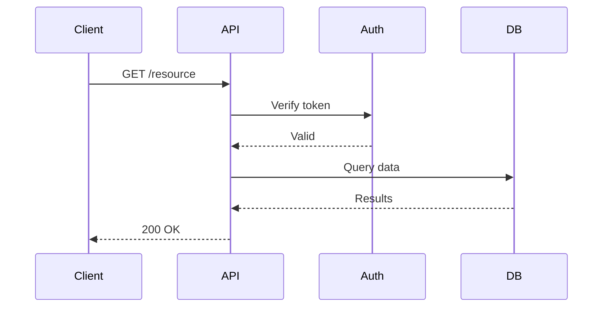

### State Machine Pattern
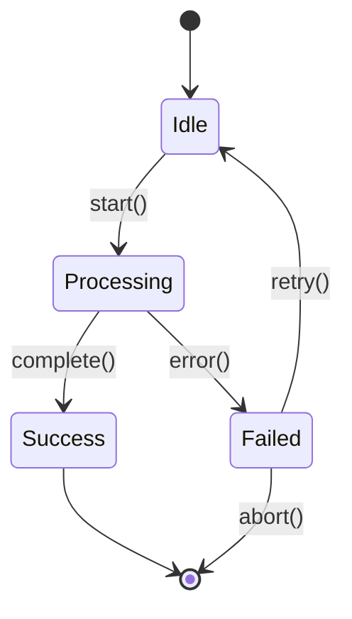

### System Architecture Pattern
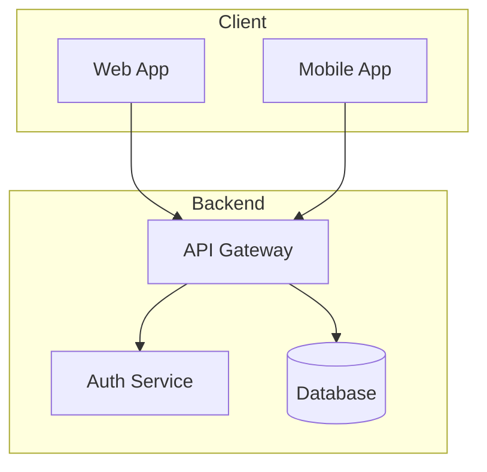

### Decision Tree Pattern
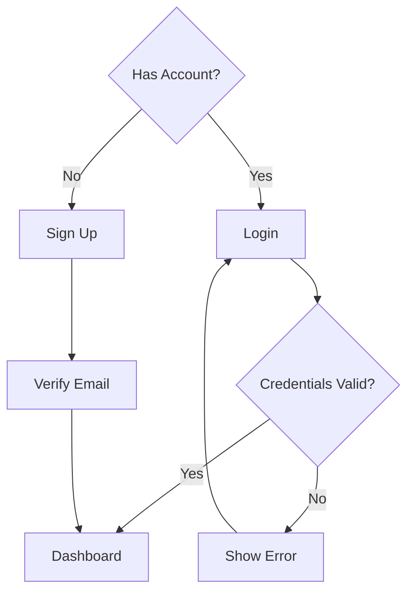

---

## Integration Tips

### In Markdown Files
Use code blocks with `mermaid` language:

````markdown

````

### In Code Comments
For languages supporting markdown in comments:
```python
"""
Process flow:

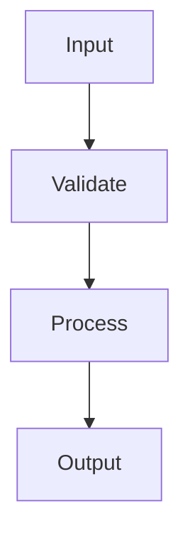
"""
```

### In Documentation Sites
Most documentation platforms support Mermaid natively:
- GitHub/GitLab markdown
- Notion
- Confluence (with plugins)
- Documentation generators (MkDocs, Docusaurus, etc.)

---

## Accessibility Considerations

- Provide text descriptions alongside complex diagrams
- Use descriptive node labels, not just symbols
- Ensure sufficient contrast in custom themes
- Include diagram purpose in surrounding text
- Consider providing both visual diagram and text-based alternative

---

## Quick Reference: Choosing Diagram Type

| Need to Show... | Use This Diagram Type |
|----------------|----------------------|
| Step-by-step process | Flowchart |
| System interactions over time | Sequence Diagram |
| Object structure and relationships | Class Diagram |
| State transitions | State Diagram |
| Project timeline | Gantt Chart |
| Database schema | ER Diagram |
| Git workflow | Git Graph |
| User experience journey | User Journey |
| Data proportions | Pie Chart |

---

## Resources

- Official documentation: https://mermaid.js.org/
- Live editor for testing: https://mermaid.live/
- Syntax reference: https://mermaid.js.org/intro/syntax-reference.html

## Summary

Use Mermaid diagrams liberally to:
- Make complex concepts visual and clear
- Keep documentation close to code
- Enable easy updates and version control
- Improve team communication
- Reduce misunderstandings

Choose diagram types based on what you're communicating, keep diagrams focused and clear, and update them as systems evolve.