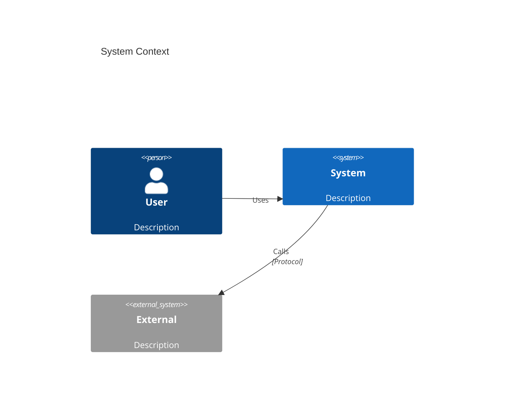
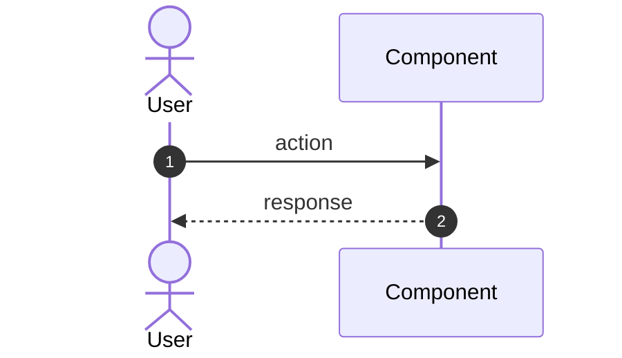
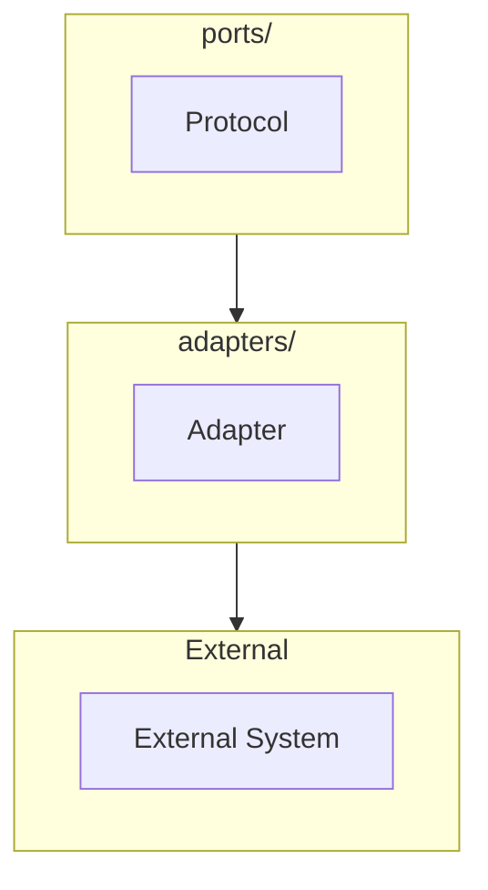

# Architecture Documentation Generator

Generate a Mermaid-first `architecture.md` for a feature using spec.md, plan.md, and project context.

## User Input

```text
${input:feature:Feature number (e.g., 031) or path to spec directory}
```

---

## Workflow

### 1. Locate Feature Artifacts

```bash
# Find the spec directory
SPEC_DIR="specs/${FEATURE_NUMBER}-*" || "specs/${FEATURE_PATH}"
ls -la $SPEC_DIR
```

Required inputs:
- `spec.md` — Feature specification (requirements, use cases)
- `plan.md` — Implementation plan (technical approach, components)

Optional inputs:
- `research.md` — Technical research and alternatives considered
- `data-model.md` — Data structures and schemas
- `tasks.md` — Implementation tasks (if already generated)

### 2. Load Project Context

Read these files for architectural alignment:

```bash
# Constitution (architecture principles)
cat .specify/memory/constitution.md

# Template (structure to follow)
cat .specify/templates/architecture-template.md

# Existing ADRs (for reference)
ls docs/adr/
```

### 3. Analyze Inputs

From `spec.md`, extract:
- **Purpose**: What the feature enables
- **Requirements**: Functional and non-functional
- **Use cases**: Primary flows to diagram
- **Constraints**: Technical or business limitations

From `plan.md`, extract:
- **Technical approach**: How it's being built
- **Components affected**: Which layers/modules change
- **Constitution alignment**: ADRs referenced
- **Dependencies**: External systems involved

### 4. Generate Architecture Document

Create `specs/{feature}/architecture.md` following the template with these rules:

#### Diagram Generation Rules

1. **C4 Context (Required)**
   - Show system boundary with this project as center
   - Include external systems: Google ADK, LLM providers, storage
   - Show primary actors (users, other systems)

2. **C4 Container (Required)**
   - Show major containers: API, Engine, Adapters, Proposer
   - Map to hexagonal layers: domain, ports, adapters, engine
   - Show data flow direction

3. **Hexagonal View (Required for this project)**
   - Show layer boundaries explicitly
   - Highlight which layer this feature touches
   - Show port/adapter relationships

4. **Sequence Diagrams (1-2 Required)**
   - Happy path: Main success scenario from spec
   - Error path: One failure/edge case

5. **ERD (Only if data changes)**
   - Show new/modified data structures
   - Include relationships

6. **Deployment (Only if infra-relevant)**
   - Local vs production differences
   - External service dependencies

#### Content Rules

1. **Do NOT invent** systems, data stores, or endpoints not in inputs
2. **Mark unknowns** as TODO in "Risks & Open Questions"
3. **Match terminology** exactly from spec/plan (same names, same concepts)
4. **Keep diagrams small** — multiple small diagrams > one giant diagram
5. **Include ADR references** from plan.md Constitution Check
6. **Align with hexagonal architecture** per constitution

### 5. Validate Output

```bash
# Verify Mermaid syntax (optional - use mermaid-cli if available)
# mmdc -i architecture.md -o /dev/null

# Check file was created
cat specs/${FEATURE}/architecture.md | head -50
```

### 6. Report

Output summary:
- File created: `specs/{feature}/architecture.md`
- Diagrams generated: [list]
- TODOs/unknowns: [count]
- ADRs referenced: [list]

---

## Architecture Template Reference

The generated document MUST follow the structure in:
`.specify/templates/architecture-template.md`

Key sections:
1. Purpose & Scope
2. Architecture at a Glance (plain English summary)
3. C4 Context Diagram
4. C4 Container Diagram
5. Component Diagram (if needed)
6. Hexagonal Architecture View
7. Sequence Diagrams (happy path + error)
8. Data Model (if persistence involved)
9. Quality Attributes
10. Testing Strategy
11. Risks & Open Questions
12. ADR References

---

## Diagram Standards

### C4 Model (Backbone)



### Sequence Diagrams



### Hexagonal (Flowchart)



---

## Error Handling

| Condition | Action |
|-----------|--------|
| spec.md not found | Error: "Run /speckit.specify first" |
| plan.md not found | Error: "Run /speckit.plan first" |
| Empty spec/plan | Warn: Generate minimal architecture with TODOs |
| Mermaid syntax error | Validate in mermaid.live, fix syntax |

---

## Examples

```bash
# Generate architecture for feature 031
/speckit.architecture 031

# Generate for current feature (if in specs/xxx-feature/ directory)
/speckit.architecture

# Generate from explicit path
/speckit.architecture specs/031-wire-reflection-model
```

---

## Integration with Spec Kit Workflow

```text
/speckit.specify → spec.md
       ↓
/speckit.plan → plan.md, research.md, data-model.md
       ↓
/speckit.architecture → architecture.md  ← THIS COMMAND
       ↓
/speckit.tasks → tasks.md
       ↓
/speckit.implement → code + tests
```

The architecture.md serves as the visual bridge between plan and implementation, ensuring the team has a shared understanding of the design before coding begins.
