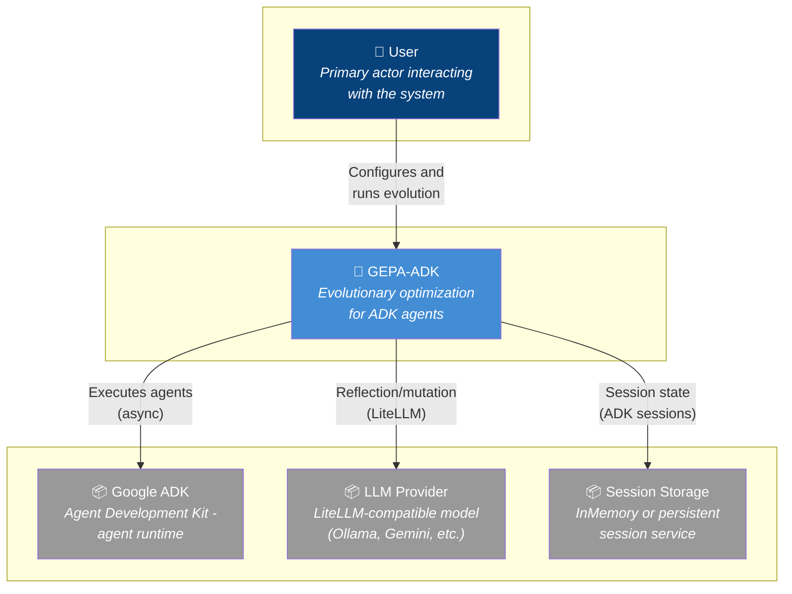
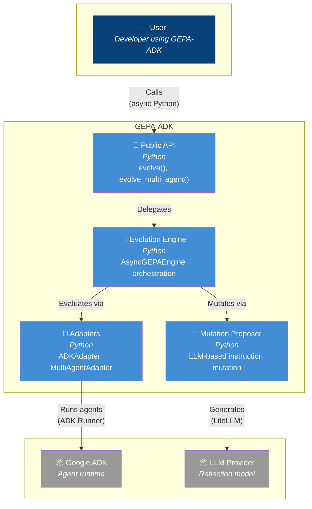
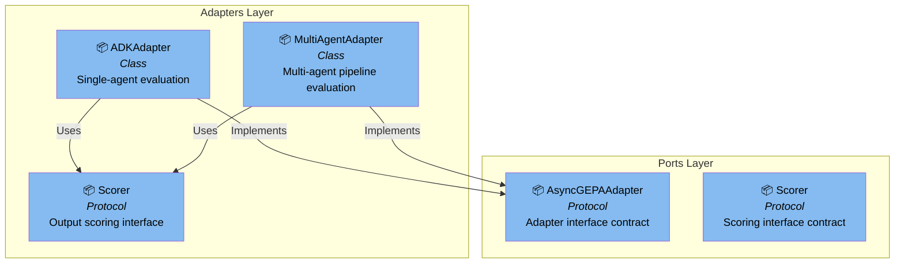
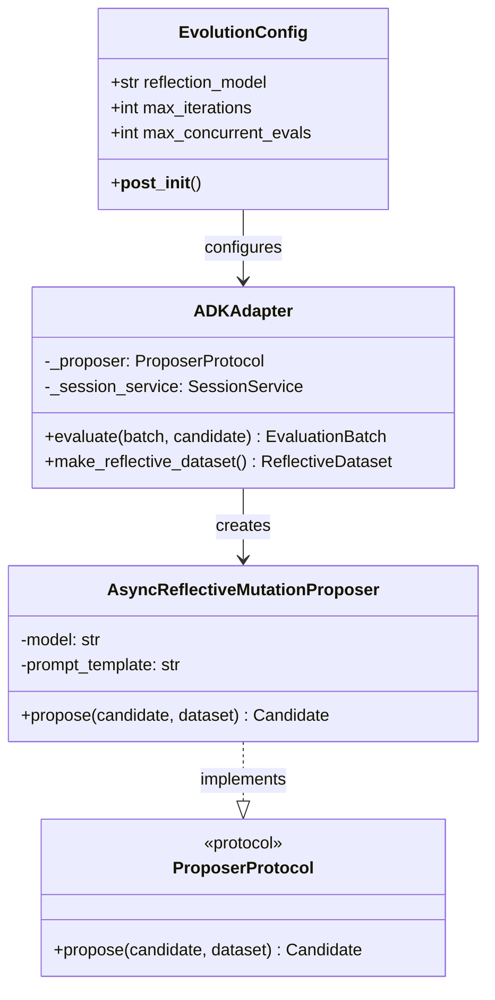
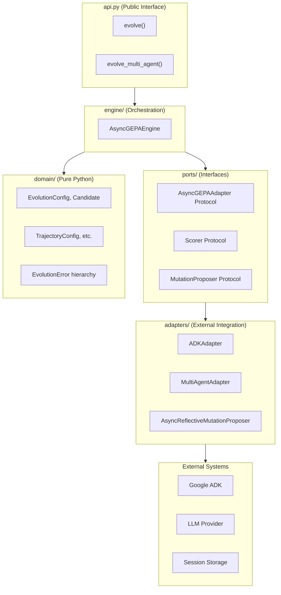
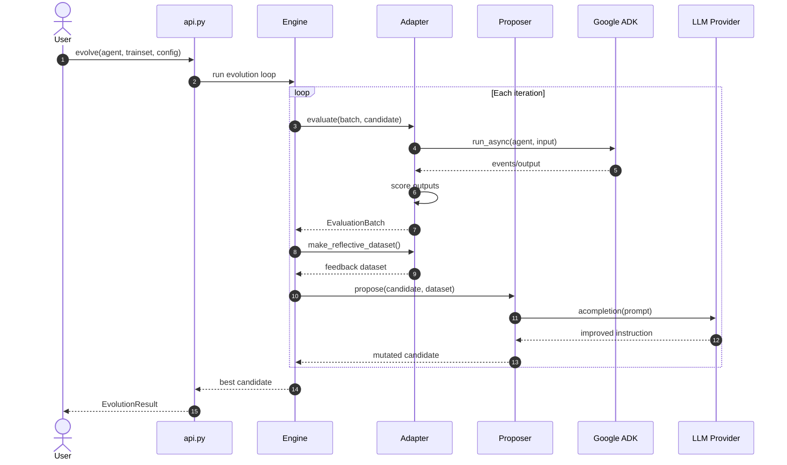
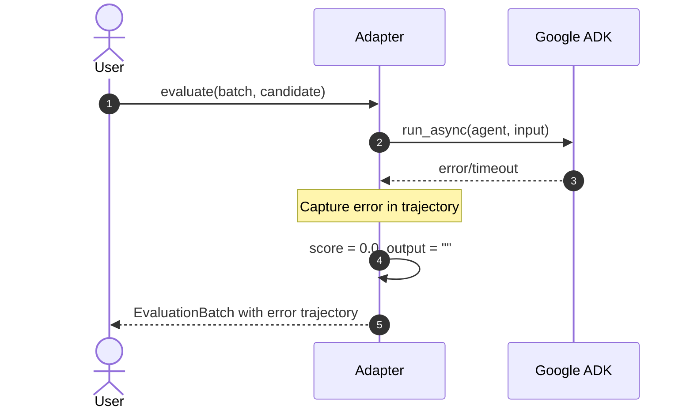
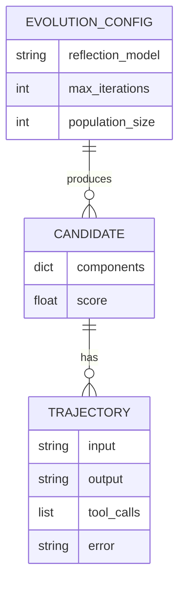
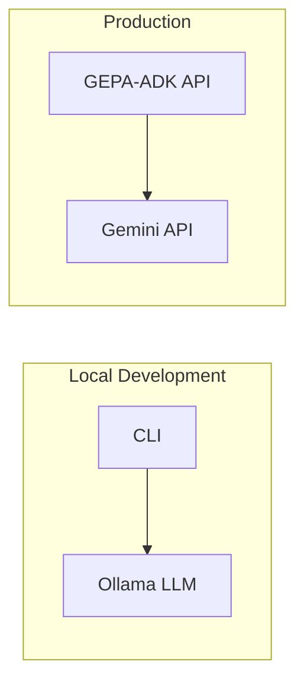
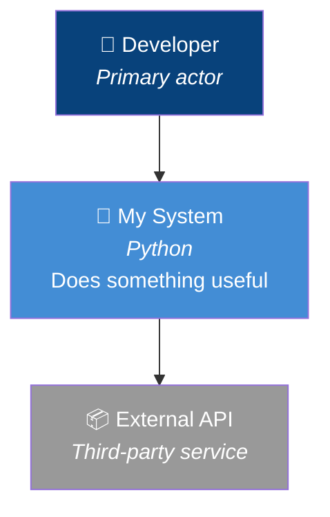

# Architecture: [FEATURE]

**Branch**: `[###-feature-name]` | **Date**: [DATE] | **Status**: draft | review | approved
**Spec**: [./spec.md] | **Plan**: [./plan.md] | **Tasks**: [./tasks.md]

**Note**: This template is filled in by the `/speckit.architecture` command. It generates Mermaid-first architecture documentation from spec.md and plan.md.

## 0. Links & References

- Feature Spec: `./spec.md`
- Implementation Plan: `./plan.md`
- Tasks: `./tasks.md`
- Related ADRs: [list ADRs from plan.md Constitution Check]
- PRs: [link when available]

## 1. Purpose & Scope

### Goal

[Extract from spec.md: what this feature enables, primary value proposition]

### Non-Goals

[Explicitly out of scope - from spec.md or plan.md]

### Scope Boundaries

- **In-scope**: [concrete deliverables]
- **Out-of-scope**: [explicitly excluded items]

## 2. Architecture at a Glance

[3-7 bullet summary of the architecture - plain English, no diagrams]

- [Key architectural decision 1]
- [Key component/layer affected]
- [Integration points]
- [Data flow summary]
- [Non-functional considerations]

## 3. Context Diagram (C4 Level 1)

> Shows how this feature fits into the broader system and external dependencies.
>
> **Note**: Uses flowchart TB for better layout control. Validate at [mermaid.live](https://mermaid.live).



## 4. Container Diagram (C4 Level 2)

> Shows the major containers (deployable units) within the system boundary.



## 5. Component Diagram (C4 Level 3)

> Shows the internal components of a container - use only when Container view is too coarse.



## 6. Code Diagram (C4 Level 4)

> Shows class/module relationships - use only when class structure clarifies the design. Optional for simple features.



## 7. Hexagonal Architecture View

> Project-specific: Shows how this feature aligns with the hexagonal (ports & adapters) architecture.



## 8. Runtime Behavior (Sequence Diagrams)

### 8.1 Happy Path: [Primary Flow Name]



### 8.2 Error/Edge Case: [Failure Scenario Name]



## 9. Data Model & Contracts

### 9.1 Data Changes (ERD)

> Include only if this feature adds/modifies persistent data structures.



### 9.2 API Contracts

**Public API Changes**:
- `evolve()` — [describe parameter/return changes]
- `EvolutionConfig` — [describe new fields]

**Internal Protocol Changes**:
- `AsyncGEPAAdapter` — [describe method signature changes]

## 10. Deployment / Infrastructure View

> Include only if infrastructure or deployment is relevant to this feature.



## 11. Quality Attributes (NFRs)

| Attribute | Requirement | Verification |
|-----------|-------------|--------------|
| **Performance** | [e.g., <100ms per evaluation] | Integration tests with timing |
| **Reliability** | [e.g., Graceful degradation on LLM failure] | Error handling tests |
| **Security** | [e.g., No secrets in logs] | Code review, TrajectoryConfig |
| **Maintainability** | [e.g., Hexagonal architecture compliance] | Layer import rules |
| **Observability** | [e.g., Structured logging with context] | Log format verification |

## 12. Testing Strategy

| Layer | Location | What to Test | Markers |
|-------|----------|--------------|---------|
| **Contract** | `tests/contracts/` | Protocol compliance | `@pytest.mark.contract` |
| **Unit** | `tests/unit/` | Business logic with mocks | `@pytest.mark.unit` |
| **Integration** | `tests/integration/` | Real ADK/LLM calls | `@pytest.mark.integration` |

**Key Test Scenarios**:
1. [Happy path test description]
2. [Error handling test description]
3. [Edge case test description]

## 13. Risks & Open Questions

### Risks

| Risk | Impact | Mitigation |
|------|--------|------------|
| [Risk 1] | [Impact description] | [Mitigation strategy] |

### Open Questions

- [ ] [Question 1 - needs resolution before implementation]
- [ ] [Question 2 - can be resolved during implementation]

### TODOs

- [ ] [Follow-up item tracked in tasks.md]

## 14. Decisions (ADR References)

| ADR | Title | Relevance to This Feature |
|-----|-------|---------------------------|
| ADR-000 | Hexagonal Architecture | [How this feature complies] |
| ADR-001 | Async-First | [Async patterns used] |
| ADR-002 | Protocol Interfaces | [Protocols affected] |
| ADR-005 | Three-Layer Testing | [Test strategy alignment] |

**New ADRs Needed**:
- [ ] ADR-XXX: [Title] — [Brief rationale if new decision required]

---

## Diagram Standards Reference

This document uses the following diagram types:

| Diagram Type | Purpose | When to Use |
|--------------|---------|-------------|
| **C4 Context** | System boundaries & external actors | Always |
| **C4 Container** | Deployable units within system | Always |
| **C4 Component** | Internal structure of a container | When container is complex |
| **Hexagonal** | Ports & adapters architecture view | Project-specific (always for this project) |
| **Sequence** | Runtime interactions | 1-2 key flows (happy path + error) |
| **ERD** | Data model changes | When persistence is involved |
| **Flowchart** | Deployment/infrastructure | When infra matters |

### C4 Color Scheme (flowchart TB style)

We use `flowchart TB` for C4 diagrams to enable top-to-bottom layout control:

| Element Type | Icon | Fill Color | Text Color | Usage |
|--------------|------|------------|------------|-------|
| Person/Actor | 👤 | `#08427B` | white | Users, developers, external actors |
| System (main) | 🔷 | `#438DD5` | white | Primary system being documented |
| Container | 🔷 | `#438DD5` | white | Deployable units within system |
| Component | 📦 | `#85BBF0` | black | Internal classes, modules, protocols |
| External System | 📦 | `#999` | white | Third-party systems, external services |

**Pattern for C4 nodes**:
```mermaid
node_id["ICON Title<br/><i>Subtitle/Type</i><br/>Description"]
```

**Example**:


**Mermaid Resources**:
- [Mermaid Live Editor](https://mermaid.live/) — Validate diagrams
- [Flowchart Syntax](https://mermaid.js.org/syntax/flowchart.html) — For C4-style diagrams
- [Sequence Diagrams](https://mermaid.js.org/syntax/sequenceDiagram.html)
- [ER Diagrams](https://mermaid.js.org/syntax/entityRelationshipDiagram.html)
