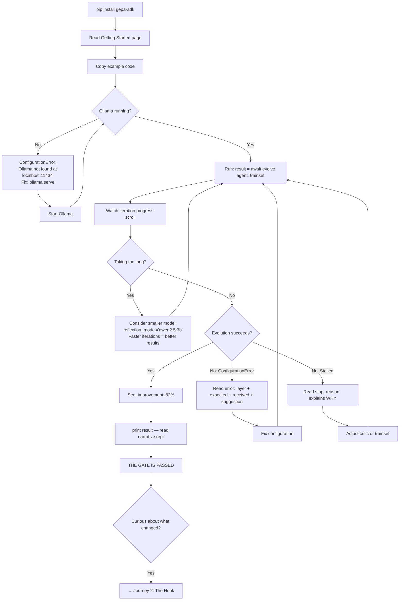
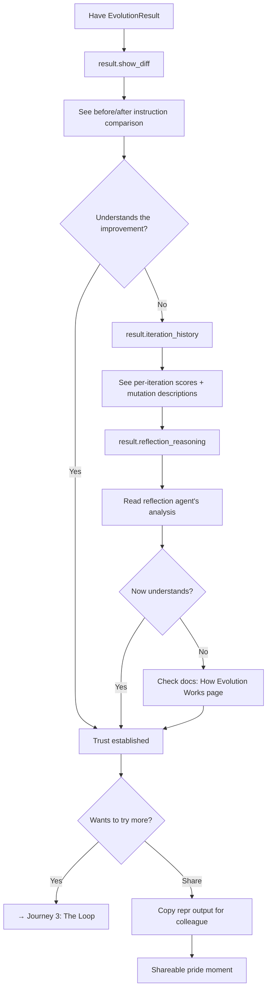
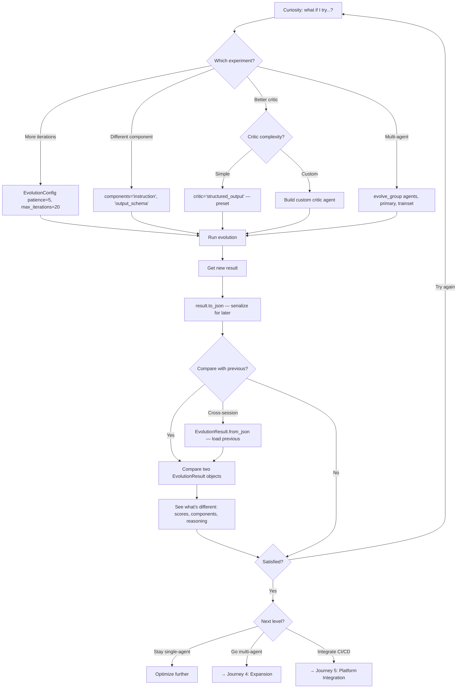
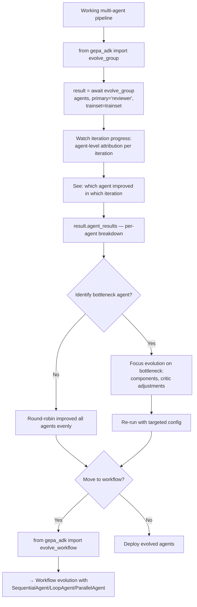
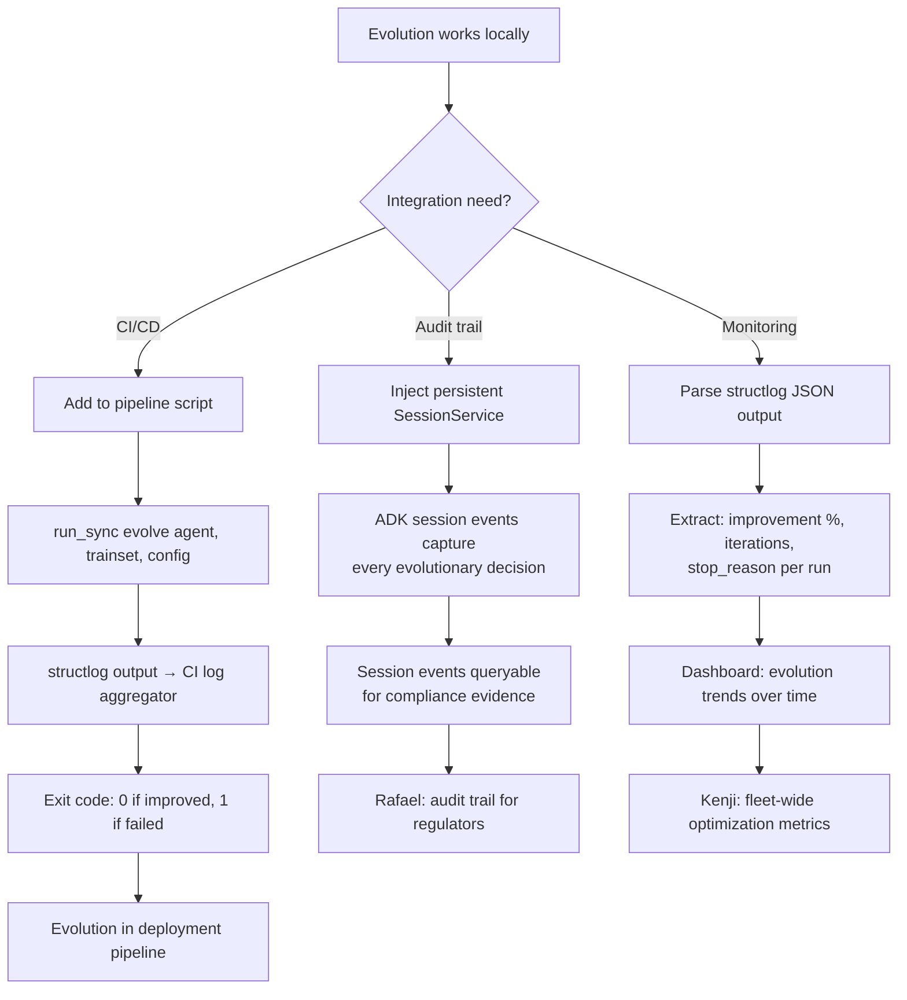
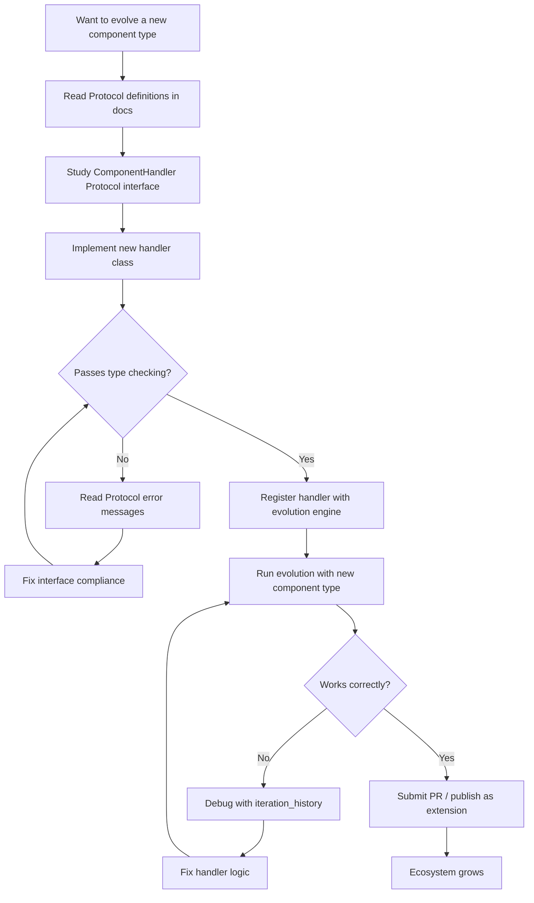

# UX Design Specification gepa-adk

**Author:** Alberto-Codes
**Date:** 2026-03-01

---

<!-- UX design content will be appended sequentially through collaborative workflow steps -->

## Executive Summary

### Project Vision

gepa-adk is a Python framework extension library that automatically improves AI agent systems by evolving their complete definition — instructions, output schemas, and generation configurations — across single agents, multi-agent pipelines, and complex workflow structures. Built on the GEPA (Genetic-Pareto) algorithm and Google's Agent Development Kit, the product's "interface" IS its API surface: a progressive adoption funnel from `evolve()` to `evolve_group()` to `evolve_workflow()`. This is a developer tool with no traditional GUI — the UX is the developer experience (DX): API ergonomics, documentation flow, error messages, result exploration, and the path from installation to first successful evolution.

### Target Users

| Persona | Role | DX Priority | Key Moment |
|---------|------|-------------|------------|
| **Priya (Agent Builder)** | Mid-level dev shipping agents | Simple API, fast onboarding, clear results | Score jumps from 0.5 to 0.8 without custom training loop |
| **Marcus (Platform Engineer)** | Builds agent infrastructure | Integration patterns, CI/CD compatibility, session management | Evolution embedded in deployment pipeline |
| **Rafael (AI Platform Lead)** | Champions adoption at enterprise | Audit trails, observability, compliance evidence | Presents session-level evidence to regulators |
| **Dr. Kenji (Optimization Lead)** | Fleet-wide quality management | Pareto data export, batch patterns, reporting | Cost/quality tradeoff dashboard from evolution data |
| **Entry-Level Developer** | Junior dev experimenting | Zero-config defaults, copy-paste examples | `pip install` to first result in <15 minutes |
| **Ecosystem Contributor** | OSS developer extending library | Clean Protocols, docstrings, hexagonal architecture | New ComponentHandler without touching core engine |

**Adoption sequence:** Priya validates DX -> Marcus integrates -> Rafael champions -> Kenji operationalizes -> CTO approves budget

### Key Design Challenges

1. **Progressive complexity without cognitive overload** — The API spans from one-liner `evolve(agent, trainset)` to complex multi-surface workflow evolution with custom stoppers. Each step up in capability must feel like a natural extension, not a new tool to learn. Priya's day-1 API must hide Kenji's month-2 complexity.

2. **Evolution process transparency** — Evolution is inherently opaque (run, wait, get result). Users need iteration-by-iteration visibility: which component improved, which mutations were accepted/rejected, what the reflection agent reasoned, and how scores progressed. Without this, users can't build intuition or debug stalled evolution.

3. **Multi-layer error diagnostics** — Failures can originate in the user's agent, the critic agent, the reflection agent, ADK's Runner, LiteLLM provider, or the evolution engine itself. Error messages must identify the originating layer and provide actionable next steps, not generic stack traces.

4. **Configuration discoverability** — `EvolutionConfig`, per-agent component selection, stopper composition, reflection agent customization, session service injection — users need progressive discovery of what's configurable without reading the full API reference upfront.

### Design Opportunities

1. **The "aha moment" as onboarding anchor** — The score improvement printout (`Original: 0.45 -> Final: 0.82, Improvement: 82%`) is the product's emotional hook. Optimizing the path from `pip install` to this moment (target: <15 min) is the highest-leverage DX investment. Every friction point on this path directly impacts adoption.

2. **Self-guided result exploration** — `EvolutionResult` and `MultiAgentEvolutionResult` contain rich data: iteration history, evolved components, Pareto frontier, accepted/rejected mutations. A well-designed result object API enables IDE-autocomplete-driven exploration — users discover capabilities by typing `result.` and seeing what's available.

3. **Progressive error guidance** — Domain-specific exceptions with structured context fields turn every failure into a learning moment. A `ConfigurationError` that says "Your critic returned score 1.5, but scores must be 0.0-1.0. Check your critic's output_schema field constraints" teaches while debugging.

4. **Copy-paste-modify patterns** — The progressive API naturally creates a template hierarchy: basic evolution -> add critic -> add custom reflection -> multi-agent -> workflow. Each level's example is the previous level plus one new concept. This is the developer tool equivalent of a design system.

## Core User Experience

### Defining Experience

The core developer experience for gepa-adk is the **evaluate-inspect-iterate loop**: run `evolve()` on an agent, inspect the `EvolutionResult`, adjust parameters or agents, run again. This loop is the heartbeat of every user session — from Priya's first experiment to Kenji's fleet-wide optimization campaigns.

The product's value is delivered through a **three-phase experience**:

1. **The Gate (First Run)** — The path from `pip install gepa-adk` to seeing `Improvement: 82%` printed in the terminal. This must succeed in under 15 minutes with zero configuration beyond Ollama setup. If this fails, users never reach phase 2.
2. **The Hook (Result Exploration)** — The moment a developer types `result.` in their IDE and sees `evolved_components`, `improvement`, `iteration_history`, `original_score`, `final_score`. The result object must be self-documenting — clear enough that users understand what happened without reading docs. The result's `__repr__` should tell a story, not dump raw fields.
3. **The Loop (Experimentation)** — The moment curiosity kicks in: "What if I change the critic? Add more training examples? Evolve the output schema too?" This is where users become power users. The Loop requires easy parameter tweaking, fast re-runs, and trivial result comparison across runs.

### Platform Strategy

| Platform | Context | Priority |
|----------|---------|----------|
| **Python 3.12+ REPL / Script** | Primary interaction surface — developers write `.py` files and run them | Critical |
| **IDE (VS Code, PyCharm)** | Autocomplete, type hints, docstrings — the "discovery" interface | Critical |
| **Terminal / CLI output** | structlog output, evolution progress, error messages | High |
| **CI/CD pipeline** | Headless execution, exit codes, structured log output | Medium |
| **Jupyter Notebook** | Exploratory evolution, result visualization | Nice-to-have (future) |

**Platform-specific considerations:**
- **No GUI required** — the API surface IS the interface. IDE autocomplete is the primary discovery mechanism.
- **Offline-first** — Ollama (local LLM) is the recommended default, making development fast and free. Cloud providers are opt-in.
- **Async-native with sync wrapper** — `evolve()` for async contexts, `evolve_sync()` for scripts. Users shouldn't need to understand asyncio to get started.

### Effortless Interactions

The principle of **progressive disclosure** applies at every layer:

**Code level — API transitions must be additive, not transformative:**
- `evolve(agent, trainset)` → `evolve_group({"gen": gen, "rev": rev}, primary="rev", trainset=trainset)` — same concepts, one more parameter
- `evolve_group(...)` → `evolve_workflow(workflow, trainset, round_robin=True)` — same pattern, workflow wrapper
- Each transition adds one concept. No existing knowledge is invalidated.

**Configuration level — zero-config defaults that just work:**
- `EvolutionConfig()` with no arguments should produce reasonable evolution (patience=3, max_iterations=10)
- Reflection model auto-detection from environment or sensible default
- Component selection defaults to `["instruction"]` — the most common case

**Documentation level — navigation matches the progressive API:**
- Getting Started → Single-Agent Guide → Multi-Agent Guide → Workflow Guide
- Each page ends with "ready for more? here's the next level"
- The docs mirror the API's progressive adoption funnel

**Error level — every failure is a teaching moment:**
- `ConfigurationError` with specific field and expected value: "critic returned score 1.5, but scores must be 0.0-1.0"
- `EvaluationError` identifying the originating layer (user agent vs. critic vs. reflection)
- `ReflectionError` explaining what the reflection agent returned and what was expected
- Pre-flight validation: catch wrong model names, missing env vars, and malformed critics before evolution starts

**Result level — comparison across runs should be trivial:**
- Printing two `EvolutionResult` objects should make differences obvious
- Iteration history supports side-by-side comparison of parameter variations
- Result objects carry enough context to be meaningful outside the session that created them

### Critical Success Moments

| Moment | Persona | What Happens | Success Signal | Phase |
|--------|---------|--------------|----------------|-------|
| **First score improvement** | Priya | `Improvement: 82%` prints in terminal | User runs a second evolution immediately | MVP |
| **Before/after comparison** | Priya | `result.evolved_components["instruction"]` shows a clearly better instruction | User shares the before/after with a colleague | MVP |
| **First error recovery** | Entry-level | Error message says exactly what's wrong and how to fix it | User fixes the issue without searching Stack Overflow | MVP |
| **Progressive transition** | Marcus | Moving from `evolve()` to `evolve_group()` takes <5 min | No new concepts needed, just new parameters | MVP |
| **Multi-agent insight** | Marcus | `result.iteration_history` shows round-robin improving different agents | "I can see which agent was the bottleneck" | Growth |
| **Audit trail discovery** | Rafael | ADK session events capture every evolutionary decision with reasoning | "I can answer the regulator's question" | Growth |
| **Pareto tradeoff** | Kenji | Pareto frontier shows cost vs. quality tradeoff across candidates | "I can present this to leadership" | Growth |
| **Extension point** | Contributor | Protocol-based interface makes new ComponentHandler obvious | "I can extend this without touching the engine" | Growth |

**Make-or-break flows:**
1. `pip install` → first successful `evolve()` call (the Gate)
2. Inspecting `EvolutionResult` and understanding what improved (the Hook)
3. Tweaking parameters and comparing results across runs (the Loop)
4. Transitioning from `evolve()` to `evolve_group()` (the Expansion)
5. Recovering from a failed evolution run with clear error guidance (the Safety Net)

### Experience Principles

1. **Result is the product** — Every design decision should optimize the clarity and richness of `EvolutionResult`. The result object is what users show to colleagues, present to leadership, and use to decide next steps. It must be self-documenting, IDE-friendly, and narrative-rich. A printed result should tell the story of the evolution run — not just what changed, but the arc of iterations, accepted and rejected mutations, and why the run stopped. `result.__repr__()` should be a readable summary, not a raw data dump.

2. **Progressive disclosure everywhere** — At every layer (API, config, docs, errors), the next level of capability should be one step away, not a cliff. Adding `round_robin=True` to a workflow call should feel as natural as adding `patience=5` to a config.

3. **Errors teach, not punish** — Domain-specific exceptions with structured context fields turn every failure into a learning moment. The exception hierarchy (`ConfigurationError`, `EvaluationError`, `ReflectionError`) should identify the layer, state what was expected, show what was received, and suggest a fix.

4. **Fifteen minutes to magic** — The path from installation to "my agent just improved itself" must be under 15 minutes with copy-paste-runnable examples. No configuration beyond Ollama setup. No concepts to learn before seeing value. The getting-started guide is the most important page in the entire documentation.

5. **IDE as discovery interface** — Type hints, docstrings, and descriptive attribute names are the primary way developers discover capabilities. `result.` + autocomplete should answer "what can I do with this?" without opening a browser.

6. **Evolution is explainable** — The result should show not just WHAT changed but WHY. Reflection reasoning — what the reflection agent observed in critic feedback, what pattern it identified, why it proposed a specific change — should be a first-class attribute of iteration records, not buried in session event logs. This is gepa-adk's category-defining differentiator: no competing tool explains its optimization decisions. This is what makes Rafael's audit trail credible, Kenji's report to leadership evidence-based, and Priya's learning curve shorter.

## Desired Emotional Response

### Primary Emotional Goals

| Emotional Goal | What It Feels Like | When It Matters Most |
|----------------|-------------------|---------------------|
| **Empowered mastery** | "I improved my agent without needing a PhD in optimization" | The Gate — first successful `evolve()` call |
| **Astonishment at simplicity** | "Wait, that's all the code it took?" | Sharing the before/after with a colleague |
| **Confident understanding** | "I know exactly what changed and why it improved" | The Hook — exploring `EvolutionResult` |
| **Intellectual trust** | "This tool shows its reasoning, not just its results" | The Loop — deciding what to evolve next |
| **Creative curiosity** | "What if I try evolving the output schema too?" | The transition from single-agent to multi-agent |
| **Shareable pride** | "Look what my evolution run discovered" | Showing the before/after to a colleague or lead |

**The defining emotional arc:** Skepticism ("can this really work?") → Surprise ("it actually improved") → Understanding ("I see why it improved") → Trust ("I can rely on this across sessions") → Mastery ("I know how to make it improve more") → Identity ("I'm someone who evolves agents").

### Emotional Journey Mapping

| Phase | Stage | Target Emotion | Anti-Emotion to Prevent | Duration |
|-------|-------|----------------|------------------------|----------|
| **Discovery** | Reading docs / getting-started | Intrigued, not overwhelmed | Intimidation ("this looks too complex for me") | Minutes |
| **Installation** | `pip install gepa-adk` + Ollama setup | Smooth momentum | Frustration ("why isn't this working?") | Minutes |
| **The Gate** | First `evolve()` call completes | Genuine surprise at the score improvement | Confusion ("did it work? what happened?") | Seconds → triggers curiosity |
| **The Wait** | Evolution is running, iterations progressing | Informed agency — watching progress unfold | Helplessness ("I have no control, is it stuck?") | Minutes (real-time) |
| **The Hook** | Exploring `EvolutionResult` in IDE | Delight at discoverability | Opacity ("I have a result but no idea what's in it") | Minutes |
| **The Plateau** | Evolution stalls, score barely moves | Informed patience — understanding *why* progress slowed | Quiet doubt ("maybe this tool doesn't work for my case") | Minutes → needs explanation |
| **The Loop** | Tweaking parameters, re-running | Creative flow state | Tedium ("I have to change too many things to re-run") | Hours → days |
| **Error Recovery** | Something fails mid-evolution | Guided confidence | Helplessness ("I have no idea what went wrong") | Seconds → fix and resume |
| **Expansion** | Moving to `evolve_group()` / `evolve_workflow()` | Natural extension, not cliff | Abandonment ("this is a completely different API") | Minutes |
| **Sharing** | Showing results to colleagues or leadership | Shareable pride, social validation | Embarrassment ("I can't explain what the tool did") | Weeks (viral loop) |
| **Return Visit** | Coming back after days/weeks | Instant reorientation | Amnesia ("how did this work again?") | Days → weeks |
| **Identity Shift** | Becoming "someone who evolves agents" | Professional identity transformation | Imposter syndrome ("I just pressed a button") | Months (retention) |

### Micro-Emotions

**Critical micro-emotion pairs for a developer tool:**

| Dimension | Target State | Risk State | DX Lever |
|-----------|-------------|------------|----------|
| **Confidence vs. Confusion** | "I know what this parameter does" | "What does `patience` mean here?" | Descriptive parameter names, rich docstrings, sensible defaults |
| **Trust vs. Skepticism** | "The improvement is real, not noise" | "Is this score meaningful?" | Reflection reasoning in results, iteration-by-iteration transparency |
| **Agency vs. Helplessness** | "I can see each iteration progressing" | "Is it stuck? Should I cancel?" | Real-time structlog progress with per-mutation visibility, accepted/rejected status |
| **Accomplishment vs. Frustration** | "My agent is measurably better" | "I ran 10 iterations and nothing changed" | Clear progress logging, early stopping with explanation, improvement metrics |
| **Delight vs. Mere Satisfaction** | "This is elegant — I want to explore more" | "It works, I guess" | Narrative `__repr__`, self-documenting result objects, "what's next" guidance |
| **Belonging vs. Isolation** | "This tool fits my workflow" | "I have to restructure my code for this" | Protocol-based interfaces, minimal agent requirements, ADK-native patterns |
| **Ownership vs. Detachment** | "My evolution run discovered this improvement" | "The algorithm produced something" | Language framing — the user's run, the user's discovery, the user's optimization |

**The micro-emotion that matters most:** **Trust vs. Skepticism**. Because evolution is inherently stochastic and opaque, users must trust that improvements are real and reasoned — not random. This is why Experience Principle 6 ("Evolution is explainable") is the category differentiator. Every iteration record carrying the reflection agent's reasoning converts skepticism to trust.

**Second most critical:** **Agency vs. Helplessness**. During evolution, the developer is waiting with no control. Real-time iteration progress with per-mutation visibility transforms passive waiting into informed observation — the developer watches their agent getting better, one mutation at a time.

### Design Implications

**Emotion-to-DX connections:**

| Target Emotion | DX Design Approach |
|----------------|-------------------|
| **Empowered mastery** | Zero-config defaults that produce real improvements; `EvolutionConfig()` with no args works well. Sync wrapper `evolve_sync()` removes asyncio barrier. |
| **Astonishment at simplicity** | Three-line getting-started example. Progress output that shows improvement in real-time. `result.improvement` as a percentage, not raw floats. |
| **Confident understanding** | `result.reflection_reasoning` as first-class attribute. Iteration history showing accepted/rejected mutations with reasons. Structured `__repr__` that tells the evolution story. |
| **Intellectual trust** | Reflection agent reasoning exposed in every iteration record. Pareto frontier data exportable for independent analysis. ADK session events as audit trail. |
| **Creative curiosity** | Progressive API that invites "what if I try...?" moments. Documentation that ends each page with the next capability. Component selection that says "you can also evolve output_schema and generation_config." |
| **Shareable pride** | Result objects that produce clean, presentable output when printed. Before/after component comparison that's meaningful to non-users. Improvement metrics framed as the developer's achievement. |

**Emotions to actively prevent through design:**

| Negative Emotion | Specific DX Failure Trigger | Prevention Strategy |
|-----------------|---------------------------|-------------------|
| **Intimidation** | Multi-page API reference as first encounter | Hide advanced config behind defaults; show simple API first in all docs |
| **Opacity** | Result object with no iteration context | Never return a result without iteration history; structlog progress output during evolution |
| **Helplessness during errors** | Generic Python traceback from deep in ADK/LiteLLM | Domain-specific exceptions with layer identification, expected vs. received, and suggested fix |
| **Helplessness during wait** | No output while evolution runs for minutes | Real-time structlog iteration progress: score, mutation, accepted/rejected |
| **Abandonment at API transitions** | `evolve_group()` requiring completely new mental model | Additive parameter pattern — `evolve()` knowledge transfers directly to `evolve_group()` |
| **Quiet doubt at plateau** | Evolution stops improving with no explanation | Reflection reasoning explaining *why* progress stalled; stopper messages that justify early termination |
| **Distrust of results** | Improvement shown without reasoning | Reflection reasoning in every iteration record; before/after component comparison |
| **Installation frustration** | Dependency conflict, Ollama connection timeout | Pre-flight validation at import time; clear error for missing Ollama with setup instructions |
| **Imposter syndrome** | Language framing results as "algorithm output" | Frame everything as the developer's discovery — "your evolution run found..." not "the algorithm produced..." |

### Emotional Design Principles

1. **Surprise before explanation** — Show the score improvement FIRST (`Improvement: 82%`), then let users drill into the how and why. The emotional hook must land before the intellectual understanding. This is why `result.__repr__()` leads with improvement metrics, not iteration details.

2. **Transparency builds trust** — Every evolutionary decision must be traceable: what the reflection agent observed, what pattern it identified, what mutation it proposed, whether it was accepted. Opacity is the enemy of adoption in a stochastic optimization tool. Users who can't explain the improvement to their lead won't champion the tool.

3. **Errors are conversations, not dead ends** — A `ConfigurationError` should feel like a helpful colleague pointing out a mistake, not a compiler rejecting your code. The emotional target is "oh, I see what I did wrong" not "what does this error even mean?" Every exception class carries context fields that answer: what layer failed, what was expected, what was received, and what to try next.

4. **Progressive mastery, not progressive complexity** — Each step up the API ladder (`evolve` → `evolve_group` → `evolve_workflow`) should feel like gaining a new power, not learning a new tool. The emotional trajectory is accumulating capability, not accumulating cognitive load. Users should feel smarter, not more burdened.

5. **The result is the reward** — The `EvolutionResult` object is the emotional payoff of the entire evolution run. Its design must reward exploration: typing `result.` and seeing meaningful attributes, printing it and reading a narrative summary, comparing two results and immediately seeing what's different. A well-designed result object converts computation time into developer satisfaction.

6. **Make users the expert** — Every interaction should reinforce that the developer is making smart decisions, not that the tool is smart. The evolved instruction isn't "what the algorithm produced" — it's "what the developer's evolution run discovered." Language, framing, and attribution should position the user as the agent of improvement. Tools are forgotten; professional identities persist. gepa-adk should make developers feel like optimization experts, not button-pushers.

## UX Pattern Analysis & Inspiration

### Inspiring Products Analysis

#### 1. pytest — The Gold Standard for Zero-Config Developer Tools

**What it does well:**
- **Zero-config start**: `pytest` with no arguments discovers and runs tests. No configuration files, no boilerplate, no setup classes. This is the benchmark for gepa-adk's `evolve(agent, trainset)` — it should just work with no `EvolutionConfig` required.
- **Progressive disclosure mastered**: Start with `assert x == y`, then discover fixtures, then parametrize, then plugins. Each layer is optional and additive. Users never encounter complexity they didn't ask for.
- **Error messages that teach**: pytest's assertion introspection shows exactly what values were compared, what was expected vs. received, and where the mismatch occurred. This is the model for gepa-adk's domain-specific exceptions — show the layer, the expected value, the received value, and the fix.
- **Rich terminal output**: Color-coded pass/fail, progress dots, summary statistics. Long-running test suites show real-time progress — directly applicable to gepa-adk's evolution progress logging.

**Transferable to gepa-adk:** Zero-config defaults, progressive fixture/config discovery, assertion-style error messages with context, real-time progress output during long operations.

#### 2. FastAPI — Type-Hint-Driven Discovery and Auto-Documentation

**What it does well:**
- **IDE as primary interface**: Type hints drive autocomplete, validation, and documentation simultaneously. A single type annotation serves three purposes. This validates gepa-adk's "IDE as discovery interface" principle — type hints on `EvolutionResult`, `EvolutionConfig`, and all public APIs are the primary discovery mechanism.
- **Progressive complexity through decorators**: Start with `@app.get("/")`, then add query params via type hints, then add Pydantic models, then add dependencies. Each level builds on the previous. Directly parallel to gepa-adk's `evolve()` → `evolve_group()` → `evolve_workflow()` progression.
- **Self-documenting objects**: FastAPI auto-generates OpenAPI docs from code. The code IS the documentation. gepa-adk's `EvolutionResult.__repr__()` should follow this principle — the printed result IS the documentation of what happened.
- **Pydantic integration**: Validation errors are clear, specific, and actionable. "value is not a valid integer" with the exact field path. This is the model for gepa-adk's `ConfigurationError` — field-level validation with specific expected vs. received.

**Transferable to gepa-adk:** Type-hint-driven IDE discovery, self-documenting result objects, Pydantic-style validation errors with field paths, progressive decorator/parameter patterns.

#### 3. Optuna — Closest Category Peer (Hyperparameter Optimization)

**What it does well:**
- **Study/Trial metaphor**: Optuna's `study.optimize(objective, n_trials=100)` is the closest API pattern to `evolve(agent, trainset)`. Users define an objective function, Optuna explores the space. The conceptual mapping is direct: study ≈ evolution session, trial ≈ iteration, best_params ≈ evolved_components.
- **Real-time logging during optimization**: Optuna logs each trial's score as it completes. Users watch optimization progress in real-time. This is exactly what gepa-adk needs during evolution — iteration-by-iteration score logging via structlog.
- **Result exploration**: `study.best_trial`, `study.trials_dataframe()`, `study.best_params` — multiple views into the same result. gepa-adk's `EvolutionResult` should offer similar multi-view exploration: `.improvement`, `.evolved_components`, `.iteration_history`, `.pareto_frontier`.

**What it does poorly (and gepa-adk must do better):**
- **No explanation of decisions**: Optuna shows WHAT was tried and WHAT scored well, but never WHY a particular parameter combination worked. This is gepa-adk's category differentiator — reflection reasoning explains the evolutionary decisions, not just the outcomes.
- **Opaque sampling**: Users can't see the sampler's reasoning. gepa-adk's reflection agent reasoning should be transparent and first-class.

**Transferable to gepa-adk:** Study/trial API metaphor, real-time trial logging, multi-view result exploration. **Differentiate from:** Optuna's opaque decision-making by making reflection reasoning first-class.

#### 4. scikit-learn — Consistent API Pattern (fit/predict)

**What it does well:**
- **Universal interface pattern**: Every estimator follows `fit()` → `predict()` → `score()`. Once you learn one model, you know them all. gepa-adk needs this consistency: `evolve()` always returns `EvolutionResult`, `evolve_group()` always returns `MultiAgentEvolutionResult`, both have `.improvement`, `.evolved_components`, `.iteration_history`.
- **Pipeline composition**: `Pipeline([('scaler', StandardScaler()), ('clf', SVM())])` — composable components with a uniform interface. This parallels gepa-adk's stopper composition and component handler architecture.
- **Sensible defaults**: `RandomForestClassifier()` with no arguments produces a reasonable model. No hyperparameter tuning required to get started. Validates gepa-adk's `EvolutionConfig()` zero-arg defaults.

**Transferable to gepa-adk:** Universal result interface across all evolution levels, composable component patterns, zero-arg sensible defaults.

#### 5. Rich / tqdm — Terminal Output That Developers Love

**What they do well:**
- **tqdm's information density**: One line per operation with exactly the right amount of data — progress bar, ETA, iteration count, one custom metric. For gepa-adk, each iteration should be one scannable, greppable, CI-friendly line: `iter 3/10 | score: 0.58→0.64 | accepted: instruction mutation | +12%`. Maximum signal per terminal line. Not verbose multi-line blocks.
- **Rich's structured output**: Tables, panels, trees — terminal output that's pleasant to read. gepa-adk's `result.__repr__()` should be structured and readable, not raw data dumps.
- **Console markup**: Rich's system makes it easy to highlight important information (scores, improvements, warnings) without requiring a GUI.

**Transferable to gepa-adk:** tqdm-style one-line-per-iteration progress (scannable, greppable, CI-friendly), Rich-style structured result formatting in terminal, highlighted improvement metrics.

#### 6. git diff / git log — The Explainability Interface

**What it does well:**
- **`git diff` as the explainability gold standard**: Shows WHAT changed, WHERE it changed, and provides enough CONTEXT (surrounding lines) to understand WHY. `EvolutionResult`'s before/after component comparison should feel like reading a git diff — familiar, scannable, immediately understandable to any developer.
- **`git log --oneline` as iteration history model**: One line per event, chronological, greppable. `result.iteration_history` should feel this natural — one entry per iteration with score, mutation type, and accept/reject decision.
- **Universal developer familiarity**: Every developer already knows how to read diffs and logs. Borrowing this mental model means zero learning curve for result interpretation.

**Transferable to gepa-adk:** diff-style before/after component comparison, log-style iteration history, leveraging universal developer familiarity for the explainability DX that is gepa-adk's competitive moat.

#### 7. Stripe API Docs — Documentation DX Gold Standard

**What it does well:**
- **Runnable code examples on every page**: Copy-paste and it works. This is the benchmark for gepa-adk's "copy-paste-modify" design opportunity — every documentation page should have a runnable example that produces visible output.
- **Progressive sidebar navigation**: Mirrors the user's learning journey, not the API's internal structure. "Quick Start → Core Concepts → Guides → API Reference" — exactly the flow gepa-adk's docs should follow: Getting Started → Single-Agent → Multi-Agent → Workflow → API Reference.
- **Request/response paired examples**: Every API call shows what you send AND what you get back. For gepa-adk, every code example should show the `evolve()` call AND the printed `EvolutionResult` output.

**Transferable to gepa-adk:** Runnable examples on every doc page, progressive learning-journey navigation, paired input/output examples showing both the API call and the result.

#### 8. SQLAlchemy — Session/State Management Pattern

**What it does well:**
- **`create_engine()` once, `Session()` per operation**: Configure the connection once, then use lightweight session objects for each unit of work. This is the model for gepa-adk's session service injection — configure the session service once, then `evolve()` creates sessions per evolution run.
- **`sessionmaker(bind=engine)` pattern**: Factory pattern that makes service injection feel like configuration, not plumbing. Marcus (Platform Engineer) injecting a persistent session service for CI/CD should feel this natural.
- **Sensible defaults with override points**: `create_engine("sqlite:///:memory:")` for development, swap to PostgreSQL for production. Parallels gepa-adk's `InMemorySessionService` default with injectable persistent services.

**Transferable to gepa-adk:** Configure-once/use-everywhere session pattern, factory-based service injection, sensible in-memory defaults with production override points.

### Transferable UX Patterns

#### API Design Patterns

| Pattern | Source | Application in gepa-adk |
|---------|--------|------------------------|
| **Zero-arg sensible defaults** | pytest, scikit-learn | `EvolutionConfig()` produces reasonable evolution without any parameters |
| **Progressive parameter addition** | FastAPI decorators | `evolve()` → `evolve_group()` → `evolve_workflow()` adds one concept per level |
| **Universal result interface** | scikit-learn fit/predict | All evolution functions return objects with `.improvement`, `.evolved_components`, `.iteration_history` |
| **Study/trial metaphor** | Optuna | Evolution session as study, iterations as trials, evolved components as best params |
| **Type-hint-driven discovery** | FastAPI | All public APIs fully typed; IDE autocomplete is the primary documentation |
| **Configure-once session injection** | SQLAlchemy | Session service configured once, evolution runs create lightweight sessions per operation |

#### Error & Feedback Patterns

| Pattern | Source | Application in gepa-adk |
|---------|--------|------------------------|
| **Assertion introspection** | pytest | Domain exceptions show expected vs. received with exact field context |
| **Field-path validation errors** | FastAPI/Pydantic | `ConfigurationError` identifies the exact config field and constraint violated |
| **One-line-per-iteration progress** | tqdm | `iter 3/10 \| score: 0.58→0.64 \| accepted: instruction mutation \| +12%` — scannable, greppable, CI-friendly |
| **Color-coded progress output** | pytest, Rich | Improvement highlighted in terminal; regressions clearly marked |

#### Result & Exploration Patterns

| Pattern | Source | Application in gepa-adk |
|---------|--------|------------------------|
| **Multi-view result access** | Optuna (best_trial, trials_dataframe) | `result.improvement`, `result.evolved_components`, `result.iteration_history`, `result.pareto_frontier` |
| **Self-documenting `__repr__`** | FastAPI auto-docs | Printed result tells the evolution story: scores, iterations, best components, stop reason |
| **Diff-style before/after comparison** | git diff | Evolved components shown as familiar diff format — what changed, where, with context |
| **Log-style iteration history** | git log --oneline | One entry per iteration: score, mutation type, accept/reject — chronological and greppable |
| **Pipeline composition** | scikit-learn | Stopper composition, component handler registry, critic chaining |

#### Documentation Patterns

| Pattern | Source | Application in gepa-adk |
|---------|--------|------------------------|
| **Runnable examples on every page** | Stripe docs | Every doc page has copy-paste-runnable code that produces visible output |
| **Progressive learning-journey navigation** | Stripe docs | Sidebar follows Getting Started → Single-Agent → Multi-Agent → Workflow → API Reference |
| **Paired input/output examples** | Stripe docs | Every example shows the `evolve()` call AND the printed `EvolutionResult` |

### Anti-Patterns to Avoid

| Anti-Pattern | Where It Fails | Why It's Dangerous for gepa-adk |
|-------------|---------------|--------------------------------|
| **Black-box optimization** | Optuna's opaque sampling decisions | Users can't build intuition, can't debug stalls, can't champion the tool to leadership. gepa-adk MUST explain its evolutionary decisions through reflection reasoning. |
| **Configuration-first onboarding** | Many ML frameworks requiring YAML/JSON config before first run | Kills the 15-minute Gate. Zero-config defaults must be the entry point; configuration is opt-in for power users. |
| **Generic exception messages** | Deep framework stack traces (TensorFlow, early PyTorch) | Multi-layer error diagnostics are critical. `RuntimeError: something went wrong` is unacceptable. Every exception must identify the originating layer. |
| **Silent long operations** | Tools that produce no output during multi-minute computations | Triggers helplessness and doubt during evolution. Every iteration must log progress. Silence is the enemy of trust. |
| **Verbose long operations** | Optuna's default logging dumping full parameter dicts per trial | Information overload causes users to stop reading. One line per iteration with maximum signal density. Noise is the enemy of agency. |
| **API cliffs between complexity levels** | Frameworks where simple→advanced requires rewriting code | `evolve()` → `evolve_group()` must be additive, not transformative. No code rewrite, just new parameters. |
| **Result objects as data dumps** | Tools that return raw dicts or unstructured data | `EvolutionResult` must be narrative-rich and IDE-friendly, not a wall of JSON. `__repr__` tells a story. |
| **Documentation that starts with the API reference** | Libraries where getting-started is buried | The getting-started guide must be the first thing users find. The API reference is for power users who already understand the concepts. |
| **Irreproducible results without explanation** | Stochastic tools with no seed support or run-level logging | If two runs with identical inputs produce different results and the tool doesn't explain why, trust dies instantly. Optional `EvolutionConfig(seed=42)` for reproducible runs; seed always logged in results; clear documentation that evolution is stochastic by design with reflection reasoning explaining why different runs discover different improvements. |

### Design Inspiration Strategy

**Adopt directly:**
- pytest's zero-config discovery pattern → `evolve(agent, trainset)` with no config required
- FastAPI's type-hint-driven IDE discovery → fully typed public API, rich docstrings on all result attributes
- tqdm's one-line-per-iteration density → structlog iteration progress: `iter 3/10 | score: 0.58→0.64 | accepted: instruction mutation | +12%`
- scikit-learn's universal interface → consistent `.improvement`, `.evolved_components`, `.iteration_history` across all evolution levels
- Stripe's runnable documentation examples → every doc page has copy-paste-runnable code with visible output
- git diff's explainability format → before/after component comparison in familiar diff style

**Adapt for gepa-adk's context:**
- Optuna's study/trial metaphor → evolution session/iteration terminology, but with reflection reasoning as a first-class addition that Optuna lacks
- SQLAlchemy's session pattern → session service injection that feels like configuration (`InMemorySessionService` default, injectable persistent services for CI/CD)
- Stripe's progressive sidebar → docs navigation following the progressive API adoption funnel, adapted for library (not REST API) context
- git log --oneline → iteration history format adapted for evolution context (score deltas, mutation types, accept/reject)

**Avoid deliberately:**
- Optuna's opaque decision-making → always expose reflection reasoning
- TensorFlow-style configuration-heavy onboarding → zero-config defaults, config is opt-in
- Generic framework exceptions → domain-specific exception hierarchy with layer identification
- Silent OR verbose long operations → tqdm-style one-line-per-iteration with maximum signal density
- API cliffs between simple and advanced → additive parameter progression
- Irreproducible results without explanation → optional seed support, stochastic behavior documented, seed logged in results

**The unique gepa-adk differentiator that no inspiration source provides:** Explainable evolutionary decisions. No existing optimization tool (Optuna, Ray Tune, Weights & Biases sweeps) explains WHY a particular change improved the objective. gepa-adk's reflection agent reasoning — exposed as a first-class result attribute, displayed in a git-diff-familiar format — is an entirely new category of DX in the optimization space.

## Design System Foundation

### Design System Choice

**Approach: Custom DX Consistency Framework** — A library-native "design system" built from the patterns established in our inspiration analysis (pytest, FastAPI, scikit-learn, git, tqdm, Stripe docs). Rather than a visual component library, this is a set of binding conventions that ensure every touchpoint of gepa-adk — API surface, errors, results, logs, docs — feels like it was designed by one mind.

This is the developer tool equivalent of choosing "Custom Design System" — full control over every interaction pattern, optimized specifically for the progressive evolution API and the six experience principles established in the Core User Experience section.

### Rationale for Selection

1. **No GUI means no visual design system** — gepa-adk has no buttons, layouts, or color themes. The "components" are API functions, result objects, exception classes, log messages, and documentation pages. A traditional design system (Material, Ant, Chakra) is irrelevant.

2. **Consistency IS the design system** — For a developer tool, predictability across the API surface replaces visual consistency. If `evolve()` returns an object with `.improvement` and `.evolved_components`, then `evolve_group()` must return an object with the same attributes (plus group-specific ones). This is scikit-learn's `fit/predict` lesson.

3. **The "components" are conventions, not widgets** — The reusable building blocks are: naming patterns, parameter conventions, result object structure, exception format, log message format, and documentation page template. Each is defined once and applied everywhere.

4. **Progressive disclosure requires systematic design** — The `evolve()` → `evolve_group()` → `evolve_workflow()` progression only feels natural if parameter naming, result structure, and error messages follow the same conventions at each level. Ad hoc API design breaks the progressive disclosure principle.

### Implementation Approach

The DX Consistency Framework operates across five layers, each with defined conventions and implementation priority:

#### Layer 1: API Surface Conventions (MVP)

| Convention | Pattern | Example |
|-----------|---------|---------|
| **Function naming** | `evolve_*` prefix for all evolution entry points | `evolve()`, `evolve_group()`, `evolve_workflow()` |
| **Parameter ordering** | Required positional → optional keyword with defaults | `evolve(agent, trainset, *, config=None, critic=None)` |
| **Return types** | Typed dataclass result objects, never raw dicts | `EvolutionResult`, `MultiAgentEvolutionResult` |
| **Async/sync parity** | Every async function has a `_sync()` counterpart | `evolve()` / `evolve_sync()` |
| **Config objects** | Dataclass with zero-arg defaults for all optional params | `EvolutionConfig()` works with no arguments |
| **Protocol interfaces** | `typing.Protocol` with `@runtime_checkable` for all extension points | `Scorer`, `Stopper`, `ComponentHandler` |

#### Layer 2: Result Object Conventions (MVP)

| Convention | Pattern | Example |
|-----------|---------|---------|
| **Common attributes** | All result types share `.improvement`, `.evolved_components`, `.iteration_history` | Consistent across single/multi/workflow |
| **Narrative `__repr__`** | Printed result tells the evolution story: improvement first, then details | Leads with `Improvement: 82%`, not raw iteration data |
| **IDE-friendly attributes** | Descriptive names that autocomplete meaningfully | `result.reflection_reasoning`, not `result.rr` |
| **Immutable results** | Result objects are frozen dataclasses — no post-hoc mutation | `@dataclass(frozen=True)` |
| **Type-hinted everything** | Every attribute fully typed for IDE discovery | `iteration_history: list[IterationRecord]` |
| **Versioning convention** | New attributes added as `Optional[T] = None`; `__repr__` and serialization gracefully degrade for older result objects | Ensures backwards compatibility when Marcus serializes results to JSON for CI/CD pipelines |

#### Layer 3: Error Conventions (MVP)

| Convention | Pattern | Example |
|-----------|---------|---------|
| **Domain exception hierarchy** | Base `GepaError` → `ConfigurationError`, `EvaluationError`, `ReflectionError` | Each identifies originating layer |
| **Structured context fields** | Every exception carries `expected`, `received`, `suggestion` | `ConfigurationError(field="score", expected="0.0-1.0", received="1.5", suggestion="Check critic output_schema")` |
| **Diagnostic context dict** | Every exception carries `context: dict[str, Any]` for layer-specific diagnostic data | `ReflectionError(context={"iteration": 3, "agent": "reviewer", "component": "instruction"})` — enough to reconstruct the failure state |
| **Layer identification** | Exception names encode the originating system layer | `EvaluationError` = critic/agent layer; `ReflectionError` = reflection agent layer |
| **Pre-flight validation** | Catch configuration errors before evolution starts | Validate model names, env vars, critic format at `evolve()` entry |

#### Layer 4: Terminal Output Conventions (MVP: iteration progress; Growth: polish)

| Convention | Pattern | Priority |
|-----------|---------|----------|
| **structlog for all logging** | Consistent structured logging across the library | MVP |
| **One-line-per-iteration** | `iter 3/10 \| score: 0.58→0.64 \| accepted: instruction mutation \| +12%` — scannable, greppable, CI-friendly | MVP |
| **Log levels** | INFO for progress, WARNING for regressions, ERROR for failures — greppable by severity in CI/CD | Growth |
| **Summary on completion** | `evolution complete \| original: 0.45 → final: 0.82 \| improvement: 82% \| 7 iterations \| stopped: patience` | Growth |

#### Layer 5: Documentation Conventions (MVP: getting-started; Growth: full template system)

| Convention | Pattern | Priority |
|-----------|---------|----------|
| **Progressive sidebar** | Getting Started → Single-Agent → Multi-Agent → Workflow → API Reference | Growth |
| **Runnable examples** | Every page has copy-paste-runnable code with expected output | MVP (getting-started only) |
| **Paired input/output** | Every example shows the `evolve()` call AND the printed `EvolutionResult` | Growth |
| **"Ready for more?" footer** | Each page links to the next capability level | Growth |
| **Consistent page structure** | Concept → Example → Configuration → Common Errors → Troubleshooting | Growth |
| **Version annotations** | Every code example specifies minimum gepa-adk version: `# requires gepa-adk >= 0.3.0` | Growth |
| **Common Errors section** | Every guide page shows typical error messages and what they mean — connecting Layer 3 error conventions to documentation | Growth |

### Customization Strategy

**The DX Consistency Framework is enforced through automated and manual mechanisms, prioritized in this order:**

#### Automated Enforcement (Primary)

1. **Typed return validation** (MVP) — pytest fixtures or CI checks that validate all public API functions return typed dataclass objects, never raw dicts or untyped values. This is the single most important convention to enforce from day one.

2. **mypy strict mode** — All public APIs run under `mypy --strict`, catching untyped attributes, missing return annotations, and Protocol violations. Prevents convention drift in type hints.

3. **Exception structure validation** — CI check that validates every `GepaError` subclass carries `expected`, `received`, `suggestion`, and `context` fields. Exceptions that don't follow the template fail the build.

4. **ruff rules** — Configured to enforce naming conventions (`evolve_*` prefix), docstring presence on public APIs, and import organization consistent with hexagonal architecture boundaries.

#### Manual Enforcement (Fallback)

5. **Protocol definitions** — All extension points (`Scorer`, `Stopper`, `ComponentHandler`) defined as `typing.Protocol` with `@runtime_checkable`, ensuring any implementation follows the same interface contract.

6. **Documentation templates** — MkDocs page templates with consistent section structure. Docstring templates (defined in `docs/contributing/docstring-templates.md`) ensure API reference consistency.

7. **Code review checklist** — For conventions that can't be automated: Does the new API follow the naming convention? Does it have a sync counterpart? Does the `__repr__` lead with improvement metrics? Does the error carry diagnostic context?

## Defining Core Experience

### The Defining Interaction

**gepa-adk in one sentence:** "Evolve your agent in three lines of code and see exactly why it improved."

**The developer's description to a friend:** "I pointed it at my agent and a test set, ran `evolve()`, and my agent's score went from 0.45 to 0.82. And I could see exactly what changed and why — the reflection agent rewrote my instruction to be more specific about output format because the critic kept scoring poorly on structure."

**If we get ONE thing perfectly right:** The moment between calling `evolve()` and inspecting the result. This spans three micro-interactions: (1) watching iteration progress scroll by, (2) seeing the improvement percentage, (3) exploring the evolved components and reflection reasoning. If this sequence feels magical, everything else follows — users will naturally explore multi-agent, workflows, and custom components.

### User Mental Model

**How developers currently solve this problem:**
- Manual prompt engineering: write instruction → test → read output → tweak → repeat. This is slow (hours), subjective (no score), and non-transferable (no systematic record of what worked).
- No systematic approach: most developers just "vibe-check" their agent's output and adjust instructions by intuition. There's no feedback loop, no measurement, no optimization history.
- Trial and error on generation config: randomly adjusting temperature, top_p, max_tokens without understanding the effect. No controlled experimentation.

**Mental model developers bring:**
- **"Train my model" metaphor** — Developers expect something like `model.fit(data)` from scikit-learn. `evolve(agent, trainset)` maps to this expectation directly. The trainset is the "data," the evolution is the "fitting," the result is the "trained model."
- **"Run tests, see results" metaphor** — From pytest. Call a function, watch it run, see pass/fail with details. `evolve()` → iteration progress → improvement score maps naturally.
- **"Git diff to see what changed" metaphor** — After any automated change, developers want to see the diff. `result.evolved_components` showing before/after instruction text satisfies this instinct.

**Where developers are likely to get confused:**
- **"Which component improved?"** — If evolving multiple surfaces (instruction + output_schema + generation_config), users need clear attribution of which change caused which score improvement. Iteration records must tag the mutated component.
- **"Is the improvement real or noise?"** — Stochastic evolution can produce fluky scores. Reflection reasoning explaining the *pattern* behind the improvement ("critic consistently scored poorly on output structure, so I made the instruction more specific about format") builds trust.
- **"What does the critic actually measure?"** — The relationship between critic scores and agent quality can be opaque. Users must understand that the critic is their definition of "good" — if the critic measures the wrong thing, evolution optimizes the wrong thing.

### Success Criteria

**What makes users say "this just works":**

| Criterion | Measurement | Target |
|-----------|------------|--------|
| **Time to first result** | `pip install` → first `Improvement: X%` printout | < 15 minutes |
| **Code required** | Lines of code for a basic evolution run | ≤ 10 lines (including imports and agent definition) |
| **Zero-config success** | Evolution produces measurable improvement with `EvolutionConfig()` defaults | Improvement > 0% on ≥ 80% of well-defined agent/trainset/critic combinations |
| **Result self-explanation** | `print(result)` tells the evolution story without reading docs | User understands what improved and why from `__repr__` alone |
| **IDE discoverability** | Typing `result.` in IDE shows meaningful attributes | All public attributes have descriptive names and docstrings |
| **Error actionability** | Error message identifies the layer, shows expected vs. received, suggests fix | User fixes the issue without external search in ≥ 80% of cases |
| **Progressive transition** | Time to move from `evolve()` to `evolve_group()` | < 5 minutes, no new concepts required |
| **Failure transparency** | When evolution cannot improve, stop reason and reflection reasoning explain WHY | 80% of users understand why evolution stagnated from stop reason alone, without external help |

**Feedback that tells users they're doing it right:**
- Iteration-by-iteration score progress scrolling in terminal (real-time agency)
- Score deltas showing upward trend (`+29%`, `+10%`, `+5%` — diminishing returns are normal and expected)
- Mutation descriptions showing what was tried and whether it worked
- Final improvement percentage as the emotional payoff

### Novel UX Patterns

**Pattern Classification:** gepa-adk combines **established patterns in innovative ways** rather than inventing entirely new interactions.

**Established patterns adopted:**
- `function(input) → result` — the universal Python pattern (scikit-learn, Optuna)
- Typed result objects with IDE autocomplete — the FastAPI pattern
- Progressive parameter addition — the decorator/config pattern
- Real-time iteration logging — the tqdm/Optuna pattern
- Before/after comparison — the git diff pattern

**Novel combination that requires user education:**
- **Explainable automated optimization** — No existing tool combines "automated improvement" with "here's why it improved." Users expect either (a) automated but opaque (Optuna) or (b) manual but understandable (prompt engineering). gepa-adk delivers both simultaneously. This needs education: the reflection reasoning IS the explanation, and it's a first-class result attribute, not an afterthought.
- **Multi-surface evolution** — Evolving instruction + output_schema + generation_config simultaneously is novel. Users need to understand that each "surface" can be evolved independently or together, and the iteration history tracks which surface was mutated per iteration. The metaphor: "like evolving different genes in the same organism."
- **Critic-as-definition-of-good** — The idea that the critic agent defines what "good" means (not the evolution engine) is a subtle but critical concept. Users must understand: evolve garbage critic → evolve garbage results. The critic is the user's specification of quality, not a built-in metric.
- **Interrupted evolution with partial results** — Unlike traditional optimization tools where cancellation discards all progress, `Ctrl+C` during evolution returns a partial `EvolutionResult` with the best-so-far components and improvement. This turns an interruption into a useful checkpoint: "You interrupted after 5 iterations. Best improvement so far: 34%. Here's what we had."

**Teaching strategy for novel patterns:**
- Getting-started guide shows the simple case first (instruction-only evolution with default critic)
- "How it works" conceptual page explains the three-way relationship: agent (what evolves) → critic (what measures quality) → reflection (what proposes improvements)
- Each novel concept is introduced in isolation before being combined: single-surface before multi-surface, default critic before custom critic, single-agent before multi-agent

### Experience Mechanics

#### 1. Initiation — Starting an Evolution Run

**How the user starts:**
```python
from gepa_adk import evolve
result = await evolve(agent, trainset)
```

**What triggers them to begin:**
- Dissatisfaction with agent output quality ("my agent's responses are inconsistent")
- Curiosity from reading the getting-started guide ("let me try this on my agent")
- Team directive to improve agent metrics ("we need to get accuracy above 80%")

**Pre-flight experience:**
- `evolve()` validates configuration before starting: model availability, critic format, trainset structure
- Any pre-flight error fires immediately with a `ConfigurationError` containing the exact issue and fix
- If pre-flight passes, evolution begins and the first iteration log line appears within seconds

#### 2. Interaction — Watching Evolution Progress

**What the user sees during evolution:**
```
iter 1/10 | score: 0.45 | baseline evaluation
iter 2/10 | score: 0.58 | accepted: emphasized output structure requirements | +29%
iter 3/10 | score: 0.58 | rejected: added output format constraints (score unchanged)
iter 4/10 | score: 0.64 | accepted: specified field-level validation rules | +10%
iter 5/10 | score: 0.67 | accepted: added examples of expected output | +5%
iter 6/10 | score: 0.67 | rejected: restructured prompt ordering (score unchanged)
iter 7/10 | score: 0.82 | accepted: consolidated constraints into numbered checklist | +22%
iter 8/10 | score: 0.82 | stopped: patience (3 iterations without improvement)
```

**User's experience during the wait:**
- Each line converts helplessness into agency — the user watches their agent getting better
- Mutation descriptions show what was *tried*, not just whether it worked — this is real-time explainability
- Accepted mutations with descriptions build intuition: "oh, structuring constraints as a checklist was the big win"
- Rejected mutations with descriptions are equally valuable: "format constraints alone didn't help, but the checklist did"
- Score deltas show diminishing returns, building intuition about when evolution converges

**Interrupted evolution:**
- `Ctrl+C` during evolution returns a partial `EvolutionResult` with the best-so-far components
- The partial result includes all completed iterations, current best score, and evolved components up to the interruption point
- Stop reason: `"interrupted by user after 5 iterations (best improvement: 34%)"`
- This turns cancellation into a useful checkpoint, not a lost computation

#### 3. Feedback — The Result Moment

**What the user sees when evolution completes:**
```
evolution complete | original: 0.45 → final: 0.82 | improvement: 82% | 7 iterations | stopped: patience
```

**What `print(result)` shows:**
```
EvolutionResult(
  improvement=82.2%,
  original_score=0.45,
  final_score=0.82,
  iterations=7,
  stop_reason="patience (3 iterations without improvement)",
  evolved_components=["instruction"],
  reflection_summary="Restructured instruction to emphasize output format constraints
    after critic consistently scored poorly on structural compliance"
)
```

**What IDE exploration reveals:**
- `result.improvement` → `0.822` (float)
- `result.evolved_components` → dict mapping component names to before/after values
- `result.iteration_history` → list of `IterationRecord` objects with per-iteration scores, mutations, and reflection reasoning
- `result.reflection_reasoning` → the reflection agent's summary of what patterns it observed and why it proposed specific changes

#### 4. Completion — What's Next

**How the user knows they're done:**
- The `stop_reason` explains why evolution stopped (patience, max iterations, target score reached, or user interruption)
- The improvement percentage provides immediate value assessment
- The evolved components show exactly what changed

**The first natural next action — understanding what changed:**
- `result.show_diff()` or `result.compare()` — a single method that prints the before/after evolved components in a git-diff-familiar format. This is the emotional Hook: the moment the developer reads the original instruction next to the evolved instruction and sees *exactly* what the reflection agent improved. This must be the most prominent, most discoverable post-evolution action.

**Subsequent next actions (the Loop):**
- **Try different components**: Add `components=["instruction", "output_schema"]` to evolve more surfaces
- **Adjust the critic**: Write a custom critic that measures what matters most
- **Run again with different config**: `EvolutionConfig(patience=5, max_iterations=20)` for deeper evolution
- **Move to multi-agent**: `evolve_group({"gen": gen, "rev": rev}, primary="rev", trainset=trainset)`

**Each next action is one parameter change away** — progressive disclosure in action.

### When Things Go Wrong

Failure modes are experience design decisions, not just error handling. Each failure has a designed emotional response:

| Failure Mode | What Happens | Designed Response | Target Emotion |
|-------------|-------------|-------------------|----------------|
| **Constant critic scores** | Critic returns identical scores across all iterations (e.g., always 0.5) | Stop reason: "Critic returned identical scores across all iterations. Your critic may not differentiate quality levels. Check that your critic evaluates meaningful dimensions of your agent's output." | Guided understanding, not confusion |
| **Invalid reflection mutation** | Reflection agent proposes empty or malformed component change | Engine silently retries with different approach; if persistent, logs: "Reflection produced invalid mutation — retrying with alternative strategy." User sees retry, not crash. | Confidence that the system self-heals |
| **First iteration failure** | Agent errors on very first evaluation (bad model name, Ollama not running, malformed agent) | Immediate `ConfigurationError` with layer identification: "Agent evaluation failed on first iteration. Cause: Ollama connection refused at localhost:11434. Fix: Ensure Ollama is running (`ollama serve`)." | Quick recovery, not helplessness |
| **Consistent score regression** | Reflection keeps making things worse; every mutation is rejected | Stop reason: "No improvement found after N iterations. All proposed mutations were rejected. Consider: (a) adjusting the critic to measure different quality dimensions, (b) trying different components (e.g., output_schema instead of instruction), (c) adding more diverse training examples." | Informed next steps, not doubt about the tool |

## Visual Design Foundation

### Color System

**No GUI, but color still matters.** gepa-adk's "color palette" lives in three places: terminal output (ANSI colors), documentation site (MkDocs Material theme), and GitHub presence (badges, README).

#### Terminal Output Colors

| Semantic Role | Color | Usage | Example |
|--------------|-------|-------|---------|
| **Improvement / Success** | Green ("mutation green") | Score increases, accepted mutations, evolution complete, improvement metrics | `+29%`, `accepted:`, `improvement: 82%` |
| **Regression / Warning** | Yellow/Amber | Score decreases, approaching patience limit | `WARNING: score regression`, `patience: 2/3` |
| **Error / Failure** | Red | Exceptions, failed evaluations, critical stops | `ERROR: Ollama connection refused` |
| **Neutral / Info** | Default (no color) | Iteration numbers, baseline scores, configuration | `iter 3/10`, `score: 0.58` |
| **Highlight / Emphasis** | Bold | Key metrics in result `__repr__`, summary line | **`improvement: 82.2%`** |

**Principle:** Color is information, not decoration. Every color carries semantic meaning. Terminal output should be readable without color (CI/CD logs strip ANSI), so color augments but never replaces textual information.

**Implementation:** structlog processors handle colorization. Colors are applied only when `sys.stdout.isatty()` is true — no ANSI codes in piped output or log files.

**Color-metaphor alignment:** Green is the accent color throughout gepa-adk — in terminal, docs, and identity. It represents growth, mutation, evolution — the core product metaphor. Blue represents trust and stability (the engine, the framework). Blue for trust, green for growth — this pairing tells the product story at the visual level.

#### Documentation Site Theme

**MkDocs Material theme** with the following customization:

| Element | Choice | Rationale |
|---------|--------|-----------|
| **Primary color** | Deep blue (Material "indigo") | Professional, trustworthy — aligns with "intellectual trust" emotional goal. Distinct from Google ADK's green branding. |
| **Accent color** | Mutation green (Material "green" or custom `#2E7D32` range) | Growth/evolution metaphor. Appears on improvement callouts, accepted mutation highlights, and "aha moment" admonitions. Distinct from Google ADK's lighter green. |
| **Code blocks** | Dark theme (Material code highlight) | Matches developer IDE context; reduces context-switching between docs and editor |
| **Admonitions** | Standard Material admonitions + custom `output` type | `tip` for best practices, `warning` for gotchas, `example` for runnable code, `info` for concepts, `output` for expected results (accent-color border) |
| **Custom `output` admonition** | Accent-color (green) left border, distinct background | Visually distinguishes "expected output" blocks from "code to run" blocks — connects to the paired input/output documentation convention. Readers instantly know: dark block = code to type, green-bordered block = what you'll see. |

**No custom CSS beyond Material theme configuration and the `output` admonition.** The documentation site should look like a well-configured Material for MkDocs site with one purposeful extension, not a custom-designed website.

#### Project Identity

| Element | Specification |
|---------|--------------|
| **GitHub badges** | PyPI version, Python version (3.12+), license, CI status, docs link |
| **README structure** | One-sentence description → 3-line code example → "What just happened?" explanation → installation → links to docs |
| **Logo (Growth phase)** | Pareto frontier curve motif — the distinctive convex curve of optimal tradeoffs. Rendered in primary blue with the optimal point highlighted in accent green. Intellectually distinctive (no other tool uses this), scales cleanly to favicon (16x16), and tells the optimization story visually. NOT a DNA helix (generic, overused, doesn't scale to small sizes). |
| **Accent color usage rule** | Mutation green appears specifically on: improvement metrics in terminal, accepted mutation indicators, "aha moment" callouts in docs, the optimal point in the logo. The accent color always signals "something improved here." |

### Typography System

**For a Python library, "typography" means code readability and documentation legibility:**

#### Code Typography

| Convention | Rule | Rationale |
|-----------|------|-----------|
| **Function names** | `snake_case`, verb-first | `evolve()`, `evolve_group()`, `evolve_workflow()` — reads as imperative action |
| **Class names** | `PascalCase`, noun-first | `EvolutionResult`, `EvolutionConfig`, `IterationRecord` — reads as thing/object |
| **Attribute names** | `snake_case`, descriptive | `reflection_reasoning`, `evolved_components`, `iteration_history` — reads as property |
| **No abbreviations** | Full words in public API | `improvement` not `impr`, `reflection_reasoning` not `rr`, `iteration_history` not `iter_hist` |
| **Boolean attributes** | `is_` or `has_` prefix | `is_improved`, `has_pareto_frontier` — unambiguous in boolean context |

**Principle:** Public API names are read 100x more than they're written. Optimize for reading comprehension and IDE autocomplete clarity. Internal/private names can be shorter.

#### `__repr__` Visual Specification

The `__repr__` of `EvolutionResult` is the single most-viewed "visual" in the product. It is a designed artifact, not a data dump:

```
EvolutionResult:
  improvement: 82.2% (0.45 → 0.82)
  iterations: 7 | stopped: patience
  components: ["instruction"]
  reflection: "Restructured instruction to emphasize output format constraints..."
```

**Design rules:**
- **Improvement first** — the emotional payoff leads the output. Score delta in parentheses for context.
- **Summary line** — iteration count and stop reason on one pipe-delimited line. Scannable.
- **Components list** — which surfaces were evolved. Brief.
- **Reflection summary** — truncated to ~80 chars with `...` if longer. Full reasoning available via `result.reflection_reasoning`.
- **No box-drawing characters** — clean indentation only. Works in all terminals, CI/CD log viewers, and grep.
- **Every line is greppable** — no decorative lines that break text parsing.
- **2-space indent** — consistent nesting for readability.

#### Documentation Typography

| Element | Font / Style | Source |
|---------|-------------|--------|
| **Headings** | Material for MkDocs default (Roboto) | Consistent with Material ecosystem |
| **Body text** | Material default, 16px base | Optimized for long-form reading |
| **Code blocks** | Monospace (Material default — Roboto Mono) | Consistent with IDE experience |
| **Inline code** | Backtick-wrapped, slightly highlighted | `evolve()`, `EvolutionResult`, `patience=3` — visually distinct in prose |

**No custom fonts.** Material for MkDocs defaults are well-tested for developer documentation readability.

### Spacing & Layout Foundation

**For a library, "spacing and layout" applies to terminal output formatting and documentation page structure:**

#### Terminal Output Layout

| Element | Spacing Rule | Example |
|---------|-------------|---------|
| **Iteration lines** | Pipe-delimited fields, fixed-width iter counter | `iter  3/10 \| score: 0.58→0.64 \| accepted: ... \| +10%` |
| **Result `__repr__`** | 2-space indented key-value pairs, one per line | Consistent nesting for all result types |
| **Error messages** | Layer → Message → Suggestion, each on separate line | Three-line error format for scan-readability |
| **Blank lines** | One blank line before evolution summary | Visual separation between progress and summary |

**Principle:** Terminal output is a fixed-width medium. Alignment and consistent delimiters make output scannable. Every structlog line should be parseable by both humans and `grep`.

#### Documentation Page Layout

| Section | Purpose | Consistent Across |
|---------|---------|-------------------|
| **Page title + one-line summary** | Immediate orientation | All pages |
| **Prerequisites box** | What the reader needs before this page | All guide pages |
| **Runnable example** (code block) | Copy-paste code to run | All guide pages |
| **Expected output** (custom `output` admonition) | What the code produces — visually distinct from the code block | All guide pages |
| **Concept explanation** | What's happening and why | All guide pages |
| **Configuration options** | What can be customized | All guide pages |
| **Common Errors** | Typical failure modes and their error messages | All guide pages |
| **"Ready for more?" link** | Progressive navigation to next capability | All guide pages |

### Accessibility Considerations

| Concern | Approach | Standard |
|---------|----------|----------|
| **Terminal color blindness** | Color augments text, never replaces it. `+29%` is readable without seeing green. `ERROR:` prefix is readable without seeing red. | WCAG-adjacent for terminal |
| **Documentation contrast** | Material for MkDocs handles WCAG AA contrast ratios out of the box. Accent green chosen for sufficient contrast on white background. | WCAG 2.1 AA |
| **Screen reader compatibility** | Documentation site uses semantic HTML (Material default). Code examples use proper `<code>` blocks. | Material default |
| **Font size** | Documentation uses Material default (16px body). No custom small fonts. | Material default |
| **Keyboard navigation** | Documentation site supports keyboard nav (Material default). No custom interactive elements. | Material default |

**Principle:** Accessibility is mostly handled by choosing well-tested defaults (Material for MkDocs, structlog) rather than custom implementations. Don't build custom solutions when the defaults are accessible.

## Design Direction Decision

### Design Directions Explored

Six DX directions were explored, each representing a different philosophy for how gepa-adk should feel to developers. Each direction shows the same task — evolving a single agent's instruction — through a different API lens.

#### Direction 1: "Minimal Magic" — Fewest Lines, Maximum Convention

```python
from gepa_adk import evolve

result = await evolve(agent, trainset)
print(result)
```

**Philosophy:** Convention over configuration. Everything is inferred. Three lines from import to result.
**Strengths:** Lowest barrier. Matches "15 minutes to magic."
**Risks:** Too much hidden behavior. Users can't tell what's happening.

#### Direction 2: "Explicit Defaults" — Convention with Visible Config

```python
from gepa_adk import evolve, EvolutionConfig

config = EvolutionConfig()  # patience=3, max_iterations=10, components=["instruction"]
result = await evolve(agent, trainset, config=config)
```

**Philosophy:** Show the configuration object even when using defaults. IDE autocomplete reveals all options.
**Strengths:** Progressive disclosure built in. Config object IS the next step.
**Risks:** Extra line for no immediate benefit.

#### Direction 3: "Builder Pattern" — Fluent Configuration

```python
from gepa_adk import Evolution

result = await (Evolution(agent, trainset)
    .with_config(patience=5)
    .with_critic(my_critic)
    .evolve())
```

**Philosophy:** Builder/fluent pattern. Reads like a sentence.
**Strengths:** Discoverable — `.with_` shows all extension points.
**Risks:** Feels Java-ish. Breaks scikit-learn conventions. No natural sync counterpart.

#### Direction 4: "Functional Pipeline" — Composable Steps

```python
from gepa_adk import evolve, config, critic

result = await evolve(agent, trainset, config=config(patience=5), critic=critic("structured_output"))
```

**Philosophy:** Everything is a function call. Composable and explicit.
**Strengths:** Pythonic. Easy to parameterize.
**Risks:** Factory function names can be confusing.

#### Direction 5: "Scikit-Learn Style" — Class-Based with Engine

```python
from gepa_adk import EvolutionEngine, EvolutionConfig

engine = EvolutionEngine(config=EvolutionConfig(patience=5))
result = await engine.evolve(agent, trainset)
```

**Philosophy:** Persistent engine object. Configure once, evolve many.
**Strengths:** Natural for platform engineers who configure once and run many.
**Risks:** Extra object for the simple case.

#### Direction 6: "Progressive Hybrid" — Simple Start, Discoverable Depth (Recommended)

```python
# Day 1: Three lines, zero config
from gepa_adk import evolve
result = await evolve(agent, trainset)
print(result)

# Day 2: Customize with config
from gepa_adk import evolve, EvolutionConfig
result = await evolve(agent, trainset, config=EvolutionConfig(patience=5))

# Day 3: Built-in critic presets
result = await evolve(agent, trainset, critic="structured_output")

# Day 7: Custom critic agent
result = await evolve(agent, trainset, config=config, critic=my_critic_agent)

# Day 10: Multi-agent
from gepa_adk import evolve_group
result = await evolve_group({"gen": gen, "rev": rev}, primary="rev", trainset=trainset)

# Day 20: Workflow
from gepa_adk import evolve_workflow
result = await evolve_workflow(workflow, trainset=trainset, round_robin=True)

# Any day: Sync wrapper for scripts
from gepa_adk import run_sync
result = run_sync(evolve(agent, trainset))
```

**Philosophy:** The simple case is Direction 1 (three lines). Optional keyword arguments progressively reveal configuration, critic presets, custom critics, and multi-agent patterns. Each day adds one concept without invalidating previous knowledge.

**Strengths:** Serves ALL personas at their respective skill levels. Priya starts with three lines. Marcus adds config and critic presets. Kenji uses the full parameter surface. No one is forced into complexity they don't need.

**Emotional fit:** Direction 6 feels like a tool that meets you where you are. Day 1 says "I'll handle the complexity." Day 10 says "here, take the wheel." This progressive handoff of control matches the emotional journey from skepticism → surprise → understanding → trust → mastery → identity established in the Emotional Journey Mapping.

### Chosen Direction

**Direction 6: "Progressive Hybrid"** — the simple case of Direction 1 with the progressive depth of Directions 2 and 4, achieving Direction 5's reusability through function parameters rather than a separate engine class.

This is the only direction that satisfies all six experience principles simultaneously:
1. **Result is the product** — All directions return `EvolutionResult`; Direction 6 ensures the same result type across all complexity levels
2. **Progressive disclosure everywhere** — Direction 6 IS progressive disclosure — each day adds one parameter
3. **Errors teach, not punish** — Orthogonal to direction choice (all directions use the same error conventions)
4. **Fifteen minutes to magic** — Direction 6's day-1 case IS Direction 1's three lines
5. **IDE as discovery interface** — Keyword arguments on `evolve()` are discoverable via autocomplete
6. **Evolution is explainable** — Orthogonal to direction choice (all directions expose reflection reasoning in results)

### Design Rationale

| Decision | Why Direction 6 | Why Not Others |
|----------|----------------|----------------|
| **Function-first, not class-first** | `evolve()` as a function matches Python conventions and scikit-learn's `fit()`. No object construction for the simple case. | Direction 5's `EvolutionEngine` adds an abstraction that isn't needed until multi-run orchestration. |
| **Optional keyword args, not builder** | `config=EvolutionConfig(patience=5)` is standard Python. IDE autocomplete works naturally. | Direction 3's fluent builder feels Java-ish and doesn't have a natural sync counterpart. |
| **Separate functions per level** | `evolve()` / `evolve_group()` / `evolve_workflow()` — each function's signature is self-documenting. | A single `evolve()` overloaded for all cases would have a confusing signature. |
| **Config as dataclass, not factory** | `EvolutionConfig(patience=5)` is clearer than `config(patience=5)`. Class name is self-documenting. | Direction 4's factory functions add indirection without clarity. |
| **Critic presets as strings** | `critic="structured_output"` bridges the gap between no-critic and custom-critic. Progressive disclosure for the hardest concept. | Jumping directly from defaults to custom critic agent is too large a conceptual leap. |
| **One `run_sync()`, not three `_sync()` functions** | `run_sync(evolve(...))` keeps the import surface to four core functions + one utility instead of six. | Three separate sync functions (`evolve_sync`, `evolve_group_sync`, `evolve_workflow_sync`) double the public API surface unnecessarily. |
| **Engine class as Growth-phase addition** | `EvolutionEngine(config=shared_config)` for platform engineers who configure once and run many evolutions. Direction 5's value preserved as a power-user pattern. | Making the engine the default entry point burdens the simple case with unnecessary abstraction. |
| **`evolve_batch()` as Growth-phase extension** | Kenji's fleet-wide campaign pattern (`evolve_batch([agent1, agent2, ...], trainset)`) fits the progressive hybrid naturally as a future function. | Not needed for MVP — single-agent and multi-agent cover the initial use cases. |

### Implementation Approach

**The Progressive Hybrid direction requires careful API surface design:**

1. **`evolve()` signature must be stable** — Optional parameters added in future versions must not break existing calls. All new parameters are keyword-only with `None` defaults.

2. **Consistent return types** — `evolve()` returns `EvolutionResult`, `evolve_group()` returns `MultiAgentEvolutionResult`, `evolve_workflow()` returns `WorkflowEvolutionResult`. All share common attributes (`.improvement`, `.evolved_components`, `.iteration_history`).

3. **One sync utility for all async functions** — `run_sync(coroutine)` wraps any async evolution call for scripts and REPLs. This is the "I don't want to think about async" escape hatch. Import surface stays lean: `evolve`, `evolve_group`, `evolve_workflow`, `run_sync`.

4. **Critic presets as progressive bridge** — String shortcuts (`critic="quality"`, `critic="structured_output"`) map to built-in critic agent templates. This is day 3 of the progressive adoption: easier than building a custom critic agent, but more intentional than the default. Custom critic agents remain the day-7 power-user option.

5. **Progressive import surface** — `from gepa_adk import evolve` for day 1. `from gepa_adk import evolve, EvolutionConfig` for day 2. `from gepa_adk import evolve_group` for day 10. Each import adds one capability.

6. **Keyword argument discoverability** — All optional parameters on `evolve()` are keyword-only (after `*`), ensuring IDE autocomplete lists them when the user types `evolve(agent, trainset, `. This is the primary discovery mechanism.

7. **Growth-phase extensions** — `EvolutionEngine` (Direction 5's configure-once pattern) and `evolve_batch()` (Kenji's fleet pattern) are acknowledged as future additions that fit naturally into the progressive hybrid without changing the core API.

## User Journey Flows

### Journey 1: The Gate — First Evolution (Priya, Entry-Level) `[MVP]`

**Goal:** Go from `pip install gepa-adk` to seeing `Improvement: 82%` in under 15 minutes.

**Entry point:** Developer has an ADK agent that works but produces mediocre output.



**Emotional annotations:**
- "Watch iteration progress scroll" → **Agency** (I'm in control, not helpless)
- "See: improvement: 82%" → **Surprise** (the "aha" moment)
- "THE GATE IS PASSED" → **Confidence** (this tool works)

**Key design decisions:**
- Pre-flight validation catches Ollama/config issues BEFORE the first iteration — errors are immediate, not mid-evolution
- The getting-started page shows copy-paste code with expected output (Stripe pattern)
- Error recovery loops back to the same `evolve()` call — no restart needed
- The Gate succeeds when the developer sees the improvement percentage AND reads the `__repr__`
- Slow iteration warning guides users to smaller models when iterations exceed a threshold — "Fifteen minutes to magic" principle requires fast iterations

**Time budget:** 5 min install + 3 min read docs + 2 min copy code + 2 min run + 3 min buffer = 15 min target

**Acceptance criterion:** Developer with Ollama running completes first evolution in ≤15 minutes from `pip install`.

### Journey 2: The Hook — Result Exploration (Priya) `[MVP]`

**Goal:** Understand what changed and why, building trust in the tool.

**Entry point:** Developer has an `EvolutionResult` from Journey 1.



**Emotional annotations:**
- "See before/after instruction comparison" → **Understanding** (the Hook)
- "Trust established" → **Trust** (evidence-based, not assertion-based)
- "Copy repr output for colleague" → **Shareable pride** (viral moment)

**Key design decisions:**
- `show_diff()` is the FIRST action after getting a result — git-diff-familiar format
- Three levels of explanation depth: diff (what changed) → history (how it progressed) → reasoning (why it improved)
- Trust is built through transparency, not through assertion — the user sees the evidence and draws their own conclusion
- The sharing moment (copying `__repr__` to Slack/email) is a natural viral loop

**Acceptance criterion:** `result.show_diff()` produces output parseable by a developer unfamiliar with gepa-adk.

### Journey 3: The Loop — Experimentation (Priya → Marcus) `[MVP]`

**Goal:** Improve results through parameter tweaking and progressive API adoption.

**Entry point:** Developer has completed Journey 2 and wants to explore.



**Emotional annotations:**
- "What if I try...?" → **Creative curiosity** (experimentation drive)
- "Compare two EvolutionResult objects" → **Mastery** (systematic improvement)

**Key design decisions:**
- Each experiment is ONE parameter change from the previous run
- Critic presets (`critic="structured_output"`) bridge the gap before custom critics
- Result comparison between runs should be trivial — print both, see differences
- The loop naturally leads to multi-agent OR CI/CD integration, depending on persona
- Result serialization (`to_json()` / `from_json()`) enables cross-session comparison and CI/CD integration

**Acceptance criterion:** Changing one parameter produces a new result comparable to the previous. Results are serializable for cross-session comparison.

### Journey 4: The Expansion — Multi-Agent Evolution (Marcus) `[Growth]`

**Goal:** Evolve a multi-agent pipeline where agents collaborate.

**Entry point:** Developer has a working multi-agent pipeline and wants to improve it holistically.



**Emotional annotations:**
- "See: which agent improved in which iteration" → **Mastery** (multi-agent insight)
- "Identify bottleneck agent?" → **Agency** (diagnostic power)

**Key design decisions:**
- `evolve_group()` uses the same parameter pattern as `evolve()` — additive, not transformative
- Per-agent attribution in iteration progress shows which agent was the bottleneck
- The mental model: "same as single-agent, but now I can see which agent in the pipeline needed improvement"
- Progressive transition: `evolve()` knowledge transfers directly to `evolve_group()`

**Acceptance criterion:** `evolve_group()` returns per-agent attribution in `iteration_history`.

### Journey 5: Platform Integration (Marcus → Rafael) `[Growth]`

**Goal:** Embed evolution into CI/CD pipeline with audit trails.

**Entry point:** Evolution works locally; now it needs to run headless with observability.



**Key design decisions:**
- `run_sync()` makes headless execution trivial — no asyncio management in CI scripts
- structlog JSON output (when not TTY) integrates with standard log aggregators
- ADK session events provide the audit trail without custom logging — this is a framework feature, not a gepa-adk feature
- Exit codes enable CI/CD pass/fail gating on evolution success

**Acceptance criterion:** `run_sync()` + structlog JSON output parseable by standard log aggregator.

### Journey 6: The Extension — Ecosystem Contribution (Contributor) `[Growth]`

**Goal:** Add support for evolving a new component type by implementing a `ComponentHandler` using only Protocol definitions and public API.

**Entry point:** Developer wants to extend gepa-adk to evolve a component type not covered by built-in handlers.



**Emotional annotations:**
- "Study ComponentHandler Protocol interface" → **Understanding** (hexagonal architecture is learnable)
- "Passes type checking?" → **Confidence** (Protocol validates correctness)
- "Ecosystem grows" → **Identity** (I contributed to this tool)

**Key design decisions:**
- The hexagonal architecture (Protocol-based interfaces) is the enabler — no internal module imports needed
- Type checking validates interface compliance before runtime errors
- The contribution journey validates the architecture promise: extensibility without core code changes
- Extension authors become advocates — the "identity" stage of the emotional journey

**Acceptance criterion:** Developer implements a new ComponentHandler using only Protocol definitions and public API — no imports from internal modules.

### Journey Acceptance Criteria

| Journey | Phase | Testable Acceptance Criterion | Test Type |
|---------|-------|-------------------------------|-----------|
| 1. The Gate | MVP | Fresh environment, Ollama running: `pip install` to first `EvolutionResult` in ≤15 min | Integration (manual timing) |
| 2. The Hook | MVP | `result.show_diff()` produces output parseable by a developer unfamiliar with gepa-adk | Usability (manual review) |
| 3. The Loop | MVP | Changing one parameter produces a new result comparable to the previous; `to_json()`/`from_json()` round-trips | Unit (automated) |
| 4. The Expansion | Growth | `evolve_group()` returns per-agent attribution in `iteration_history` | Unit (automated) |
| 5. Platform Integration | Growth | `run_sync()` + structlog JSON output parseable by standard log aggregator | Integration (automated) |
| 6. The Extension | Growth | New `ComponentHandler` implemented using only Protocol definitions and public API | Integration (manual review) |

### Journey Patterns

**Cross-journey patterns that ensure consistency:**

| Pattern | Description | Used In |
|---------|-------------|---------|
| **Single entry point** | Each journey starts with one import and one function call | All journeys |
| **Error → Fix → Retry loop** | Errors provide enough context to fix and retry without restarting | Journeys 1, 3, 4, 6 |
| **Progressive depth on demand** | Each journey has a "shallow" path (happy path) and "deep" path (exploration) | Journeys 2, 3 |
| **Result as transition trigger** | The result object's content naturally suggests the next journey | Journeys 1→2, 2→3, 3→4 |
| **One parameter change per step** | Moving between experiment variations requires changing one parameter | Journey 3 |
| **Same pattern, bigger scope** | `evolve()` → `evolve_group()` → `evolve_workflow()` feel identical in usage pattern | Journeys 1, 4 |
| **Protocol as contract** | Interface compliance via Protocol definitions, not inheritance | Journey 6 |

### Flow Optimization Principles

1. **Minimize steps to first value** — Journey 1 (the Gate) has exactly 4 developer actions: install, copy code, run, read result. Any additional step is friction to eliminate.

2. **Error recovery returns to the same point** — After fixing an error, the developer re-runs the same `evolve()` call. No "start over from the beginning" flow.

3. **Results suggest next actions** — The `EvolutionResult.__repr__` and `show_diff()` output should make the natural next step obvious without explicit "what to do next" instructions.

4. **Journey transitions are one import away** — Moving from Journey 1 to Journey 4 requires adding `from gepa_adk import evolve_group`. Same package, new function, same pattern.

5. **Observation depth is user-controlled** — Each journey has a shallow path (run, see improvement, done) and a deep path (explore history, read reasoning, compare runs). The user chooses how deep to go based on their persona and curiosity level.

6. **Performance guidance is proactive** — Slow iteration warnings and model recommendations appear automatically, not after the user has already wasted 50 minutes waiting.

## Component Strategy

### DX Consistency Framework Coverage

Our 5-layer convention system (Step 6) defines standards for API Surface, Result Objects, Errors, Terminal Output, and Documentation. These conventions are the "design system" — they establish how every component should look and behave. The components below are the concrete implementations that follow those conventions.

### Components Needed (Journey Analysis)

| Component | Journeys | Phase | Discovery Path |
|-----------|----------|-------|----------------|
| `evolve()` function | 1, 2, 3 | MVP | Getting Started page (copy-paste example) |
| `EvolutionResult` object | 1, 2, 3, 4 | MVP | Return type of `evolve()` (IDE autocomplete) |
| `EvolutionConfig` dataclass | 2, 3 | MVP | IDE autocomplete on `evolve(config=` |
| `show_diff()` method | 2 | MVP | Getting Started "What's Next" section |
| `GepaError` hierarchy | 1, 3, 6 | MVP | Naturally encountered on failure |
| Critic presets (string shortcuts) | 3 | MVP | Module attribute + "Critic Agents" guide |
| `run_sync()` utility | 5 | MVP | Getting Started "Scripts & REPL" section |
| `to_json()` / `from_json()` | 3, 5 | MVP | "Experimentation" guide |
| `evolve_group()` function | 4 | Growth | "Multi-Agent Evolution" guide |
| `MultiAgentEvolutionResult` | 4 | Growth | Return type of `evolve_group()` |
| `evolve_workflow()` function | 4 | Growth | "Workflow Evolution" guide |
| `ComponentHandler` Protocol | 6 | Growth | "Extending gepa-adk" guide |
| `EvolutionEngine` class | 5 (platform) | Growth | "Platform Integration" guide |
| `evolve_batch()` function | 5 (fleet) | Growth | "Fleet Optimization" guide |
| `EvolutionResult.compare()` | 3 (scale) | Growth | "Batch Experiments" guide |

### Gap Analysis

The DX Consistency Framework defines conventions (how things should look/behave) but doesn't specify these custom components that have no standard library equivalent:

1. **`EvolutionResult`** — Narrative `__repr__`, `show_diff()`, serialization, status tracking, comparison
2. **`EvolutionConfig`** — Progressive disclosure via field organization
3. **Critic preset registry** — String shortcuts mapping to built-in critic agent templates
4. **Iteration progress display** — Terminal progress with per-iteration scores and mutation descriptions
5. **Result comparison interface** — Side-by-side comparison for experimentation and batch workflows
6. **Error diagnostic system** — Structured fields beyond standard Python exceptions
7. **`ComponentHandler` Protocol** — Extension interface for new evolvable component types

### Custom Component Specifications

#### 1. `EvolutionResult` — The Primary Product

**Purpose:** The tangible artifact of every evolution run. This IS the product.
**Usage:** Returned by `evolve()`, `evolve_group()`, `evolve_workflow()`. Printed, serialized, compared.

**Anatomy:**
- `.improvement` — `float`, percentage improvement score
- `.evolved_components` — `dict[str, Any]`, component name → evolved value
- `.iteration_history` — `list[IterationRecord]`, per-iteration records (score, mutation description, component changed)
- `.reflection_reasoning` — `str`, the reflection agent's analysis
- `.stop_reason` — `str`, why evolution stopped
- `.config` — `EvolutionConfig`, the config used for this run
- `.metadata` — `dict[str, Any]`, diagnostic info (model used, total time, iteration count)
- `.status` — `EvolutionStatus` enum: `COMPLETE | PARTIAL | FAILED`

**Key behaviors:**
- `__repr__` — Narrative format: improvement-first, no box chars, greppable, designed as a shareable artifact
- `show_diff()` — git-diff-style before/after comparison of evolved components
- `to_json()` / `from_json()` — Serialization for cross-session comparison and CI/CD
- `compare(results: list[EvolutionResult])` — Summary table comparing multiple results (Growth phase, for Kenji's batch experiments)

**States:** `COMPLETE` (evolution finished normally), `PARTIAL` (interrupted — contains valid data up to interruption point), `FAILED` (error during evolution — contains diagnostic info)

#### 2. `EvolutionConfig` — Progressive Disclosure Dataclass

**Purpose:** Configuration object that reveals complexity gradually through field discovery.
**Usage:** `EvolutionConfig(patience=5)` as keyword arg to `evolve()`.

**Anatomy (organized by progressive disclosure day):**

**Day 2 fields** (basic tuning):
- `patience: int = 3` — Iterations without improvement before stopping
- `max_iterations: int = 10` — Maximum evolution iterations

**Day 3 fields** (critic and components):
- `critic: str | CriticAgent | None = None` — Preset string, custom agent, or default
- `components: list[str] | None = None` — Which evolvable surfaces to target (`"instruction"`, `"output_schema"`, `"generation_config"`)

**Day 7+ fields** (advanced):
- `reflection_model: str | None = None` — Override the default reflection model (e.g., `"qwen2.5:3b"` for faster iterations)
- `seed: int | None = None` — Reproducibility seed for deterministic evolution
- `verbose: bool = False` — Enable detailed iteration logging

**Design principle:** Fields appear in IDE autocomplete in this order. A developer on Day 2 sees `patience` and `max_iterations` first. Day 7+ fields are discoverable but not prominent.

#### 3. Critic Preset Registry

**Purpose:** Bridge the conceptual gap between no-critic (default) and custom critic agent.
**Usage:** `critic="structured_output"` as string parameter to `evolve()`.

**Concrete type:** `critic_presets: dict[str, str]` — mapping preset name → human-readable description. Accessible via `gepa_adk.critic_presets`.

```python
# Developer discovery
import gepa_adk
print(gepa_adk.critic_presets)
# {'quality': 'General output quality assessment',
#  'structured_output': 'Schema compliance and structure validation',
#  'conciseness': 'Verbosity reduction',
#  'accuracy': 'Factual correctness against trainset'}
```

**Type annotation on `evolve()`:** `critic: str | CriticAgent | None = None` — string resolves to preset, agent passes through, None uses default behavior.

**Validation:** Every key in `critic_presets` must resolve to a valid critic agent template at import time.

#### 4. Iteration Progress Display

**Purpose:** Show evolution progress in terminal with per-iteration detail.
**Usage:** Automatic during `evolve()` execution. structlog-based.

**TTY mode (interactive terminal):**
```
iteration 3/10 | score: 0.78 → 0.82 (+5.1%) | mutated: instruction | patience: 2/3
iteration 4/10 | score: 0.82 → 0.82 (=) | mutated: output_schema | patience: 1/3
```

**JSON mode (CI/CD — non-TTY):**
structlog JSON events with same fields, parseable by standard log aggregators.

**Mutation descriptions:** Each iteration line shows WHAT changed (component name), not just the score delta.

#### 5. Error Diagnostic System

**Purpose:** Errors that teach, not punish. Structured fields enable programmatic handling.

**Hierarchy:**
- `GepaError` (base)
  - `ConfigurationError` — invalid config, missing dependencies, Ollama not found
  - `EvaluationError` — critic/scoring failures during evolution
  - `ReflectionError` — reflection agent failures

**Structured fields (all errors, enforced by `__init_subclass__`):**
- `expected: str` — what was expected
- `received: str` — what was actually found
- `suggestion: str` — actionable fix suggestion
- `context: dict[str, Any]` — diagnostic details for debugging

**Contract enforcement:** `__init_subclass__` validates that all `GepaError` subclasses define required fields at class definition time — zero runtime cost, catches violations immediately.

#### 6. Result Comparison Interface

**Purpose:** Compare evolution results for experimentation and batch workflows.

**Journey 3 (single comparison):**
Printing two results side-by-side highlights score delta, different components evolved, different stop reasons. Self-describing — no separate comparison function needed for 2 results.

**Growth (batch comparison):**
`EvolutionResult.compare(results: list[EvolutionResult])` produces a summary table:
- Score comparison across all results
- Which parameters differed between runs
- Best/worst performers highlighted
- Suitable for Kenji's fleet-wide experiment analysis

**Serialization:** `to_json()` → `from_json()` enables loading results from previous sessions, CI artifacts, or shared storage for comparison.

#### 7. `ComponentHandler` Protocol — Extension Interface

**Purpose:** Enable third-party developers to add new evolvable component types without modifying core code.
**Usage:** Journey 6 (The Extension) — ecosystem contributors implement this Protocol.

**Interface specification:**
```python
@runtime_checkable
class ComponentHandler(Protocol):
    """Handles extraction and mutation of a specific evolvable component."""

    @property
    def component_name(self) -> str:
        """Unique identifier for this component type."""
        ...

    def extract(self, agent: Agent) -> Any:
        """Extract the current component value from an agent."""
        ...

    def apply(self, agent: Agent, value: Any) -> Agent:
        """Apply a mutated component value to an agent, returning updated agent."""
        ...

    def describe(self, value: Any) -> str:
        """Human-readable description of the component value for iteration logs."""
        ...
```

**Design principle:** Four methods, all with clear single responsibilities. Type checking validates compliance. No internal module imports required — this is the hexagonal architecture promise.

### Component Implementation Strategy

| Phase | Components | Priority | Discovery Path |
|-------|-----------|----------|----------------|
| **MVP Core** | `evolve()`, `EvolutionResult`, `EvolutionConfig`, `GepaError` hierarchy, `run_sync()` | Must ship | Getting Started, IDE autocomplete |
| **MVP Experience** | `__repr__` narrative, `show_diff()`, critic presets, iteration progress, `to_json()`/`from_json()`, `.status` enum | Must ship for DX | Getting Started "What's Next", Experimentation guide |
| **Growth Core** | `evolve_group()`, `MultiAgentEvolutionResult`, `evolve_workflow()` | Post-launch | Multi-Agent guide, Workflow guide |
| **Growth Platform** | `ComponentHandler` Protocol, `EvolutionEngine`, `evolve_batch()`, `EvolutionResult.compare()` | Extension points | Extending guide, Platform guide, Batch guide |

### Implementation Roadmap

**Phase 1 — MVP Core (Journey 1 must work):**
- `evolve()` function with keyword-only optional params
- `EvolutionResult` with `__repr__`, `show_diff()`, serialization, `.status` enum
- `EvolutionConfig` dataclass with Day 2 and Day 3 fields
- `GepaError` hierarchy with structured fields and `__init_subclass__` enforcement
- `run_sync()` utility
- Critic presets (`critic_presets: dict[str, str]`) with at least `"quality"` and `"structured_output"`

**Phase 2 — MVP Polish (Journeys 2-3 must work):**
- Iteration progress display (TTY + JSON modes) with mutation descriptions
- Result serialization round-trip (`to_json()` / `from_json()`)
- Error recovery documentation
- Getting-started guide matching Journey 1 exactly

**Phase 3 — Growth (Journeys 4-6):**
- `evolve_group()` with per-agent attribution
- `evolve_workflow()` for ADK workflow agents
- `ComponentHandler` Protocol with documented interface (4 methods)
- `EvolutionEngine` for platform engineers (configure-once pattern)
- `evolve_batch()` for fleet optimization
- `EvolutionResult.compare(results)` for batch experiment analysis

### Component Contract Tests

Structural API contracts enforced in CI as a fast, Ollama-free validation stage:

| Contract | What It Validates | Enforcement |
|----------|-------------------|-------------|
| **Result attribute contract** | Every `EvolutionResult` has `.improvement`, `.evolved_components`, `.iteration_history`, `.stop_reason`, `.status` | Property-based test across all result variants |
| **Serialization round-trip** | `EvolutionResult.from_json(result.to_json()) == result` for every result state (COMPLETE, PARTIAL, FAILED) | Parameterized test |
| **Error structure contract** | Every `GepaError` subclass has `expected`, `received`, `suggestion`, `context` | `__init_subclass__` + test scanning all subclasses |
| **Critic preset validation** | Every key in `critic_presets` resolves to a valid template at import time | Import-time test |
| **`__repr__` stability** | Narrative repr format matches snapshot — format changes are deliberate, not accidental | Snapshot test |
| **Config field ordering** | `EvolutionConfig` fields appear in documented progressive disclosure order | Introspection test on dataclass fields |

**CI integration:** Contract tests run as a separate "API contract" stage, before integration tests. Fast (no LLM calls), deterministic, catches API surface regressions immediately.

## DX Consistency Patterns

### Meta-Patterns (Design Rules)

Four underlying design rules that ALL patterns in gepa-adk follow. When adding a new pattern or output format, it must conform to these meta-rules:

1. **One line, one concept** — Every output format puts one piece of information per line. Iteration progress: one line per iteration. Error messages: one field per line. Result repr: one attribute per line. Imports: one import per capability. This rule enables dual-format output (TTY and JSON from the same data).

2. **Progressive depth** — Every pattern has a shallow version (happy path, minimal output) and a deep version (exploration, full detail). The developer chooses how deep to go. No pattern forces depth on the user.

3. **Stateless retry** — Every failure can be retried without cleanup, re-initialization, or re-import. The developer fixes the issue and re-runs the same `evolve()` call.

4. **Self-describing output** — Every output contains enough context to understand without consulting documentation. Error messages include `suggestion`. Result repr includes `stop_reason`. Iteration progress includes `patience` countdown.

### Competitive Differentiators

Three patterns that distinguish gepa-adk from alternative tools:

| Differentiator | What It Does | Why It's Rare |
|---------------|-------------|---------------|
| **Actionable error suggestions** | Every error includes a `suggestion` field with a concrete command or fix step | Most Python libraries give `expected`/`received` but not the fix. Stripe does this for APIs; almost no Python library does. |
| **Graceful interrupt preservation** | Ctrl+C preserves the best result achieved so far as a `PARTIAL` result | Optuna loses the trial. scikit-learn's GridSearch loses everything. gepa-adk preserves partial work. |
| **Dual-format automatic output** | TTY gets colored, human-readable progress. Non-TTY gets structlog JSON. No flags, no config. | Most tools require `--format json` or `--verbose`. gepa-adk detects context automatically via `sys.stdout.isatty()`. |

### API Call Patterns

**Pattern: Function Signature Consistency**
Every public function follows the same parameter structure:

| Position | Parameter | Example | Rule |
|----------|-----------|---------|------|
| 1st positional | The thing being evolved | `agent`, `agents`, `workflow` | Always first |
| 2nd positional | Training data | `trainset` | Always second |
| Keyword-only | Configuration | `config=EvolutionConfig(...)` | After `*` separator |
| Keyword-only | Critic shortcut | `critic="quality"` | String or agent |
| Keyword-only | Component filter | `components=["instruction"]` | List of strings |

**When to apply:** Every `evolve_*()` function must follow this order. New parameters are always keyword-only with `None` defaults.

**Pattern: One Import Per Capability Level**
```python
from gepa_adk import evolve              # Day 1: single agent
from gepa_adk import evolve, EvolutionConfig  # Day 2: with config
from gepa_adk import evolve_group        # Day 10: multi-agent
from gepa_adk import evolve_workflow     # Day 15: workflow
from gepa_adk import run_sync           # Any day: sync wrapper
```

**Rule:** Each import adds exactly one capability. No developer needs to understand imports they haven't added yet.

**Pattern: Async-First with Sync Escape**
```python
# Default: async (recommended)
result = await evolve(agent, trainset)

# Escape hatch: sync wrapper for scripts/REPL
result = run_sync(evolve(agent, trainset))
```

**Rule:** `run_sync()` wraps any async `evolve_*()` call. One utility, not per-function sync variants.

### Feedback Patterns

**Pattern: Iteration Progress (TTY)**
```
iteration 1/10 | score: 0.00 → 0.64 (+64.0%) | mutated: instruction | patience: 3/3
iteration 2/10 | score: 0.64 → 0.72 (+12.5%) | mutated: output_schema | patience: 3/3
iteration 3/10 | score: 0.72 → 0.72 (=)       | mutated: instruction | patience: 2/3
iteration 4/10 | score: 0.72 → 0.82 (+13.9%) | mutated: instruction | patience: 3/3
✓ stopped: improvement plateaued (patience exhausted) | total: +82.0% in 4 iterations
```

**Rules:**
- Every iteration gets exactly one line
- Score shows: previous → new (delta %)
- Component mutated is always named
- Patience countdown is visible
- Final summary line uses `✓` for success, `✗` for failure
- Mutation green accent for positive deltas (TTY only)

**Pattern: Iteration Progress (JSON/CI)**
Same fields as TTY, emitted as structlog JSON events. No color, no formatting — machine-parseable.

**Rule:** TTY detection is automatic (`sys.stdout.isatty()`). Developers never configure output format manually.

**Pattern: Result Display (`__repr__`)**
```
EvolutionResult
  improvement: 82.0%
  components: instruction (mutated 3x), output_schema (mutated 1x)
  iterations: 4 of 10 (stopped: patience exhausted)
  reflection: "The original instruction lacked specificity..."
  status: COMPLETE
```

**Rules:**
- Improvement percentage is FIRST line after class name
- No box-drawing characters (breaks grep, copy-paste)
- Greppable: `result | grep improvement` works
- Narrative, not tabular — reads like a summary, not a data dump
- Reflection reasoning is quoted and truncated to first sentence

**Pattern: Diff Display (`show_diff()`)**
```diff
--- original instruction
+++ evolved instruction
@@ -1,3 +1,5 @@
-You are a helpful assistant that answers questions.
+You are a precise technical assistant that answers questions
+about Python programming. Always include code examples.
+When uncertain, state your confidence level explicitly.
```

**Rule:** Follows `git diff` format exactly. Developers already know how to read this.

### Error Patterns

**Pattern: Structured Error Message**
```
gepa_adk.ConfigurationError: Reflection model not accessible

  expected: Ollama model 'llama3.2' responding at localhost:11434
  received: Connection refused at localhost:11434
  suggestion: Run 'ollama serve' to start Ollama, then 'ollama pull llama3.2'

  context:
    model: llama3.2
    endpoint: http://localhost:11434
    timeout: 5s
```

**Rules:**
- Error class name is self-documenting (no generic `GepaError` catches)
- `expected` / `received` / `suggestion` are always present — three fields, always in this order
- `suggestion` is an actionable command or step, not a description of the problem
- `context` dict provides diagnostic details for debugging and bug reports
- No stack trace noise — the structured fields ARE the debugging information

**Pattern: Error Recovery Loop**
Every error in every journey follows the same recovery pattern:
1. Error is raised with structured fields
2. Developer reads `suggestion`
3. Developer fixes the issue
4. Developer re-runs the same `evolve()` call — no restart, no re-initialization
5. Evolution continues from scratch (stateless retry)

**Rule:** No error state requires the developer to re-import, re-create objects, or restart the Python process.

### Graceful Interrupt Pattern

When a developer presses Ctrl+C during evolution, the result is preserved, not lost:

```python
result = await evolve(agent, trainset)  # Ctrl+C during iteration 4 of 10
# result.status == EvolutionStatus.PARTIAL
# result.improvement == 45.0%  (best achieved before interrupt)
# result.evolved_components has best components from iteration 3
# result.iteration_history has records for iterations 1-3
# result.stop_reason == "interrupted by user (KeyboardInterrupt)"
```

**Rules:**
- `PARTIAL` results are fully usable — same attributes as `COMPLETE`, no `None` fields
- `PARTIAL` results represent the best state achieved before interruption
- Re-running after interrupt requires no cleanup — stateless retry applies
- `stop_reason` explains the interruption explicitly
- Serialization works on `PARTIAL` results — `to_json()` / `from_json()` round-trips correctly

**Why this matters:** Most evolution/optimization tools lose all progress on interrupt. gepa-adk preserving partial work means developers can interrupt long runs without losing value — a significant DX differentiator.

### State Patterns

**Pattern: Result Status Enum**
```python
result.status == EvolutionStatus.COMPLETE   # Finished normally
result.status == EvolutionStatus.PARTIAL    # Interrupted (Ctrl+C, timeout)
result.status == EvolutionStatus.FAILED     # Error during evolution
```

**Rules:**
- `PARTIAL` results contain valid data up to the interruption point
- `PARTIAL` results have the same attributes as `COMPLETE` — no `None` attributes, no missing fields
- `FAILED` results contain diagnostic info in `.metadata` but may have empty `.evolved_components`
- Status is always checkable — no need to try/except on result attributes

**Pattern: Serialization Round-Trip**
```python
# Save
data = result.to_json()
Path("result.json").write_text(data)

# Load
loaded = EvolutionResult.from_json(Path("result.json").read_text())
assert loaded == result  # Full equality
```

**Rules:**
- `to_json()` / `from_json()` — not `serialize()` / `deserialize()` (JSON is the only format)
- Round-trip equality: `from_json(to_json(x)) == x` for all status variants
- JSON is human-readable (pretty-printed by default)
- No external serialization dependencies (stdlib `json` only)

### Configuration Patterns

**Pattern: Progressive Defaults**
```python
# Everything has a sensible default
result = await evolve(agent, trainset)  # patience=3, max_iterations=10, no critic

# Override one thing at a time
result = await evolve(agent, trainset, config=EvolutionConfig(patience=5))

# Override more as needed
config = EvolutionConfig(patience=5, max_iterations=20, critic="quality")
result = await evolve(agent, trainset, config=config)
```

**Rules:**
- Every parameter has a default that works for the simple case
- Adding `config=` is the first customization step — never required
- `EvolutionConfig` fields have defaults that match "run with no config" behavior
- No "required" fields on `EvolutionConfig` — every field is optional

**Pattern: Conflict Resolution (Config vs. Direct Args)**
```python
# Direct keyword args override config fields
config = EvolutionConfig(critic="quality", patience=5)
result = await evolve(agent, trainset, config=config, critic="accuracy")
# → critic is "accuracy" (direct arg wins), patience is 5 (from config)
```

**Rules:**
- Direct keyword arguments on `evolve()` override the corresponding `EvolutionConfig` field
- Config provides defaults; direct args provide overrides — same pattern as `requests` session vs. request-level params
- When a conflict is detected, no warning is emitted — the override is intentional
- This applies to all overlapping fields: `critic`, `components`, and any future shared parameters

**Pattern: Critic Progressive Adoption**
```python
# Day 1: No critic (default behavior)
result = await evolve(agent, trainset)

# Day 3: Preset critic (string shortcut)
result = await evolve(agent, trainset, critic="structured_output")

# Day 7: Custom critic agent
result = await evolve(agent, trainset, critic=my_critic_agent)
```

**Rules:**
- `critic=None` → default behavior (no explicit critic)
- `critic="string"` → resolves to built-in preset at runtime
- `critic=Agent` → custom critic agent passed through
- Invalid preset strings raise `ConfigurationError` with `suggestion` listing valid presets

### Documentation Patterns

**Pattern: Code Example in Every Guide**
Every documentation page contains at least one copy-paste-runnable code example.

**Rules:**
- Examples use `evolve()` with the simplest possible setup
- Expected output is shown below each example (Stripe docs pattern)
- Examples build on each other within a guide — each adds one concept
- No example requires reading another page to understand

**Pattern: Error Page Cross-References**
When a developer encounters an error, the error message contains enough information to fix it. For complex errors, the `suggestion` field references a documentation page:

```
suggestion: See 'Critic Agents' guide for custom critic setup:
            https://gepa-adk.readthedocs.io/guides/critic-agents/
```

**Rule:** Documentation URLs in error suggestions are reserved for complex errors that need tutorial-length explanation. Simple errors have inline suggestions.

### Pattern Encounter Map

Every pattern maps to its trigger moment and documentation location. No pattern should be encountered "in the wild" before it's been introduced in a guide the developer has already passed through:

| Pattern | Trigger Moment | Documentation Location |
|---------|---------------|----------------------|
| Function Signature Consistency | First `evolve()` call | Getting Started |
| Iteration Progress (TTY) | First evolution run | Appears automatically (introduced in Getting Started) |
| Structured Error Message | First configuration mistake | Error message IS the docs |
| Result Display (`__repr__`) | First `print(result)` | Getting Started "What's Next" |
| Diff Display (`show_diff()`) | First `show_diff()` call | Getting Started "What's Next" |
| Progressive Defaults | First `EvolutionConfig` usage | "Configuration" guide |
| Conflict Resolution | First mixed config + args | "Configuration" guide (explicit note) |
| Critic Progressive Adoption | First critic usage | "Critic Agents" guide |
| Graceful Interrupt | First Ctrl+C during evolution | "Experimentation" guide |
| Serialization Round-Trip | First cross-session comparison | "Experimentation" guide |
| Dual-Format Output | First CI/CD integration | "Platform Integration" guide |

**Documentation QA use:** Before shipping any guide, verify it introduces the patterns the developer will encounter at that journey stage. If a pattern is missing from the guide, the guide has a gap.

### DX Consistency Framework Integration

These patterns implement the 5-layer DX Consistency Framework from the Design System Foundation:

| Framework Layer | Patterns Applied |
|-----------------|-----------------|
| **API Surface** | Function Signature Consistency, One Import Per Level, Async-First, Conflict Resolution |
| **Result Objects** | Result Display, Diff Display, Status Enum, Serialization Round-Trip, Graceful Interrupt |
| **Errors** | Structured Error Message, Error Recovery Loop |
| **Terminal Output** | Iteration Progress (TTY/JSON), Dual-Format Output, mutation green accent |
| **Documentation** | Code Example in Every Guide, Error Page Cross-References, Pattern Encounter Map |

## Cross-Environment Adaptability & Inclusive DX

### Environment Adaptability Strategy

gepa-adk runs across diverse developer environments. Each environment has different capabilities and constraints:

**Terminal Environments:**

| Environment | Capabilities | Adaptation |
|------------|-------------|------------|
| **Interactive terminal (TTY)** | Color, Unicode, full-width | Rich iteration progress, mutation green accent, `✓`/`✗` symbols |
| **Non-TTY (piped/CI)** | Plain text only | structlog JSON events, no color, no special characters |
| **Jupyter Notebook** | Rich display, HTML rendering | `_repr_html_()` for `EvolutionResult` with formatted tables |
| **Python REPL** | TTY but no scroll-back | Suppress live progress; show single summary line after completion |
| **Windows Terminal** | Limited Unicode, color via ANSI | Graceful fallback: ASCII alternatives via Unicode Fallback Table |
| **Screen reader** | Text-only, sequential reading | All output meaningful as plain text — no information encoded only in color |

**Detection strategy:**

| Context | Detection Method | Behavior Change |
|---------|-----------------|-----------------|
| Non-TTY (CI/CD) | `sys.stdout.isatty() == False` | structlog JSON, no color, no Unicode symbols |
| Jupyter Notebook | `'IPython' in sys.modules` | `_repr_html_()`, no live progress (cell output) |
| Python REPL | `hasattr(sys, 'ps1')` | Suppress live iteration progress, show single summary line |
| Windows non-UTF-8 | `sys.stdout.encoding != 'utf-8'` | Unicode Fallback Table substitutions |
| Default (TTY script) | All checks False | Full color, Unicode, live progress |

No developer configuration required — all detection is automatic.

**Python Environment Compatibility:**

| Environment | Requirement | Strategy |
|------------|-------------|----------|
| **Python 3.12+** | Minimum version | Use modern Python features (type unions, dataclass slots) |
| **Virtual environments** | Standard practice | No global state, no system-level dependencies |
| **Conda environments** | Data science common | Pure Python dependencies, no compiled extensions |
| **Docker containers** | CI/CD deployment | Headless mode, structlog JSON, exit codes |

**Known Incompatibility — Jupyter + `run_sync()`:**

`run_sync()` calls `asyncio.run()`, which raises `RuntimeError: This event loop is already running` in Jupyter notebooks (which already have a running event loop). In Jupyter, use `await` directly:

```python
# Jupyter notebook: use await directly
result = await evolve(agent, trainset)  # Works in Jupyter

# Scripts/REPL: use run_sync()
result = run_sync(evolve(agent, trainset))  # Fails in Jupyter
```

This must be documented in the Getting Started guide with a prominent admonition box and in the `run_sync()` docstring.

### Encoding Fallback Chain

Three-step encoding fallback ensures no crashes on any platform:

1. **Try UTF-8 output** (default) — all output is UTF-8 encoded
2. **If terminal encoding is not UTF-8** (`sys.stdout.encoding != 'utf-8'`): apply Unicode Fallback Table substitutions
3. **If encoding still fails**: use `errors='replace'` to prevent crashes — `?` characters are better than `UnicodeEncodeError`

**Unicode Fallback Table:**

| Unicode Character | Usage | ASCII Fallback |
|------------------|-------|----------------|
| `✓` (U+2713) | Success indicator | `OK` |
| `✗` (U+2717) | Failure indicator | `FAIL` |
| `→` (U+2192) | Score transition (`0.72 → 0.82`) | `->` |
| `▸` (U+25B8) | List bullet in progress | `-` |
| `━` (U+2501) | Separator line | `-` |
| `┃` (U+2503) | Vertical separator | `\|` |

**Rule:** Every Unicode character used in any output format has a documented ASCII fallback. No new Unicode characters may be added without updating the fallback table.

### Output Format Strategy

**Automatic Format Detection (Dual-Format Output Pattern):**

```python
# Same code, different environments
result = await evolve(agent, trainset)
print(result)
```

| Context | Detection Method | Output Format |
|---------|-----------------|---------------|
| Interactive terminal | `isatty() and not hasattr(sys, 'ps1')` | Colored, live progress, mutation green |
| Python REPL | `hasattr(sys, 'ps1')` | Summary line only: `"Evolution complete: +82.0% in 4 iterations"` |
| CI/CD pipeline | `isatty() == False` | structlog JSON, machine-parseable |
| Jupyter Notebook | `'IPython' in sys.modules` | `_repr_html_()` with formatted HTML tables |
| Redirected to file | `isatty() == False` | Plain text, no ANSI escape codes |

**Rules:**
- Format detection is automatic — no `--format` flag, no environment variable
- All formats contain identical information — only presentation differs
- Color is enhancement, never information carrier — nothing is conveyed only through color
- All output is copy-paste friendly in any format

### Inclusive DX Strategy

For a Python library, "accessibility" means ensuring ALL developers can use gepa-adk effectively regardless of:

**Visual accessibility:**
- **Screen reader users:** All output is meaningful as plain text. No information encoded solely in color or Unicode art. `__repr__` reads naturally line-by-line.
- **Low vision:** Error messages use structured fields (not inline prose). Key information (improvement %, stop reason) is at consistent, predictable positions.
- **Color blindness:** Mutation green accent is supplementary — the `+` prefix and `(+N%)` text convey improvement without color. All Mermaid diagrams in docs use shape and label, not just color, for distinction.

**Motor accessibility:**
- **Keyboard-only IDE users:** All API discovery works via autocomplete (keyword-only args). No mouse-required interactions for any developer workflow.
- **Voice coding users:** Function names are pronounceable (`evolve`, `show_diff`, `run_sync`). No abbreviations that are hard to dictate.

**Cognitive accessibility (including neurodiverse developers):**
- **Progressive complexity serves multiple needs:** Progressive disclosure is not just a learning curve strategy — it equally serves developers with ADHD, executive function challenges, or high cognitive load from context-switching. Fewer options at each stage means less decision fatigue for ALL developers.
- **Real-time progress reduces uncertainty:** The iteration progress display serves developers with time blindness or anxiety about "is this stuck?" — not just those who want observability. This is an accessibility feature, not just a DX feature.
- **Result self-description aids context recovery:** `EvolutionResult.__repr__` and `to_json()` help developers who leave mid-task and return later regain context without re-running. Low working memory load: the result contains everything needed to take the next action.
- **Predictable patterns reduce cognitive load:** Every `evolve_*()` function follows the same signature structure. Learn once, apply everywhere. No surprises, no exceptions.
- **Error messages teach, not punish:** `expected` / `received` / `suggestion` structure reduces cognitive load during debugging — no parsing of unstructured error prose. The fix is right there.

**Language accessibility:**
- **Non-native English speakers:** API names use simple, common English words. No idioms or cultural references in error messages. Technical terms are defined in the glossary.
- **Documentation clarity:** Code examples speak louder than prose. Every guide leads with runnable code, then explains.

### Docstring Accessibility Rules

Python docstrings are an accessibility surface — they power IDE tooltips, `help()` calls, and auto-generated API reference. Rules for all public API docstrings:

1. **First line is self-contained** — Screen readers often read only the first line. `"Evolve an ADK agent using the GEPA algorithm."` not `"This function performs evolutionary optimization..."` (passive voice is harder to parse)

2. **Parameter descriptions are action-oriented** — `patience: Maximum iterations without improvement before stopping` not `patience: The patience parameter controls the number of...`

3. **Return type described in plain language** — `Returns: EvolutionResult with improvement score and evolved components` not `Returns: An EvolutionResult object`

4. **Examples in docstrings** — `help(evolve)` should show a runnable example:
```python
def evolve(agent, trainset, *, config=None, critic=None, components=None):
    """Evolve an ADK agent using the GEPA algorithm.

    Example::

        result = await evolve(my_agent, trainset)
        print(result.improvement)  # 0.82

    Args:
        agent: The ADK agent to evolve.
        trainset: Training examples for evaluation.
        config: Evolution configuration. Defaults to sensible values.
        critic: Preset name or custom critic agent. None uses default.
        components: Which components to evolve. None evolves all.

    Returns:
        EvolutionResult with improvement score and evolved components.
    """
```

5. **`help()` as discovery path** — `help(evolve)` is a documentation location alongside Getting Started and IDE autocomplete in the Pattern Encounter Map.

### Documentation Accessibility

**MkDocs Material theme accessibility features:**

| Feature | Implementation |
|---------|---------------|
| **Color contrast** | Material theme meets WCAG AA contrast ratios by default |
| **Keyboard navigation** | Built-in keyboard navigation for search, sidebar, content |
| **Code block accessibility** | Syntax highlighting uses both color AND font weight for distinction |
| **Responsive docs** | Material theme adapts to mobile screens automatically |
| **Search** | Full-text search with keyboard shortcut (`/` or `s`) |
| **Dark mode** | Toggle available, preserves all contrast ratios |

**Custom documentation rules:**
- All Mermaid diagrams include alt text describing the flow in prose
- Code examples include comments explaining each line for screen reader users who can't visually scan
- Tables always have header rows for screen reader table navigation
- No information conveyed only through images — all visual content has text equivalent

### Testing Strategy (Risk-Tiered)

**Critical (blocks release):**

| Test | What It Validates | Automation |
|------|-------------------|------------|
| **Non-TTY JSON validity** | structlog JSON output is parseable by `jq` | Automated JSON schema validation |
| **Windows encoding safety** | No `UnicodeEncodeError` on non-UTF-8 console | CI matrix: `windows-latest` with `cp1252` |
| **Error suggestion completeness** | Every `GepaError` subclass has non-empty `suggestion` | Unit test scanning all subclasses |
| **Cross-platform contract tests** | API contracts (result attributes, error fields, serialization) hold on all platforms | CI matrix: Linux + macOS + Windows |

**High (degrades DX):**

| Test | What It Validates | Automation |
|------|-------------------|------------|
| **TTY color rendering** | ANSI sequences render correctly, no broken escape codes | Snapshot tests with TTY simulation |
| **Unicode fallback substitution** | All symbols have working ASCII alternatives on non-UTF-8 | Parameterized test with mocked encoding |
| **Jupyter `_repr_html_()`** | Valid HTML, renders formatted table | Unit test + manual spot-check |
| **REPL progress suppression** | No live progress in REPL context, summary line only | Unit test with `sys.ps1` mocked |

**Medium (edge cases):**

| Test | What It Validates | Automation |
|------|-------------------|------------|
| **Dark mode contrast** | Custom documentation elements maintain contrast in dark mode | Visual spot-check |
| **Docstring completeness** | All public functions have first-line summary + example | Linter rule or CI check |
| **Mermaid alt text** | All diagrams have prose descriptions | Documentation CI check |

### Implementation Guidelines

**For library developers (contributors):**

1. **Never encode information only in color** — Use `+`/`-` prefixes, `(+N%)` text, or Unicode symbols alongside color
2. **Always provide `__repr__` and `_repr_html_()`** — Terminal and notebook representations for all public objects
3. **Test on Windows CI** — GitHub Actions matrix includes `windows-latest` for every PR
4. **Use `structlog` for all output** — Automatic TTY/JSON format switching, no custom detection needed
5. **Encoding safety** — Use the cross-platform encoding utilities (feature 001) for all terminal output
6. **Pronounceable names** — New public API names must be speakable for voice coding (no `evo_cfg`, use `EvolutionConfig`)
7. **Unicode Fallback Table** — Every new Unicode character needs an ASCII fallback entry
8. **Docstring accessibility** — Follow the four docstring rules for all public functions

**For documentation contributors:**

1. **Alt text on all diagrams** — Mermaid diagrams get a prose description below
2. **Code comments for context** — Examples include `# This does X` comments for screen reader users
3. **Simple English** — Avoid idioms, use glossary-defined terms, lead with code examples
4. **Test on mobile** — Documentation pages must be readable on a phone screen
