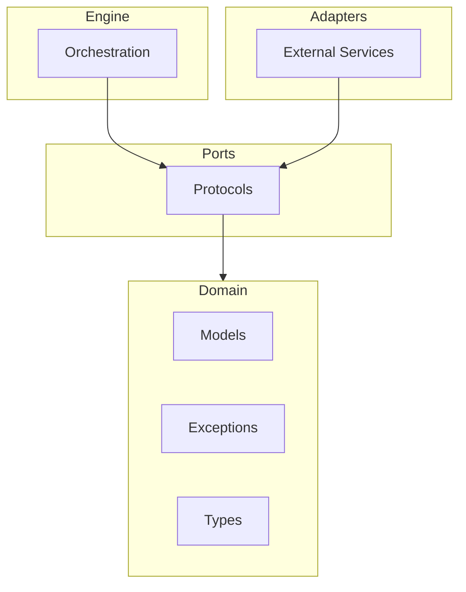

# Getting Started

This guide will help you install GEPA-ADK and understand its core concepts.

## Prerequisites

- Python 3.12 or higher
- [uv](https://docs.astral.sh/uv/) package manager (recommended)

## Installation

### Using uv (Recommended)

```bash
uv add gepa-adk
```

### Using pip

```bash
pip install gepa-adk
```

## Core Concepts

GEPA-ADK uses evolutionary algorithms to optimize AI agents. Here are the key concepts:

### Evolution Configuration

The [`EvolutionConfig`][gepa_adk.domain.models.EvolutionConfig] class defines parameters for an evolution run:

```python
from gepa_adk.domain.models import EvolutionConfig

config = EvolutionConfig(
    max_iterations=100,      # Maximum evolution iterations
    patience=10,             # Stop after N iterations without improvement
    fitness_threshold=0.95,  # Target fitness score
    population_size=20,      # Number of candidates per generation
    mutation_rate=0.1,       # Probability of mutation
)
```

### Candidates

A [`Candidate`][gepa_adk.domain.models.Candidate] represents an individual solution being evolved:

```python
from gepa_adk.domain.models import Candidate

candidate = Candidate(
    id="candidate-001",
    content="Your agent prompt or configuration",
    fitness=0.85,
    generation=5,
)
```

### Evolution Results

The [`EvolutionResult`][gepa_adk.domain.models.EvolutionResult] captures the outcome of an evolution run:

```python
from gepa_adk.domain.models import EvolutionResult

# After running evolution, you get a result like:
result = EvolutionResult(
    best_candidate=best_candidate,
    iterations_completed=42,
    final_fitness=0.97,
    converged=True,
)
```

### Iteration Records

Each iteration is tracked with an [`IterationRecord`][gepa_adk.domain.models.IterationRecord]:

```python
from gepa_adk.domain.models import IterationRecord

record = IterationRecord(
    iteration=1,
    best_fitness=0.75,
    mean_fitness=0.62,
    candidates_evaluated=20,
)
```

## Architecture Overview

GEPA-ADK follows a hexagonal architecture pattern:



For more details, see the [Architecture Decision Records](adr/index.md).

## Type System

GEPA-ADK uses type aliases for clarity:

- [`Score`][gepa_adk.domain.types.Score]: Fitness scores (float between 0.0 and 1.0)
- [`ComponentName`][gepa_adk.domain.types.ComponentName]: Named components (string)
- [`ModelName`][gepa_adk.domain.types.ModelName]: LLM model identifiers (string)

## Exception Handling

All exceptions inherit from [`EvolutionError`][gepa_adk.domain.exceptions.EvolutionError]:

```python
from gepa_adk.domain.exceptions import EvolutionError, ConfigurationError

try:
    # Your evolution code
    pass
except ConfigurationError as e:
    print(f"Configuration issue: {e}")
except EvolutionError as e:
    print(f"Evolution failed: {e}")
```

## Your First Evolution

Now let's run your first evolution to optimize an agent's instruction.

### Step 1: Create an Agent

Create a simple Q&A agent with a structured output schema:

```python
from pydantic import BaseModel, Field
from google.adk.agents import LlmAgent


class QAOutput(BaseModel):
    """Structured output for Q&A responses."""

    answer: str
    confidence: str
    score: float = Field(ge=0.0, le=1.0, description="Self-assessed accuracy")


agent = LlmAgent(
    name="qa-assistant",
    model="gemini-2.0-flash",
    instruction="You are a helpful assistant that answers questions accurately.",
    output_schema=QAOutput,
)
```

### Step 2: Prepare Training Data

Create training examples that represent the kind of queries your agent should handle:

```python
trainset = [
    {"input": "What is the capital of France?", "expected": "Paris"},
    {"input": "What is 2 + 2?", "expected": "4"},
    {"input": "Who wrote Romeo and Juliet?", "expected": "William Shakespeare"},
]
```

### Step 3: Run Evolution

Use `evolve_sync()` to optimize the agent's instruction:

```python
from gepa_adk import evolve_sync, EvolutionConfig

# Configure evolution parameters
config = EvolutionConfig(
    max_iterations=10,  # Maximum evolution iterations
    patience=3,         # Stop if no improvement for 3 iterations
)

# Run evolution
result = evolve_sync(agent, trainset, config=config)

# View results
print(f"Original score: {result.original_score:.2f}")
print(f"Final score: {result.final_score:.2f}")
print(f"Improvement: {result.improvement:.2%}")
print(f"\nEvolved instruction:\n{result.evolved_instruction}")
```

### Complete Example

Here's the full script you can run:

```python
"""First evolution example - optimize a Q&A agent."""

import os
from pydantic import BaseModel, Field
from google.adk.agents import LlmAgent
from gepa_adk import evolve_sync, EvolutionConfig

# Ensure API key is set
if not os.getenv("GEMINI_API_KEY"):
    raise ValueError("Set GEMINI_API_KEY environment variable")


class QAOutput(BaseModel):
    answer: str
    confidence: str
    score: float = Field(ge=0.0, le=1.0)


agent = LlmAgent(
    name="qa-assistant",
    model="gemini-2.0-flash",
    instruction="You are a helpful assistant that answers questions accurately.",
    output_schema=QAOutput,
)

trainset = [
    {"input": "What is the capital of France?", "expected": "Paris"},
    {"input": "What is 2 + 2?", "expected": "4"},
    {"input": "Who wrote Romeo and Juliet?", "expected": "William Shakespeare"},
]

config = EvolutionConfig(max_iterations=10, patience=3)
result = evolve_sync(agent, trainset, config=config)

print(f"Original score: {result.original_score:.2f}")
print(f"Final score: {result.final_score:.2f}")
print(f"Improvement: {result.improvement:.2%}")
print(f"\nEvolved instruction:\n{result.evolved_instruction}")
```

## Understanding Results

The [`EvolutionResult`][gepa_adk.EvolutionResult] contains:

| Field | Description |
|-------|-------------|
| `original_score` | Score before evolution (0.0-1.0) |
| `final_score` | Score after evolution (0.0-1.0) |
| `improvement` | Percentage improvement |
| `evolved_instruction` | The optimized instruction text |
| `total_iterations` | Number of evolution iterations run |
| `iteration_history` | Detailed per-iteration metrics |

### Interpreting Scores

- **Score source**: By default, the score comes from the agent's `output_schema` (the `score` field)
- **Higher is better**: Scores range from 0.0 (worst) to 1.0 (best)
- **Improvement threshold**: A 5-10% improvement is typical; larger improvements suggest the original instruction was suboptimal

### Iteration History

Access detailed metrics for each iteration:

```python
for record in result.iteration_history:
    print(f"Iteration {record.iteration}: score={record.best_fitness:.3f}")
```

## Troubleshooting

### Common Issues

**"GEMINI_API_KEY environment variable required"**

Set your API key before running:

```bash
export GEMINI_API_KEY="your-api-key-here"
```

**"ConfigurationError: Either critic must be provided or agent must have output_schema"**

Your agent needs either:

1. An `output_schema` with a `score` field for self-assessment, OR
2. A separate critic agent for scoring

**"nest_asyncio is required for nested event loops"**

If running in Jupyter, install nest_asyncio:

```bash
uv add nest_asyncio
```

**Evolution doesn't improve**

- Add more training examples (5-10 minimum recommended)
- Increase `max_iterations` in the config
- Check that expected outputs in trainset are clear and unambiguous

## Next Steps

- **[Single-Agent Guide](guides/single-agent.md)** — Detailed patterns for basic agent evolution
- **[Critic Agents Guide](guides/critic-agents.md)** — Use dedicated critics for better scoring
- **[Multi-Agent Guide](guides/multi-agent.md)** — Evolve multiple agents together
- **[Workflows Guide](guides/workflows.md)** — Optimize SequentialAgent pipelines
- **[API Reference](reference/)** — Complete documentation for all functions and classes
- **[Architecture Decision Records](adr/index.md)** — Design rationale and patterns
- **[Docstring Templates](contributing/docstring-templates.md)** — Contributing guidelines
