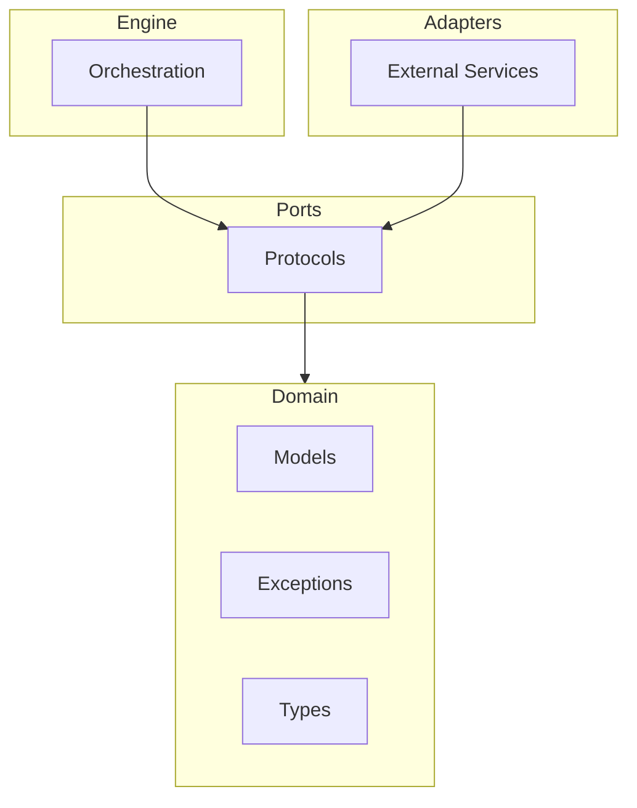

# Getting Started

This guide will help you install GEPA-ADK and understand its core concepts.

## Prerequisites

- Python 3.12 or higher
- [uv](https://docs.astral.sh/uv/) package manager (recommended)

## Installation

### Using uv (Recommended)

```bash
uv add gepa-adk
```

### Using pip

```bash
pip install gepa-adk
```

## Core Concepts

GEPA-ADK uses evolutionary algorithms to optimize AI agents. Here are the key concepts:

### Evolution Configuration

The [`EvolutionConfig`][gepa_adk.domain.models.EvolutionConfig] class defines parameters for an evolution run:

```python
from gepa_adk.domain.models import EvolutionConfig

config = EvolutionConfig(
    max_iterations=100,      # Maximum evolution iterations
    patience=10,             # Stop after N iterations without improvement
    fitness_threshold=0.95,  # Target fitness score
    population_size=20,      # Number of candidates per generation
    mutation_rate=0.1,       # Probability of mutation
)
```

### Candidates

A [`Candidate`][gepa_adk.domain.models.Candidate] represents an individual solution being evolved:

```python
from gepa_adk.domain.models import Candidate

candidate = Candidate(
    id="candidate-001",
    content="Your agent prompt or configuration",
    fitness=0.85,
    generation=5,
)
```

### Evolution Results

The [`EvolutionResult`][gepa_adk.domain.models.EvolutionResult] captures the outcome of an evolution run:

```python
from gepa_adk.domain.models import EvolutionResult

# After running evolution, you get a result like:
result = EvolutionResult(
    best_candidate=best_candidate,
    iterations_completed=42,
    final_fitness=0.97,
    converged=True,
)
```

### Iteration Records

Each iteration is tracked with an [`IterationRecord`][gepa_adk.domain.models.IterationRecord]:

```python
from gepa_adk.domain.models import IterationRecord

record = IterationRecord(
    iteration=1,
    best_fitness=0.75,
    mean_fitness=0.62,
    candidates_evaluated=20,
)
```

## Architecture Overview

GEPA-ADK follows a hexagonal architecture pattern:



For more details, see the [Architecture Decision Records](adr/index.md).

## Type System

GEPA-ADK uses type aliases for clarity:

- [`Score`][gepa_adk.domain.types.Score]: Fitness scores (float between 0.0 and 1.0)
- [`ComponentName`][gepa_adk.domain.types.ComponentName]: Named components (string)
- [`ModelName`][gepa_adk.domain.types.ModelName]: LLM model identifiers (string)

## Exception Handling

All exceptions inherit from [`EvolutionError`][gepa_adk.domain.exceptions.EvolutionError]:

```python
from gepa_adk.domain.exceptions import EvolutionError, ConfigurationError

try:
    # Your evolution code
    pass
except ConfigurationError as e:
    print(f"Configuration issue: {e}")
except EvolutionError as e:
    print(f"Evolution failed: {e}")
```

## Next Steps

- Explore the [API Reference](reference/) for detailed documentation
- Read the [Architecture Decision Records](adr/index.md) for design rationale
- Check the [Docstring Templates](contributing/docstring-templates.md) for contributing guidelines
