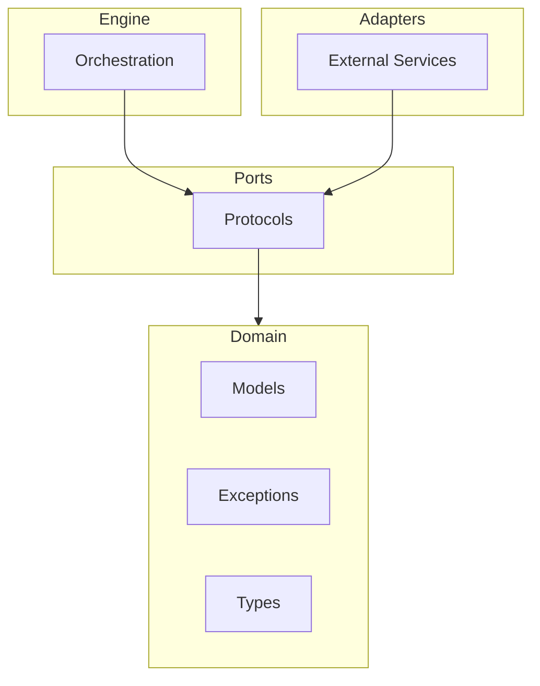

# Getting Started

This guide will help you install GEPA-ADK and understand its core concepts.

## Prerequisites

Before installing gepa-adk, you need:

1. **Python 3.12 or higher**
2. **[uv](https://docs.astral.sh/uv/) package manager** (recommended)
3. **Ollama** with the `gpt-oss:20b` model:
   ```bash
   # Install Ollama from https://ollama.ai

   # Pull the required model
   ollama pull gpt-oss:20b
   ```
4. **Set environment variable**:
   ```bash
   export OLLAMA_API_BASE=http://localhost:11434
   ```

**Why gpt-oss:20b?** The evolutionary optimization engine uses this model internally to generate improved agent instructions. Without it, evolution will fail.

!!! info "Why We Recommend Local Models"
    Evolutionary optimization makes **many LLM calls** during each run (evaluating multiple candidates across iterations). This can quickly consume API quotas and incur costs with cloud providers.

    **We recommend Ollama with open-source models** for development and experimentation. However, gepa-adk works with any model supported by Google ADK, including Gemini - just be aware of potential costs and rate limits.

## Installation

### Using uv (Recommended)

```bash
uv add gepa-adk
```

### Using pip

```bash
pip install gepa-adk
```

## Core Concepts

GEPA-ADK uses evolutionary algorithms to optimize AI agents. Here are the key concepts:

### Evolution Configuration

The [`EvolutionConfig`][gepa_adk.domain.models.EvolutionConfig] class defines parameters for an evolution run:

```python
from gepa_adk.domain.models import EvolutionConfig

config = EvolutionConfig(
    max_iterations=100,      # Maximum evolution iterations
    patience=10,             # Stop after N iterations without improvement
    fitness_threshold=0.95,  # Target fitness score
    population_size=20,      # Number of candidates per generation
    mutation_rate=0.1,       # Probability of mutation
)
```

### Candidates

A [`Candidate`][gepa_adk.domain.models.Candidate] represents an individual solution being evolved:

```python
from gepa_adk.domain.models import Candidate

candidate = Candidate(
    id="candidate-001",
    content="Your agent prompt or configuration",
    fitness=0.85,
    generation=5,
)
```

### Evolution Results

The [`EvolutionResult`][gepa_adk.domain.models.EvolutionResult] captures the outcome of an evolution run:

```python
from gepa_adk.domain.models import EvolutionResult

# After running evolution, you get a result like:
result = EvolutionResult(
    best_candidate=best_candidate,
    iterations_completed=42,
    final_fitness=0.97,
    converged=True,
)
```

### Iteration Records

Each iteration is tracked with an [`IterationRecord`][gepa_adk.domain.models.IterationRecord]:

```python
from gepa_adk.domain.models import IterationRecord

record = IterationRecord(
    iteration=1,
    best_fitness=0.75,
    mean_fitness=0.62,
    candidates_evaluated=20,
)
```

## Architecture Overview

GEPA-ADK follows a hexagonal architecture pattern:



For more details, see the [Architecture Decision Records](adr/index.md).

## Type System

GEPA-ADK uses type aliases for clarity:

- [`Score`][gepa_adk.domain.types.Score]: Fitness scores (float between 0.0 and 1.0)
- [`ComponentName`][gepa_adk.domain.types.ComponentName]: Named components (string)
- [`ModelName`][gepa_adk.domain.types.ModelName]: LLM model identifiers (string)

## Exception Handling

All exceptions inherit from [`EvolutionError`][gepa_adk.domain.exceptions.EvolutionError]:

```python
from gepa_adk.domain.exceptions import EvolutionError, ConfigurationError

try:
    # Your evolution code
    pass
except ConfigurationError as e:
    print(f"Configuration issue: {e}")
except EvolutionError as e:
    print(f"Evolution failed: {e}")
```

## Your First Evolution

Now let's run your first evolution to optimize an agent's instruction using a critic agent for scoring.

### Step 1: Create the Main Agent

Create a simple greeting agent:

```python
from google.adk.agents import LlmAgent
from google.adk.models.lite_llm import LiteLlm

agent = LlmAgent(
    name="greeter",
    model=LiteLlm(model="ollama_chat/gpt-oss:20b"),
    instruction="Greet the user appropriately based on their introduction.",
)
```

### Step 2: Create a Critic Agent

Create a critic to score the greetings:

```python
from pydantic import BaseModel, Field


class CriticOutput(BaseModel):
    """Structured output for critic evaluation."""
    score: float = Field(ge=0.0, le=1.0, description="Quality score")
    feedback: str


critic = LlmAgent(
    name="critic",
    model=LiteLlm(model="ollama_chat/gpt-oss:20b"),
    instruction="""Evaluate the greeting quality. Look for formal, elaborate greetings
    appropriate for the social context. Provide a score from 0.0 to 1.0 where 1.0 is perfect.""",
    output_schema=CriticOutput,
)
```

### Step 3: Prepare Training Data

Create training examples representing different greeting scenarios:

```python
trainset = [
    {"input": "I am His Majesty, the King."},
    {"input": "I am your mother."},
    {"input": "I am a close friend."},
]
```

### Step 4: Run Evolution

Use `evolve_sync()` with the critic to optimize the agent's instruction:

```python
from gepa_adk import evolve_sync, EvolutionConfig

# Configure evolution parameters
config = EvolutionConfig(
    max_iterations=5,  # Maximum evolution iterations
    patience=2,        # Stop if no improvement for 2 iterations
)

# Run evolution with critic
result = evolve_sync(agent, trainset, critic=critic, config=config)

# View results
print(f"Original score: {result.original_score:.2f}")
print(f"Final score: {result.final_score:.2f}")
print(f"Improvement: {result.improvement:.2%}")
print(f"\nEvolved instruction:\n{result.evolved_instruction}")
```

### Complete Working Examples

Three complete runnable examples are available in the repository:

- **[examples/basic_evolution.py](https://github.com/Alberto-Codes/gepa-adk/blob/HEAD/examples/basic_evolution.py)** — Simple greeting agent evolution with critic scoring (shown above)
- **[examples/critic_agent.py](https://github.com/Alberto-Codes/gepa-adk/blob/HEAD/examples/critic_agent.py)** — Story generation with dedicated critic agent for evaluation
- **[examples/custom_reflection_prompt.py](https://github.com/Alberto-Codes/gepa-adk/blob/HEAD/examples/custom_reflection_prompt.py)** — Custom reflection prompts for tailored mutation strategies

All examples require Ollama with `gpt-oss:20b` model running locally.

Run an example:
```bash
python examples/basic_evolution.py
```

## Understanding Results

The [`EvolutionResult`][gepa_adk.EvolutionResult] contains:

| Field | Description |
|-------|-------------|
| `original_score` | Score before evolution (0.0-1.0) |
| `final_score` | Score after evolution (0.0-1.0) |
| `improvement` | Percentage improvement |
| `evolved_instruction` | The optimized instruction text |
| `total_iterations` | Number of evolution iterations run |
| `iteration_history` | Detailed per-iteration metrics |

### Interpreting Scores

- **Score source**: By default, the score comes from the agent's `output_schema` (the `score` field)
- **Higher is better**: Scores range from 0.0 (worst) to 1.0 (best)
- **Improvement threshold**: A 5-10% improvement is typical; larger improvements suggest the original instruction was suboptimal

### Iteration History

Access detailed metrics for each iteration:

```python
for record in result.iteration_history:
    print(f"Iteration {record.iteration}: score={record.best_fitness:.3f}")
```

## Troubleshooting

### Common Issues

**"Model not found" or "Connection refused" errors**

Ensure Ollama is running and the model is pulled:

```bash
# Check Ollama is running
curl http://localhost:11434/api/tags

# Pull the model if not present
ollama pull gpt-oss:20b

# Verify the model is available
ollama list | grep gpt-oss
```

**"OLLAMA_API_BASE environment variable required"**

Set the environment variable before running:

```bash
export OLLAMA_API_BASE=http://localhost:11434
```

**"ConfigurationError: Either critic must be provided or agent must have output_schema"**

Your agent needs either:

1. An `output_schema` with a `score` field for self-assessment, OR
2. A separate critic agent for scoring (recommended - see examples)

**Evolution is slow or uses too many iterations**

Adjust the `EvolutionConfig` parameters:

```python
config = EvolutionConfig(
    max_iterations=3,  # Reduce iterations
    patience=2,        # Stop early if no improvement
)
```

**Evolution doesn't improve**

- Add more training examples (3-5 minimum, 5-10 recommended)
- Increase `max_iterations` in the config
- Check that your critic instruction is clear and specific
- Ensure training examples cover diverse scenarios

## Next Steps

- **[Single-Agent Guide](guides/single-agent.md)** — Detailed patterns for basic agent evolution
- **[Critic Agents Guide](guides/critic-agents.md)** — Use dedicated critics for better scoring
- **[Reflection Prompts Guide](guides/reflection-prompts.md)** — Customize the prompt used for instruction mutation
- **[API Reference](reference/)** — Complete documentation for all functions and classes
- **[Architecture Decision Records](adr/index.md)** — Design rationale and patterns
- **[Examples Directory](https://github.com/Alberto-Codes/gepa-adk/tree/HEAD/examples)** — Working code examples

### Advanced Topics (Coming Soon)

- Multi-Agent Evolution — Evolve multiple agents together
- Workflow Optimization — Optimize SequentialAgent pipelines
