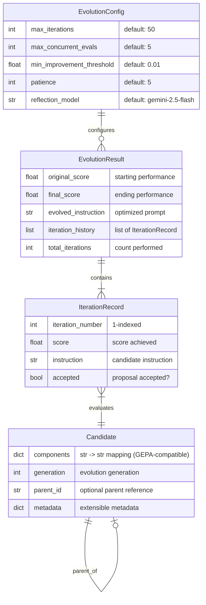
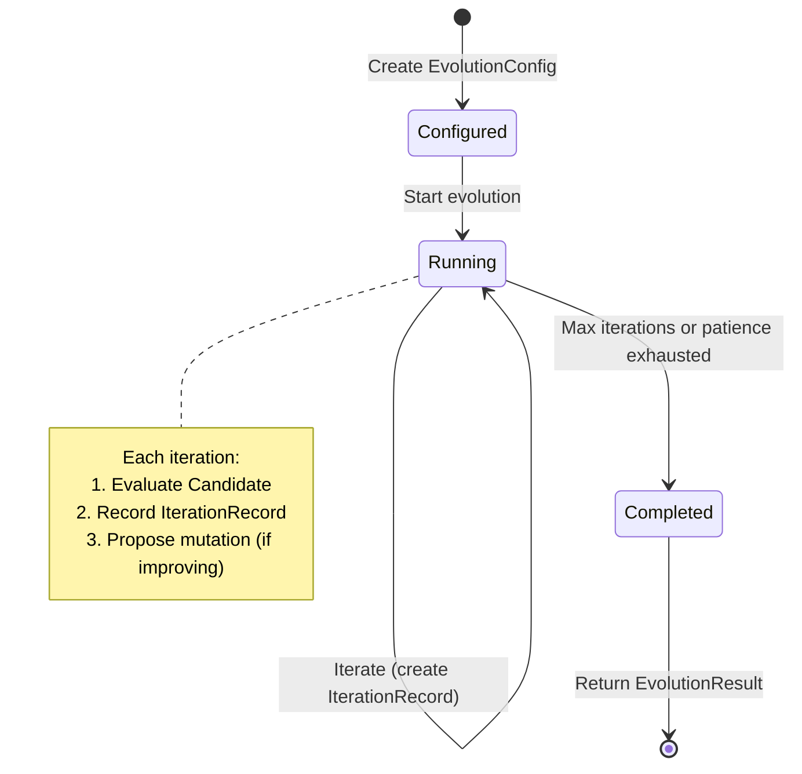

# Data Model: Domain Models for Evolution Engine

**Feature**: 002-domain-models  
**Date**: 2026-01-10  
**Source**: [spec.md](./spec.md), [research.md](./research.md)

## Entity Relationship Diagram



## Entity Definitions

### EvolutionConfig

**Purpose**: Configuration parameters for an evolution run.

| Field | Type | Default | Validation | Description |
|-------|------|---------|------------|-------------|
| `max_iterations` | `int` | `50` | `>= 0` | Maximum evolution iterations |
| `max_concurrent_evals` | `int` | `5` | `>= 1` | Concurrent batch evaluations |
| `min_improvement_threshold` | `float` | `0.01` | `>= 0.0` | Minimum score improvement to accept |
| `patience` | `int` | `5` | `>= 0` | Iterations without improvement before stopping |
| `reflection_model` | `str` | `"gemini-2.5-flash"` | Non-empty | Model for reflection/mutation |

**Dataclass Options**: `slots=True`, `kw_only=True`

**Validation Rules**:
- `max_iterations >= 0` (0 means no evolution, just evaluate baseline)
- `max_concurrent_evals >= 1` (at least one evaluation at a time)
- `min_improvement_threshold >= 0.0` (negative makes no sense)
- `patience >= 0` (0 means never stop early)
- `reflection_model` must be non-empty string

---

### EvolutionResult

**Purpose**: Outcome of a completed evolution run.

| Field | Type | Default | Description |
|-------|------|---------|-------------|
| `original_score` | `float` | Required | Starting performance (baseline) |
| `final_score` | `float` | Required | Ending performance (best achieved) |
| `evolved_instruction` | `str` | Required | The optimized instruction text |
| `iteration_history` | `list[IterationRecord]` | Required | Chronological iteration records |
| `total_iterations` | `int` | Required | Number of iterations performed |

**Dataclass Options**: `slots=True`, `frozen=True`, `kw_only=True`

**Computed Properties**:
- `improvement: float` → `final_score - original_score`
- `improved: bool` → `final_score > original_score`

**Invariants**:
- `total_iterations == len(iteration_history)` (enforced in engine, not model)
- `original_score` and `final_score` are typically in `[0.0, 1.0]` but not enforced

---

### Candidate

**Purpose**: Represents an instruction candidate being evolved. Unlike GEPA's `dict[str, str]` type alias, we use a class for richer state tracking in async scenarios.

| Field | Type | Default | Description |
|-------|------|---------|-------------|
| `components` | `dict[str, str]` | `{}` | Component name → text value (GEPA-compatible) |
| `generation` | `int` | `0` | Generation number in evolution lineage |
| `parent_id` | `str \| None` | `None` | ID of parent candidate (for lineage) |
| `metadata` | `dict[str, Any]` | `{}` | Extensible metadata for async tracking |

**Dataclass Options**: `slots=True`, `kw_only=True`

**Standard Component Keys** (aligned with GEPA):
- `"instruction"`: The main agent instruction/prompt
- `"output_schema"`: Optional structured output schema

**GEPA Compatibility**:
```python
# gepa-adk Candidate can export to GEPA's dict[str, str] format:
gepa_candidate: dict[str, str] = candidate.components
```

**Mutation Pattern**:
```python
candidate = Candidate(components={"instruction": "You are a helpful assistant."})
candidate.components["instruction"] = "You are an expert analyst."
```

---

### IterationRecord

**Purpose**: Captures metrics for a single evolution iteration.

| Field | Type | Default | Description |
|-------|------|---------|-------------|
| `iteration_number` | `int` | Required | 1-indexed iteration number |
| `score` | `float` | Required | Score achieved in this iteration |
| `instruction` | `str` | Required | Instruction text evaluated |
| `accepted` | `bool` | Required | Whether proposal was accepted |

**Dataclass Options**: `slots=True`, `frozen=True`, `kw_only=True`

**Invariants**:
- `iteration_number >= 1` (1-indexed for human readability)
- `score` typically in `[0.0, 1.0]` but not enforced

---

## Type Aliases (types.py)

```python
from typing import TypeAlias

# Semantic type aliases for clarity
Score: TypeAlias = float
"""Normalized score, typically in [0.0, 1.0]."""

ComponentName: TypeAlias = str
"""Name of a candidate component (e.g., 'instruction', 'output_schema')."""

ModelName: TypeAlias = str
"""Model identifier (e.g., 'gemini-2.5-flash', 'gpt-4o')."""
```

---

## Exception Hierarchy (exceptions.py)

Following [ADR-009](../../docs/adr/ADR-009-exception-hierarchy.md):

```python
class EvolutionError(Exception):
    """Base exception for all gepa-adk errors."""
    
class ConfigurationError(EvolutionError):
    """Raised when configuration validation fails."""
```

| Exception | Raised When | Context Fields |
|-----------|-------------|----------------|
| `ConfigurationError` | Invalid config parameter | `field`, `value`, `constraint` |

---

## State Diagram: Evolution Lifecycle


