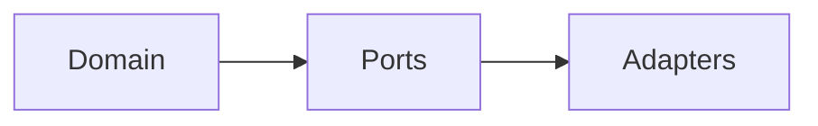

# Quickstart: MkDocs Documentation (Full Automation)

**Feature**: 003-mkdocs-setup

## Prerequisites

```bash
# Ensure dependencies are synced
uv sync
```

## Common Commands

### Build Documentation
```bash
# Build static site to site/ directory
uv run mkdocs build

# Build with strict mode (fail on warnings)
uv run mkdocs build --strict
```

### Preview Locally
```bash
# Start development server with hot reload
uv run mkdocs serve

# Access at http://127.0.0.1:8000
```

## File Locations

| Purpose | Location |
|---------|----------|
| Configuration | `mkdocs.yml` |
| API generator script | `scripts/gen_ref_pages.py` |
| Landing page | `docs/index.md` |
| Getting started guide | `docs/getting-started.md` |
| API reference | `docs/reference/` (auto-generated) |
| ADRs | `docs/adr/*.md` |
| Contributing guides | `docs/contributing/*.md` |
| Build output | `site/` (gitignored) |

## Adding New Modules (Zero Work!)

The API documentation is **fully automated**. When you add a new Python module:

1. Create your module in `src/gepa_adk/`
2. Add Google-style docstrings
3. Run `uv run mkdocs serve`
4. ✨ Your module appears in API Reference automatically!

**How it works**:
- `scripts/gen_ref_pages.py` scans `src/gepa_adk/` at build time
- Creates virtual markdown pages with `::: module.path` directives
- `mkdocs-literate-nav` builds the navigation tree
- `mkdocs-section-index` binds `__init__.py` to folder sections

## Plugin Features

| Feature | Automatic? | Notes |
|---------|------------|-------|
| API reference | ✅ Yes | Scans `src/` at build time |
| Navigation | ✅ Yes | Generated from source structure |
| Last updated | ✅ Yes | From git history |
| Inherited docs | ✅ Yes | Child classes get parent docs |
| Deprecation | ✅ Yes | `@deprecated` shows warnings |
| Image lightbox | ✅ Yes | Click any image to zoom |
| Minification | ✅ Yes | Production builds optimized |

## Using Macros (Dynamic Content)

Variables defined in `mkdocs.yml`:
```yaml
extra:
  project_name: GEPA-ADK
  version: "0.1.0"
```

Use in markdown:
```markdown
# {{ project_name }}

Current version: **{{ version }}**
```

## Adding Mermaid Diagrams

Use fenced code blocks:

````markdown

````

## Troubleshooting

### "Config file 'mkdocs.yml' does not exist"
Run from repository root: `cd /path/to/gepa-adk`

### Module not appearing in API reference
1. Check module is in `src/gepa_adk/`
2. Ensure it has an `__init__.py`
3. Verify docstrings exist
4. Restart `mkdocs serve`

### Git dates not showing
CI needs `fetch-depth: 0`:
```yaml
- uses: actions/checkout@v4
  with:
    fetch-depth: 0
```

### Mermaid diagrams show as code
Ensure `pymdownx.superfences` has mermaid custom fence configured.

## Debug Information

Add to any page to see all available variables:
```markdown
{{ macros_info() }}
```
