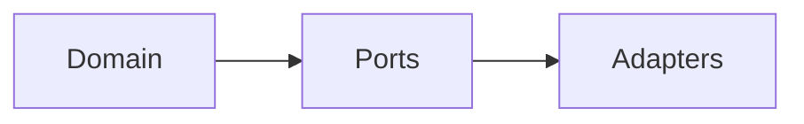

# Research: MkDocs Material Documentation Setup (Full Automation)

**Feature**: 003-mkdocs-setup  
**Date**: January 10, 2026  
**Goal**: Maximize automation using all installed dev dependencies

## Docstring Conventions Analysis (ADR-010 + Templates)

Your codebase follows these docstring patterns that mkdocstrings must render correctly:

### Current Docstring Sections in Use

From analyzing `src/gepa_adk/`:

| Section | Example from Code | Rendering Strategy |
|---------|-------------------|-------------------|
| **Attributes** | `max_iterations: Maximum number...` | Table with types |
| **Examples** | Fenced ` ```python ` blocks | Syntax highlighted |
| **Note** | `Note: All numeric parameters...` | Blue admonition |
| **Raises** | `ConfigurationError: If any...` | Linked to exception |
| **See Also** | `` [`gepa_adk.domain`][gepa_adk.domain] `` | Cross-reference link |
| **Returns** | `The difference between...` | Return type + desc |

### Module-Level Docstrings Pattern

All `__init__.py` files use this structure (per `docstring-templates.md`):
```python
"""Module summary.

Extended description.

Attributes:
    ExportedClass (class): Description.
    exported_function (function): Description.

Examples:
    ```python
    from module import Thing
    ```

See Also:
    :mod:`related.module`: Related module.

Note:
    Implementation detail.
"""
```

### Class Docstrings Pattern

All dataclasses use:
```python
"""Summary.

Extended description.

Attributes:
    field_name: Description of field.

Examples:
    ```python
    instance = Class(param=value)
    ```

Note:
    Usage note.
"""
```

---

## Installed Plugins Analysis

From `pyproject.toml` dev dependencies:

| Plugin | Purpose | Use in This Feature |
|--------|---------|---------------------|
| `mkdocs-material>=9.7.1` | Theme | ✅ Core theme with Mermaid support |
| `mkdocstrings>=1.0.0` | API autodoc framework | ✅ Core API documentation |
| `mkdocstrings-python>=2.0.1` | Python handler (griffe-based) | ✅ Docstring parsing |
| `mkdocs-gen-files>=0.5.0` | Generate files at build time | ✅ **Auto-generate API pages** |
| `mkdocs-literate-nav>=0.6.1` | Navigation from markdown | ✅ **Auto-generate nav for API** |
| `mkdocs-section-index>=0.3.9` | Bind sections to index pages | ✅ **Clean `__init__` handling** |
| `mkdocs-git-revision-date-localized-plugin>=1.4.7` | Last updated dates | ✅ Show "Last updated" on pages |
| `mkdocs-minify-plugin>=0.8.0` | Minify HTML/CSS/JS | ✅ Production optimization |
| `mkdocs-redirects>=1.2.1` | URL redirects | ⏸️ Reserved for later refactoring |
| `mkdocs-glightbox>=0.4.0` | Image lightbox | ✅ Better image viewing |
| `mkdocs-macros-plugin>=1.3.7` | Jinja2 variables/macros | ✅ **Dynamic content & variables** |
| `pillow>=11.0.0` | Image processing | ✅ Social cards (optional) |
| `cairosvg>=2.7.1` | SVG rendering | ✅ Social cards (optional) |
| `griffe-warnings-deprecated>=1.1.0` | Mark deprecated APIs | ✅ Deprecation notices |
| `griffe-inherited-docstrings>=1.1.2` | Inherit parent docstrings | ✅ Cleaner class docs |

---

## R1: Automatic API Reference Generation (Full Automation)

### Decision
Use the **mkdocstrings recipe** with `mkdocs-gen-files` + `mkdocs-literate-nav` + `mkdocs-section-index` for fully automated API documentation.

### Implementation
Create `scripts/gen_ref_pages.py`:

```python
"""Generate the code reference pages and navigation."""

from pathlib import Path

import mkdocs_gen_files

nav = mkdocs_gen_files.Nav()

root = Path(__file__).parent.parent
src = root / "src"

for path in sorted(src.rglob("*.py")):
    module_path = path.relative_to(src).with_suffix("")
    doc_path = path.relative_to(src).with_suffix(".md")
    full_doc_path = Path("reference", doc_path)

    parts = tuple(module_path.parts)

    if parts[-1] == "__init__":
        parts = parts[:-1]
        doc_path = doc_path.with_name("index.md")
        full_doc_path = full_doc_path.with_name("index.md")
    elif parts[-1] == "__main__":
        continue

    nav[parts] = doc_path.as_posix()

    with mkdocs_gen_files.open(full_doc_path, "w") as fd:
        ident = ".".join(parts)
        fd.write(f"::: {ident}")

    mkdocs_gen_files.set_edit_path(full_doc_path, path.relative_to(root))

with mkdocs_gen_files.open("reference/SUMMARY.md", "w") as nav_file:
    nav_file.writelines(nav.build_literate_nav())
```

### mkdocs.yml Configuration
```yaml
plugins:
  - search
  - gen-files:
      scripts:
        - scripts/gen_ref_pages.py
  - literate-nav:
      nav_file: SUMMARY.md
  - section-index
  - mkdocstrings:
      handlers:
        python:
          options:
            docstring_style: google
            show_source: true
            show_root_heading: true
            members_order: source

nav:
  - Home: index.md
  - Getting Started: getting-started.md
  - API Reference: reference/  # Trailing slash = literate nav!
  - Architecture: adr/
  - Contributing: contributing/
```

### Rationale
- **Zero manual maintenance**: New modules automatically appear in docs
- **Consistent structure**: All modules documented identically
- **Edit links**: Point to source files, not generated markdown
- **Section binding**: `__init__.py` docs bound to folder sections

---

## R2: Griffe Extensions for Enhanced Documentation

### Decision
Enable `griffe-inherited-docstrings` and `griffe-warnings-deprecated` extensions.

### Configuration
```yaml
plugins:
  - mkdocstrings:
      handlers:
        python:
          options:
            extensions:
              - griffe_inherited_docstrings
              - griffe_warnings_deprecated
```

### Benefits
- **Inherited docstrings**: Child classes inherit parent method docs (cleaner)
- **Deprecation notices**: `@deprecated` decorators show warnings in docs

---

## R3: Git Revision Date (Last Updated)

### Decision
Use `mkdocs-git-revision-date-localized-plugin` for automatic "Last updated" timestamps.

### Configuration
```yaml
plugins:
  - git-revision-date-localized:
      enable_creation_date: true
      type: timeago  # "2 days ago" format
```

### CI Requirement
Must set `fetch-depth: 0` in GitHub Actions checkout:
```yaml
- uses: actions/checkout@v4
  with:
    fetch-depth: 0  # Required for git dates
```

---

## R4: Macros Plugin for Dynamic Content

### Decision
Use `mkdocs-macros-plugin` for project variables and dynamic content.

### Configuration
```yaml
plugins:
  - macros

extra:
  project_name: GEPA-ADK
  repo_url: https://github.com/Alberto-Codes/gepa-adk
  version: "0.1.0"
```

### Usage in Markdown
```markdown
# {{ project_name }}

Current version: **{{ version }}**

[View on GitHub]({{ repo_url }})
```

### Benefits
- Single source of truth for project metadata
- Can reference `pyproject.toml` values
- Custom macros for repetitive content

---

## R5: Image Lightbox (glightbox)

### Decision
Use `mkdocs-glightbox` for image zoom/lightbox functionality.

### Configuration
```yaml
plugins:
  - glightbox:
      touchNavigation: true
      loop: false
      effect: zoom
      width: 100%
      height: auto
```

### Usage
All images automatically get lightbox behavior. No markdown changes needed.

---

## R6: Production Optimization (minify)

### Decision
Use `mkdocs-minify-plugin` for smaller build output.

### Configuration
```yaml
plugins:
  - minify:
      minify_html: true
      minify_js: true
      minify_css: true
      htmlmin_opts:
        remove_comments: true
```

---

## R7: Mermaid Diagram Support

### Decision
Use Material's built-in Mermaid support (no additional plugin).

### Configuration
```yaml
markdown_extensions:
  - pymdownx.superfences:
      custom_fences:
        - name: mermaid
          class: mermaid
          format: !!python/name:pymdownx.superfences.fence_code_format
```

### Usage
````markdown

````

---

## R8: mkdocstrings-python Best Configuration

### Full Handler Configuration
```yaml
plugins:
  - mkdocstrings:
      default_handler: python
      handlers:
        python:
          paths: [src]
          options:
            # General
            docstring_style: google
            show_source: true
            show_root_heading: true
            show_root_full_path: false
            show_symbol_type_heading: true
            show_symbol_type_toc: true
            
            # Members
            members_order: source
            group_by_category: true
            show_submodules: true
            
            # Signatures
            show_signature_annotations: true
            separate_signature: true
            signature_crossrefs: true
            
            # Inheritance
            show_bases: true
            show_inheritance_diagram: true
            
            # Extensions
            extensions:
              - griffe_inherited_docstrings
              - griffe_warnings_deprecated
```

### Key Features
| Option | Value | Effect |
|--------|-------|--------|
| `show_inheritance_diagram` | `true` | Mermaid diagrams for class hierarchy |
| `signature_crossrefs` | `true` | Type annotations link to their docs |
| `separate_signature` | `true` | Cleaner function signatures |
| `group_by_category` | `true` | Groups attributes, methods, etc. |

---

## R9: CI Workflow Updates

### Required Changes to `.github/workflows/docs.yml`
```yaml
- uses: actions/checkout@v4
  with:
    fetch-depth: 0  # Required for git-revision-date plugin
```

Already present in current workflow ✅

---

## Final Plugin Order

Plugin order matters! Use this sequence:
```yaml
plugins:
  - search
  - gen-files:
      scripts:
        - scripts/gen_ref_pages.py
  - literate-nav:
      nav_file: SUMMARY.md
  - section-index
  - mkdocstrings:
      # ... config
  - git-revision-date-localized:
      enable_creation_date: true
      type: timeago
  - glightbox
  - minify:
      minify_html: true
  - macros
```

---

## Summary: Full Automation Stack

| Automation | Plugin(s) | Manual Work Eliminated |
|------------|-----------|------------------------|
| API page generation | gen-files | No manual `::: module` pages |
| API navigation | literate-nav | No manual nav entries for modules |
| `__init__` handling | section-index | Clean section binding |
| Inherited docs | griffe-inherited-docstrings | No duplicate docstrings |
| Last updated | git-revision-date-localized | Automatic timestamps |
| Variables | macros | Single source of truth |
| Image zoom | glightbox | Better UX, no work |
| Minification | minify | Smaller builds |

**Result**: Adding a new module to `src/gepa_adk/` automatically:
1. Creates its API reference page
2. Adds it to the navigation
3. Inherits parent docstrings
4. Shows last updated date
5. All with zero manual intervention!
