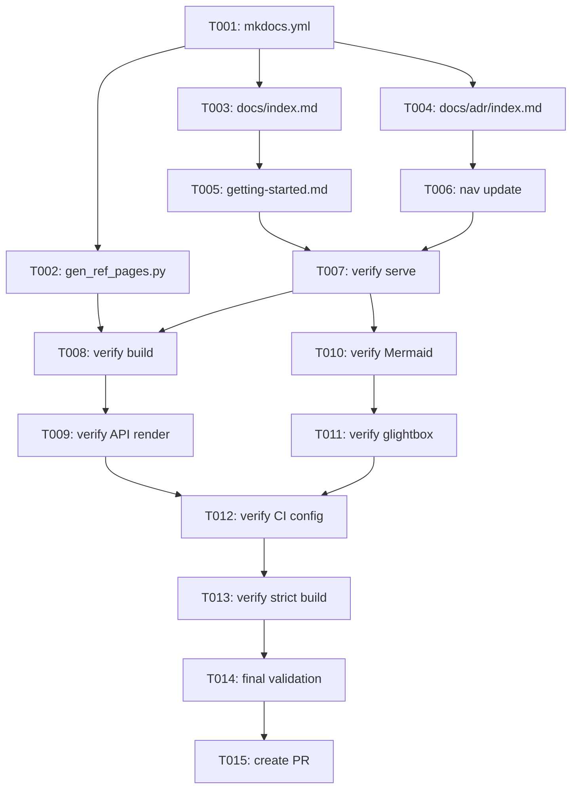

# Tasks: MkDocs Material Documentation Setup

> Auto-generated from spec.md, plan.md, and research.md

## Summary

| Phase | Description | Task Count |
|-------|-------------|------------|
| 1 | Setup | 2 |
| 2 | Foundational | 2 |
| 3 | US1 - View Documentation | 3 |
| 4 | US2 - API Reference | 2 |
| 5 | US3 - Architecture Diagrams | 2 |
| 6 | US4 - CI Validation | 2 |
| 7 | Polish | 2 |
| **Total** | | **15** |

---

## Phase 1: Setup

**Goal**: Initialize MkDocs configuration and core infrastructure

- [ ] T001 Create `mkdocs.yml` with Material theme, all plugins (gen-files, literate-nav, section-index, mkdocstrings, git-revision-date-localized, glightbox, minify, macros), and full markdown_extensions configuration per plan.md
- [ ] T002 Create `scripts/gen_ref_pages.py` with mkdocs-gen-files automation script per plan.md design

---

## Phase 2: Foundational

**Goal**: Create essential documentation structure required by all user stories

- [ ] T003 Create `docs/index.md` landing page with project overview, quick links to Getting Started, API Reference, and Architecture sections
- [ ] T004 Create `docs/adr/index.md` section landing page with overview of Architecture Decision Records and links to individual ADRs

---

## Phase 3: User Story 1 - View Documentation

**Story**: As a developer, I want to view project documentation locally so that I can understand how to use and extend GEPA-ADK

**Independent Test Criteria**:
- `uv run mkdocs serve` starts in < 5 seconds
- Landing page accessible at `http://localhost:8000`
- Navigation shows Home, Getting Started links

**Tasks**:

- [ ] T005 [US1] Create `docs/getting-started.md` with installation instructions (uv add), basic usage examples, and links to API Reference
- [ ] T006 [US1] Update `nav:` section in `mkdocs.yml` to include all navigation entries per plan.md (Home, Getting Started, API Reference, Architecture, Contributing)
- [ ] T007 [US1] Verify `uv run mkdocs serve` starts successfully and all pages are accessible

---

## Phase 4: User Story 2 - API Reference

**Story**: As a developer, I want automatically generated API reference documentation so that I can quickly find class signatures, method parameters, and docstring content

**Independent Test Criteria**:
- API Reference section auto-generated at `/reference/`
- All public modules from `src/gepa_adk/` appear in navigation
- Docstrings render with proper sections (Attributes, Examples, Note)

**Tasks**:

- [ ] T008 [US2] Run `uv run mkdocs build --strict` to verify gen-files automation creates all API pages under `reference/`
- [ ] T009 [US2] Verify API reference pages render correctly: module docstrings, class docstrings with Attributes/Examples/Note sections, type annotations, inheritance diagrams

---

## Phase 5: User Story 3 - Architecture Diagrams

**Story**: As a developer, I want to see architecture diagrams rendered as interactive graphics so that I can understand system design visually

**Independent Test Criteria**:
- Mermaid diagrams in ADR files render as SVG/graphics (not code blocks)
- Diagrams are interactive (hover, zoom via glightbox)

**Tasks**:

- [ ] T010 [US3] Verify Mermaid diagrams in ADR files (ADR-000, ADR-001, ADR-002, ADR-005) render correctly as graphics
- [ ] T011 [US3] Verify glightbox enables image lightbox functionality for diagrams

---

## Phase 6: User Story 4 - CI Validation

**Story**: As a developer, I want CI to validate documentation builds so that broken docs don't reach main branch

**Independent Test Criteria**:
- `uv run mkdocs build --strict` succeeds with exit code 0
- Existing `.github/workflows/docs.yml` runs without errors
- Build completes in < 60 seconds

**Tasks**:

- [ ] T012 [US4] Verify `.github/workflows/docs.yml` has `fetch-depth: 0` for git-revision-date-localized plugin
- [ ] T013 [US4] Run `uv run mkdocs build --strict` and confirm clean build with no warnings or errors

---

## Phase 7: Polish

**Goal**: Final validation and cross-cutting concerns

- [ ] T014 Verify all docstring features render correctly: Google-style sections, cross-references, inherited docstrings, type annotations, source links
- [ ] T015 Create PR targeting `develop` branch with complete documentation setup

---

## Dependencies



---

## Parallel Execution Opportunities

### Phase 1 (Sequential - file dependencies):
```bash
# Must be sequential: gen_ref_pages.py references mkdocs.yml location
T001 → T002
```

### Phase 2 (Parallel - different files):
```bash
# Can run in parallel:
T003: docs/index.md
T004: docs/adr/index.md
```

### User Story Phases (Sequential within, parallel across):
```bash
# After Phase 2 completes, US1 and US3 can progress in parallel:
# US1: T005 → T006 → T007
# US3: T010 → T011 (once serve is available from T007)

# US2 depends on US1 completion (needs serve running):
# US2: T008 → T009

# US4 depends on US2 and US3:
# US4: T012 → T013
```

---

## Implementation Strategy

### MVP First (User Story 1 Only)

1. Complete Phase 1: Setup (T001-T002)
2. Complete Phase 2: Foundational (T003-T004)
3. Complete Phase 3: User Story 1 (T005-T007)
4. **STOP and VALIDATE**: Run `uv run mkdocs serve` and verify landing page works
5. Can deploy docs site with just landing page + getting started

### Incremental Delivery

1. Setup + Foundational → Core structure ready
2. Add User Story 1 → Local preview working (MVP!)
3. Add User Story 2 → API reference auto-generated
4. Add User Story 3 → Diagrams rendering
5. Add User Story 4 → CI validated
6. Polish → Production ready

### Single Developer Strategy

Execute sequentially by phase:
1. Phase 1-2: Core setup (~15 min)
2. Phase 3: US1 - Local preview (~10 min)
3. Phase 4: US2 - API reference (~10 min)
4. Phase 5: US3 - Diagrams (~5 min)
5. Phase 6: US4 - CI validation (~5 min)
6. Phase 7: Polish (~5 min)

**Total estimated time**: ~50 minutes

---

## Notes

- No test tasks included (not requested in spec)
- All plugins already in `pyproject.toml` dev dependencies
- Gen-files automation eliminates manual API page creation
- Existing ADR files contain Mermaid diagrams ready to render
- Existing docstrings follow Google-style per ADR-010 (no changes needed)
- CI workflow `.github/workflows/docs.yml` exists but may need `fetch-depth: 0`
