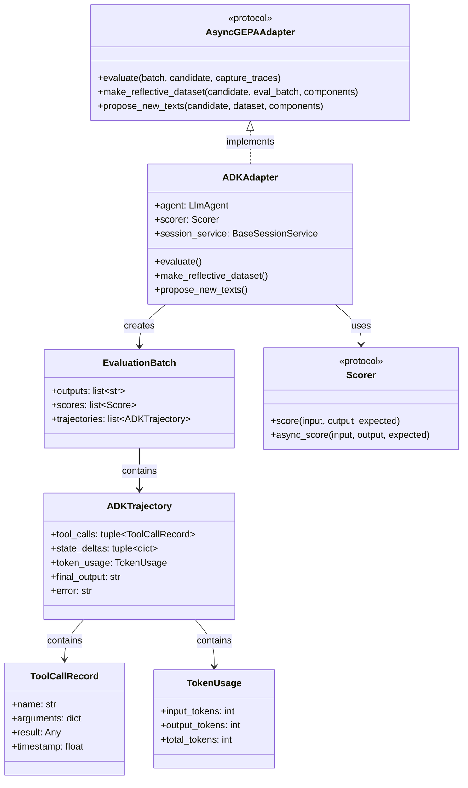
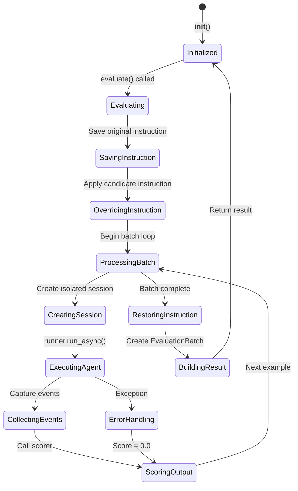

# Data Model: ADKAdapter

**Feature**: 008-adk-adapter  
**Date**: 2026-01-10  
**Status**: Complete

## Overview

This document defines the data structures and entities for the ADKAdapter implementation. The adapter bridges GEPA's evaluation patterns to Google ADK's agent/runner architecture.

---

## Entity Definitions

### 1. ADKAdapter (Primary Entity)

The main adapter class implementing `AsyncGEPAAdapter` protocol.

```python
class ADKAdapter:
    """ADK implementation of AsyncGEPAAdapter protocol.
    
    Bridges GEPA evaluation patterns to Google ADK's agent/runner
    architecture, enabling evolutionary optimization of ADK agents.
    """
    
    # Initialization Parameters
    agent: LlmAgent              # The ADK agent to evaluate
    scorer: Scorer               # Scoring implementation
    session_service: BaseSessionService | None  # Optional session service
    app_name: str                # Application name for sessions
    
    # Internal State
    _session_service: BaseSessionService  # Resolved session service
    _logger: structlog.BoundLogger        # Bound logger with context
```

**Relationships**:
- Implements: `AsyncGEPAAdapter[dict, ADKTrajectory, str]`
- Uses: `Scorer` protocol for output evaluation
- Creates: `EvaluationBatch[ADKTrajectory, str]` results

---

### 2. ADKTrajectory (Supporting Entity)

Captures execution trace information when `capture_traces=True`.

```python
@dataclass(frozen=True, slots=True)
class ADKTrajectory:
    """Execution trace from ADK agent evaluation.
    
    Captures tool calls, state changes, and metrics from
    a single evaluation run.
    """
    
    tool_calls: tuple[ToolCallRecord, ...]  # Immutable sequence of tool calls
    state_deltas: tuple[dict[str, Any], ...]  # State changes during execution
    token_usage: TokenUsage | None           # Optional token metrics
    final_output: str                         # Final agent response text
    error: str | None                         # Error message if execution failed
```

**Relationships**:
- Contains: `ToolCallRecord`, `TokenUsage`
- Stored in: `EvaluationBatch.trajectories`

---

### 3. ToolCallRecord (Supporting Entity)

Records a single tool invocation during agent execution.

```python
@dataclass(frozen=True, slots=True)
class ToolCallRecord:
    """Record of a single tool call during agent execution."""
    
    name: str           # Tool/function name
    arguments: dict     # Arguments passed to the tool
    result: Any         # Tool return value
    timestamp: float    # Relative time in execution
```

**Relationships**:
- Collected by: `ADKTrajectory`

---

### 4. TokenUsage (Supporting Entity)

Captures LLM token consumption metrics.

```python
@dataclass(frozen=True, slots=True)
class TokenUsage:
    """Token usage statistics from LLM calls."""
    
    input_tokens: int    # Tokens in prompt/context
    output_tokens: int   # Tokens generated
    total_tokens: int    # Sum of input + output
```

**Relationships**:
- Optional field in: `ADKTrajectory`

---

## Type Aliases

From existing domain (`gepa_adk.domain.types`):

```python
Score = float           # Normalized score in [0.0, 1.0]
ComponentName = str     # Key for candidate components
```

New type aliases for this feature:

```python
# Type variables for generic protocol
DataInst = dict[str, Any]           # Batch example type
TrajectoryType = ADKTrajectory      # Execution trace type  
OutputType = str                    # Agent output type

# Reflective dataset type
ReflectiveDataset = Mapping[ComponentName, Sequence[Mapping[str, Any]]]
```

---

## Entity Relationships Diagram



---

## Validation Rules

### ADKAdapter Initialization

| Field | Validation | Error |
|-------|------------|-------|
| `agent` | Must be `LlmAgent` instance | `TypeError` |
| `scorer` | Must satisfy `Scorer` protocol | `TypeError` |
| `session_service` | If None, create `InMemorySessionService` | N/A |
| `app_name` | Non-empty string | `ValueError` |

### Score Values

| Constraint | Rule |
|------------|------|
| Range | `0.0 <= score <= 1.0` (convention, not enforced) |
| Type | `float` |
| Error case | `score = 0.0` when execution fails |

### EvaluationBatch Consistency

| Constraint | Rule |
|------------|------|
| Length alignment | `len(outputs) == len(scores) == len(batch)` |
| Trajectories | `None` when `capture_traces=False` |
| Trajectories length | `len(trajectories) == len(batch)` when present |

---

## State Transitions

### ADKAdapter Evaluation State Machine



---

## File Locations

| Entity | Location |
|--------|----------|
| `ADKAdapter` | `src/gepa_adk/adapters/adk_adapter.py` |
| `ADKTrajectory` | `src/gepa_adk/adapters/adk_adapter.py` |
| `ToolCallRecord` | `src/gepa_adk/adapters/adk_adapter.py` |
| `TokenUsage` | `src/gepa_adk/adapters/adk_adapter.py` |
| `EvaluationBatch` | `src/gepa_adk/ports/adapter.py` (existing) |
| `Scorer` | `src/gepa_adk/ports/scorer.py` (existing) |
| `Candidate` | `src/gepa_adk/domain/models.py` (existing) |
