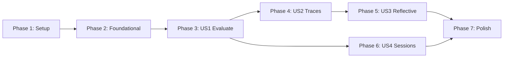

# Tasks: ADKAdapter

**Feature**: 008-adk-adapter  
**Date**: 2026-01-10  
**Status**: Ready for Implementation

---

## Overview

Implementation tasks for ADKAdapter - the concrete `AsyncGEPAAdapter` implementation for Google ADK agents. Organized by user story to enable independent implementation and testing.

### User Stories Summary

| Story | Priority | Description |
|-------|----------|-------------|
| US1 | P1 | Evaluate ADK agent with candidate instruction override |
| US2 | P2 | Capture execution traces for debugging |
| US3 | P2 | Generate reflective dataset from evaluation results |
| US4 | P3 | Manage evaluation sessions for isolation |

---

## Phase 1: Setup

**Purpose**: Initialize project structure and dependencies.

- [ ] T001 Create adapters module directory at `src/gepa_adk/adapters/__init__.py`
- [ ] T002 [P] Create test directories at `tests/unit/adapters/` and ensure `tests/contracts/` exists
- [ ] T003 [P] Create supporting domain types at `src/gepa_adk/domain/trajectory.py` (ADKTrajectory, ToolCallRecord, TokenUsage)

---

## Phase 2: Foundational

**Purpose**: Create core infrastructure that BLOCKS all user stories.

- [ ] T004 Create ADKAdapter class skeleton implementing protocol at `src/gepa_adk/adapters/adk_adapter.py`
- [ ] T005 [P] Add ADKAdapter exports to `src/gepa_adk/adapters/__init__.py`
- [ ] T006 [P] Add trajectory types exports to `src/gepa_adk/domain/__init__.py`
- [ ] T007 Create contract test file at `tests/contracts/test_adk_adapter_contracts.py` with protocol compliance tests

---

## Phase 3: User Story 1 - Evaluate with Instruction Override (P1)

**Goal**: As a developer, I can evaluate an ADK agent with a candidate instruction to test different instruction variations and receive scored results.

**Independent Test Criteria**: 
- Adapter accepts `batch` and `candidate` with instruction override
- Agent's instruction is modified before execution
- Each example produces output and score
- Original agent instruction restored after evaluation
- Protocol compliance tests pass

### Tests First (Red)

- [ ] T008 [US1] Write failing unit tests for evaluate() at `tests/unit/adapters/test_adk_adapter.py`
- [ ] T009 [US1] Write failing contract tests for evaluate() at `tests/contracts/test_adk_adapter_contracts.py`

### Implementation (Green)

- [ ] T010 [US1] Implement `__init__` constructor with validation at `src/gepa_adk/adapters/adk_adapter.py`
- [ ] T011 [US1] [FR-004] Implement `_apply_candidate` helper to override agent instruction at `src/gepa_adk/adapters/adk_adapter.py`
- [ ] T012 [US1] [FR-005] Implement `_restore_instruction` helper to restore original instruction at `src/gepa_adk/adapters/adk_adapter.py`
- [ ] T013 [US1] Implement `_run_single_example` async method for one evaluation at `src/gepa_adk/adapters/adk_adapter.py`
- [ ] T014 [US1] Implement `evaluate()` method (capture_traces=False path) at `src/gepa_adk/adapters/adk_adapter.py`

### Verification (Refactor)

- [ ] T015 [US1] Verify all unit and contract tests pass for US1

---

## Phase 4: User Story 2 - Capture Execution Traces (P2)

**Goal**: As a developer, I can enable trace capture during evaluation to debug agent behavior and understand execution flow.

**Independent Test Criteria**:
- `capture_traces=True` collects tool calls, state deltas, token usage
- `ADKTrajectory` dataclass populated correctly
- Trace information available in `EvaluationBatch.trajectories`
- Works independently of other stories (only requires evaluate foundation)

### Tests First (Red)

- [ ] T016 [US2] Write failing unit tests for trace capture at `tests/unit/adapters/test_adk_adapter.py`
- [ ] T017 [US2] Write failing contract tests for trajectory invariants at `tests/contracts/test_adk_adapter_contracts.py`

### Implementation (Green)

- [ ] T018 [US2] Implement `_extract_tool_calls` helper from ADK Events at `src/gepa_adk/adapters/adk_adapter.py`
- [ ] T019 [US2] Implement `_extract_state_deltas` helper from ADK Events at `src/gepa_adk/adapters/adk_adapter.py`
- [ ] T020 [US2] Implement `_extract_token_usage` helper from ADK Events at `src/gepa_adk/adapters/adk_adapter.py`
- [ ] T021 [US2] Implement `_build_trajectory` to assemble ADKTrajectory at `src/gepa_adk/adapters/adk_adapter.py`
- [ ] T022 [US2] Update `evaluate()` to handle `capture_traces=True` at `src/gepa_adk/adapters/adk_adapter.py`

### Verification (Refactor)

- [ ] T023 [US2] Verify all unit and contract tests pass for US2

---

## Phase 5: User Story 3 - Generate Reflective Dataset (P2)

**Goal**: As a developer, I can generate a reflective dataset from evaluation results to enable mutation proposals for improved candidates.

**Independent Test Criteria**:
- `make_reflective_dataset()` accepts evaluation batch with traces
- Returns mapping from component name to reflection examples
- Each example includes input, output, score, and trace context
- Dataset compatible with MutationProposer interface

**Note**: US3 CAN work without US2 traces (trajectories=None) but SHOULD have traces for meaningful reflection data.

### Tests First (Red)

- [ ] T024 [US3] Write failing unit tests for make_reflective_dataset() at `tests/unit/adapters/test_adk_adapter.py`
- [ ] T025 [US3] Write failing contract tests for dataset structure at `tests/contracts/test_adk_adapter_contracts.py`

### Implementation (Green)

- [ ] T026 [US3] Implement `_build_reflection_example` helper at `src/gepa_adk/adapters/adk_adapter.py`
- [ ] T027 [US3] Implement `make_reflective_dataset()` method at `src/gepa_adk/adapters/adk_adapter.py`

### Verification (Refactor)

- [ ] T028 [US3] Verify all unit and contract tests pass for US3

---

## Phase 6: User Story 4 - Session Management (P3)

**Goal**: As a developer, I can rely on session isolation between evaluations to prevent cross-contamination of agent state.

**Independent Test Criteria**:
- Each evaluation uses fresh session
- Session service injectable (default to InMemorySessionService)
- Multiple concurrent evaluations don't interfere
- Session cleanup after evaluation completes

### Tests First (Red)

- [ ] T029 [US4] Write failing unit tests for session management at `tests/unit/adapters/test_adk_adapter.py`
- [ ] T030 [US4] Write failing contract tests for session isolation at `tests/contracts/test_adk_adapter_contracts.py`

### Implementation (Green)

- [ ] T031 [US4] Implement `_create_session` helper at `src/gepa_adk/adapters/adk_adapter.py`
- [ ] T032 [US4] Implement `_cleanup_session` helper at `src/gepa_adk/adapters/adk_adapter.py`
- [ ] T033 [US4] Update evaluate() with session lifecycle management at `src/gepa_adk/adapters/adk_adapter.py`

### Verification (Refactor)

- [ ] T034 [US4] Verify all unit and contract tests pass for US4

---

## Phase 7: Polish & Cross-Cutting Concerns

**Purpose**: Improvements that affect multiple user stories.

- [ ] T035 [P] Implement `propose_new_texts()` stub (delegates to MutationProposer) at `src/gepa_adk/adapters/adk_adapter.py`
- [ ] T036 [P] Add comprehensive error handling with AdapterError at `src/gepa_adk/adapters/adk_adapter.py`
- [ ] T037 [P] Add structured logging with structlog at `src/gepa_adk/adapters/adk_adapter.py`
- [ ] T038 [P] Add integration tests at `tests/integration/test_adk_adapter_integration.py`
- [ ] T039 [P] Add large batch handling test (100+ examples) at `tests/integration/test_adk_adapter_integration.py`
- [ ] T040 Run full test suite and validate all contract tests pass
- [ ] T041 Run quickstart.md examples to verify documentation accuracy

---

## Dependencies & Execution Order

### Phase Dependencies

- **Setup (Phase 1)**: No dependencies - can start immediately
- **Foundational (Phase 2)**: Depends on Setup completion - BLOCKS all user stories
- **User Stories (Phase 3+)**: All depend on Foundational phase completion
  - User Story 1 (P1): Must complete first - provides evaluate() foundation
  - User Story 2 (P2): Requires US1 evaluate() foundation
  - User Story 3 (P2): CAN work without US2 (traces optional) but SHOULD have traces
  - User Story 4 (P3): Can run in parallel with US2/US3 after US1
- **Polish (Phase 7)**: Depends on all user stories being complete

### User Story Dependencies



### Within Each User Story

- Tests MUST be written FIRST and FAIL before implementation (Red-Green-Refactor)
- Helpers before main methods
- Core implementation before integration
- Story complete before moving to next priority

### Parallel Opportunities

- T002 and T003 can run in parallel (different files)
- T005 and T006 can run in parallel (different __init__ files)
- US4 (Sessions) can run in parallel with US2 (Traces) after US1 completes
- All Polish tasks marked [P] can run in parallel

---

## Parallel Example: Setup Phase

```bash
# Launch parallel setup tasks:
Task T002: "Create test directories at tests/unit/adapters/"
Task T003: "Create trajectory types at src/gepa_adk/domain/trajectory.py"
```

---

## Implementation Strategy

### MVP First (User Story 1 Only)

1. Complete Phase 1: Setup
2. Complete Phase 2: Foundational (CRITICAL - blocks all stories)
3. Complete Phase 3: User Story 1 (Evaluate with instruction override)
4. **STOP and VALIDATE**: Test `evaluate(capture_traces=False)` independently
5. Deploy/demo if ready - basic evaluation works!

### Incremental Delivery

1. Complete Setup + Foundational → Foundation ready
2. Add User Story 1 → Test independently → **MVP: Basic evaluation**
3. Add User Story 2 → Test independently → **Enhanced: Debug traces**
4. Add User Story 3 → Test independently → **Enhanced: Reflection support**
5. Add User Story 4 → Test independently → **Complete: Session isolation**
6. Each story adds value without breaking previous stories

### File Creation Order

1. `src/gepa_adk/domain/trajectory.py` - Supporting types
2. `src/gepa_adk/adapters/__init__.py` - Module initialization
3. `src/gepa_adk/adapters/adk_adapter.py` - Main implementation
4. `tests/contracts/test_adk_adapter_contracts.py` - Protocol compliance
5. `tests/unit/adapters/test_adk_adapter.py` - Unit tests
6. `tests/integration/test_adk_adapter_integration.py` - Integration tests

---

## Notes

- [P] tasks = different files, no dependencies, can run in parallel
- [USn] label maps task to specific user story for traceability
- [FR-XXX] label maps task to functional requirement for traceability
- Each user story follows Red-Green-Refactor TDD cycle
- Each user story should be independently completable and testable
- Commit after each task or logical group
- Stop at any checkpoint to validate story independently
- ADK imports validated against .venv (google-adk v1.22.0)
- Key ADK types: LlmAgent, Runner, InMemorySessionService, Event, EventActions
