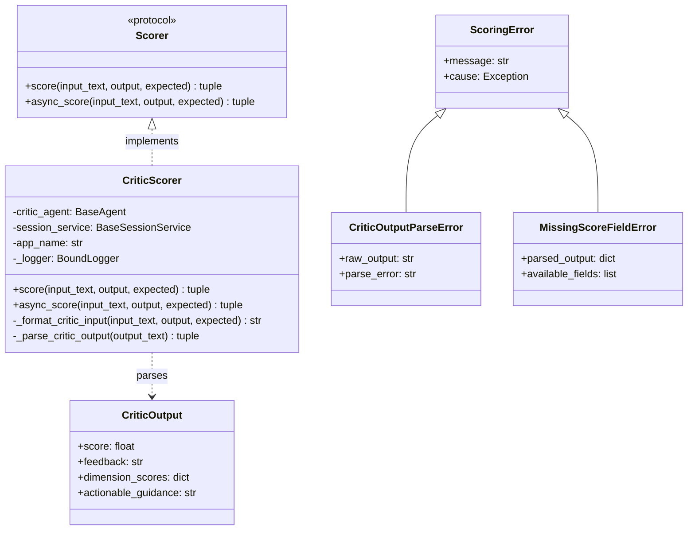
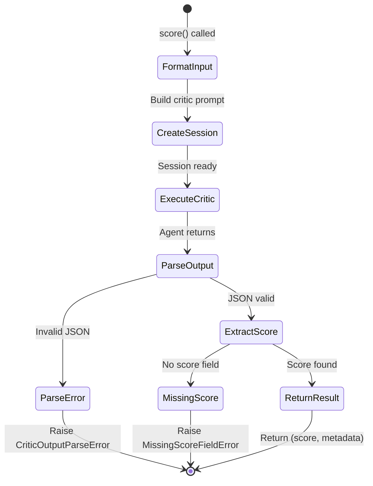

# Data Model: CriticScorer

**Feature**: 009-critic-scorer  
**Date**: 2026-01-10

## Entities

### CriticScorer

**Description**: Adapter that wraps an ADK critic agent to provide structured scoring via the Scorer protocol.

**Attributes**:

| Field | Type | Required | Description |
|-------|------|----------|-------------|
| `critic_agent` | `BaseAgent` | Yes | ADK agent (LlmAgent or workflow agent) configured for evaluation |
| `session_service` | `BaseSessionService` | No | Session service for state management (default: InMemorySessionService) |
| `app_name` | `str` | No | Application name for session identification (default: "critic_scorer") |
| `_logger` | `BoundLogger` | Internal | Structlog logger with bound context |

**Behavior**:
- Implements `Scorer` protocol (`score()` and `async_score()`)
- Creates isolated sessions per scoring call unless `session_id` provided
- Parses structured JSON output from critic agent
- Returns normalized score with metadata

**Validation Rules**:
- `critic_agent` must be a valid ADK BaseAgent instance
- `app_name` cannot be empty string

---

### CriticOutput (Pydantic Schema)

**Description**: Expected structured output format from critic agents.

> **ADK Constraint**: When this schema is used as `output_schema` on an LlmAgent, the agent can ONLY reply and CANNOT use any tools. This is acceptable for critic agents focused on scoring.

**Attributes**:

| Field | Type | Required | Default | Description |
|-------|------|----------|---------|-------------|
| `score` | `float` | Yes | - | Score value (conventionally 0.0-1.0) |
| `feedback` | `str` | No | `""` | Human-readable feedback text |
| `dimension_scores` | `dict[str, float]` | No | `{}` | Per-dimension scores (e.g., accuracy, clarity) |
| `actionable_guidance` | `str` | No | `""` | Specific improvement suggestions |

**Validation Rules**:
- `score` field is required
- `score` should be between 0.0 and 1.0 (convention, not enforced)
- Additional fields are preserved in metadata

**Example**:
```json
{
  "score": 0.75,
  "feedback": "Good response but could be more concise",
  "dimension_scores": {
    "accuracy": 0.9,
    "clarity": 0.6,
    "completeness": 0.8
  },
  "actionable_guidance": "Reduce response length by 30% while preserving key information"
}
```

---

### ScoringResult (Return Type)

**Description**: The result returned by scoring operations.

**Type**: `tuple[float, dict[str, Any]]`

**Structure**:
- `[0]` - `float`: The numeric score extracted from critic output
- `[1]` - `dict`: Metadata containing:
  - `feedback` (str): Feedback text if present
  - `dimension_scores` (dict): Per-dimension scores if present
  - `actionable_guidance` (str): Guidance text if present
  - Any additional fields from critic output

---

## Exception Hierarchy

### ScoringError (Base)

**Description**: Base exception for all scoring-related errors.

**Extends**: `EvolutionError` (from domain/exceptions.py)

**Attributes**:
- `message` (str): Error description
- `cause` (Exception | None): Original exception if chained

---

### CriticOutputParseError

**Description**: Raised when critic agent output cannot be parsed as valid JSON.

**Extends**: `ScoringError`

**Attributes**:
- `raw_output` (str): The unparseable output from critic
- `parse_error` (str): Description of parsing failure

---

### MissingScoreFieldError

**Description**: Raised when parsed JSON does not contain required `score` field.

**Extends**: `ScoringError`

**Attributes**:
- `parsed_output` (dict): The parsed JSON without score field
- `available_fields` (list[str]): Fields that were present

---

## Relationships



## State Transitions

CriticScorer itself is stateless. Each scoring call follows this flow:


