# Architecture: Pareto Frontier Tracking and Candidate Selection

**Feature**: 022-pareto-frontier
**Date**: 2026-01-14

## Overview

This document describes the architectural design for integrating Pareto frontier tracking and candidate selection strategies into gepa-adk's evolution engine.

---

## System Context

The Pareto frontier system integrates into gepa-adk's existing hexagonal architecture, adding new domain models, a port protocol, and strategy implementations.

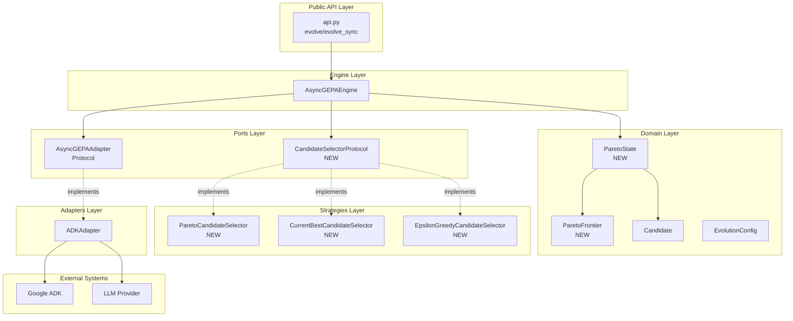

---

## Layer Responsibilities

### Domain Layer (No External Dependencies)

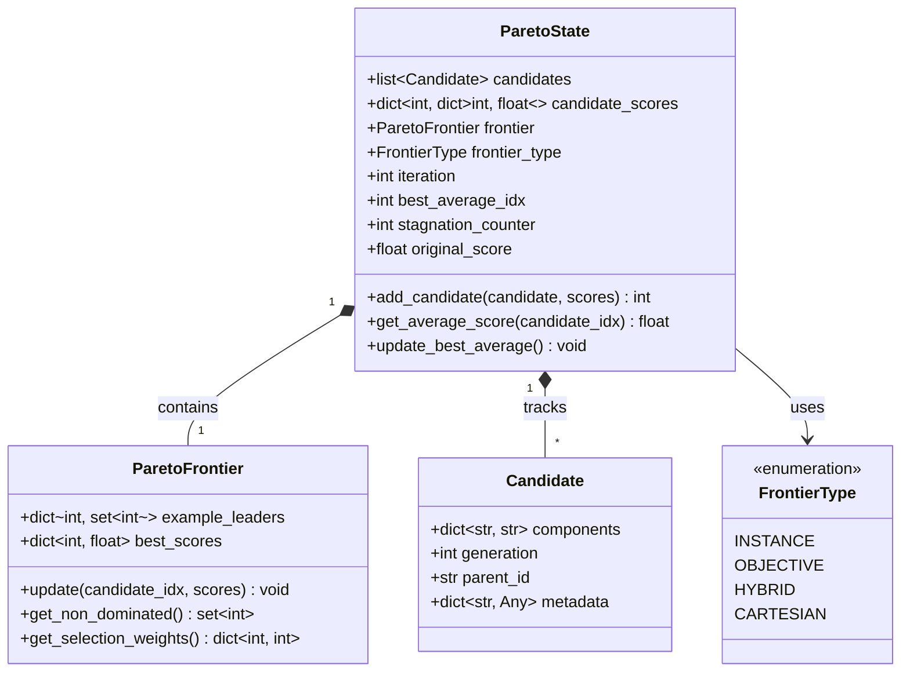

### Ports Layer (Protocol Definitions)

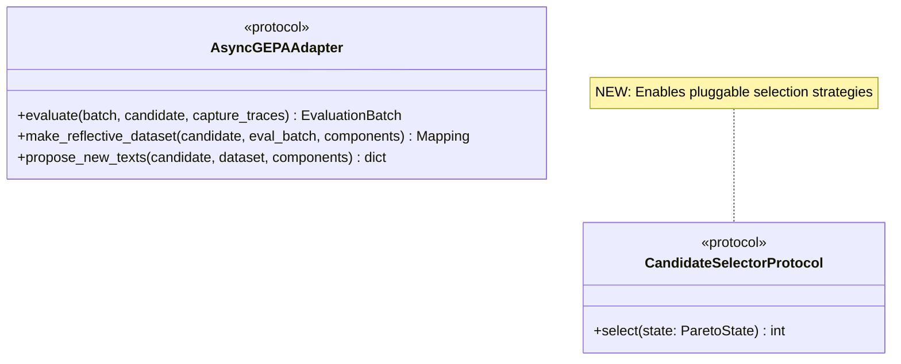

### Strategies Layer (Algorithm Implementations)

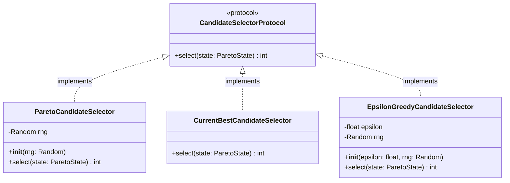

---

## Data Flow

### Evolution Loop with Pareto Selection

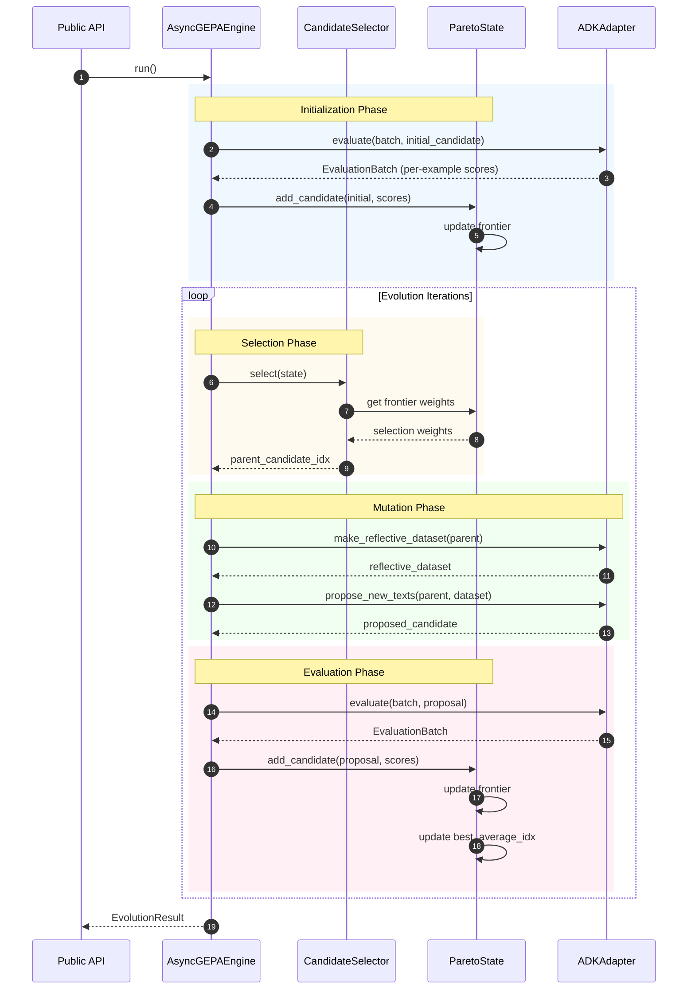

### Pareto Frontier Update

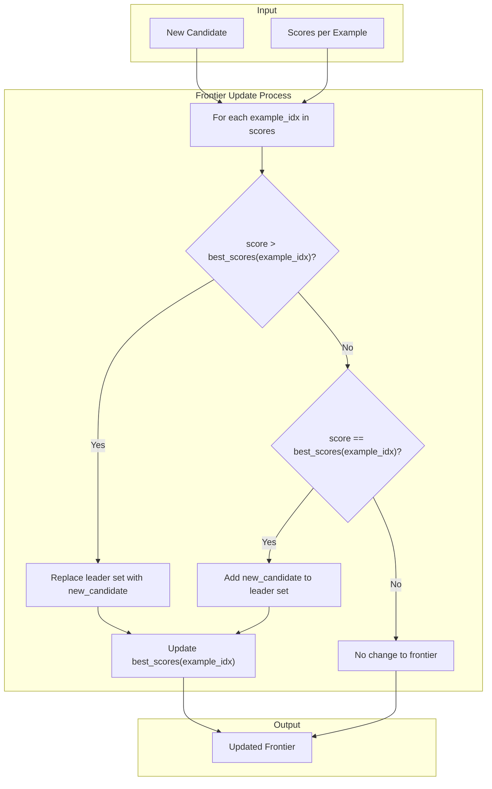

---

## State Transitions

### ParetoState Lifecycle

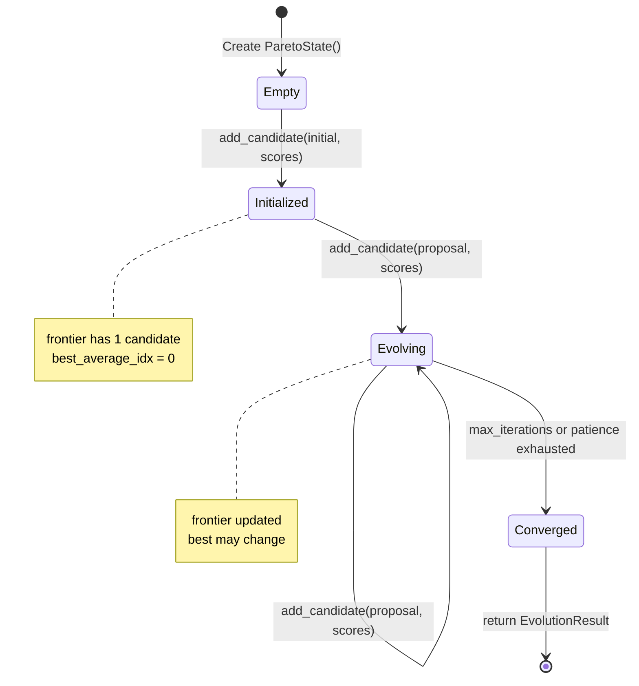

### Candidate Selection Decision

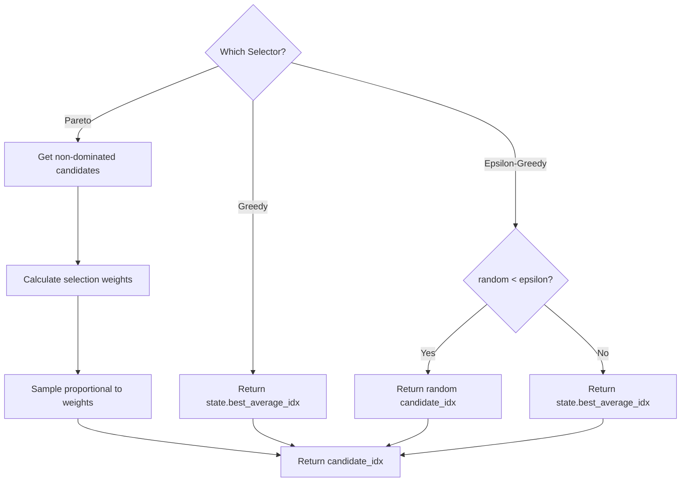

---

## Pareto Selection Algorithm

### Non-Dominated Candidate Identification

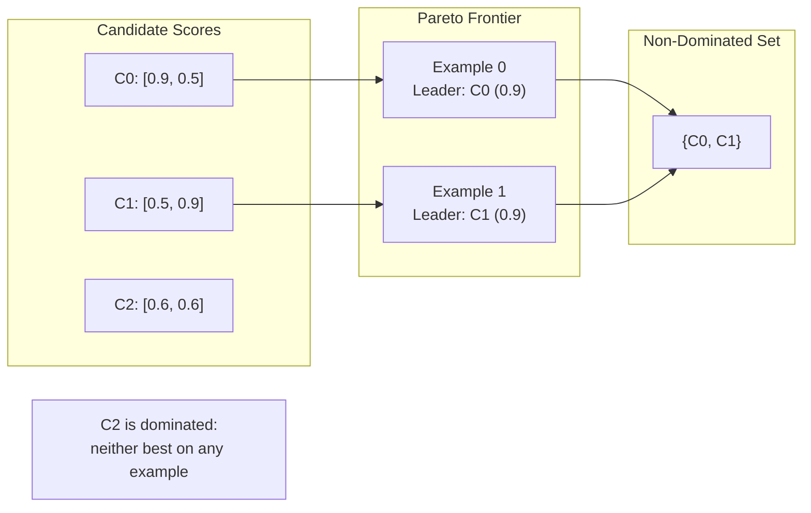

### Selection Weight Calculation

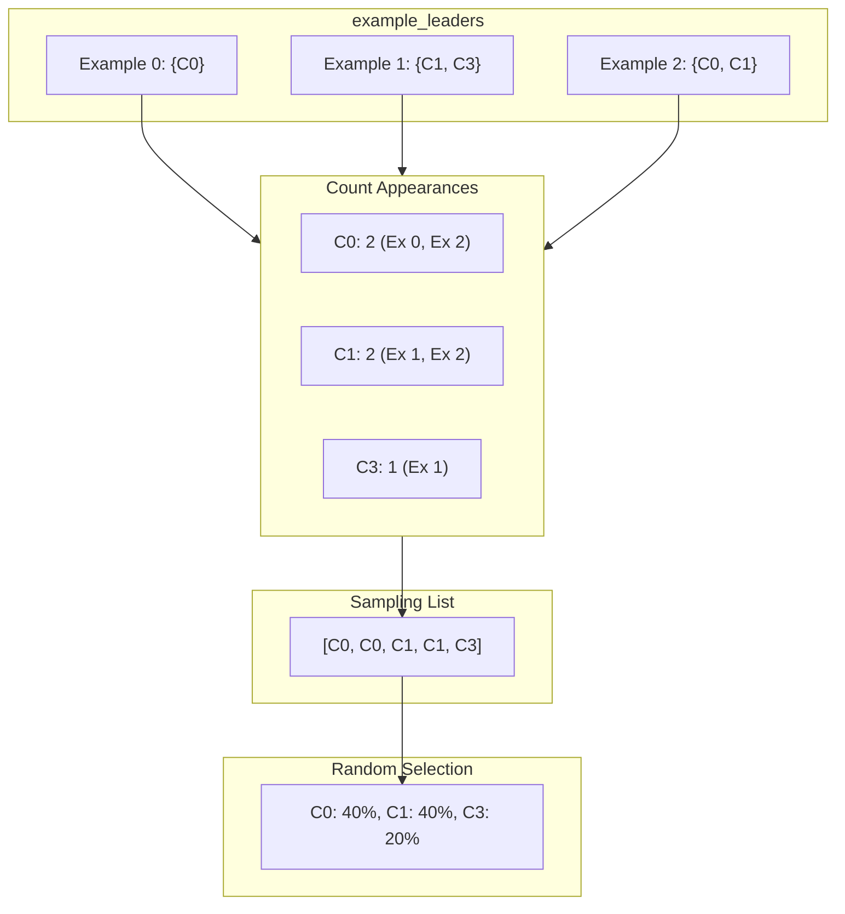

---

## Integration Points

### Engine Modification

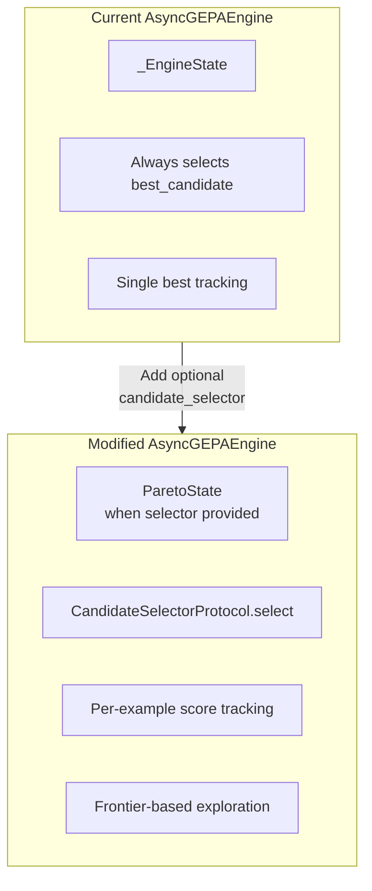

### Public API Change

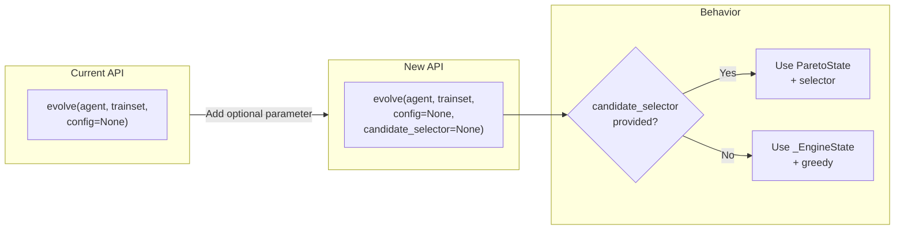

---

## File Structure

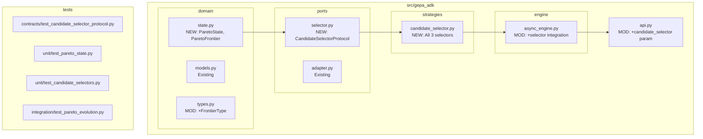

---

## Summary

The Pareto frontier architecture:

1. **Preserves hexagonal boundaries**: Domain models have no external deps
2. **Uses protocol-based injection**: Engine receives selector via constructor
3. **Maintains backward compatibility**: Default behavior unchanged without selector
4. **Enables extensibility**: New selectors can be added by implementing the protocol
5. **Supports testing at all layers**: Contract, unit, and integration tests

Key design decisions:
- Selectors are stateless algorithms (except RNG state)
- Frontier updates are incremental (O(m) per candidate, where m = examples)
- Selection is lazy (dominance removal only at selection time)
