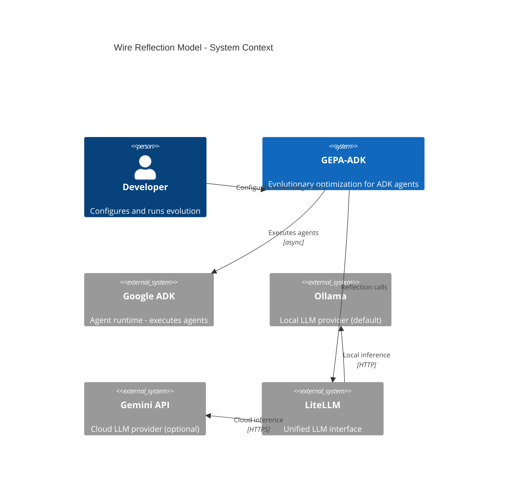
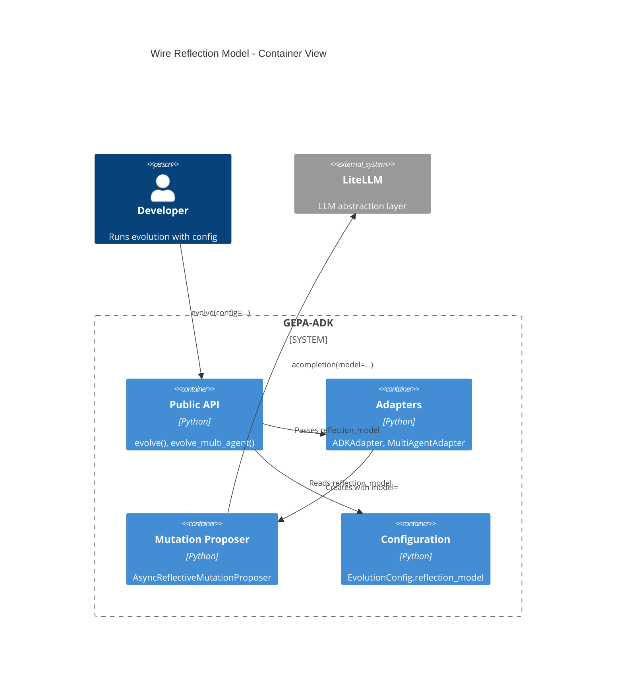
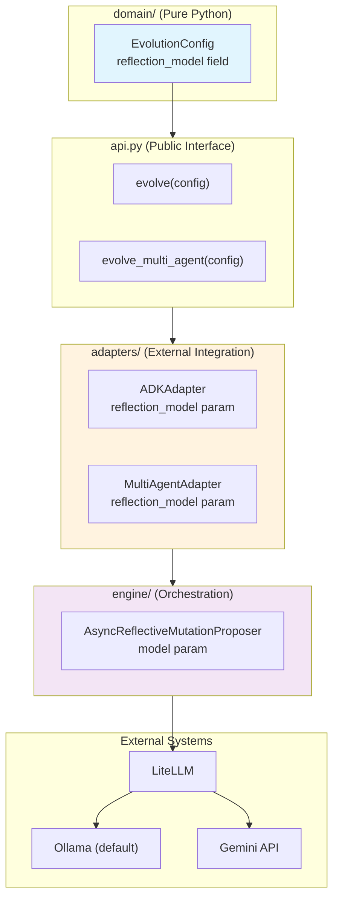
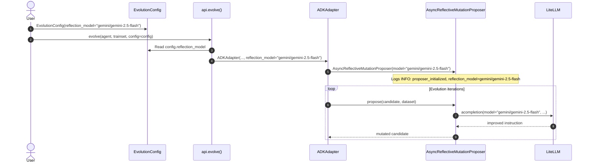
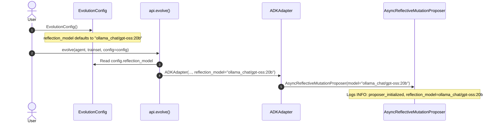
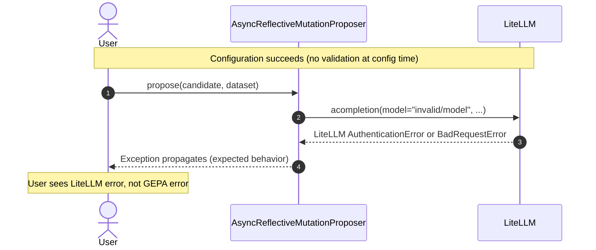
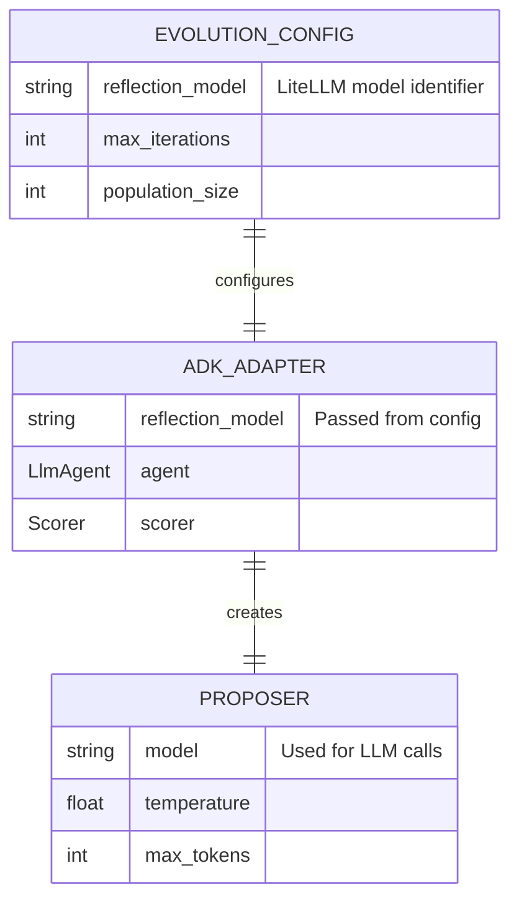
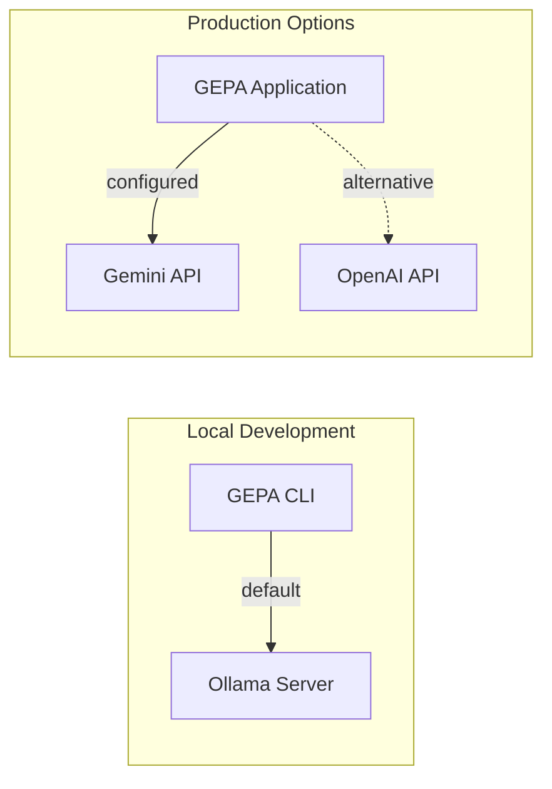

# Architecture: Wire Reflection Model Config to Proposer

**Branch**: `031-wire-reflection-model` | **Date**: 2026-01-17 | **Status**: approved
**Spec**: [./spec.md](./spec.md) | **Plan**: [./plan.md](./plan.md) | **Tasks**: [./tasks.md](./tasks.md)

## 0. Links & References

- Feature Spec: `./spec.md`
- Implementation Plan: `./plan.md`
- Tasks: `./tasks.md`
- Related ADRs:
  - [ADR-000: Hexagonal Architecture](../../docs/adr/ADR-000-hexagonal-architecture.md)
  - [ADR-001: Async-First Architecture](../../docs/adr/ADR-001-async-first-architecture.md)
  - [ADR-008: Structured Logging](../../docs/adr/ADR-008-structured-logging.md)
- PRs: #92

## 1. Purpose & Scope

### Goal

Enable users to configure which LLM model is used for reflection/mutation operations via `EvolutionConfig.reflection_model`, passing this configuration through the adapter chain to `AsyncReflectiveMutationProposer`.

### Non-Goals

- Smart model defaults or auto-detection (covered by issue #80)
- Model validation beyond empty string check
- Model availability checking at configuration time
- Performance benchmarking of different models

### Scope Boundaries

- **In-scope**: Configuration wiring through api.py → adapters → proposer
- **Out-of-scope**: LiteLLM internals, model validation, API key management

## 2. Architecture at a Glance

- **Configuration passthrough**: `EvolutionConfig.reflection_model` flows through adapter chain to proposer
- **Layers affected**: `api.py` (surface), `adapters/` (wiring), `engine/proposer.py` (consumer)
- **No protocol changes**: Proposer already accepts `model` parameter; this wires it to config
- **Default model**: `ollama_chat/gpt-oss:20b` for local/OSS development; users can override for production
- **Logging**: INFO-level log emitted when proposer initializes with configured model
- **Backward compatible**: Existing code continues to work; new parameter is optional with sensible default

## 3. Context Diagram (C4 Level 1)

> Shows how this feature fits into the broader system and external dependencies.
>
> **Note**: C4 diagrams require Mermaid 9.3+. If diagrams don't render, validate at [mermaid.live](https://mermaid.live).



## 4. Container Diagram (C4 Level 2)

> Shows the major containers within the system boundary.



## 5. Hexagonal Architecture View

> Project-specific: Shows how this feature aligns with the hexagonal (ports & adapters) architecture.



## 6. Configuration Flow (Sequence Diagram)

### 6.1 Happy Path: Custom Reflection Model



### 6.2 Default Model Path



### 6.3 Error Case: Invalid Model at Runtime



## 7. Data Model

### 7.1 Configuration Flow (No Persistence)



### 7.2 API Contracts

**Public API (unchanged signatures, new parameter passed internally)**:
- `evolve(agent, trainset, scorer, config)` — config.reflection_model now flows to adapter
- `evolve_multi_agent(agents, primary, trainset, scorer, config)` — same behavior

**Adapter Constructors (new optional parameter)**:
```python
ADKAdapter(
    agent: LlmAgent,
    scorer: Scorer,
    ...,
    reflection_model: str = "ollama_chat/gpt-oss:20b",  # NEW
)

MultiAgentAdapter(
    agents: list[LlmAgent],
    primary: str,
    scorer: Scorer,
    ...,
    reflection_model: str = "ollama_chat/gpt-oss:20b",  # NEW
)
```

## 8. Deployment / Infrastructure View

> This feature has no infrastructure changes. The diagram shows model provider options.



## 9. Quality Attributes (NFRs)

| Attribute | Requirement | Verification |
|-----------|-------------|--------------|
| **Performance** | No impact (config passthrough only) | Existing benchmarks unchanged |
| **Reliability** | LiteLLM errors propagate cleanly | Error handling tests |
| **Security** | No secrets in logs (model name only) | Log format verification |
| **Maintainability** | Hexagonal architecture compliance | Layer import rules pass |
| **Observability** | INFO log shows configured model | Log output verification |

## 10. Testing Strategy

| Layer | Location | What to Test | Markers |
|-------|----------|--------------|---------|
| **Unit** | `tests/unit/test_reflection_model_wiring.py` | Config flows to proposer | `@pytest.mark.unit` |
| **Unit** | `tests/unit/domain/test_models.py` | Default value correct | `@pytest.mark.unit` |
| **Contract** | N/A | No protocol changes | — |
| **Integration** | Existing tests | No regression | `@pytest.mark.integration` |

**Key Test Scenarios**:
1. Custom `reflection_model` reaches proposer via ADKAdapter
2. Custom `reflection_model` reaches proposer via MultiAgentAdapter
3. Default model used when not specified
4. Proposer logs model on initialization

## 11. Risks & Open Questions

### Risks

| Risk | Impact | Mitigation |
|------|--------|------------|
| Users unaware of default change | May expect Gemini | Document in CHANGELOG, examples |
| Ollama not running locally | Default model fails | Clear error from LiteLLM; docs guide |

### Open Questions

- [x] Should default be Ollama or Gemini? → **Resolved**: Ollama for OSS defaults
- [x] Should we validate model format? → **Resolved**: No, LiteLLM validates

### TODOs

- [x] Update examples/basic_evolution.py with reflection_model usage
- [x] Add INFO log to proposer initialization

## 12. Decisions (ADR References)

| ADR | Title | Relevance to This Feature |
|-----|-------|---------------------------|
| ADR-000 | Hexagonal Architecture | Changes confined to adapters layer |
| ADR-001 | Async-First | Proposer uses async LiteLLM calls |
| ADR-008 | Structured Logging | INFO log for proposer initialization |

**New ADRs Needed**: None — this is a configuration wiring feature with no new architectural decisions.

---

## Diagram Standards Reference

| Diagram Type | Used | Purpose |
|--------------|------|---------|
| **C4 Context** | Yes | System boundaries & LLM providers |
| **C4 Container** | Yes | Configuration flow through containers |
| **Hexagonal** | Yes | Layer boundaries and data flow |
| **Sequence** | Yes (3) | Happy path, default, error scenarios |
| **ERD** | Yes | Configuration relationships |
| **Deployment** | Yes | Local vs cloud model options |
