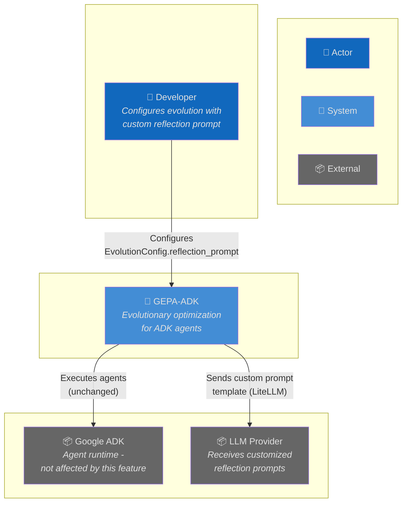
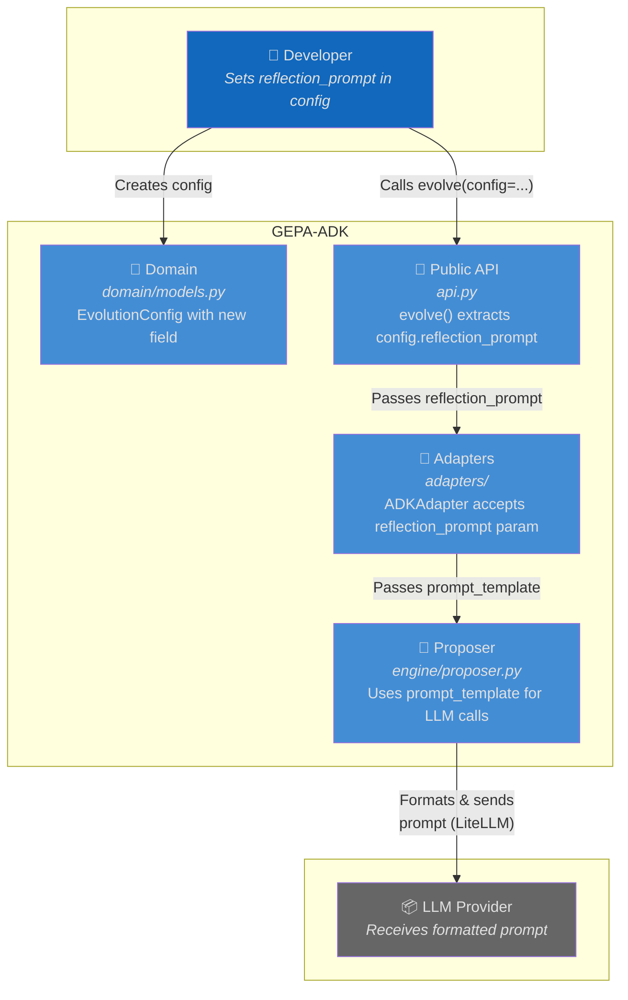
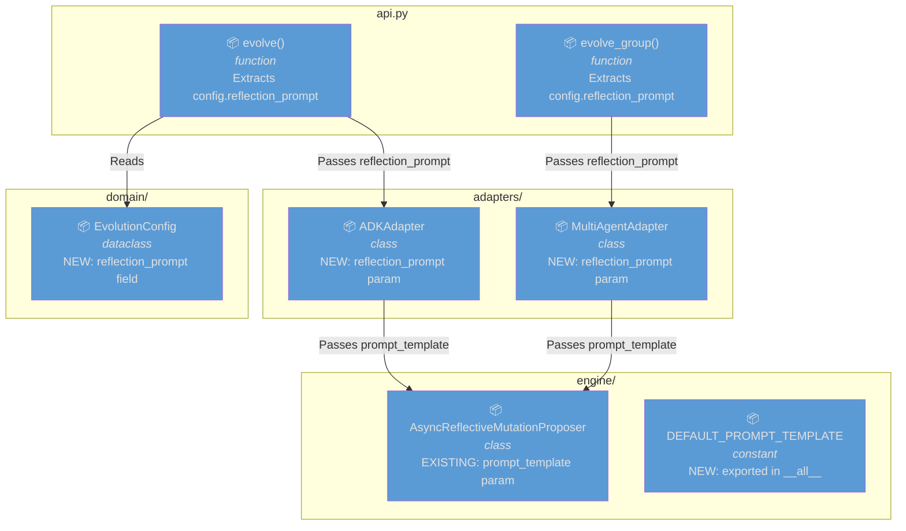
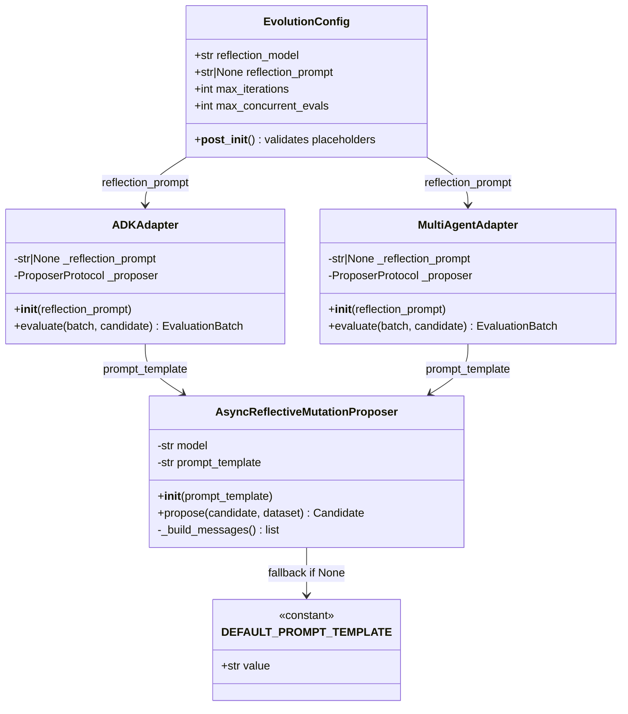
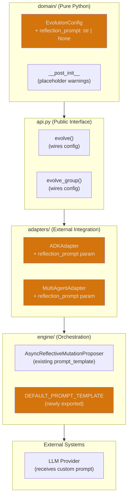
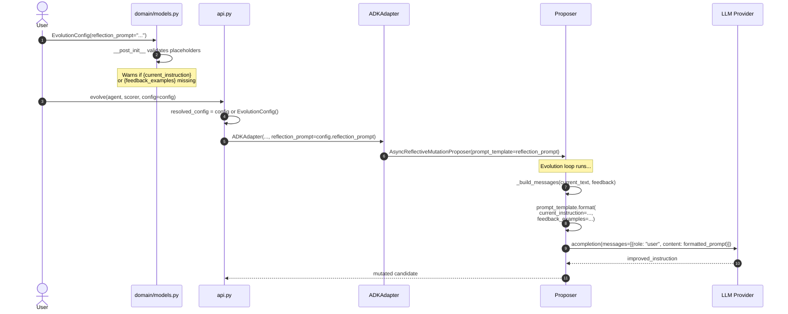
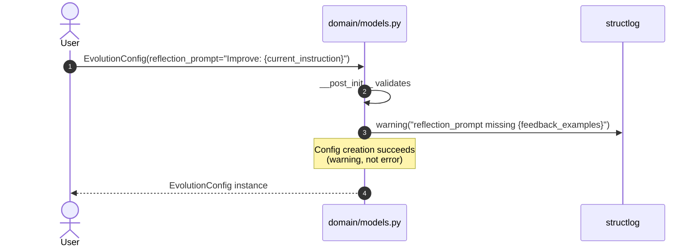
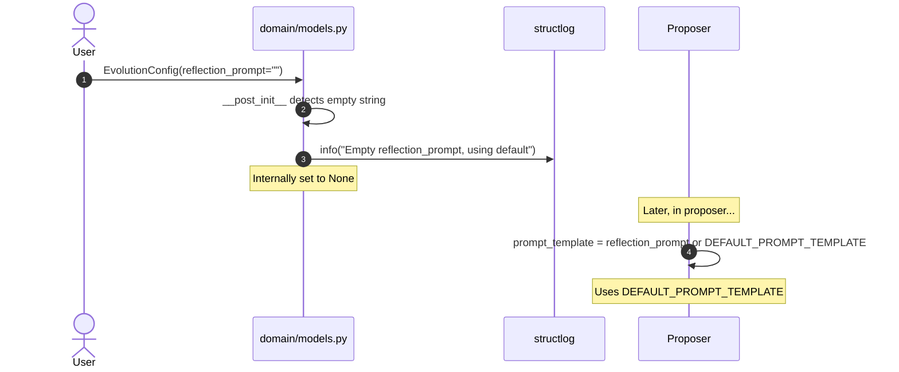
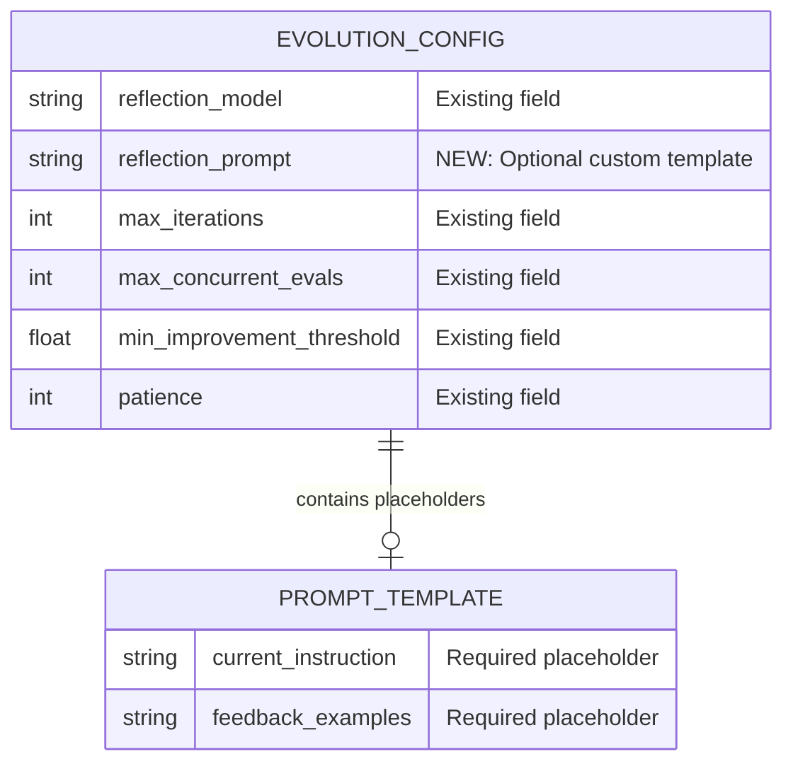

# Architecture: Reflection Prompt Configuration

**Branch**: `032-reflection-prompt-config` | **Date**: 2026-01-17 | **Status**: draft
**Spec**: [./spec.md](./spec.md) | **Plan**: [./plan.md](./plan.md) | **Tasks**: [./tasks.md](./tasks.md)

## 0. Links & References

- Feature Spec: `./spec.md`
- Implementation Plan: `./plan.md`
- Tasks: `./tasks.md` (pending generation)
- Related ADRs: ADR-000 (Hexagonal Architecture), ADR-008 (Structured Logging)
- PRs: [link when available]

## 1. Purpose & Scope

### Goal

Enable users to customize the reflection/mutation prompt template via `EvolutionConfig.reflection_prompt`, allowing them to tailor prompt behavior to specific use cases, model capabilities, and output format requirements.

### Non-Goals

- Creating new proposer types or mechanisms
- Changing the core evolution algorithm
- Adding new external dependencies
- Modifying the ADK reflection agent path (only LiteLLM path affected)

### Scope Boundaries

- **In-scope**:
  - New `reflection_prompt` field in `EvolutionConfig`
  - Config wiring through api → adapter → proposer
  - Placeholder validation warnings
  - Documentation for prompt customization
  - Export of `DEFAULT_PROMPT_TEMPLATE`
- **Out-of-scope**:
  - New prompt templates or variations (user responsibility)
  - Changes to ADK reflection agent behavior
  - Persistent prompt storage

### Constraints

- **Technical**: Python 3.12+, no new dependencies, must work with existing proposer infrastructure
- **Organizational**: Must follow hexagonal architecture (config in domain/, wiring through layers)
- **Conventions**: Use structlog for warnings, follow existing `reflection_model` wiring pattern

## 2. Architecture at a Glance

- **Configuration-only feature**: No new runtime logic, purely config passthrough
- **Affects domain layer**: New optional field in `EvolutionConfig` dataclass
- **Wires through 4 layers**: domain → api → adapters → engine/proposer
- **Reuses existing infrastructure**: `AsyncReflectiveMutationProposer` already supports `prompt_template` parameter
- **Validation at config creation**: Warns on missing placeholders via structlog
- **Backward compatible**: `reflection_prompt` defaults to `None` (use existing default)

## 3. Context Diagram (C4 Level 1)

> Shows how this feature fits into the broader system. The reflection prompt configuration affects the LLM Provider interaction.

## 4. Container Diagram (C4 Level 2)

> Shows the config flow through major containers.

## 5. Component Diagram (C4 Level 3)

> Shows internal components affected by this feature.

## 6. Code Diagram (C4 Level 4)

> Shows class relationships for the reflection_prompt config wiring.

## 7. Hexagonal Architecture View

> Shows how this feature aligns with hexagonal architecture layers.

**Legend**: 🔶 Orange = Modified components (colorblind-safe highlight)

## 8. Runtime Behavior (Sequence Diagrams)

### 8.1 Happy Path: Custom Prompt Configuration

### 8.2 Edge Case: Missing Placeholder Warning

### 8.3 Edge Case: Empty String Fallback

## 9. Data Model & Contracts

### 9.1 Data Changes (Config Schema)

> No persistent data changes. Config is in-memory only.

### 9.2 API Contracts

**Public API Changes**:

| Component | Change | Backward Compatible |
|-----------|--------|---------------------|
| `EvolutionConfig.reflection_prompt` | NEW field: `str \| None = None` | Yes (defaults to None) |
| `DEFAULT_PROMPT_TEMPLATE` | NEW export from `engine.proposer` | Yes (additive) |

**Internal Changes**:

| Component | Change |
|-----------|--------|
| `api.evolve()` | Passes `config.reflection_prompt` to ADKAdapter |
| `api.evolve_group()` | Passes `config.reflection_prompt` to MultiAgentAdapter |
| `ADKAdapter.__init__()` | NEW param: `reflection_prompt: str \| None = None` |
| `MultiAgentAdapter.__init__()` | NEW param: `reflection_prompt: str \| None = None` |

## 10. Deployment / Infrastructure View

> Not applicable - this is a configuration-only feature with no infrastructure changes.

## 11. Quality Attributes (NFRs)

| Attribute | Requirement | Verification |
|-----------|-------------|--------------|
| **Performance** | No runtime overhead (config passthrough only) | N/A |
| **Reliability** | Graceful fallback on empty/invalid prompt | Unit test for empty string handling |
| **Maintainability** | Follows existing config wiring pattern | Code review |
| **Observability** | Structured logging for validation warnings | Log format verification |
| **Backward Compatibility** | Existing code works without changes | Integration test without reflection_prompt |

## 12. Testing Strategy

| Layer | Location | What to Test | Markers |
|-------|----------|--------------|---------|
| **Contract** | N/A | No new protocols - config dataclass only | — |
| **Unit** | `tests/unit/test_config.py` | Config validation, placeholder warnings | `@pytest.mark.unit` |
| **Integration** | `tests/integration/test_reflection_prompt.py` | Custom prompt actually used | `@pytest.mark.integration` |

**Key Test Scenarios**:

1. **Valid custom prompt**: Create config with both placeholders, verify no warnings
2. **Missing placeholder warning**: Create config missing `{feedback_examples}`, verify warning logged
3. **Empty string fallback**: Create config with `reflection_prompt=""`, verify default used
4. **End-to-end**: Run evolution with custom prompt, verify LLM receives formatted prompt
5. **Default behavior**: Run evolution without reflection_prompt, verify DEFAULT_PROMPT_TEMPLATE used

## 13. Risks & Open Questions

### Risks

| Risk | Impact | Mitigation |
|------|--------|------------|
| Users create invalid prompts | LLM returns poor responses | Validation warnings + documentation |
| Prompt injection concerns | Unlikely (user controls their own config) | Document that prompt content is user responsibility |

### Open Questions

- [x] Should validation be warning or error? **Decision: Warning** (per research.md)
- [x] How to handle empty string? **Decision: Treat as None + info log**

### TODOs

- [ ] Create comprehensive prompt documentation at `docs/guides/reflection-prompts.md`

## 14. Decisions (ADR References)

| ADR | Title | Relevance to This Feature |
|-----|-------|---------------------------|
| ADR-000 | Hexagonal Architecture | Config in domain/, wiring through layers follows pattern |
| ADR-008 | Structured Logging | Validation warnings use structlog |

**New ADRs Needed**:
- None - feature follows existing patterns

---

## Diagram Standards Reference

Diagrams used in this document:

| Diagram Type | Purpose | Sections |
|--------------|---------|----------|
| **C4 Context** | System boundaries | Section 3 |
| **C4 Container** | Config flow through containers | Section 4 |
| **C4 Component** | Affected components | Section 5 |
| **Hexagonal** | Layer compliance | Section 6 |
| **Sequence** | Config wiring at runtime | Section 7 (3 diagrams) |
| **ERD** | Config schema | Section 8 |
