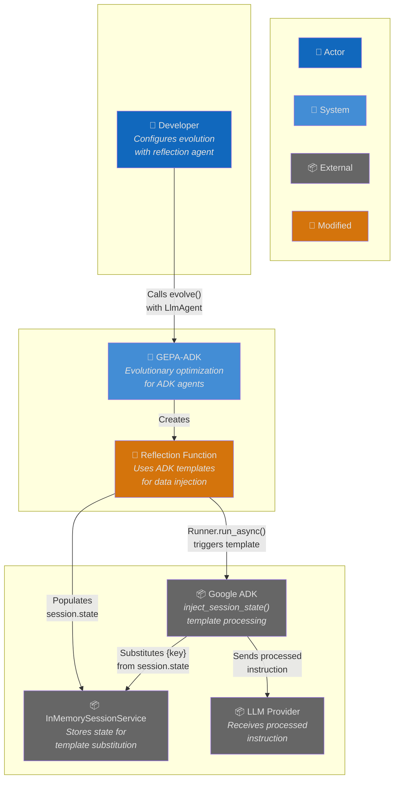
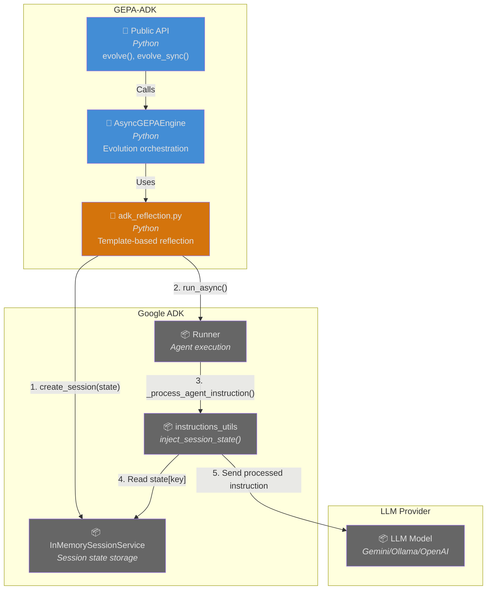
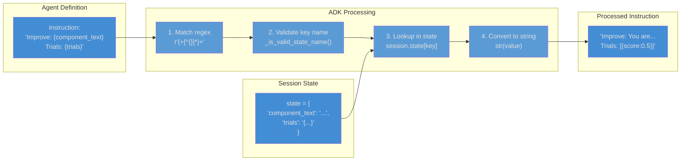
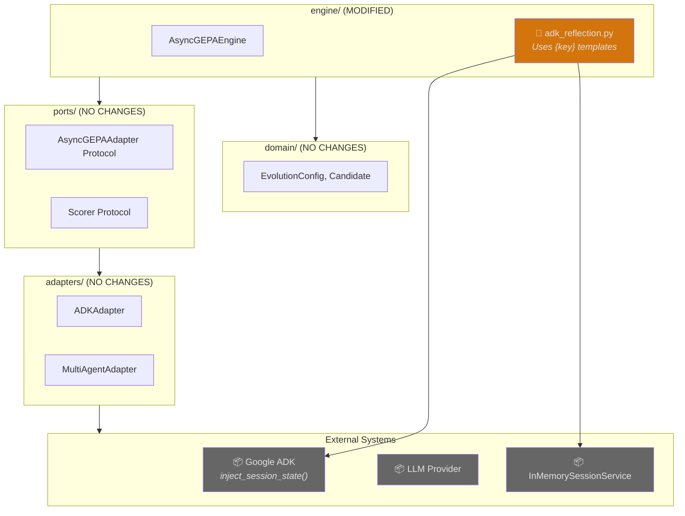
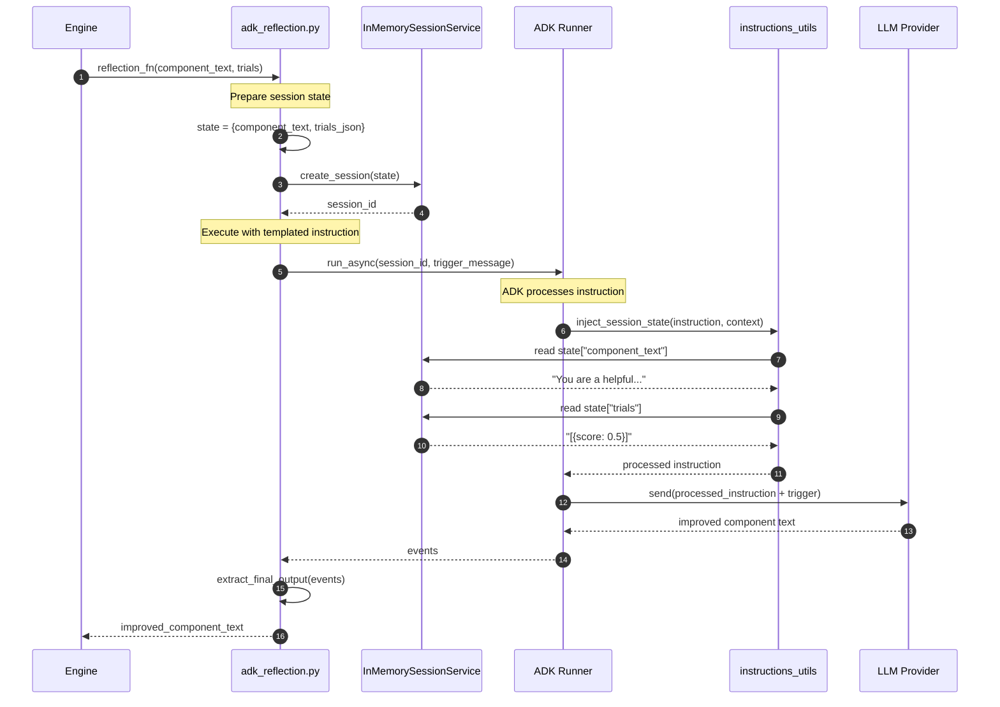
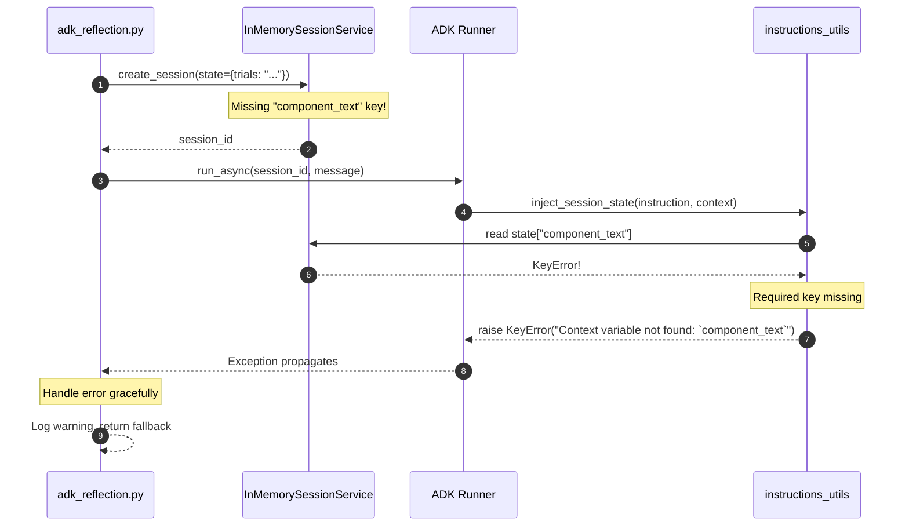
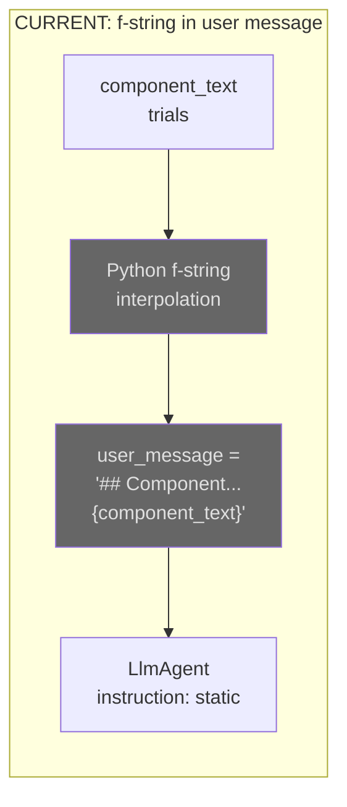
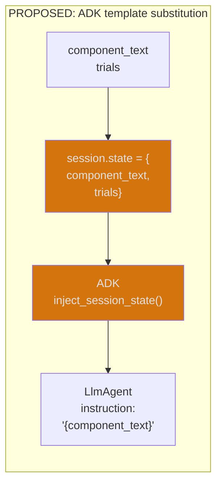

# Architecture: ADK Session State Template Substitution

**Branch**: `035-adk-session-template` | **Date**: 2026-01-18 | **Status**: draft
**Spec**: [./spec.md](./spec.md) | **Plan**: [./plan.md](./plan.md) | **Tasks**: [./tasks.md](./tasks.md)

## 0. Links & References

- Feature Spec: `./spec.md`
- Implementation Plan: `./plan.md`
- Tasks: `./tasks.md`
- Related ADRs: ADR-000 (Hexagonal), ADR-001 (Async-First), ADR-005 (Three-Layer Testing)
- GitHub Issue: #99

## 1. Purpose & Scope

### Goal

Enable ADK's native template substitution syntax (`{key}`) in reflection agent instructions, replacing the current workaround of manually embedding data in user messages via Python f-strings.

### Non-Goals

- Custom template syntax beyond ADK's native support
- Template substitution in tool descriptions or other agent properties
- Dynamic session state updates during agent execution

### Scope Boundaries

- **In-scope**: Modify `adk_reflection.py` to use `{key}` placeholders, add tests, update docs
- **Out-of-scope**: Changes to other adapters, new public APIs, persistence layer changes

### Constraints

- **Technical**: Must work across all LLM providers (Gemini, Ollama, OpenAI); no new dependencies
- **Organizational**: Must follow hexagonal architecture; changes only in `engine/` layer
- **Conventions**: Use ADK's `{key}` syntax (not `{state.key}`); pre-serialize complex types to JSON

## 2. Architecture at a Glance

- **ADK provides native template substitution** via `inject_session_state()` in `google.adk.utils.instructions_utils`
- **Syntax is `{key}`** which maps to `session.state[key]`; optional variant `{key?}` returns empty string if missing
- **Template processing occurs automatically** during `Runner.run_async()` before sending to LLM
- **Current workaround** embeds data in user messages via f-strings, bypassing ADK's template system
- **Proposed change** moves data to session state and uses `{key}` placeholders in agent instruction
- **No protocol changes** — `ReflectionFn` signature remains unchanged; internal implementation detail only

## 3. Context Diagram (C4 Level 1)

> Shows how template substitution fits into the broader system and external dependencies.



## 4. Container Diagram (C4 Level 2)

> Shows the containers involved in template substitution flow.



## 5. ADK Template Substitution Internals

> Shows how ADK processes `{key}` placeholders internally.



## 6. Hexagonal Architecture View

> Shows how this feature aligns with the hexagonal (ports & adapters) architecture.



**Layer Impact**: Only `engine/adk_reflection.py` is modified. No changes to ports, adapters, or domain layers.

## 7. Runtime Behavior (Sequence Diagrams)

### 7.1 Happy Path: Template Substitution During Reflection



### 7.2 Error Path: Missing Session State Key



## 8. Data Model

> No new data structures. Session state format unchanged.

### Session State Structure

```python
session_state: dict[str, Any] = {
    "component_text": str,   # Plain text - agent instruction to improve
    "trials": str,           # JSON string - serialized trial results
}
```

### Template Syntax Reference

| Syntax | Behavior | Use Case |
|--------|----------|----------|
| `{key}` | Substitute or raise KeyError | Required data |
| `{key?}` | Substitute or return "" | Optional data |
| `{app:key}` | App-scoped state | Shared config |
| `{user:key}` | User-scoped state | User preferences |
| `{temp:key}` | Temporary state | Scratch data |

## 9. Before/After Comparison

### Current Implementation (Workaround)



### Proposed Implementation (ADK Templates)



## 10. Quality Attributes (NFRs)

| Attribute | Requirement | Verification |
|-----------|-------------|--------------|
| **Performance** | No increase in execution time vs workaround | Benchmark comparison test |
| **Reliability** | KeyError on missing required keys (fail-fast) | Unit test for error cases |
| **Compatibility** | Works with Gemini, Ollama, OpenAI | Multi-provider integration tests |
| **Maintainability** | Uses ADK-native patterns | Code review |
| **Observability** | Structured logging preserved | Log format verification |

## 11. Testing Strategy

| Layer | Location | What to Test | Markers |
|-------|----------|--------------|---------|
| **Unit** | `tests/unit/engine/test_adk_reflection.py` | Template placeholder detection, JSON serialization, error handling | `@pytest.mark.unit` |
| **Integration** | `tests/integration/test_reflection_template.py` | End-to-end with real LLM, multi-provider | `@pytest.mark.slow` |

**Key Test Scenarios**:
1. Single placeholder substitution with valid state
2. Multiple placeholder substitution
3. Missing required key raises KeyError
4. Optional placeholder returns empty string when missing
5. Non-string values converted via str()
6. Output equivalence with current workaround

## 12. Risks & Open Questions

### Risks

| Risk | Impact | Mitigation |
|------|--------|------------|
| Template syntax undocumented | May change in future ADK versions | Pin ADK version; verified in source |
| Model provider differences | Some models may handle instruction differently | Multi-provider integration tests |
| Breaking existing behavior | Users depending on current message format | Feature flag for rollback |

### Open Questions

- [x] What is the correct template syntax? → **Resolved: `{key}` not `{state.key}`**
- [x] How are complex types handled? → **Resolved: Use `json.dumps()` pre-serialization**
- [ ] Should we support optional placeholders `{key?}` for future flexibility?

## 13. Decisions (ADR References)

| ADR | Title | Relevance to This Feature |
|-----|-------|---------------------------|
| ADR-000 | Hexagonal Architecture | Changes only in engine/ layer; no adapter changes |
| ADR-001 | Async-First | Existing async flow unchanged |
| ADR-005 | Three-Layer Testing | Unit + integration tests for template behavior |

**New ADRs Needed**: None — this feature uses existing patterns.

---

## Appendix: ADK Source Code References

| Component | Location (in .venv) | Purpose |
|-----------|---------------------|---------|
| `inject_session_state()` | `google/adk/utils/instructions_utils.py` | Main template processing |
| `_replace_match()` | `google/adk/utils/instructions_utils.py` | Individual placeholder handling |
| `_is_valid_state_name()` | `google/adk/utils/instructions_utils.py` | Key name validation |
| `State` prefixes | `google/adk/sessions/state.py` | APP, USER, TEMP prefix constants |
| `_process_agent_instruction()` | `google/adk/flows/llm_flows/instructions.py` | Template integration in flow |
