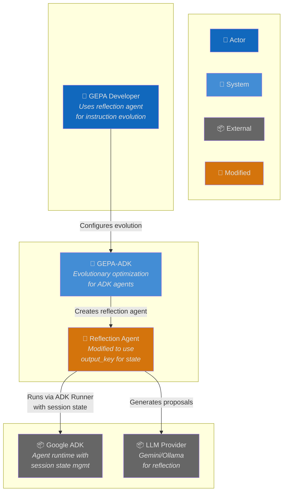
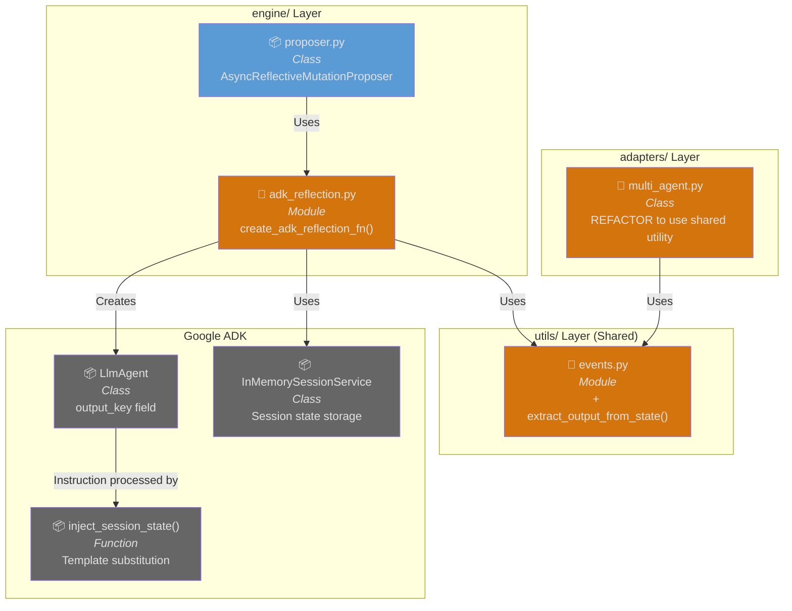
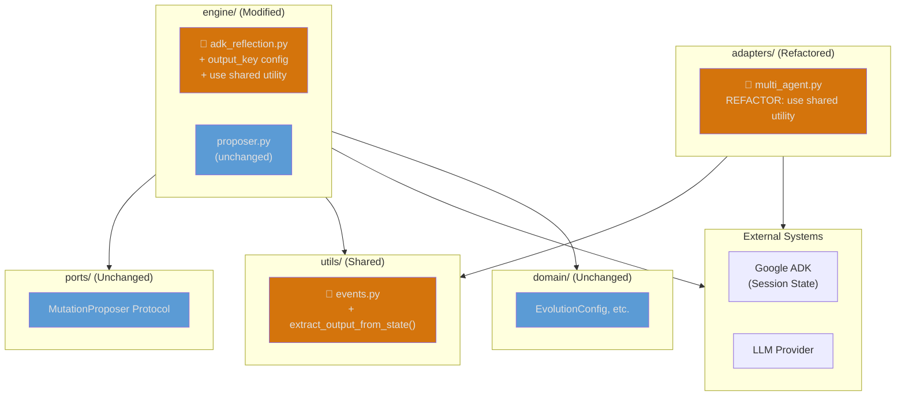
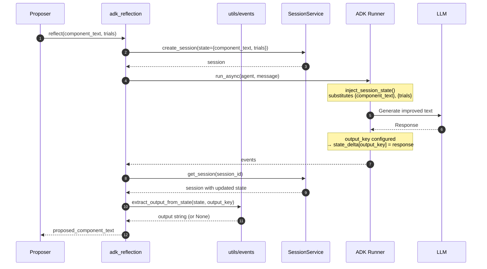
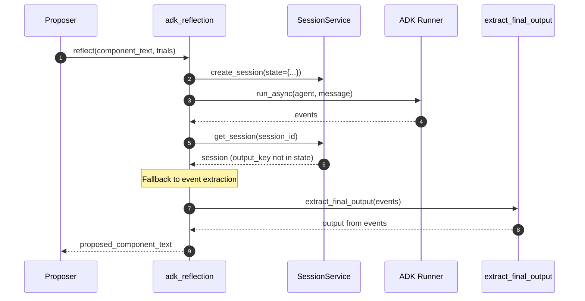
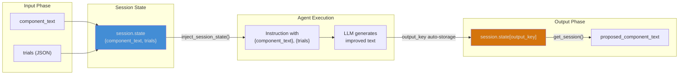

# Architecture: ADK Session State Management

**Branch**: `122-adk-session-state` | **Date**: 2026-01-18 | **Status**: draft
**Spec**: [./spec.md] | **Plan**: [./plan.md] | **Tasks**: [./tasks.md]

## 0. Links & References

- Feature Spec: `./spec.md`
- Implementation Plan: `./plan.md`
- Research: `./research.md`
- Related ADRs:
  - ADR-000: Hexagonal Architecture
  - ADR-001: Async-First Architecture
  - ADR-002: Protocol for Interfaces
  - ADR-005: Three-Layer Testing

## 1. Purpose & Scope

### Goal

Enable the reflection agent to fully leverage ADK's native session state management, eliminating manual message construction and enabling state-based data flow between agents.

### Non-Goals

- Persistent session storage (remains in-memory)
- Changes to domain models or port protocols
- Multi-agent workflow implementation (future work)

### Scope Boundaries

- **In-scope**: output_key configuration, state-based output retrieval, backward compatibility
- **Out-of-scope**: New domain models, protocol changes, documentation updates

### Constraints

- **Technical**: Must use existing ADK session state APIs (InMemorySessionService)
- **Organizational**: Must follow hexagonal architecture (changes in adapters/engine only)
- **Conventions**: Existing ReflectionFn interface must remain unchanged

## 2. Architecture at a Glance

- **State injection** (existing): Input data flows via session.state and template substitution
- **Output storage** (new): Configure `output_key` on LlmAgent for automatic state storage
- **Output retrieval** (new): Extract output from session.state instead of parsing events
- **Shared utility** (new): `extract_output_from_state()` in `utils/events.py` (DRY, hexagonal-compliant)
- **Fallback strategy**: Event-based extraction when state retrieval fails
- **Layer impact**: 3 layers - utils (new function), engine (modify), adapters (refactor to use shared utility)

## 3. Context Diagram (C4 Level 1)

## 4. Component Diagram (C4 Level 3)

## 5. Hexagonal Architecture View

## 6. Runtime Behavior (Sequence Diagrams)

### 6.1 Happy Path: Reflection with output_key

### 6.2 Fallback: State Retrieval Fails

## 7. State Flow Architecture

## 8. Quality Attributes (NFRs)

| Attribute | Requirement | Verification |
|-----------|-------------|--------------|
| **Performance** | No regression from current reflection | Benchmark tests |
| **Reliability** | Fallback to event extraction on failure | Unit tests with mock failures |
| **Maintainability** | Follows existing patterns from multi_agent.py | Code review |
| **Backward Compatibility** | ReflectionFn interface unchanged | Contract tests |

## 9. Testing Strategy

| Layer | Location | What to Test | Markers |
|-------|----------|--------------|---------|
| **Contract** | `tests/contracts/` | ReflectionFn signature unchanged | `@pytest.mark.contract` |
| **Unit** | `tests/unit/engine/` | output_key config, state retrieval, fallback | - |
| **Integration** | `tests/integration/` | Real ADK with output_key | `@pytest.mark.external` |

**Key Test Scenarios**:
1. Output retrieved from session.state[output_key]
2. Fallback to extract_final_output when state missing
3. Template substitution with valid session state
4. Backward compatibility with existing callers

## 10. Risks & Open Questions

### Risks

| Risk | Impact | Mitigation |
|------|--------|------------|
| ADK output_key behavior changes | Breaking change | Pin ADK version, test with CI |
| State retrieval timing issues | Empty output | Fallback to event extraction |

### Open Questions

- [x] How does ADK store output with output_key? → Researched in research.md
- [x] Does output_key work with InMemorySessionService? → Yes, confirmed in codebase

## 11. Decisions (ADR References)

| ADR | Title | Relevance to This Feature |
|-----|-------|---------------------------|
| ADR-000 | Hexagonal Architecture | Changes in engine/ only, ports unchanged |
| ADR-001 | Async-First | All operations remain async |
| ADR-002 | Protocol Interfaces | ReflectionFn signature unchanged |
| ADR-005 | Three-Layer Testing | Unit + integration + contract tests |

**New ADRs Needed**: None - follows existing patterns
