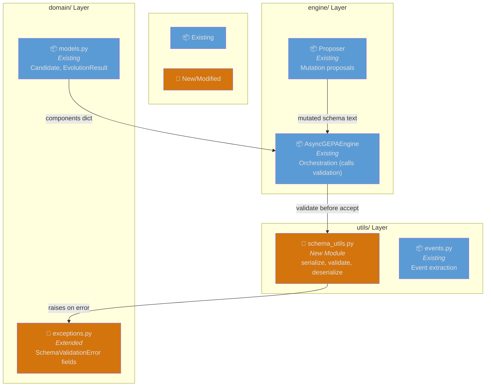
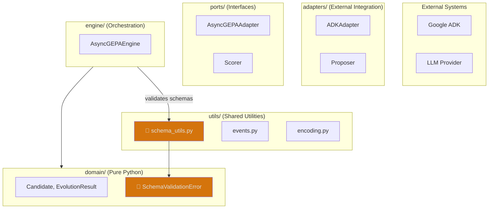
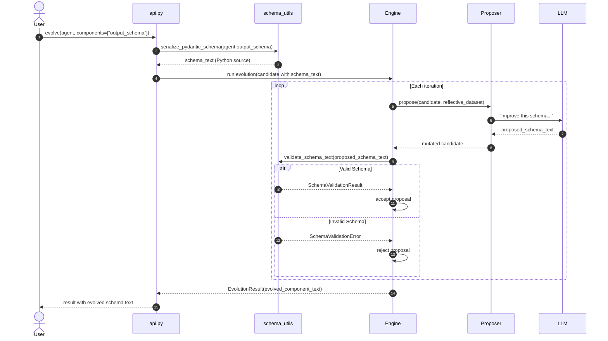
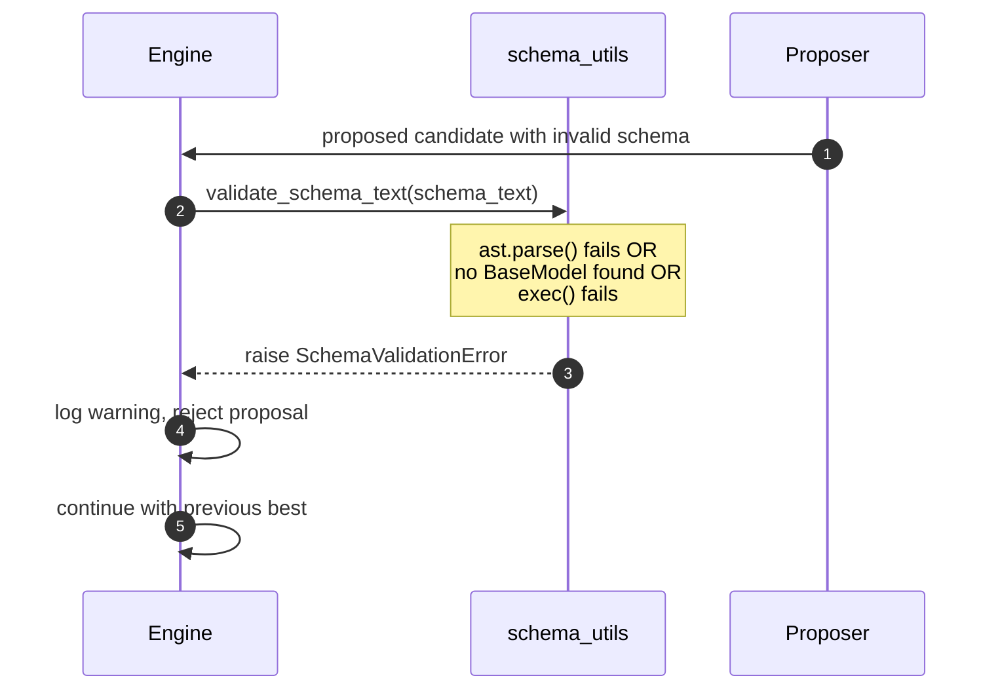
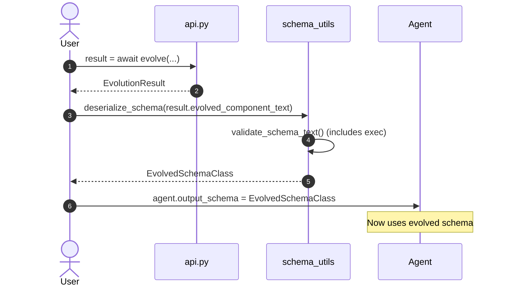

# Architecture: Output Schema Evolution

**Branch**: `123-output-schema-evolution` | **Date**: 2026-01-18 | **Status**: draft
**Spec**: [./spec.md](./spec.md) | **Plan**: [./plan.md](./plan.md) | **Tasks**: [./tasks.md](./tasks.md)

## 0. Links & References

- Feature Spec: `./spec.md`
- Implementation Plan: `./plan.md`
- Research: `./research.md`
- Data Model: `./data-model.md`
- Related ADRs: ADR-000 (Hexagonal Architecture), ADR-005 (Three-Layer Testing)

## 1. Purpose & Scope

### Goal

Enable evolution of Pydantic output schemas as components, allowing developers to optimize structured output definitions alongside agent instructions using the gepa-adk evolution engine.

### Non-Goals

- Evolving complex nested schemas with external imports
- Supporting JSON Schema format (Python source code only)
- Custom Pydantic validators (`@validator` decorators)
- Real-time schema validation during agent execution

### Scope Boundaries

- **In-scope**: Schema serialization, validation, deserialization utilities
- **Out-of-scope**: Modifications to the evolution engine core, new protocols

### Constraints

- **Technical**: Python 3.12+, stdlib only for utils layer (per ADR-000), Pydantic dependency
- **Organizational**: Must follow hexagonal architecture, no engine modifications
- **Conventions**: Self-contained schemas only (no imports allowed)

## 2. Architecture at a Glance

- **No new layers**: Adds utilities to existing `utils/` layer
- **No engine changes**: Existing component system already generic
- **Three utilities**: serialize, validate, deserialize Pydantic schemas
- **Security**: AST validation before exec() for deserialization
- **Integration**: Hooks into acceptance flow for validation

## 3. Component Diagram (Feature Focus)

> Shows the new schema_utils module and its integration with existing components.



## 4. Hexagonal Architecture View

> Shows how schema utilities fit within the hexagonal architecture.



## 5. Runtime Behavior (Sequence Diagrams)

### 5.1 Happy Path: Schema Evolution



### 5.2 Error Path: Invalid Schema Rejected



### 5.3 Post-Evolution: Deserialize for Use



## 6. Data Flow

```
┌─────────────────┐     serialize_pydantic_schema()     ┌─────────────────┐
│ Pydantic Model  │ ──────────────────────────────────▶ │   Schema Text   │
│     Class       │                                     │  (Python src)   │
│ (MyOutput)      │                                     │  in Candidate   │
└─────────────────┘                                     └────────┬────────┘
                                                                 │
                                                                 ▼
                                                        ┌─────────────────┐
                                                        │  Evolution Loop │
                                                        │  (LLM mutation) │
                                                        └────────┬────────┘
                                                                 │
                        validate_schema_text()                   ▼
┌─────────────────┐ ◀────────────────────────────────── ┌─────────────────┐
│ Accept/Reject   │                                     │ Proposed Schema │
│   Decision      │                                     │      Text       │
└────────┬────────┘                                     └─────────────────┘
         │ (if accepted)
         ▼
┌─────────────────┐     deserialize_schema()            ┌─────────────────┐
│ Evolved Schema  │ ◀────────────────────────────────── │  Final Result   │
│     Class       │                                     │ evolved_text    │
│ (EvolvedOutput) │                                     └─────────────────┘
└─────────────────┘
```

## 7. Testing Strategy

| Layer | Location | What to Test | Markers |
|-------|----------|--------------|---------|
| **Contract** | `tests/contracts/` | Round-trip serialization, validation rules | `@pytest.mark.contract` |
| **Unit** | `tests/unit/utils/` | serialize, validate, deserialize functions | `@pytest.mark.unit` |
| **Integration** | `tests/integration/` | End-to-end schema evolution | `@pytest.mark.integration` |

**Key Test Scenarios**:
1. Round-trip: serialize → evolve → deserialize preserves field types
2. Validation rejects syntax errors, missing BaseModel, imports
3. Security: exec() with controlled namespace only

## 8. Risks & Mitigations

| Risk | Impact | Mitigation |
|------|--------|------------|
| Code execution via exec() | Security | AST validation + controlled namespace whitelist |
| LLM proposes invalid schemas | Evolution fails | Validation rejects; engine continues with previous best |
| inspect.getsource() fails | Serialization fails | Only support classes defined in .py files |
| Schema name collisions | Namespace pollution | Unique namespace per validation call |

## 9. Decisions (ADR References)

| ADR | Title | Relevance to This Feature |
|-----|-------|---------------------------|
| ADR-000 | Hexagonal Architecture | Utils layer for schema_utils; no domain changes |
| ADR-005 | Three-Layer Testing | Contract + Unit + Integration tests required |
| ADR-009 | Exception Hierarchy | SchemaValidationError extends existing hierarchy |

**New ADRs Needed**: None - feature fits within existing architecture.
