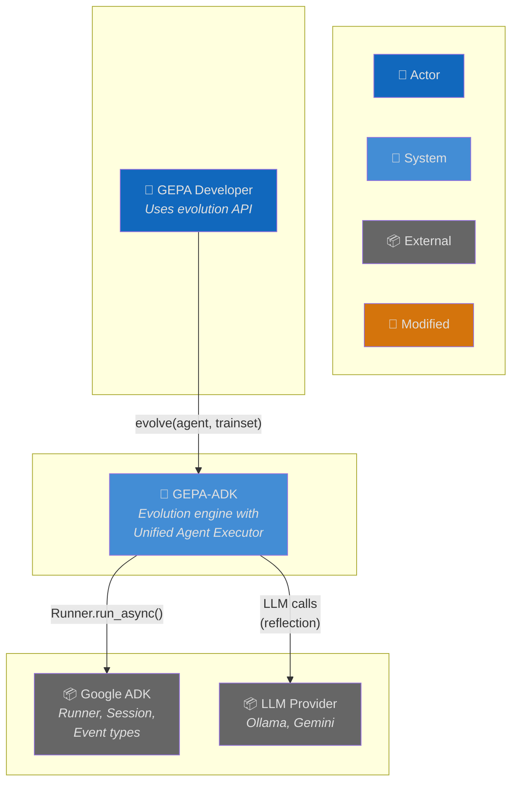
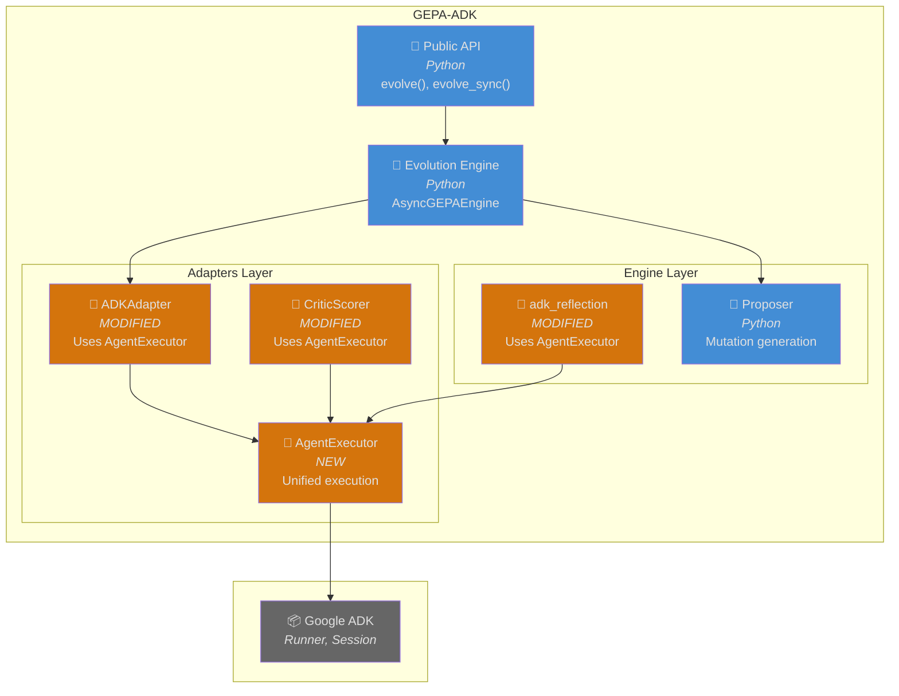
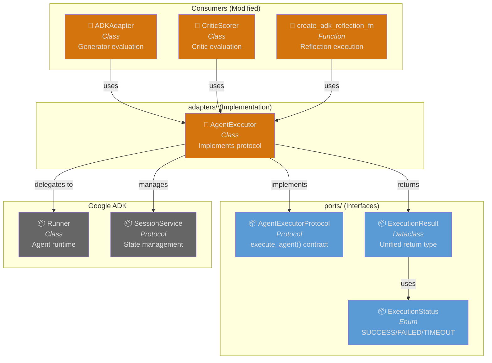
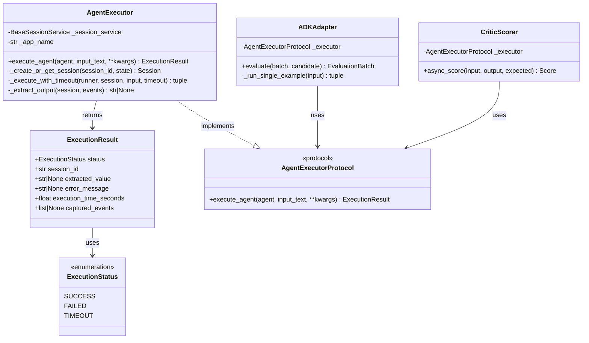
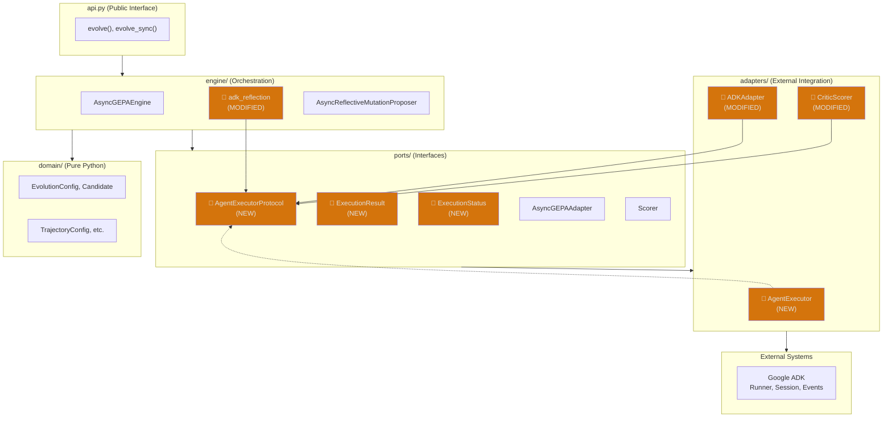
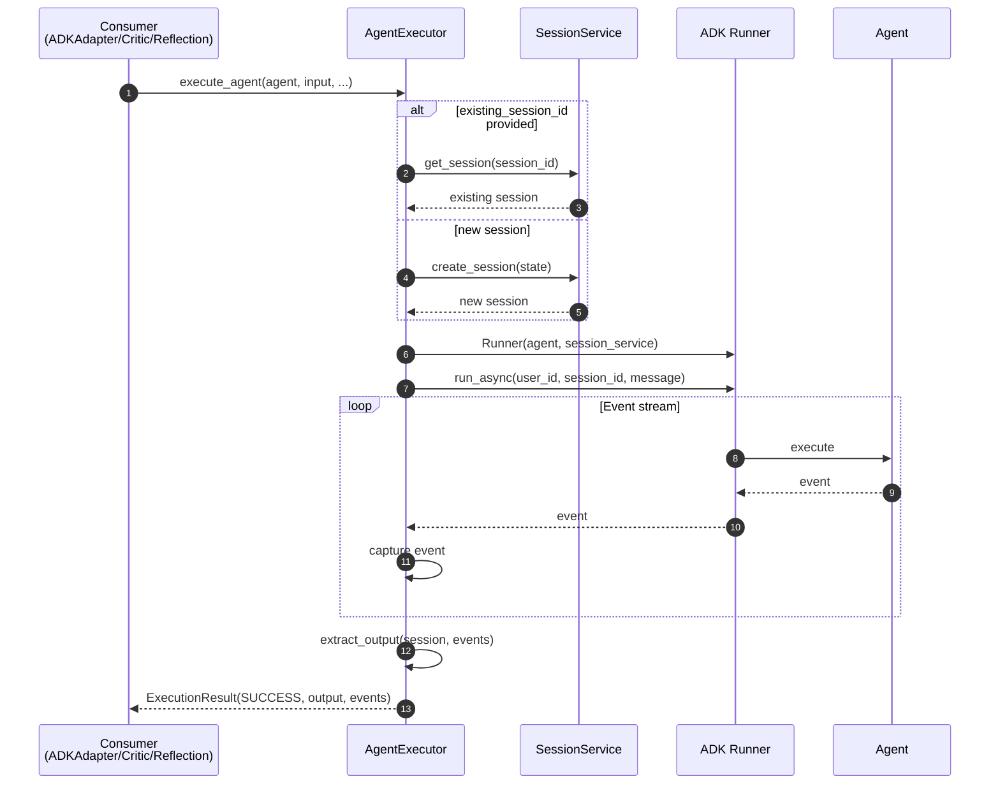
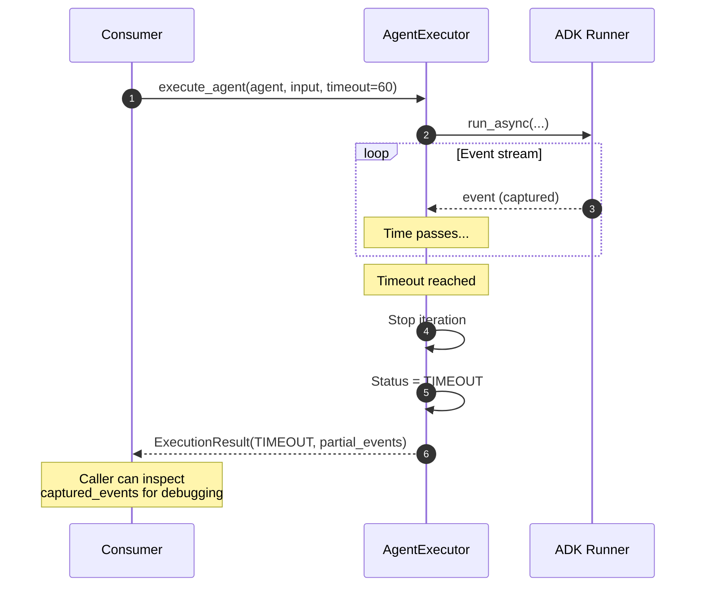
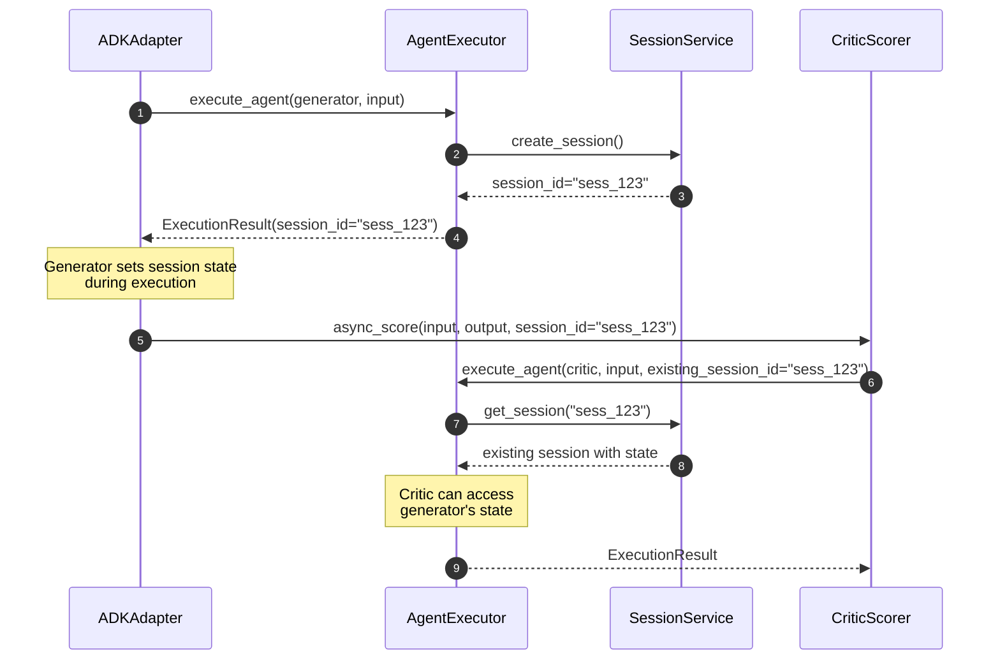
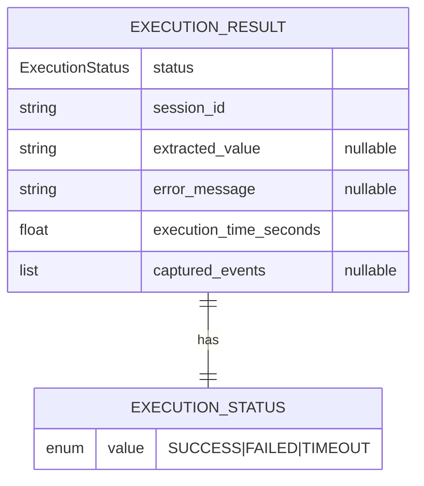

# Architecture: Unified Agent Executor

**Branch**: `124-unified-agent-executor` | **Date**: 2026-01-19 | **Status**: draft
**Spec**: [./spec.md](spec.md) | **Plan**: [./plan.md](plan.md) | **Tasks**: [./tasks.md](tasks.md)

## 0. Links & References

- Feature Spec: `./spec.md`
- Implementation Plan: `./plan.md`
- Tasks: `./tasks.md` (to be generated)
- Related ADRs:
  - [ADR-000: Hexagonal Architecture](../../docs/adr/ADR-000-hexagonal-architecture.md)
  - [ADR-002: Protocol for Interfaces](../../docs/adr/ADR-002-protocol-for-interfaces.md)
  - [ADR-005: Three-Layer Testing](../../docs/adr/ADR-005-three-layer-testing.md)
- GitHub Issue: [#135](https://github.com/Alberto-Codes/gepa-adk/issues/135)

## 1. Purpose & Scope

### Goal

Provide a unified execution interface for all ADK agent types (generator, critic, reflection) with consistent session management, event capture, and result handling. This eliminates ~18-19% code duplication and enables feature parity across agent types.

### Non-Goals

- Workflow agent support (SequentialAgent, ParallelAgent, LoopAgent)
- Database persistence of execution results
- OpenTelemetry tracing integration
- Provider-specific error enhancement
- Tool validation callbacks (deferred to #133)
- Lifecycle callbacks (deferred to #134)

### Scope Boundaries

- **In-scope**: AgentExecutorProtocol, AgentExecutor adapter, migration of ADKAdapter/CriticScorer/reflection, backward compatibility
- **Out-of-scope**: Public API changes, new user-facing features, workflow support

### Constraints

- **Technical**: Must use existing google-adk >= 1.22.0, no new dependencies
- **Organizational**: Must follow hexagonal architecture (ADR-000), protocols (ADR-002)
- **Conventions**: Backward compatible - existing evolve() API unchanged

## 2. Architecture at a Glance

- **Single AgentExecutor** replaces three separate Runner instantiation patterns
- **Protocol-based interface** in ports layer enables dependency injection and testing
- **ExecutionResult dataclass** provides consistent return type with status, output, events
- **Session management** unified: create new or reuse existing via parameter
- **Timeout handling** returns status (not exception) for graceful recovery
- **Event capture** always available for debugging and trajectory analysis

## 3. Context Diagram (C4 Level 1)

> Shows how the Unified Agent Executor fits into the broader system.



## 4. Container Diagram (C4 Level 2)

> Shows the major containers within GEPA-ADK and how AgentExecutor fits.



## 5. Component Diagram (C4 Level 3)

> Shows the internal structure of the AgentExecutor and its relationships.



## 6. Code Diagram (C4 Level 4)

> Shows class relationships for the new and modified components.



## 7. Hexagonal Architecture View

> Shows how the feature aligns with the hexagonal (ports & adapters) architecture.



## 8. Runtime Behavior (Sequence Diagrams)

### 8.1 Happy Path: Agent Execution via AgentExecutor



### 8.2 Error Case: Timeout During Execution



### 8.3 Session Sharing: Critic Accesses Generator State



## 9. Data Model & Contracts

### 9.1 Data Changes (ERD)

> New types introduced in ports layer.



### 9.2 API Contracts

**Public API Changes**: None - internal refactoring only

**New Protocol** (ports layer):
```python
@runtime_checkable
class AgentExecutorProtocol(Protocol):
    async def execute_agent(
        self,
        agent: Any,
        input_text: str,
        *,
        instruction_override: str | None = None,
        output_schema_override: dict[str, Any] | None = None,
        session_state: dict[str, Any] | None = None,
        existing_session_id: str | None = None,
        timeout_seconds: int = 300,
    ) -> ExecutionResult: ...
```

**Internal Changes**:
- `ADKAdapter.__init__()` accepts optional `executor: AgentExecutorProtocol`
- `CriticScorer.__init__()` accepts optional `executor: AgentExecutorProtocol`
- `create_adk_reflection_fn()` accepts optional `executor: AgentExecutorProtocol`

## 10. Quality Attributes (NFRs)

| Attribute | Requirement | Verification |
|-----------|-------------|--------------|
| **Performance** | No regression from current execution paths | Integration timing tests |
| **Reliability** | TIMEOUT status instead of exception | Unit tests for timeout handling |
| **Maintainability** | Single execution path for all agent types | Code coverage, no duplication |
| **Testability** | Protocol enables mocking | Contract tests |
| **Backward Compatibility** | evolve() API unchanged | Existing tests pass |

## 11. Testing Strategy

| Layer | Location | What to Test | Markers |
|-------|----------|--------------|---------|
| **Contract** | `tests/contracts/test_agent_executor_protocol.py` | AgentExecutor implements protocol | `@pytest.mark.contract` |
| **Unit** | `tests/unit/adapters/test_agent_executor.py` | Session management, timeout, extraction | `@pytest.mark.unit` |
| **Integration** | `tests/integration/test_unified_execution.py` | Feature parity across agent types | `@pytest.mark.integration` |

**Key Test Scenarios**:
1. Execute agent and extract output successfully
2. Execute with instruction override - original unchanged
3. Execute with session reuse - state accessible
4. Timeout returns TIMEOUT status with partial events
5. Feature parity: generator, critic, reflection all work identically

## 12. Risks & Open Questions

### Risks

| Risk | Impact | Mitigation |
|------|--------|------------|
| Output extraction differences between agent types | Incorrect results | Test all three paths thoroughly |
| Session state isolation regression | Data leakage | Verify session isolation in tests |
| Performance regression | Slower evolution | Benchmark before/after |

### Open Questions

- [x] Should timeout raise or return status? **Decision: Return status**
- [x] Use Any or LlmAgent for agent parameter? **Decision: Any (avoid coupling)**

### TODOs

- [x] Consolidate duplicate extraction utilities in ADKAdapter to utils/events.py → **Covered by T061**
- [x] Document migration path for custom adapters → **Out of scope (no custom adapters exist)**

## 13. Decisions (ADR References)

| ADR | Title | Relevance to This Feature |
|-----|-------|---------------------------|
| ADR-000 | Hexagonal Architecture | Protocol in ports, implementation in adapters |
| ADR-002 | Protocol Interfaces | AgentExecutorProtocol with @runtime_checkable |
| ADR-005 | Three-Layer Testing | Contract/unit/integration test coverage |

**New ADRs Needed**: None - all decisions align with existing ADRs.
