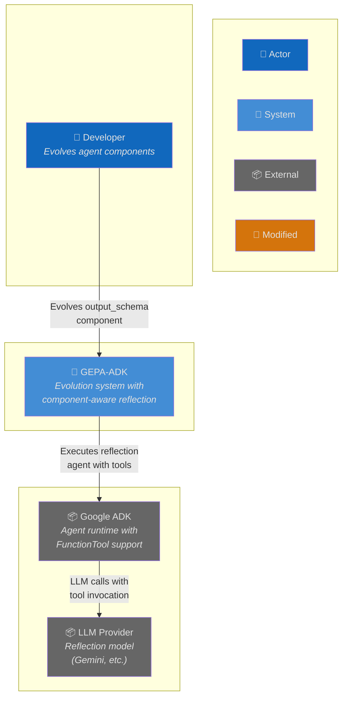
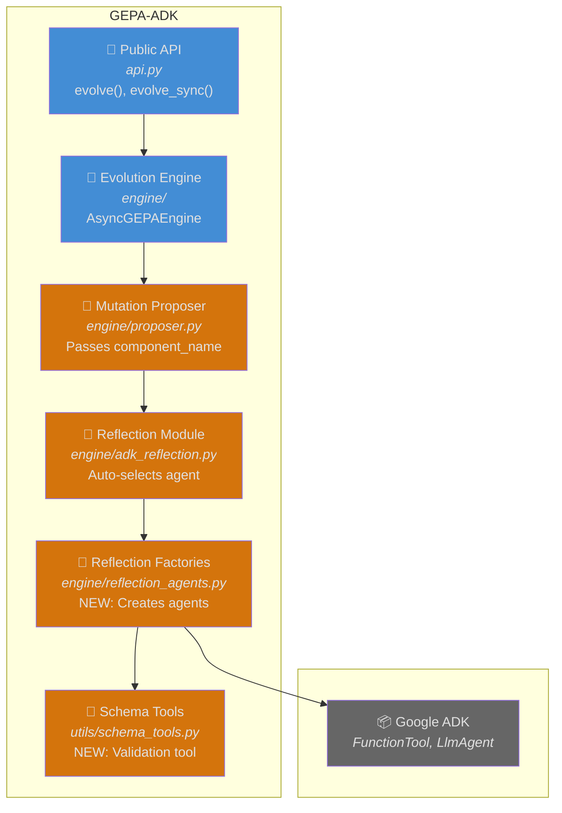
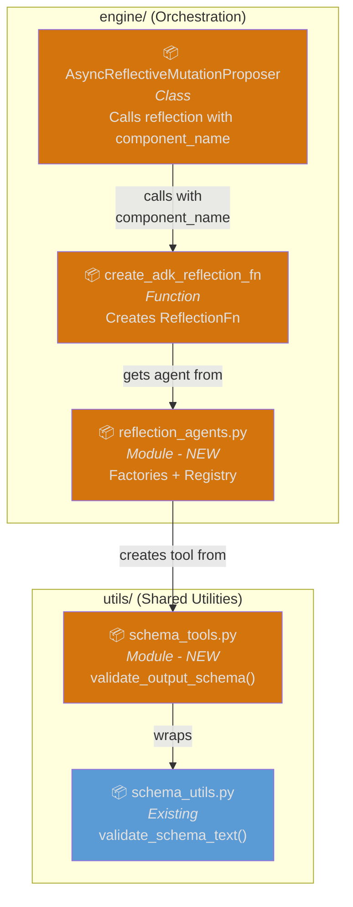
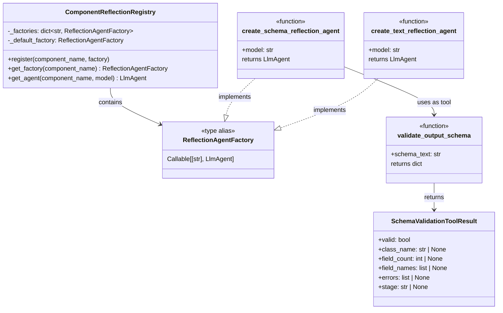
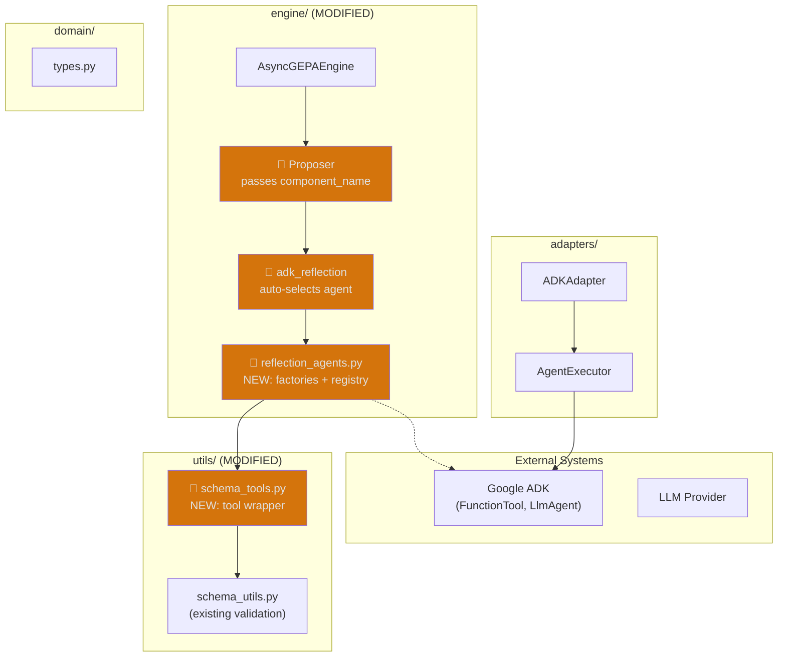
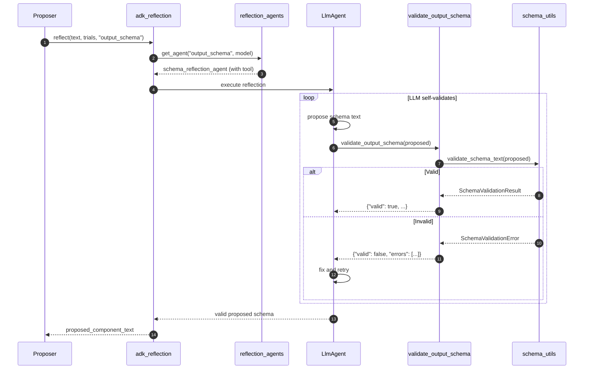
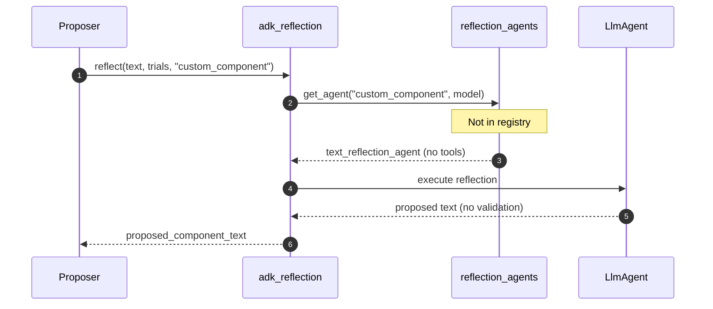

# Architecture: Component-Aware Reflection Agents

**Branch**: `142-component-aware-reflection` | **Date**: 2026-01-20 | **Status**: draft
**Spec**: [./spec.md](spec.md) | **Plan**: [./plan.md](plan.md)

## 0. Links & References

- Feature Spec: `./spec.md`
- Implementation Plan: `./plan.md`
- Research: `./research.md`
- Related ADRs: ADR-000 (Hexagonal), ADR-002 (Protocols), ADR-005 (Testing), ADR-006 (External Libraries)

## 1. Purpose & Scope

### Goal

Enable reflection agents to validate `output_schema` proposals before returning, reducing wasted evolution iterations on invalid Pydantic schemas.

### Non-Goals

- Validating other structured ADK attributes (deferred)
- Modifying how ADK executes agents
- Changing the core evolution loop

### Scope Boundaries

- **In-scope**: `output_schema` validation tool, reflection agent factories, component registry
- **Out-of-scope**: `tools`, `input_schema`, `generate_content_config` validation (future)

### Constraints

- **Technical**: Must use ADK's FunctionTool pattern for validation tool
- **Organizational**: Follow hexagonal architecture - tools in utils/, factories in engine/
- **Conventions**: Backward compatible - existing code must continue to work

## 2. Architecture at a Glance

- **Factory pattern** creates component-specific reflection agents (schema vs text)
- **Registry** maps component names to factories for auto-selection
- **Validation tool** wraps existing `validate_schema_text()` as ADK FunctionTool
- **Reflection instruction** explicitly guides LLM to use validation before returning
- **Proposer passes component_name** to reflection, enabling dynamic agent selection
- **Backward compatible** - existing code works unchanged

## 3. Context Diagram (C4 Level 1)



## 4. Container Diagram (C4 Level 2)



## 5. Component Diagram (C4 Level 3)



## 6. Code Diagram (C4 Level 4)



## 7. Hexagonal Architecture View



## 8. Runtime Behavior (Sequence Diagrams)

### 8.1 Happy Path: Schema Reflection with Validation



### 8.2 Fallback: Unknown Component Uses Default



## 9. Data Model & Contracts

### 9.1 API Contracts

**Extended ReflectionFn signature**:
```python
# Before
ReflectionFn = Callable[[str, list[dict]], Awaitable[str]]

# After (backward compatible)
ReflectionFn = Callable[[str, list[dict], str], Awaitable[str]]
#                        ^text  ^trials   ^component_name
```

**New factory functions**:
- `create_text_reflection_agent(model: str) -> LlmAgent`
- `create_schema_reflection_agent(model: str) -> LlmAgent`
- `get_reflection_agent(component_name: str, model: str) -> LlmAgent`

**New validation tool**:
- `validate_output_schema(schema_text: str) -> dict`

## 10. Quality Attributes (NFRs)

| Attribute | Requirement | Verification |
|-----------|-------------|--------------|
| **Backward Compatibility** | Existing code works unchanged | Unit tests with old API |
| **Extensibility** | New validators without core changes | Registry pattern |
| **Reliability** | Invalid schemas don't crash | Tool returns error dict |
| **Observability** | Validation events logged | structlog with context |

## 11. Testing Strategy

| Layer | Location | What to Test | Markers |
|-------|----------|--------------|---------|
| **Unit** | `tests/unit/engine/test_reflection_agents.py` | Factory functions, registry | - |
| **Unit** | `tests/unit/utils/test_schema_tools.py` | Tool wrapper function | - |
| **Integration** | `tests/integration/test_schema_reflection.py` | Full validation flow | `@pytest.mark.slow` |

**Key Test Scenarios**:
1. Schema reflection agent validates and returns valid schema
2. Schema reflection agent retries on invalid schema (mock LLM)
3. Unknown component falls back to text reflection
4. Registry extension works without core changes
5. Backward compatibility - existing code unchanged

## 12. Risks & Open Questions

### Risks

| Risk | Impact | Mitigation |
|------|--------|------------|
| LLM ignores validation tool | Wasted iterations | Strong instruction, fallback to downstream validation |
| Tool adds latency | Slower reflection | Validation is fast (<10ms), benefit outweighs cost |

### Open Questions

- [x] How does ADK handle output_schema validation? → Researched: uses `model_validate_json()` and `SetModelResponseTool`
- [x] Can we use ADK's existing patterns? → Yes: FunctionTool + instruction injection

## 13. Decisions (ADR References)

| ADR | Title | Relevance to This Feature |
|-----|-------|---------------------------|
| ADR-000 | Hexagonal Architecture | Tools in utils/, factories in engine/ |
| ADR-002 | Protocol Interfaces | No new protocols needed |
| ADR-005 | Three-Layer Testing | Unit + integration tests |
| ADR-006 | External Library Integration | ADK FunctionTool used via injection |

**New ADRs Needed**: None
