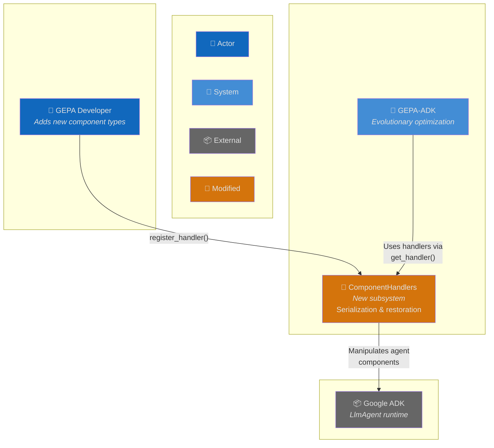
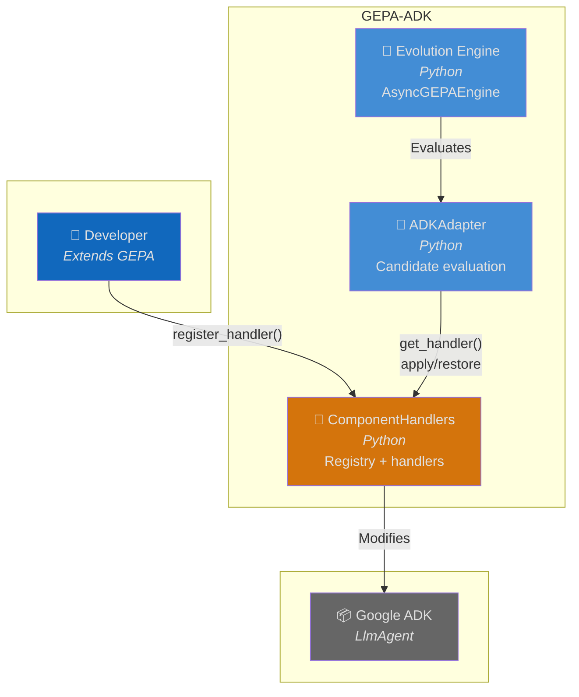
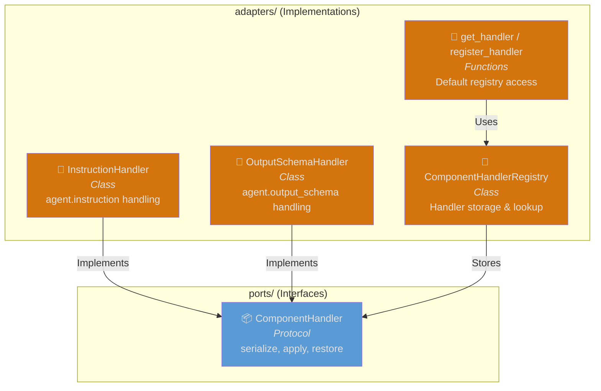
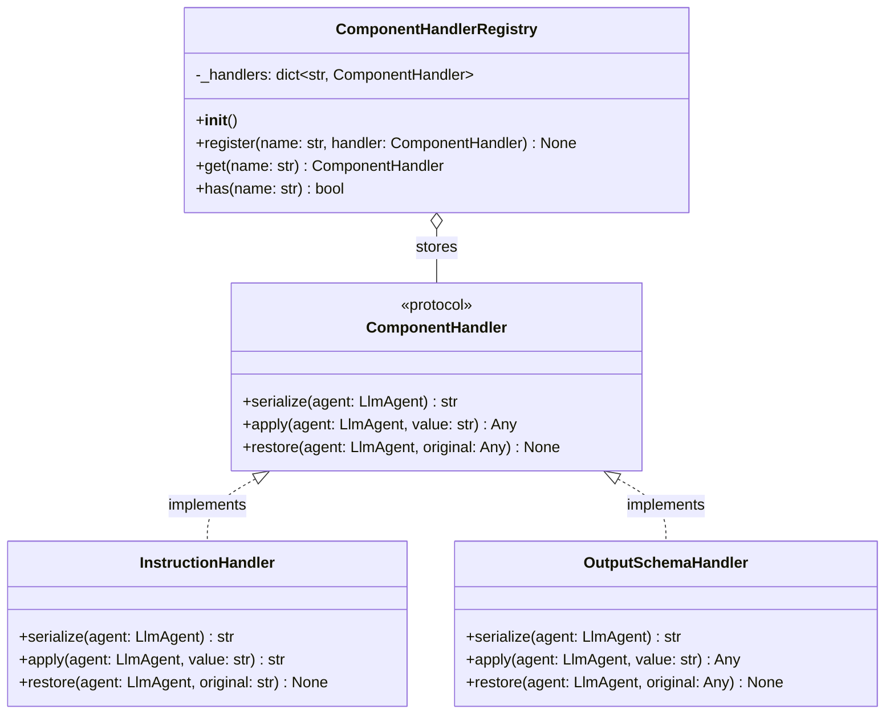
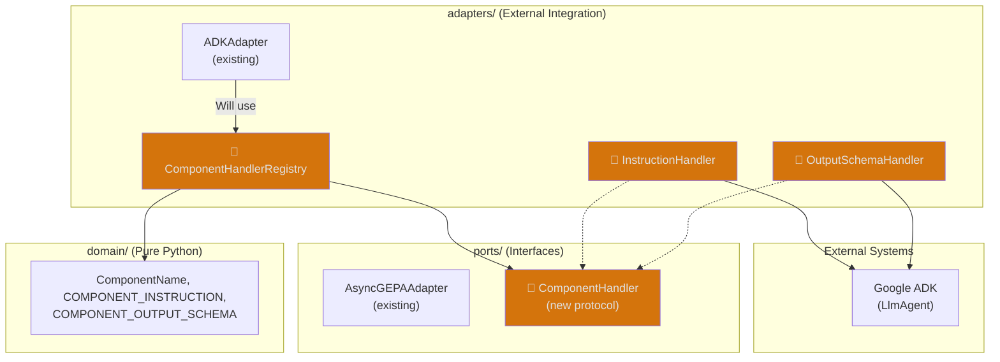
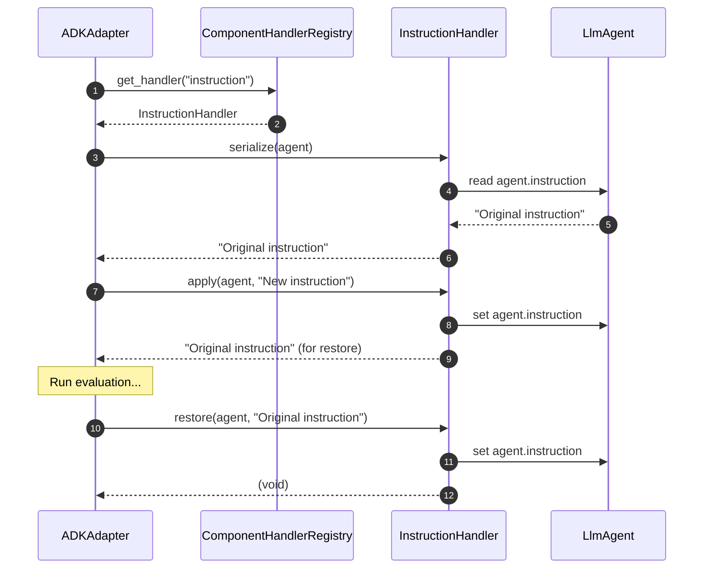
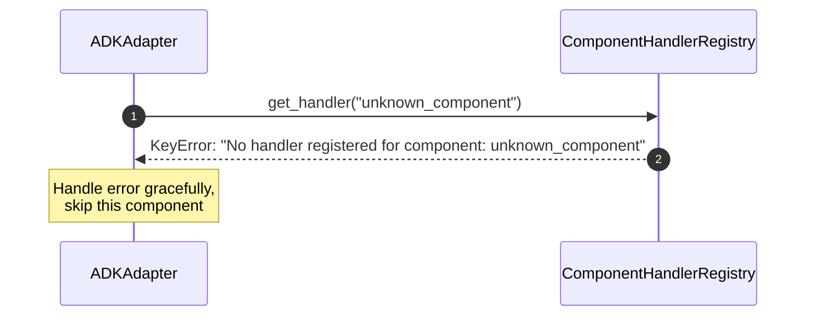
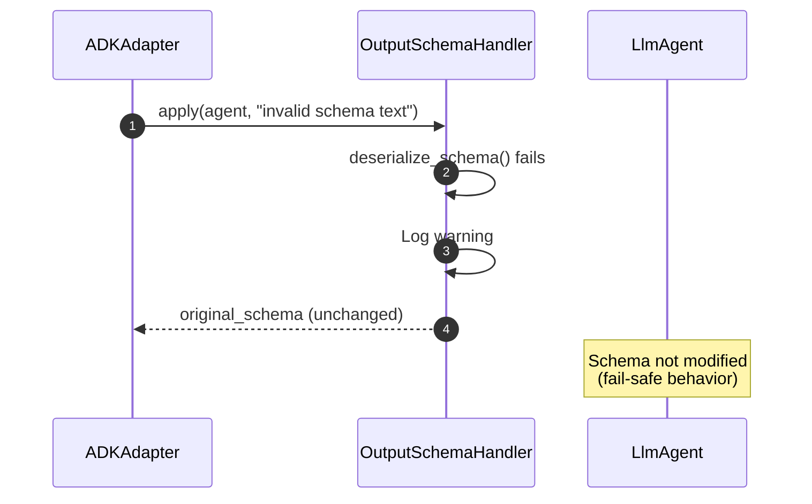
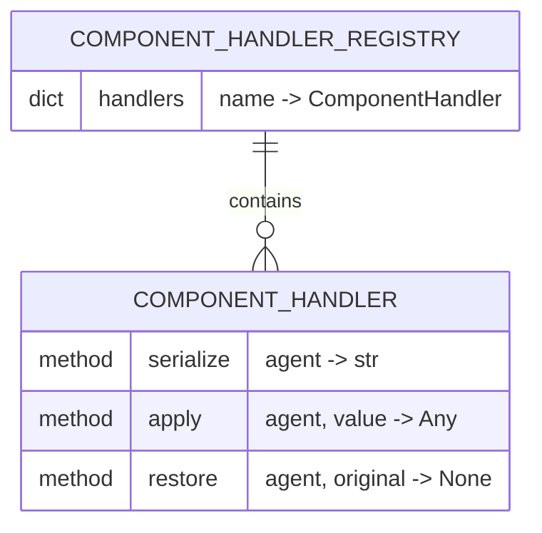

# Architecture: ComponentHandler Protocol and Registry

**Branch**: `162-component-handlers` | **Date**: 2026-01-20 | **Status**: draft
**Spec**: [./spec.md](./spec.md) | **Plan**: [./plan.md](./plan.md) | **Tasks**: ./tasks.md (pending)

## 0. Links & References

- Feature Spec: `./spec.md`
- Implementation Plan: `./plan.md`
- Tasks: `./tasks.md` (to be generated via `/speckit.tasks`)
- Related ADRs:
  - ADR-000: Hexagonal Architecture
  - ADR-002: Protocol for Interfaces
  - ADR-005: Three-Layer Testing
- PRs: [link when available]

## 1. Purpose & Scope

### Goal

Create an extensible ComponentHandler protocol and registry that abstracts component serialization/application, replacing hardcoded if/elif branches in ADKAdapter with a registry-based handler pattern. This enables adding new component types (e.g., temperature, generate_content_config) without modifying core adapter code.

### Non-Goals

- Migrating existing `_apply_candidate()` code to use handlers (separate follow-up issue)
- Adding new component types beyond instruction and output_schema
- Changing the public API surface

### Scope Boundaries

- **In-scope**:
  - ComponentHandler protocol definition in ports/
  - ComponentHandlerRegistry class in adapters/
  - InstructionHandler and OutputSchemaHandler implementations
  - Default registry instance and convenience functions
  - Three-layer test suite (contract, unit, integration)

- **Out-of-scope**:
  - ADKAdapter refactoring to use handlers
  - New component handler implementations
  - Public API changes

### Constraints

- **Technical**: Python 3.12+, no new dependencies, sync methods only (no I/O)
- **Organizational**: Must follow hexagonal architecture (protocol in ports/, implementations in adapters/)
- **Conventions**: Google-style docstrings, @runtime_checkable protocol, structlog logging

## 2. Architecture at a Glance

- **Protocol-based design**: ComponentHandler protocol defines serialize/apply/restore contract
- **Registry pattern**: Dict-based registry with O(1) lookup, module-level default instance
- **Hexagonal separation**: Protocol in ports/ layer, implementations in adapters/ layer
- **Data flow**: serialize → apply → evaluate → restore cycle for each component
- **Extensibility**: New handlers registered via `register_handler()` without code changes
- **Error safety**: Graceful degradation on invalid values (log warning, keep original)

## 3. Context Diagram (C4 Level 1)

> Shows how ComponentHandler fits into the broader GEPA-ADK system.

## 4. Container Diagram (C4 Level 2)

> Shows the new ComponentHandler subsystem within GEPA-ADK.

## 5. Component Diagram (C4 Level 3)

> Shows internal structure of the ComponentHandler subsystem.

## 6. Code Diagram (C4 Level 4)

> Shows class structure and relationships.

## 7. Hexagonal Architecture View

> Shows how this feature aligns with the hexagonal architecture.

## 8. Runtime Behavior (Sequence Diagrams)

### 8.1 Happy Path: Component Apply and Restore

### 8.2 Error Case: Handler Not Found

### 8.3 Error Case: Invalid Schema Value

## 9. Data Model & Contracts

### 9.1 Data Changes (ERD)

> No persistent data changes. All data is in-memory.

### 9.2 API Contracts

**Public API Changes**: None (internal refactoring)

**New Exports from `adapters/`**:
- `ComponentHandlerRegistry` (class)
- `InstructionHandler` (class)
- `OutputSchemaHandler` (class)
- `component_handlers` (default registry instance)
- `get_handler(name)` (convenience function)
- `register_handler(name, handler)` (convenience function)

**New Export from `ports/`**:
- `ComponentHandler` (protocol)

## 10. Deployment / Infrastructure View

> Not applicable. This feature is purely in-memory with no infrastructure changes.

## 11. Quality Attributes (NFRs)

| Attribute | Requirement | Verification |
|-----------|-------------|--------------|
| **Performance** | O(1) handler lookup | Unit test with timing |
| **Reliability** | Graceful degradation on invalid values | Error handling tests |
| **Extensibility** | New handlers via register_handler() | Integration test with custom handler |
| **Maintainability** | Hexagonal architecture compliance | Layer import rule verification |
| **Observability** | Structured logging for errors | Log format verification |

## 12. Testing Strategy

| Layer | Location | What to Test | Markers |
|-------|----------|--------------|---------|
| **Contract** | `tests/contracts/test_component_handler_protocol.py` | Protocol compliance for all handlers | `@pytest.mark.contract` |
| **Unit** | `tests/unit/adapters/test_component_handlers.py` | Registry operations, handler logic | `@pytest.mark.unit` |
| **Integration** | `tests/integration/test_component_handler_integration.py` | Full serialize/apply/restore cycle with real agent | `@pytest.mark.integration` |

**Key Test Scenarios**:
1. Protocol compliance: All handlers pass isinstance(handler, ComponentHandler)
2. Registry CRUD: register, get, has operations work correctly
3. Error handling: Missing handlers, invalid names, invalid values
4. Idempotency: apply + restore leaves agent unchanged
5. Custom handler: Developer can register and use custom handler

## 13. Risks & Open Questions

### Risks

| Risk | Impact | Mitigation |
|------|--------|------------|
| Handler registration order conflicts | Medium - Last registration wins | Document behavior, add warning log |
| Breaking existing _apply_candidate() | High - Regression | Separate migration issue, extensive tests |

### Open Questions

- [x] Should handlers be async? **Decision: No, sync methods only (no I/O)**
- [x] Generic vs Any for original value? **Decision: Any (matches current code flexibility)**

### TODOs

- [ ] Create follow-up issue for ADKAdapter migration to use handlers
- [ ] Consider thread-safety if handlers accessed from multiple threads

## 14. Decisions (ADR References)

| ADR | Title | Relevance to This Feature |
|-----|-------|---------------------------|
| ADR-000 | Hexagonal Architecture | Protocol in ports/, implementations in adapters/ |
| ADR-002 | Protocol Interfaces | @runtime_checkable ComponentHandler protocol |
| ADR-005 | Three-Layer Testing | Contract, unit, integration test structure |

**New ADRs Needed**: None - existing ADRs cover this feature's decisions.
