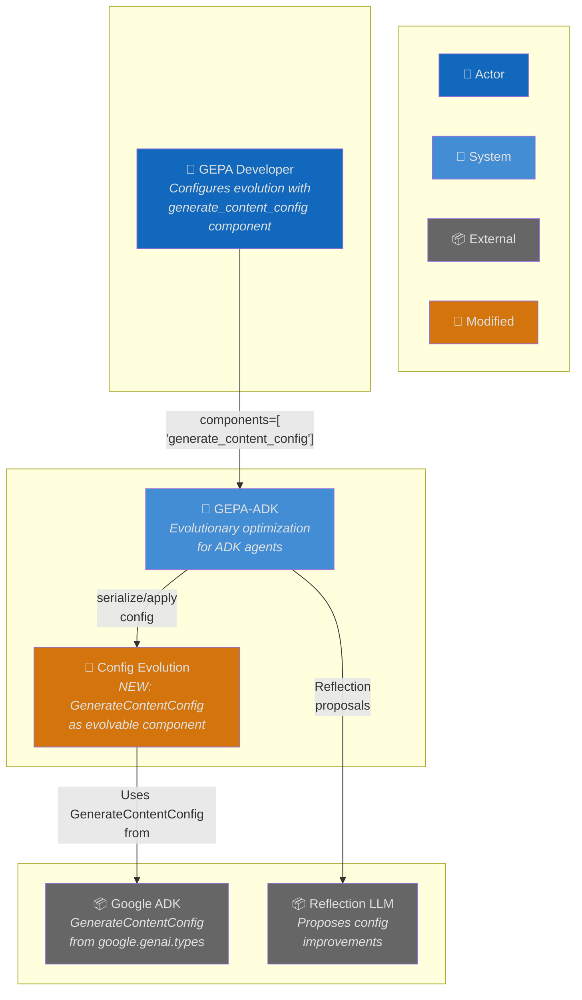
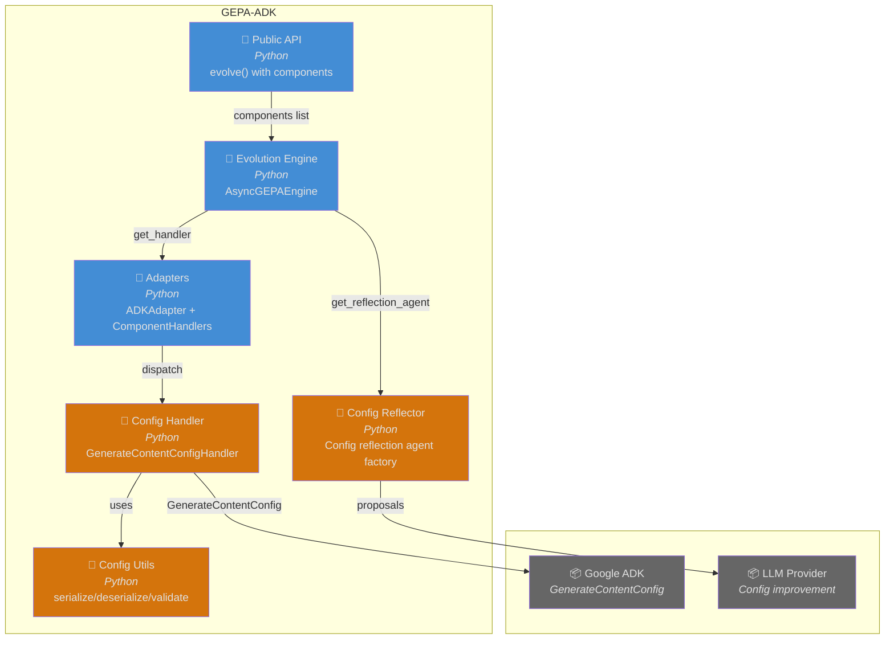
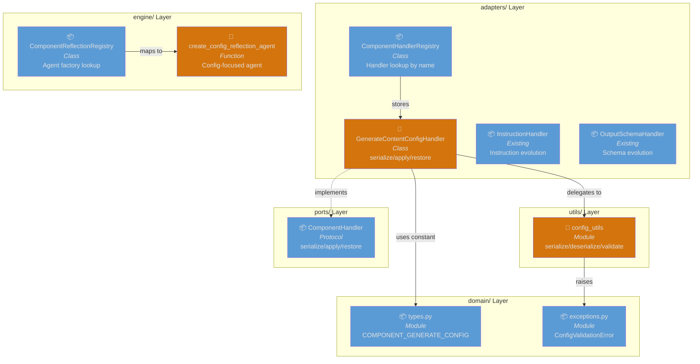
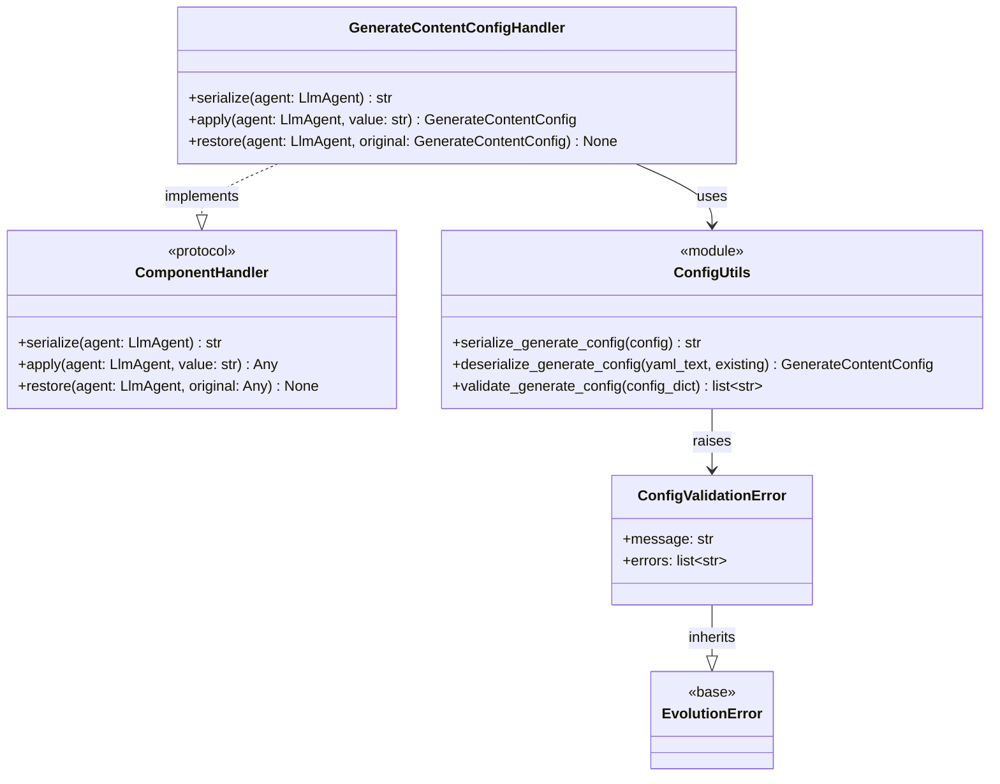
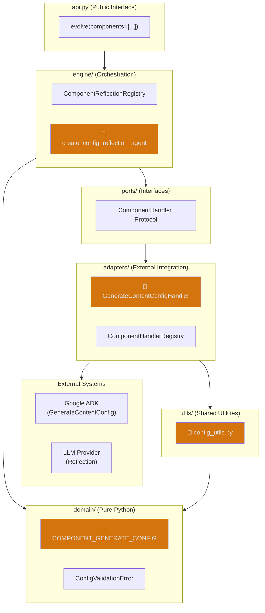
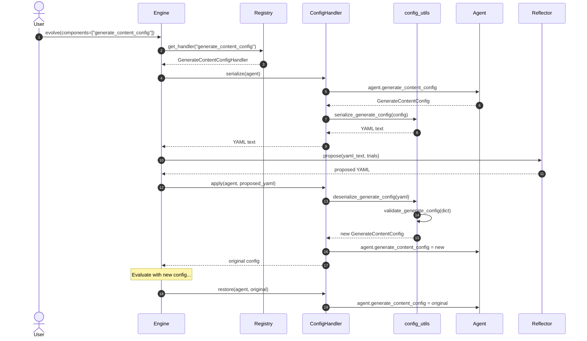
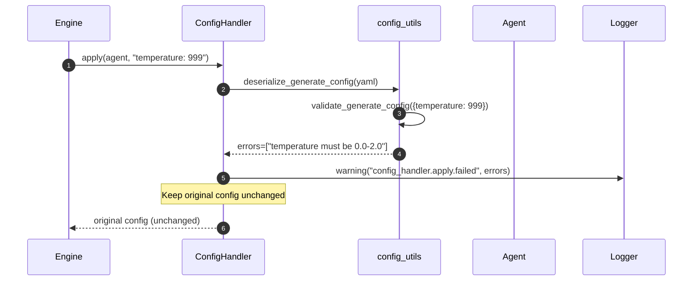
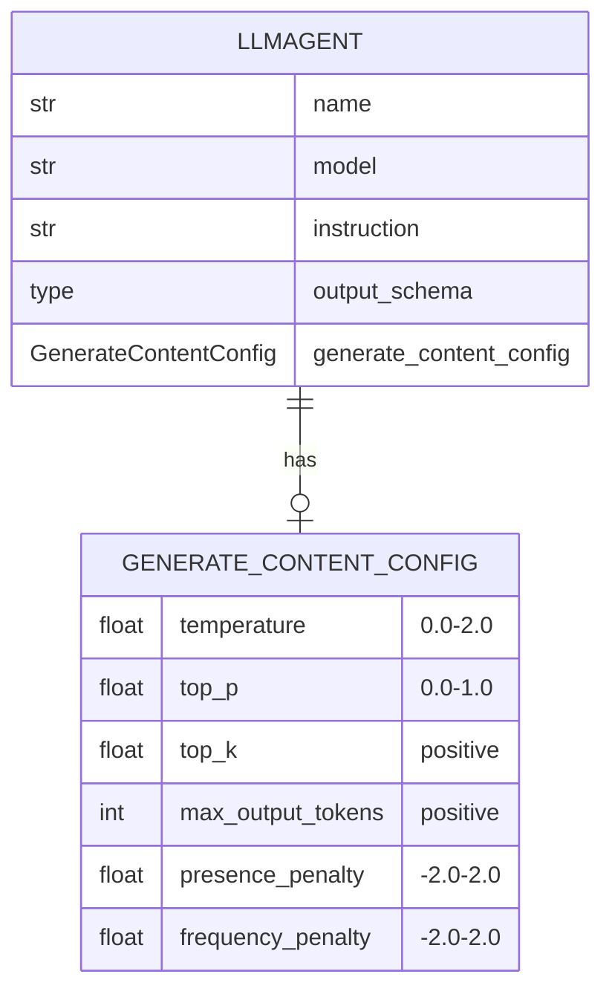

# Architecture: Generate Content Config Evolution

**Branch**: `164-config-evolution` | **Date**: 2026-01-20 | **Status**: draft
**Spec**: [./spec.md] | **Plan**: [./plan.md] | **Tasks**: [./tasks.md]

## 0. Links & References

- Feature Spec: `./spec.md`
- Implementation Plan: `./plan.md`
- Tasks: `./tasks.md`
- Related ADRs: ADR-000 (Hexagonal), ADR-002 (Protocols), ADR-005 (Testing), ADR-006 (External Libs), ADR-008 (Logging)
- PRs: [link when available]

## 1. Purpose & Scope

### Goal

Enable automatic optimization of LLM generation parameters (temperature, top_p, top_k, max_output_tokens) alongside other agent components during GEPA evolution. This extends the ComponentHandler pattern to support `generate_content_config` as an evolvable component.

### Non-Goals

- Evolving `safety_settings` as a separate component
- Model-specific parameter validation
- Automatic parameter constraint discovery
- UI/visualization for config evolution

### Scope Boundaries

- **In-scope**:
  - GenerateContentConfigHandler implementation
  - Config serialization/deserialization utilities
  - Validation for known parameter constraints
  - Config reflection agent factory
  - Three-layer tests
- **Out-of-scope**:
  - Changes to core evolution loop
  - New dependencies (uses existing PyYAML, structlog)

### Constraints

- **Technical**: Must follow ComponentHandler protocol exactly; YAML serialization for LLM readability
- **Organizational**: Must comply with hexagonal architecture (handler in adapters/, utilities in utils/)
- **Conventions**: Follow existing InstructionHandler/OutputSchemaHandler patterns

## 2. Architecture at a Glance

- **Handler Pattern**: `GenerateContentConfigHandler` implements the `ComponentHandler` protocol with serialize/apply/restore methods
- **Layers Affected**: domain/ (constant), utils/ (new config_utils), adapters/ (handler), engine/ (reflection agent)
- **Integration**: Registered in `ComponentHandlerRegistry` at module load; automatic dispatch via `_apply_candidate()`
- **Data Flow**: Config → YAML serialize → reflection agent → proposed YAML → validate → apply to agent
- **Error Handling**: Graceful degradation - invalid configs keep original, warning logged

## 3. Context Diagram (C4 Level 1)

> Shows how config evolution fits into the broader GEPA system.

## 4. Container Diagram (C4 Level 2)

> Shows the containers involved in config evolution.

## 5. Component Diagram (C4 Level 3)

> Shows the internal components for config evolution.

## 6. Code Diagram (C4 Level 4)

> Class relationships for the config handler implementation.

## 7. Hexagonal Architecture View

> Shows how config evolution aligns with the hexagonal architecture.

## 8. Runtime Behavior (Sequence Diagrams)

### 8.1 Happy Path: Config Evolution Cycle

### 8.2 Error Case: Invalid Config Rejected

## 9. Data Model & Contracts

### 9.1 Data Changes

> No persistent data changes - config is in-memory on LlmAgent.

### 9.2 API Contracts

**No Public API Changes** - Uses existing `evolve()` with components parameter.

**New Internal Components**:
- `COMPONENT_GENERATE_CONFIG = "generate_content_config"` in domain/types.py
- `GenerateContentConfigHandler` class in adapters/component_handlers.py
- `config_utils` module in utils/

## 10. Deployment / Infrastructure View

> No infrastructure changes - this is a library feature.

## 11. Quality Attributes (NFRs)

| Attribute | Requirement | Verification |
|-----------|-------------|--------------|
| **Performance** | <1ms for serialize/apply/restore | Unit tests with timing |
| **Reliability** | Graceful degradation on invalid input | Error handling tests |
| **Security** | No secrets in serialized config | Code review |
| **Maintainability** | Hexagonal architecture compliance | Layer import checks |
| **Observability** | Structured logging with context | Log format verification |

## 12. Testing Strategy

| Layer | Location | What to Test | Markers |
|-------|----------|--------------|---------|
| **Contract** | `tests/contracts/` | Handler protocol compliance | `@pytest.mark.contract` |
| **Unit** | `tests/unit/adapters/` | Handler serialize/apply/restore | `@pytest.mark.unit` |
| **Unit** | `tests/unit/utils/` | Config utils functions | `@pytest.mark.unit` |
| **Integration** | `tests/integration/` | Full evolution with config component | `@pytest.mark.integration` |

**Key Test Scenarios**:
1. Handler serialize/apply/restore round-trip
2. Validation rejects out-of-range parameters
3. Partial config merges with existing
4. None/empty config handling
5. Full evolution loop with config component

## 13. Risks & Open Questions

### Risks

| Risk | Impact | Mitigation |
|------|--------|------------|
| ADK GenerateContentConfig changes | Handler breaks | Pin ADK version, test in CI |
| YAML parsing edge cases | Invalid proposals | Comprehensive validation tests |

### Open Questions

- [x] YAML vs JSON format → YAML chosen for LLM readability
- [x] Which params to evolve → Core generation params only

### TODOs

- [x] Implementation in tasks.md
- [ ] Example script `config_evolution_demo.py`
- [ ] Update docs/guides

## 14. Decisions (ADR References)

| ADR | Title | Relevance to This Feature |
|-----|-------|---------------------------|
| ADR-000 | Hexagonal Architecture | Handler in adapters/, utils in utils/, constant in domain/ |
| ADR-002 | Protocol Interfaces | Implements ComponentHandler protocol |
| ADR-005 | Three-Layer Testing | Contract + unit + integration tests required |
| ADR-006 | External Library Integration | ADK types imported only in adapters/ |
| ADR-008 | Structured Logging | All handler operations logged with structlog |

**New ADRs Needed**: None - follows existing patterns.
