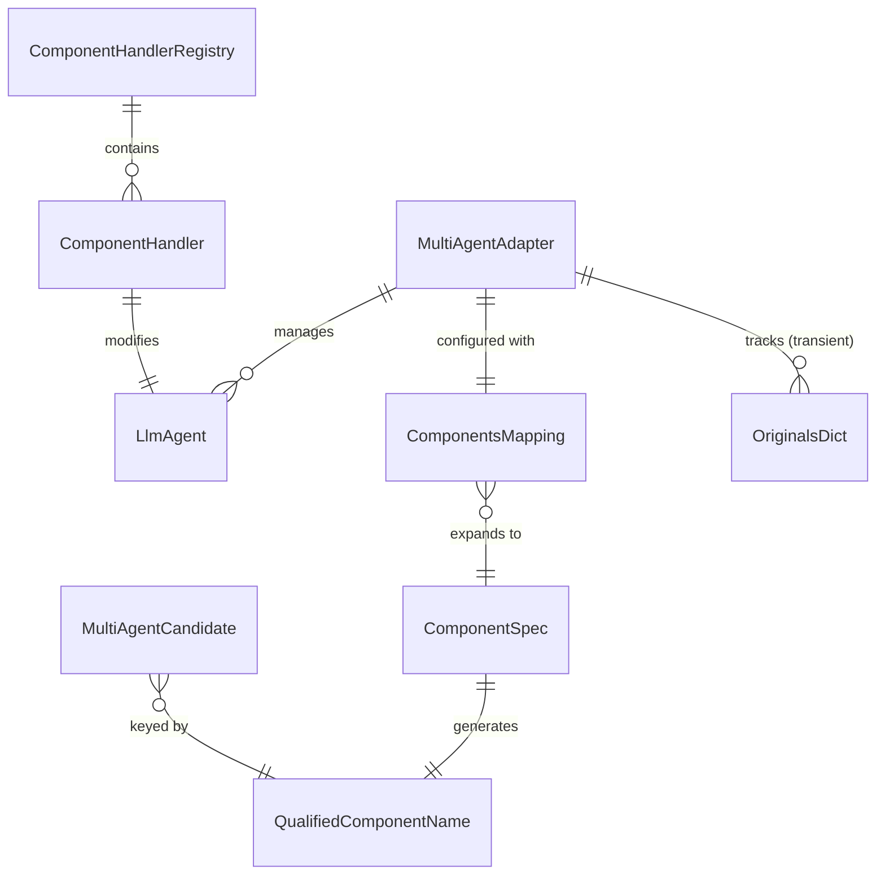
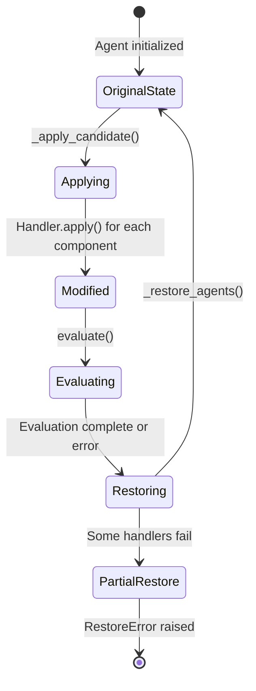
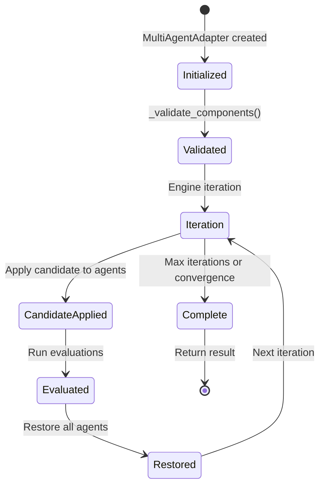

# Data Model: Multi-Agent Component Routing

**Feature**: 166-multi-agent-routing
**Date**: 2026-01-20

## Entities

### QualifiedComponentName (Existing)

**Location**: `src/gepa_adk/domain/types.py`

A type-safe string identifier combining agent name and component name.

| Attribute | Type | Description |
|-----------|------|-------------|
| (value) | `str` | Format: `{agent_name}.{component_name}` |

**Format Rules**:
- Agent name: Valid Python identifier (alphanumeric + underscore, no leading digit)
- Component name: One of registered handler names
- Separator: Single dot (`.`)

**Examples**:
- `generator.instruction`
- `critic.output_schema`
- `refiner.generate_content_config`

### ComponentSpec (Existing)

**Location**: `src/gepa_adk/domain/types.py`

A structured representation for constructing and parsing qualified names.

| Attribute | Type | Description |
|-----------|------|-------------|
| agent | `str` | Agent name |
| component | `str` | Component name |

**Methods**:
| Method | Returns | Description |
|--------|---------|-------------|
| `qualified` | `QualifiedComponentName` | Property returning `{agent}.{component}` |
| `parse(qualified)` | `ComponentSpec` | Class method to parse string |

**Validation**:
- `parse()` raises `ValueError` if format invalid (missing dot or empty parts)

### ComponentsMapping (New Type Alias)

**Location**: `src/gepa_adk/domain/types.py` (to be added)

Mapping of agent names to lists of component names to evolve.

| Attribute | Type | Description |
|-----------|------|-------------|
| (key) | `str` | Agent name |
| (value) | `list[str]` | Component names for that agent |

**Type Definition**:
```python
ComponentsMapping = dict[str, list[str]]
```

**Example**:
```python
{
    "generator": ["instruction", "output_schema"],
    "refiner": ["instruction"],
    "critic": ["generate_content_config"],
}
```

**Validation Rules**:
- All agent names must exist in agents dict
- All agents in agents dict must have entries in components mapping (fail-fast)
- All component names must have registered handlers
- Empty list means agent excluded from evolution

### MultiAgentCandidate (Existing Enhancement)

**Location**: `src/gepa_adk/domain/types.py`

Enhanced to use qualified component names.

| Attribute | Type | Description |
|-----------|------|-------------|
| (key) | `QualifiedComponentName` | Qualified name (`agent.component`) |
| (value) | `str` | Component value text |

**Example**:
```python
{
    "generator.instruction": "You are a helpful assistant...",
    "generator.output_schema": "class Response(BaseModel): ...",
    "critic.generate_content_config": "temperature: 0.7\nmax_tokens: 1024",
}
```

### OriginalsDict (Internal Type)

**Location**: `src/gepa_adk/adapters/multi_agent.py`

Internal mapping for tracking original component values before modification.

| Attribute | Type | Description |
|-----------|------|-------------|
| (key) | `QualifiedComponentName` | Qualified component name |
| (value) | `Any` | Original value (type varies by handler) |

**Lifecycle**:
1. Created by `_apply_candidate()` before modifications
2. Used by `_restore_agents()` after evaluation
3. Discarded after restoration complete

### RestoreError (New Exception)

**Location**: `src/gepa_adk/domain/exceptions.py`

Exception for partial restoration failures.

| Attribute | Type | Description |
|-----------|------|-------------|
| message | `str` | Human-readable error summary |
| errors | `list[tuple[str, Exception]]` | List of (qualified_name, exception) pairs |
| cause | `Exception \| None` | Optional underlying cause |

**Hierarchy**:
```
EvolutionError
└── AdapterError
    └── RestoreError
```

## Relationships



## State Transitions

### Candidate Application Flow



### Evolution Run Lifecycle



## Validation Rules

### Initialization Validation

| Rule | Error | Recovery |
|------|-------|----------|
| Agent name in components not in agents dict | `ValueError` with available agents | Fix components mapping |
| Agent in agents dict missing from components | `ValueError` listing missing agents | Add agent to components mapping |
| Component name has no handler | `ValueError` with available handlers | Register handler or fix mapping |
| Empty agents dict | `ValueError` | Provide at least one agent |

### Runtime Validation

| Rule | Error | Recovery |
|------|-------|----------|
| Qualified name format invalid | `ValueError` from ComponentSpec.parse() | Check candidate generation |
| Handler apply fails | Propagate handler exception | Fix agent state or handler |
| Handler restore fails | Aggregate into RestoreError | Manual state reset required |
