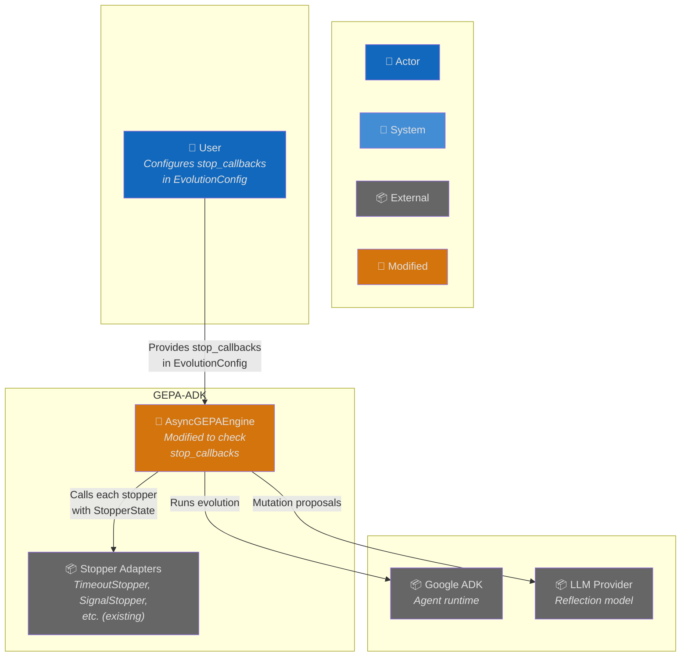
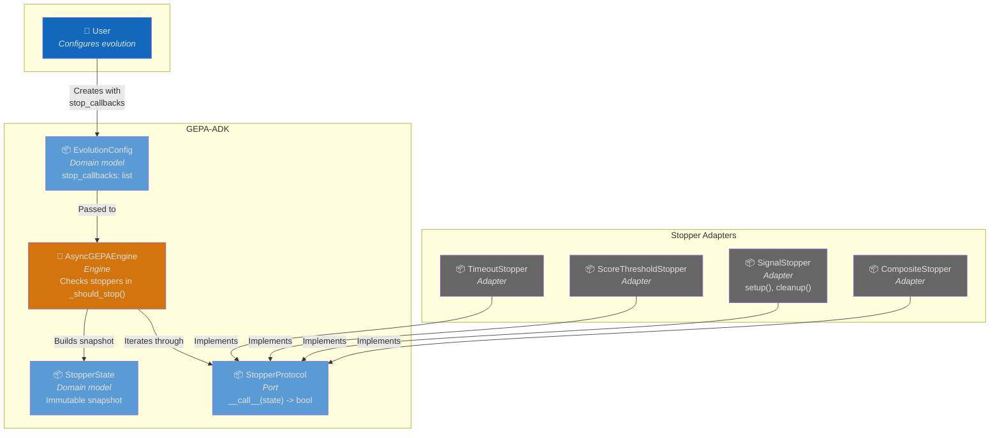
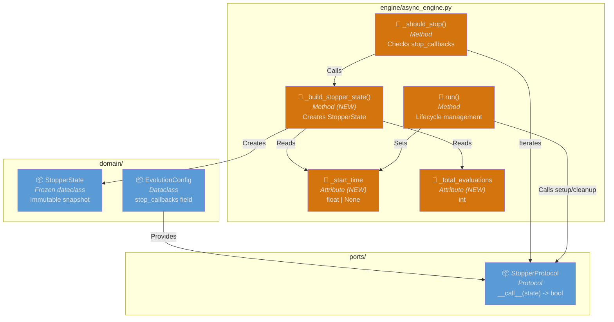
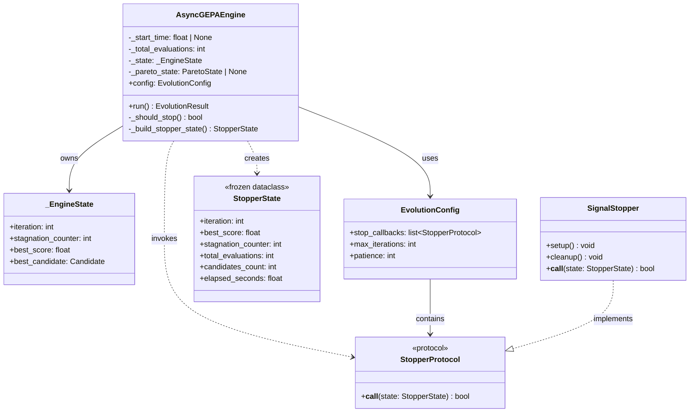
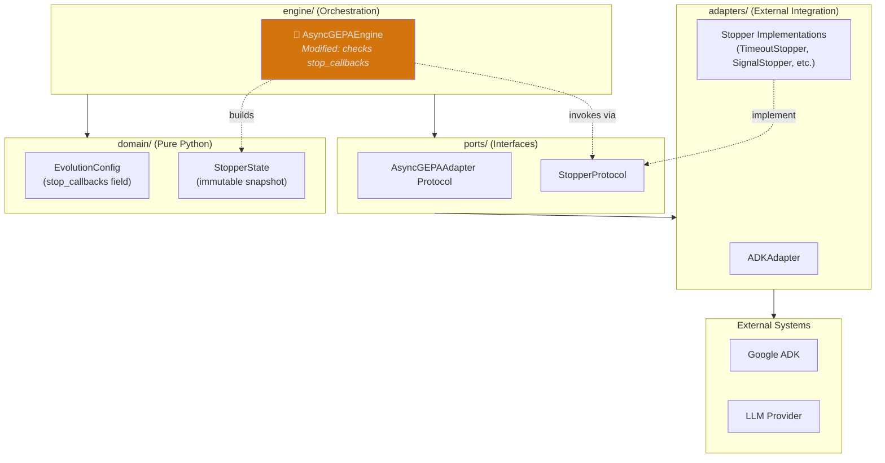
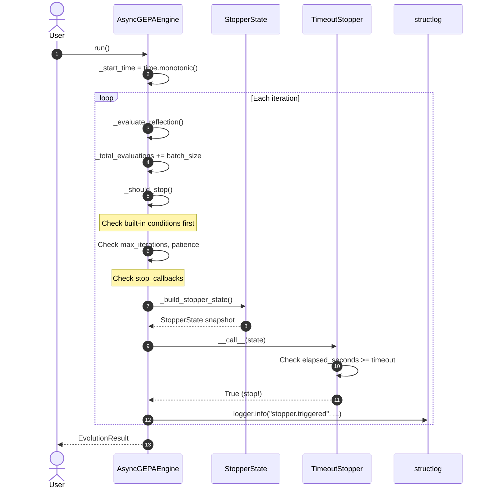
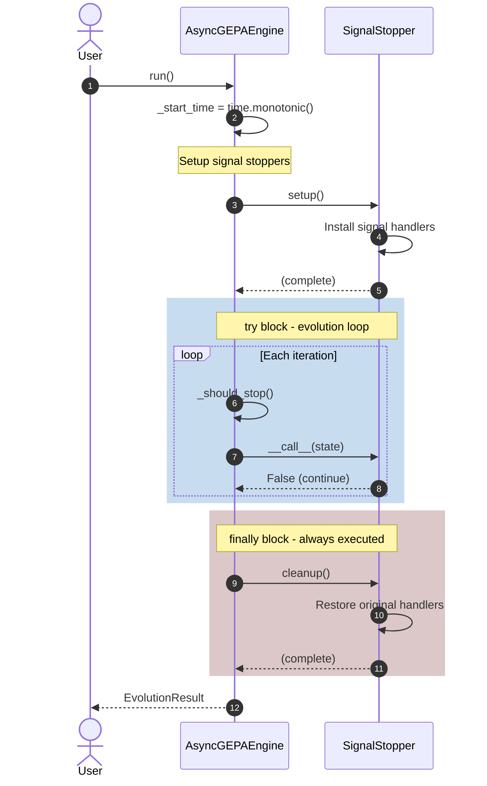
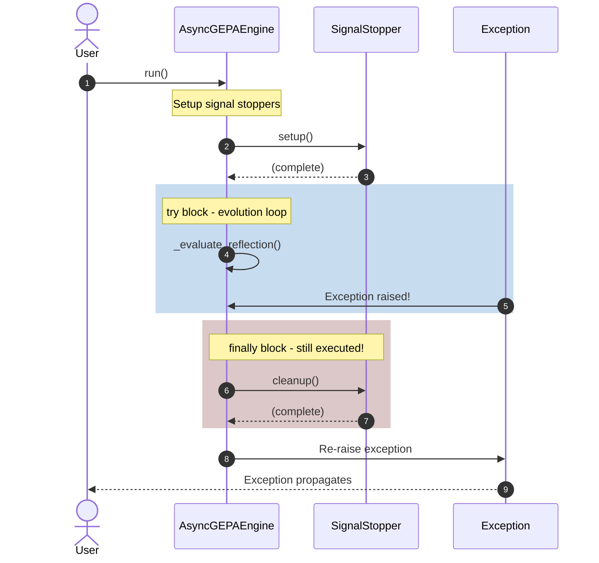

# Architecture: Wire stop_callbacks into AsyncGEPAEngine

**Branch**: `196-stopper-engine-integration` | **Date**: 2026-01-22 | **Status**: draft
**Spec**: [./spec.md](./spec.md) | **Plan**: [./plan.md](./plan.md) | **Tasks**: ./tasks.md (pending)

## 0. Links & References

- Feature Spec: `./spec.md`
- Implementation Plan: `./plan.md`
- Tasks: `./tasks.md` (generated by `/speckit.tasks`)
- Related ADRs:
  - ADR-000: Hexagonal Architecture
  - ADR-001: Async-First Architecture
  - ADR-002: Protocol for Interfaces
  - ADR-005: Three-Layer Testing
  - ADR-008: Structured Logging
- Parent Issue: #51 - Pluggable stop conditions

## 1. Purpose & Scope

### Goal

Enable users to configure custom stop conditions via `stop_callbacks` in `EvolutionConfig` that are actively checked during evolution. This is the final integration step that makes the stopper system functional.

### Non-Goals

- Creating new stopper implementations (already complete)
- Modifying the StopperProtocol or StopperState (already finalized)
- Adding persistence for stopper state
- Async stopper support (stoppers are sync callables by design)

### Scope Boundaries

- **In-scope**:
  - Add `_start_time` and `_total_evaluations` tracking to engine
  - Create `_build_stopper_state()` method for snapshot creation
  - Extend `_should_stop()` to invoke stop_callbacks
  - Add lifecycle management (setup/cleanup) in `run()` method
  - Log stopper trigger events with structlog
  - Create unit and integration tests

- **Out-of-scope**:
  - Changes to existing stopper implementations
  - Changes to EvolutionConfig schema (stop_callbacks field exists)
  - UI/CLI changes for stopper configuration

### Constraints

- **Technical**: No new dependencies; must use `time.monotonic()` for elapsed time tracking
- **Organizational**: Must follow hexagonal architecture - engine depends only on ports/domain, not adapters
- **Conventions**: Built-in conditions (max_iterations, patience) checked before custom stoppers

## 2. Architecture at a Glance

- Engine adds internal state tracking: `_start_time` (float) and `_total_evaluations` (int)
- New `_build_stopper_state()` method creates immutable `StopperState` snapshots from engine state
- `_should_stop()` extended to iterate through `stop_callbacks` after built-in conditions
- Lifecycle management added to `run()` with try/finally for SignalStopper setup/cleanup
- Structured logging emits `stopper.triggered` event when any stopper returns True
- No changes to public API - only internal engine behavior modified

## 3. Context Diagram (C4 Level 1)

> Shows how stoppers fit into the broader GEPA-ADK system.

## 4. Container Diagram (C4 Level 2)

> Shows the engine's relationship with stopper components.

## 5. Component Diagram (C4 Level 3)

> Shows internal components involved in stopper checking.

## 6. Code Diagram (C4 Level 4)

> Class relationships for stopper integration.

## 7. Hexagonal Architecture View

> Shows alignment with hexagonal architecture layers.

## 8. Runtime Behavior (Sequence Diagrams)

### 8.1 Happy Path: Stopper Triggered

### 8.2 Happy Path: SignalStopper Lifecycle

### 8.3 Error Case: Cleanup on Exception

## 9. Data Model & Contracts

### 9.1 Data Changes

No persistent data changes. Engine adds internal attributes:

| Attribute | Type | Default | Purpose |
|-----------|------|---------|---------|
| `_start_time` | `float \| None` | `None` | Monotonic timestamp for elapsed_seconds |
| `_total_evaluations` | `int` | `0` | Cumulative evaluation count |

### 9.2 API Contracts

**Public API Changes**: None - internal engine behavior only.

**Internal Changes to AsyncGEPAEngine**:
- `_should_stop()` - Extended to check stop_callbacks
- `_build_stopper_state()` - New method (private)
- `run()` - Extended with lifecycle management (setup/cleanup)

## 10. Deployment / Infrastructure View

> Not applicable - this is internal library code, no infrastructure changes.

## 11. Quality Attributes (NFRs)

| Attribute | Requirement | Verification |
|-----------|-------------|--------------|
| **Performance** | Stopper checking adds < 1ms overhead per iteration | Unit tests with timing |
| **Reliability** | cleanup() always called even on exception | Integration test with exception |
| **Backward Compat** | Empty stop_callbacks = identical behavior | Unit test with no stoppers |
| **Observability** | Stopper triggers logged with class name + iteration | Log verification in tests |
| **Maintainability** | No adapter imports in engine layer | Static analysis (import check) |

## 12. Testing Strategy

| Layer | Location | What to Test | Markers |
|-------|----------|--------------|---------|
| **Unit** | `tests/unit/engine/` | _should_stop() logic with mock stoppers | `@pytest.mark.unit` |
| **Integration** | `tests/integration/` | Real stoppers in evolution loop | `@pytest.mark.integration` |

**Key Test Scenarios**:

1. **Stopper invocation**: Mock stopper verifies it's called each iteration with valid StopperState
2. **Short-circuit on True**: Stopper returning True stops evolution immediately
3. **Elapsed time accuracy**: TimeoutStopper triggers when expected (within 50ms tolerance)
4. **Evaluation count accuracy**: total_evaluations matches sum of batch sizes
5. **Lifecycle management**: setup() called before loop, cleanup() called after (even on exception)
6. **Empty stop_callbacks**: No stopper calls when list is empty
7. **Logging**: Verify "stopper.triggered" event emitted

## 13. Risks & Open Questions

### Risks

| Risk | Impact | Mitigation |
|------|--------|------------|
| Stopper raises exception | Evolution could crash | Log error and continue (graceful degradation) |
| SignalStopper cleanup fails | Signal handlers leak | Log error, continue cleanup for other stoppers |
| Performance regression | Evolution slows down | Benchmark before/after; early exit on built-in conditions |

### Open Questions

All questions resolved during research phase.

### TODOs

- [ ] Create unit tests in `tests/unit/engine/test_stopper_integration.py`
- [ ] Create integration tests in `tests/integration/test_stopper_integration.py`
- [ ] Document exception handling strategy for stopper errors

## 14. Decisions (ADR References)

| ADR | Title | Relevance to This Feature |
|-----|-------|---------------------------|
| ADR-000 | Hexagonal Architecture | Engine imports only ports/domain, not adapter stoppers |
| ADR-001 | Async-First | Stoppers are sync (pure functions), no async bridging needed |
| ADR-002 | Protocol Interfaces | Uses existing StopperProtocol from ports |
| ADR-005 | Three-Layer Testing | Unit + integration tests required |
| ADR-008 | Structured Logging | Log stopper triggers with structlog |

**New ADRs Needed**: None - existing architecture fully supports this feature.
