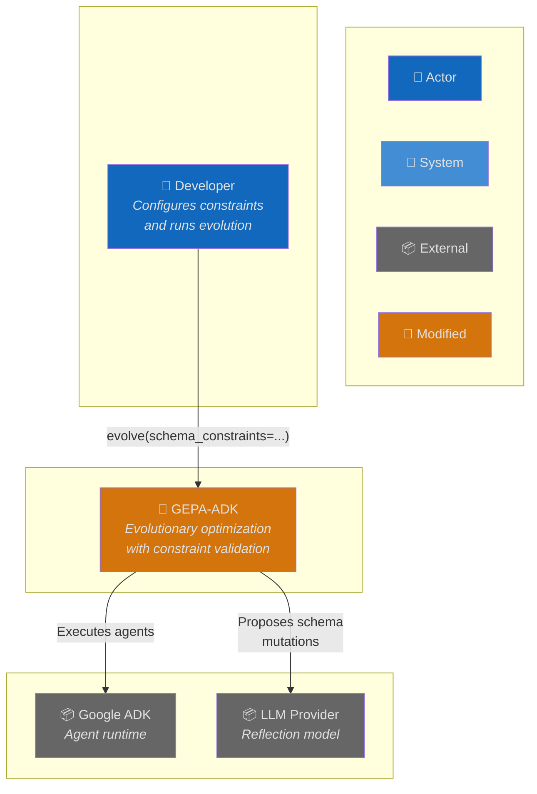
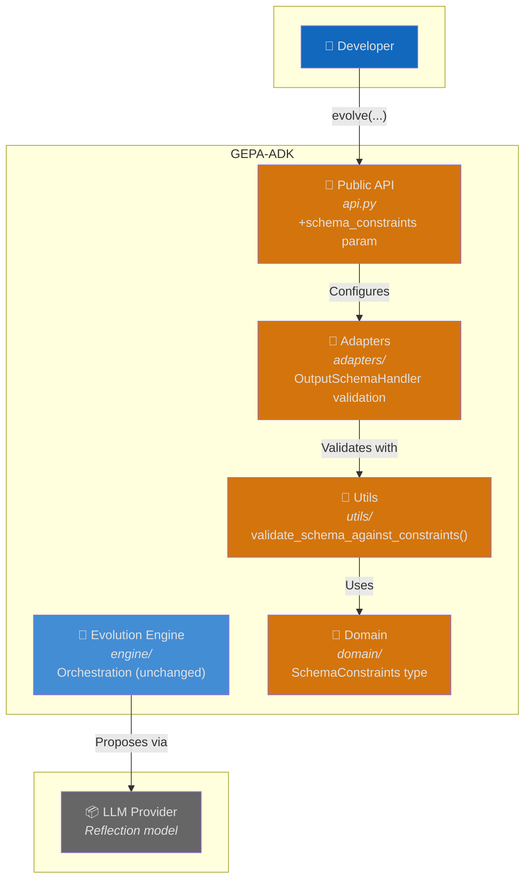
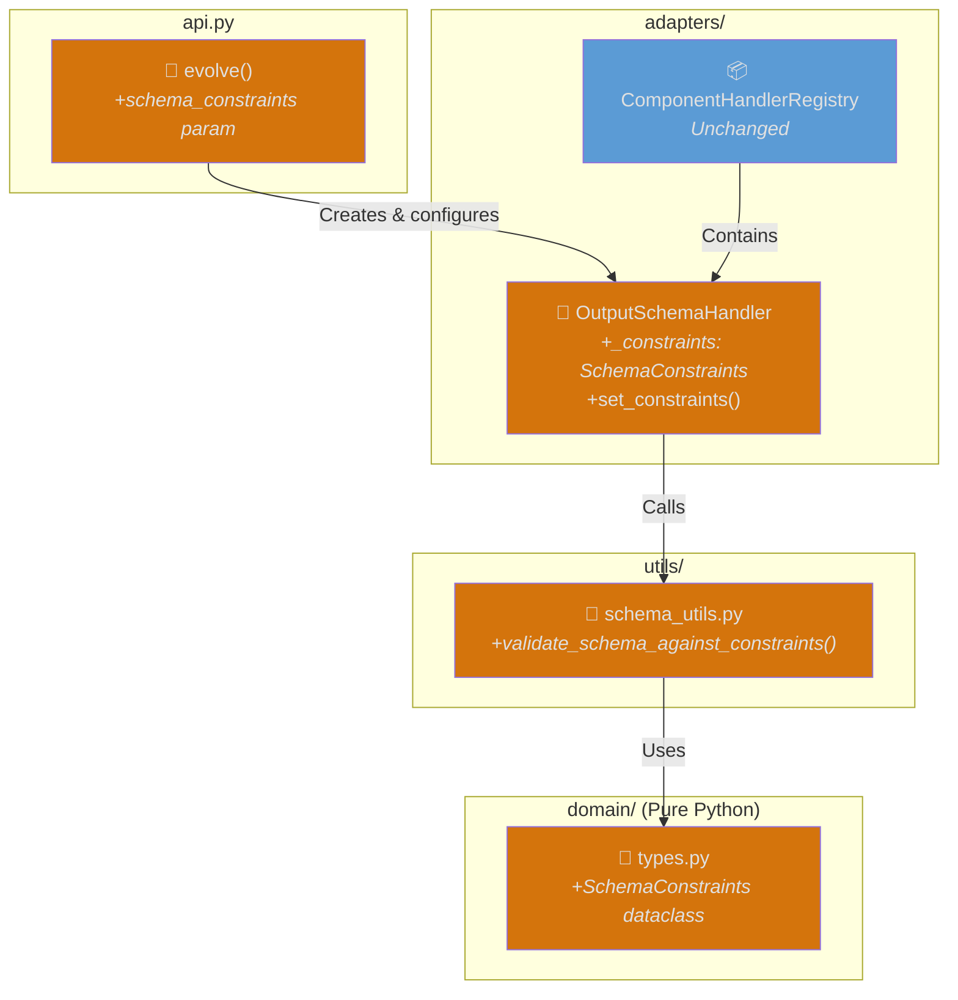
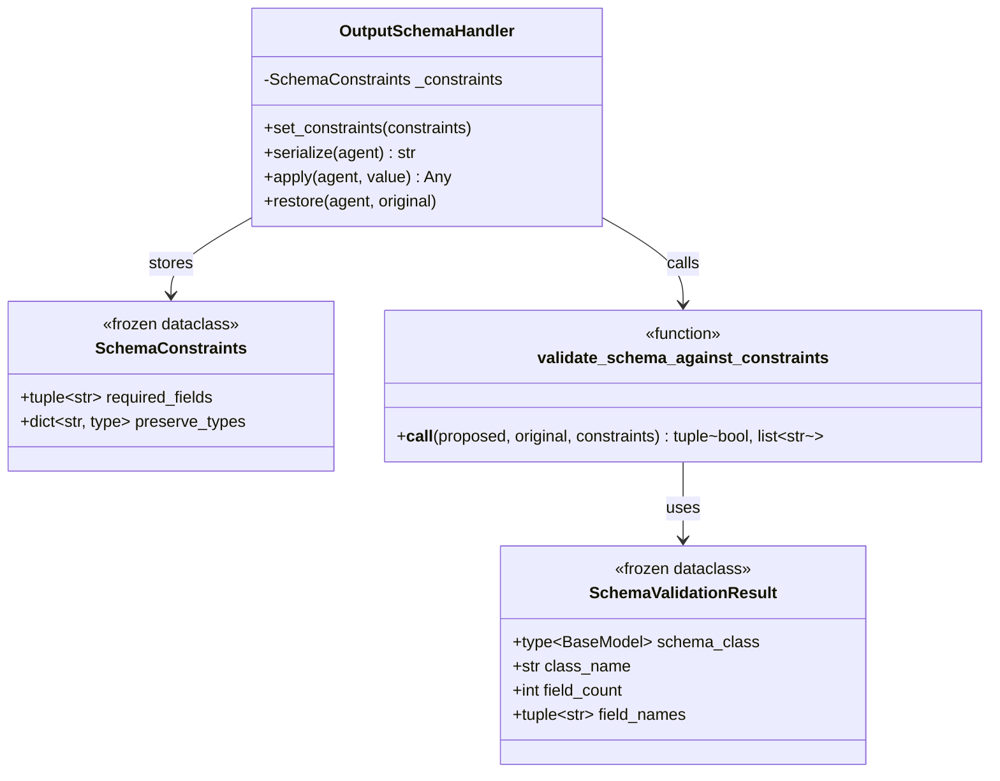
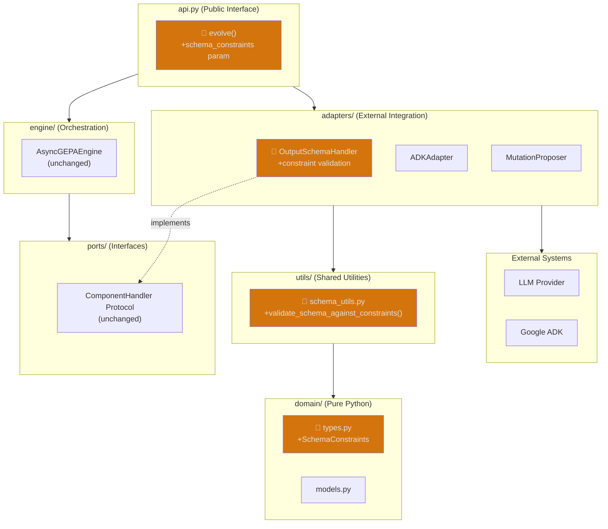
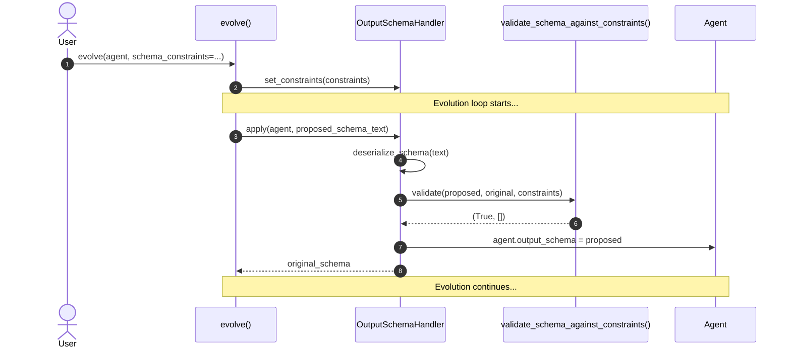
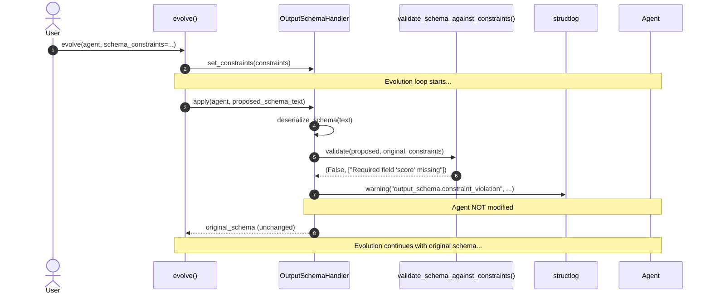
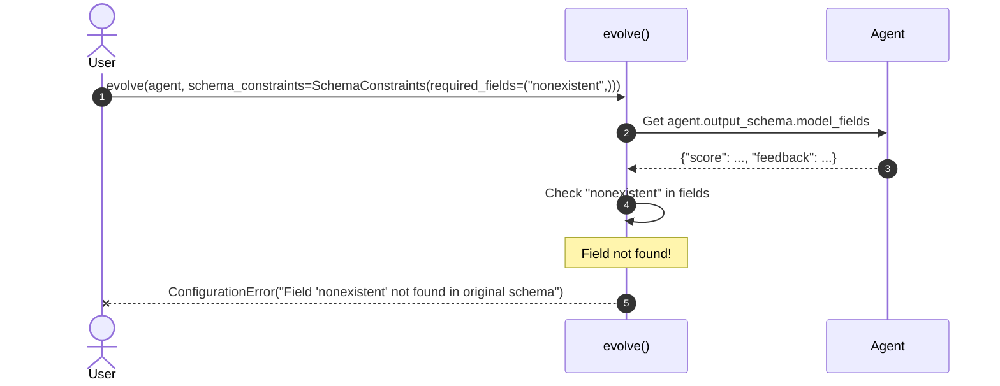
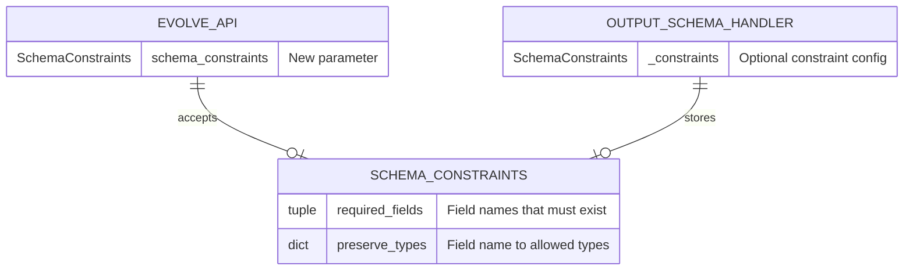

# Architecture: Required Field Preservation for Output Schema Evolution

**Branch**: `198-schema-field-preservation` | **Date**: 2026-01-22 | **Status**: draft
**Spec**: [./spec.md](./spec.md) | **Plan**: [./plan.md](./plan.md) | **Tasks**: ./tasks.md (pending)

## 0. Links & References

- Feature Spec: `./spec.md`
- Implementation Plan: `./plan.md`
- Tasks: `./tasks.md` (to be generated with `/speckit.tasks`)
- Related ADRs: ADR-000 (Hexagonal Architecture), ADR-002 (Protocol Interfaces), ADR-005 (Three-Layer Testing)
- PRs: [link when available]

## 1. Purpose & Scope

### Goal

Enable users to protect critical fields in `output_schema` during evolution. When the reflection agent proposes schema mutations, the system validates against user-specified constraints and rejects invalid mutations, preserving schema integrity.

### Non-Goals

- Automatic detection of critical fields (user must explicitly specify)
- Persisting constraint configurations across runs
- Modifying reflection agent prompts to be aware of constraints
- GUI or interactive constraint configuration

### Scope Boundaries

- **In-scope**: Required field validation, type preservation, configuration-time validation, backward compatibility
- **Out-of-scope**: Field bounds/constraints preservation (P3 - future), constraint-aware reflection prompts

### Constraints

- **Technical**: Python 3.12+, no new dependencies, validation < 1ms
- **Organizational**: Must follow hexagonal architecture (ADR-000), protocol-based interfaces (ADR-002)
- **Conventions**: Frozen dataclasses for domain types, structured logging for rejections

## 2. Architecture at a Glance

- **New domain type**: `SchemaConstraints` dataclass in `domain/types.py` for constraint configuration
- **Validation utility**: `validate_schema_against_constraints()` in `utils/schema_utils.py`
- **Handler enhancement**: `OutputSchemaHandler` gains constraint checking in `apply()`
- **API threading**: `evolve()` accepts `schema_constraints` parameter, configures handler before evolution
- **Backward compatible**: No constraints = current behavior unchanged

## 3. Context Diagram (C4 Level 1)

> Shows how schema constraints fit into the broader evolution system.

## 4. Container Diagram (C4 Level 2)

> Shows the containers affected by this feature.

## 5. Component Diagram (C4 Level 3)

> Shows the internal components affected by this feature.

## 6. Code Diagram (C4 Level 4)

> Shows the class structure for constraint validation.

## 7. Hexagonal Architecture View

> Shows how this feature aligns with the hexagonal architecture.

## 8. Runtime Behavior (Sequence Diagrams)

### 8.1 Happy Path: Valid Mutation Accepted

### 8.2 Error Path: Invalid Mutation Rejected

### 8.3 Configuration Validation: Fail Fast

## 9. Data Model & Contracts

### 9.1 Data Changes

### 9.2 API Contracts

**Public API Changes**:
- `evolve(schema_constraints: SchemaConstraints | None = None)` — New optional parameter

**Internal Changes**:
- `OutputSchemaHandler.set_constraints(constraints: SchemaConstraints | None)` — New method
- `validate_schema_against_constraints(proposed, original, constraints)` — New utility function

## 10. Quality Attributes (NFRs)

| Attribute | Requirement | Verification |
|-----------|-------------|--------------|
| **Performance** | Validation < 1ms per mutation | Unit test with timing assertions |
| **Reliability** | Graceful rejection (never crash) | Unit tests for all edge cases |
| **Maintainability** | Hexagonal architecture compliance | Layer import rules enforced |
| **Observability** | Structured logging for rejections | Log format verification |
| **Backward Compat** | No constraints = unchanged behavior | Integration tests |

## 11. Testing Strategy

| Layer | Location | What to Test | Markers |
|-------|----------|--------------|---------|
| **Contract** | `tests/contracts/test_schema_constraints_contract.py` | SchemaConstraints immutability, validation protocol | `@pytest.mark.contract` |
| **Unit** | `tests/unit/domain/test_schema_constraints.py` | Dataclass behavior | `@pytest.mark.unit` |
| **Unit** | `tests/unit/utils/test_schema_constraint_validation.py` | Validation logic | `@pytest.mark.unit` |
| **Unit** | `tests/unit/adapters/test_output_schema_handler_constraints.py` | Handler integration | `@pytest.mark.unit` |
| **Integration** | `tests/integration/test_schema_constrained_evolution.py` | End-to-end with real ADK | `@pytest.mark.integration` |

**Key Test Scenarios**:
1. Required field present → mutation accepted
2. Required field missing → mutation rejected, original preserved
3. Type matches → mutation accepted
4. Type mismatch → mutation rejected
5. No constraints → all mutations accepted (backward compat)
6. Invalid constraint config → fail fast with ConfigurationError

## 12. Risks & Open Questions

### Risks

| Risk | Impact | Mitigation |
|------|--------|------------|
| Handler state leaks between runs | Constraints from one run affect next | Reset constraints after evolution completes |
| Type extraction fails for complex types | Validation incorrectly rejects | Test with Optional, Union, List types |

### Open Questions

- [x] Where to validate constraints at config time? → In `evolve()` before handler setup
- [x] Log level for rejections? → WARNING (not ERROR)

## 13. Decisions (ADR References)

| ADR | Title | Relevance to This Feature |
|-----|-------|---------------------------|
| ADR-000 | Hexagonal Architecture | SchemaConstraints in domain/, validation in utils/, handler in adapters/ |
| ADR-002 | Protocol Interfaces | ComponentHandler protocol unchanged; validation is internal |
| ADR-005 | Three-Layer Testing | Contract + Unit + Integration tests required |

**New ADRs Needed**: None - this feature follows existing patterns.
