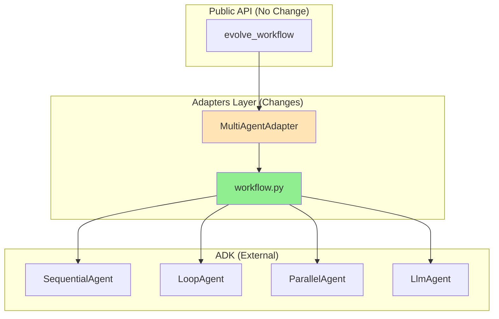
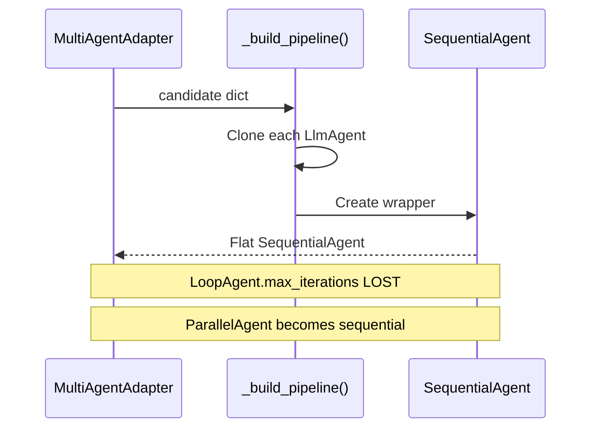
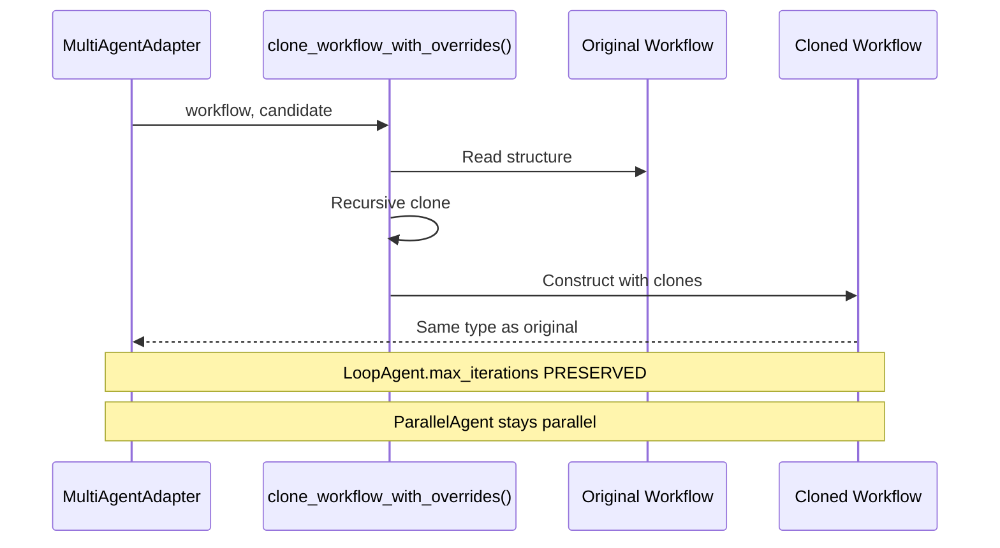
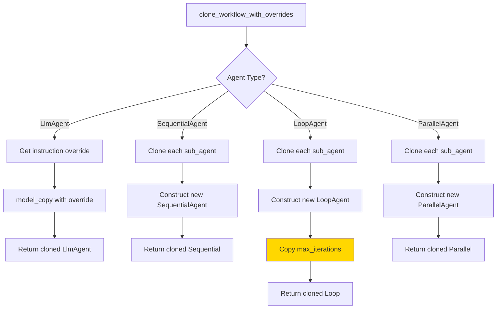
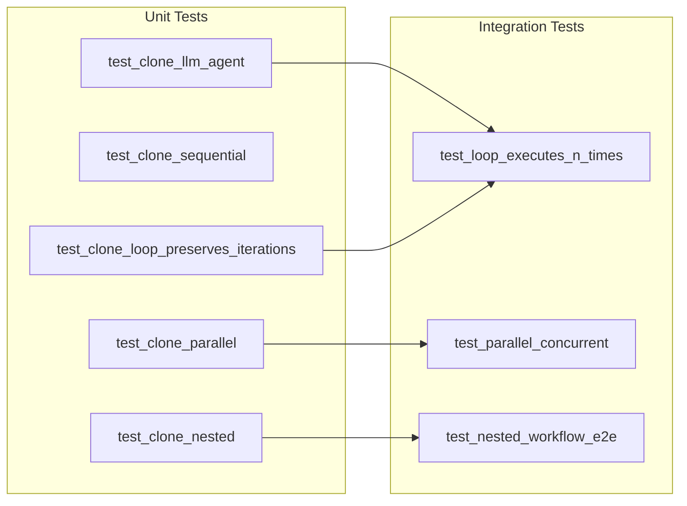

# Architecture: Execute Workflows As-Is (Preserve Structure)

**Feature**: 215-workflow-structure
**Date**: 2026-01-22

> **Scope**: This is a focused refactor within the adapters layer. Full C4 diagrams are not warranted; this document captures the key architectural change.

## 1. Purpose

Replace the flattening behavior in `_build_pipeline()` with structure-preserving recursive cloning to enable proper execution of LoopAgent, ParallelAgent, and nested workflows.

## 2. Affected Components

**Legend**:
- Green: New function added
- Orange: Existing code modified

## 3. Key Change: Cloning Flow

### Before (Flattening)

### After (Structure Preservation)

## 4. Recursive Cloning Algorithm

**Note**: Yellow highlights the critical preservation of `max_iterations`.

## 5. Integration Points

| Component | File | Change Type |
|-----------|------|-------------|
| `clone_workflow_with_overrides()` | `adapters/workflow.py` | New function |
| `MultiAgentAdapter.__init__` | `adapters/multi_agent.py` | Store original workflow |
| `MultiAgentAdapter._build_pipeline` | `adapters/multi_agent.py` | Call cloning function |
| `MultiAgentAdapter._extract_primary_output` | `adapters/multi_agent.py` | Handle loop outputs |

## 6. Testing Strategy

## 7. Risks and Mitigations

| Risk | Impact | Mitigation |
|------|--------|------------|
| Breaking existing tests | Medium | Run full test suite, update assertions |
| Performance regression | Low | Recursive cloning is O(n) where n = agents |
| ADK compatibility | Low | Using standard model_copy() pattern |
| Deep nesting stack overflow | Very Low | Respect existing max_depth limit |
