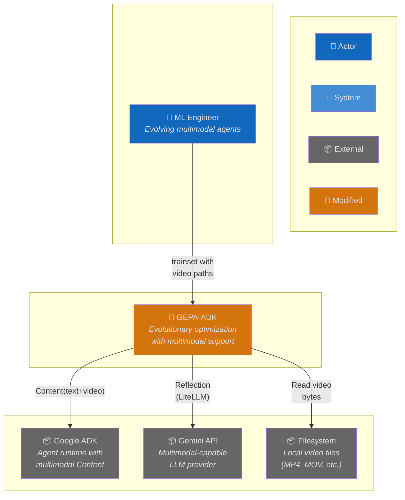
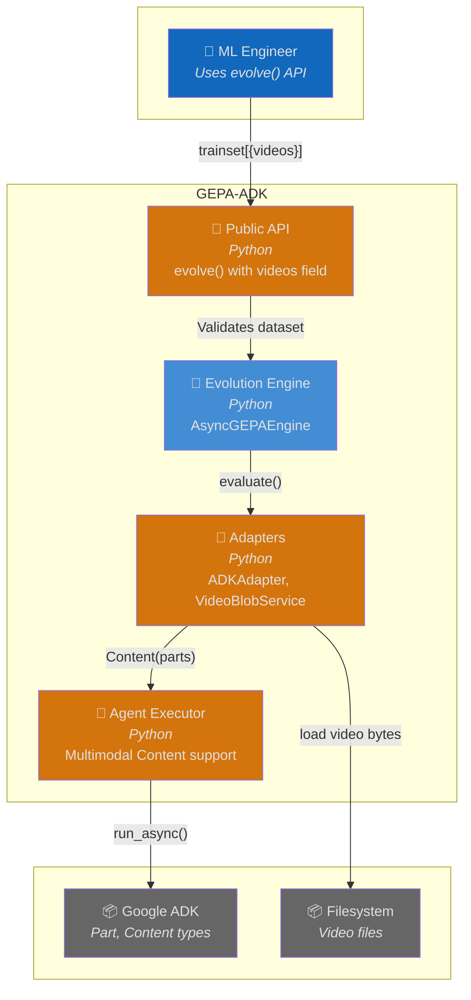
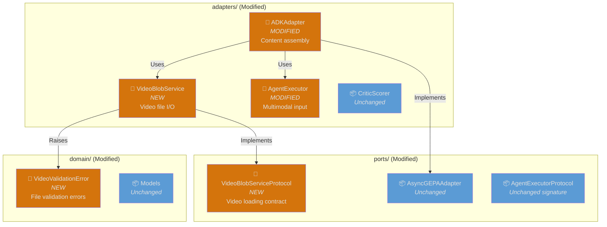
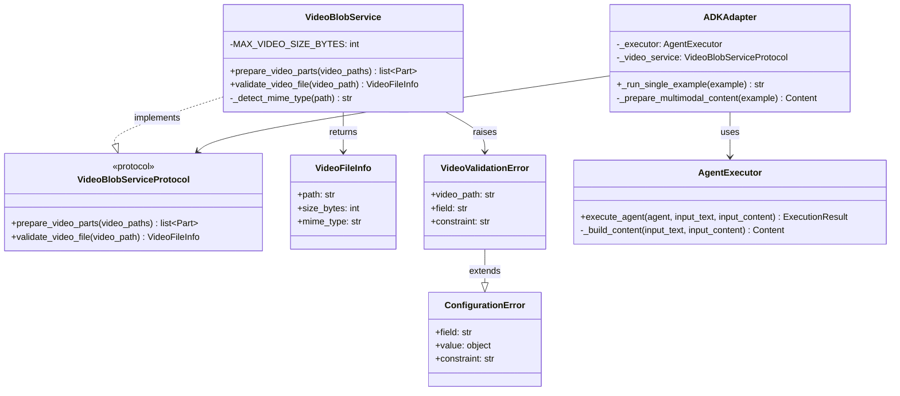
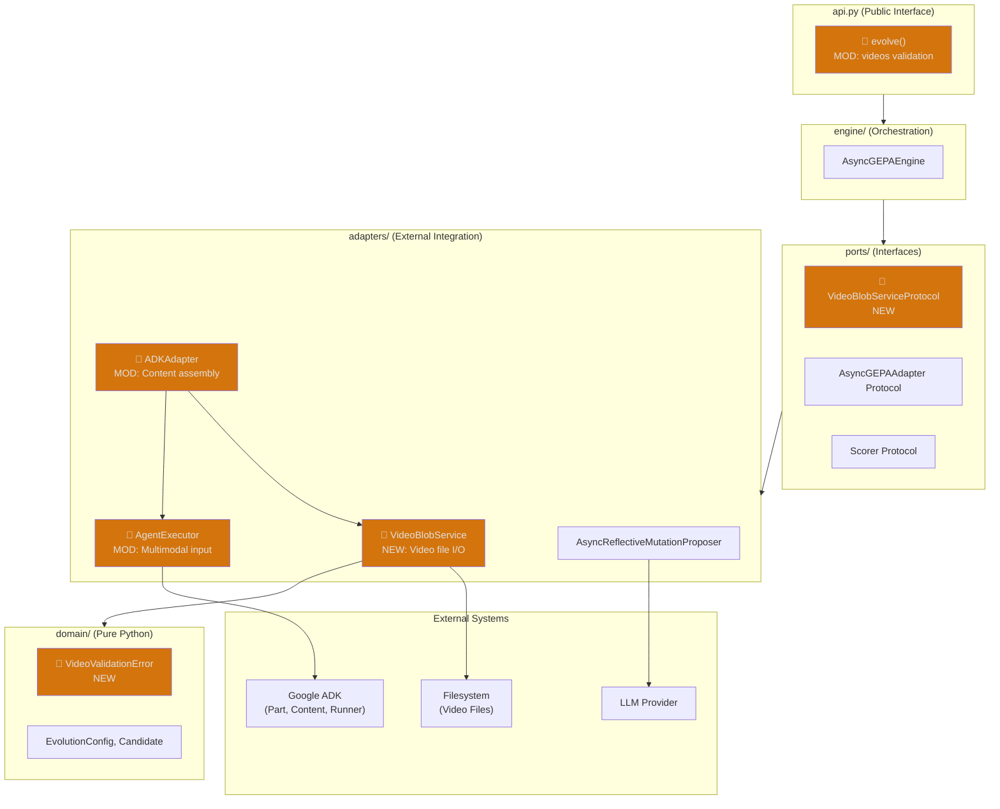
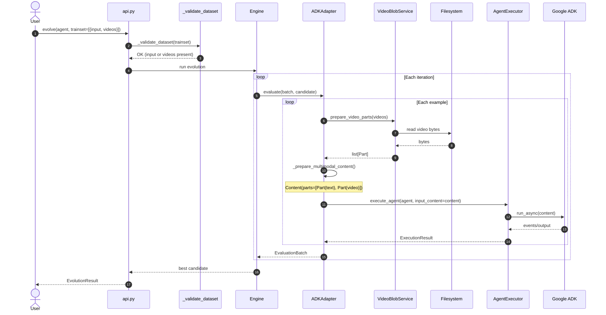
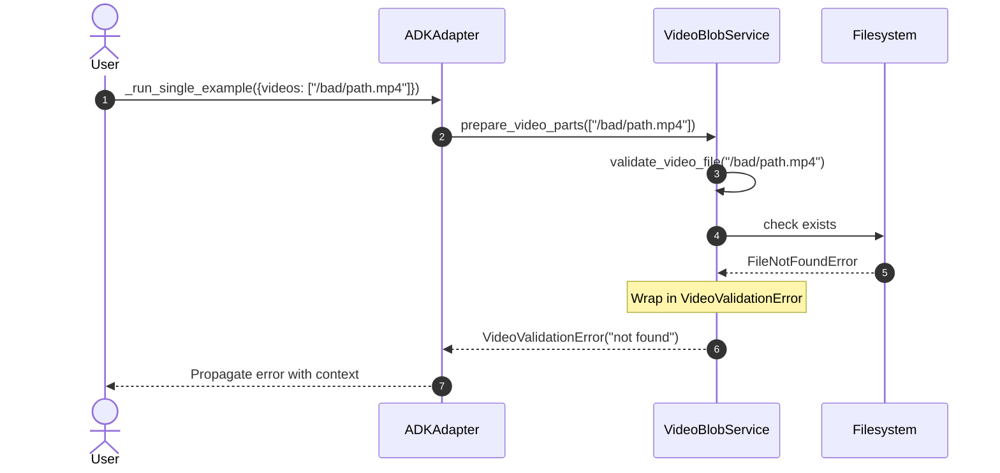
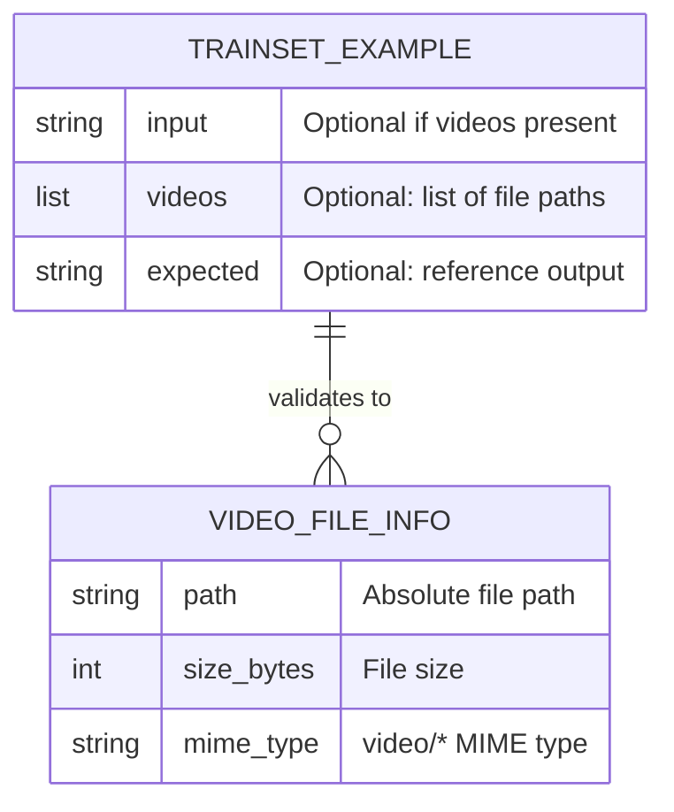

# Architecture: Multimodal Input Support

**Branch**: `235-multimodal-input` | **Date**: 2026-01-27 | **Status**: draft
**Spec**: [./spec.md](./spec.md) | **Plan**: [./plan.md](./plan.md) | **Tasks**: [./tasks.md](./tasks.md)

## 0. Links & References

- Feature Spec: `./spec.md`
- Implementation Plan: `./plan.md`
- Tasks: `./tasks.md`
- Related ADRs:
  - ADR-000: Hexagonal Architecture
  - ADR-001: Async-First Architecture
  - ADR-002: Protocol for Interfaces
  - ADR-005: Three-Layer Testing
  - ADR-006: External Library Integration
  - ADR-008: Structured Logging
  - ADR-009: Exception Hierarchy
- PRs: [link when available]

## 1. Purpose & Scope

### Goal

Enable trainset/valset examples to include video files alongside text prompts, allowing GEPA to evolve multimodal agents (e.g., video transcription, visual analysis) without text-only workarounds.

### Non-Goals

- Image file support (future iteration)
- Audio-only file support (future iteration)
- Video streaming or URL-based inputs
- Video preprocessing (resizing, compression)
- Remote storage integration (S3, GCS)
- Video caching optimization

### Scope Boundaries

- **In-scope**: Video file loading, validation, blob conversion, Content assembly, backward compatibility
- **Out-of-scope**: Non-video media types, cloud storage, preprocessing

### Constraints

- **Technical**: 2GB max file size (Gemini API limit), video/* MIME types only, local filesystem paths
- **Organizational**: Must follow hexagonal architecture, ADK types only in adapters layer
- **Conventions**: Protocol-based interfaces, async methods for I/O, structlog for observability

## 2. Architecture at a Glance

- **New port interface**: `VideoBlobServiceProtocol` defines video loading contract
- **New adapter**: `VideoBlobService` implements file I/O and Part creation
- **Extended executor**: `AgentExecutor.execute_agent()` accepts optional `Content` input
- **Extended adapter**: `ADKAdapter._run_single_example()` assembles multimodal Content
- **Extended validation**: `_validate_dataset()` allows `videos` field alternative to `input`
- **New exception**: `VideoValidationError` for file validation failures
- **Preserved compatibility**: Text-only trainsets work unchanged

## 3. Context Diagram (C4 Level 1)

## 4. Container Diagram (C4 Level 2)

## 5. Component Diagram (C4 Level 3)

## 6. Code Diagram (C4 Level 4)

## 7. Hexagonal Architecture View

## 8. Runtime Behavior (Sequence Diagrams)

### 8.1 Happy Path: Multimodal Evolution

### 8.2 Error Case: Video Validation Failure

## 9. Data Model & Contracts

### 9.1 Data Changes (No Persistence)

This feature does not add persistent data. Video files are read on-demand and converted to in-memory Part objects.

### 9.2 API Contracts

**Public API Changes**:
- `evolve()` — Trainset examples now accept optional `videos` field
- `_validate_dataset()` — Validates `input` OR `videos` present (not both required)

**New Protocol**:
- `VideoBlobServiceProtocol` — Contract for video loading (see contracts/video-blob-service.md)

**Extended Signature**:
- `AgentExecutor.execute_agent()` — New optional `input_content: Content` parameter

## 10. Deployment / Infrastructure View

No infrastructure changes. Video files are read from local filesystem during execution.

## 11. Quality Attributes (NFRs)

| Attribute | Requirement | Verification |
|-----------|-------------|--------------|
| **Performance** | Video loading adds <1s overhead per file | Unit tests with timing |
| **Reliability** | Clear errors for missing/invalid files | Error handling tests |
| **Memory** | No memory leaks for large videos | Integration tests with monitoring |
| **Maintainability** | Hexagonal architecture compliance | Layer import rules |
| **Observability** | Structured logging for video ops | Log format verification |
| **Compatibility** | 100% backward compatible | Existing test suite passes |

## 12. Testing Strategy

| Layer | Location | What to Test | Markers |
|-------|----------|--------------|---------|
| **Contract** | `tests/contracts/test_video_blob_contract.py` | Protocol compliance | `@pytest.mark.contract` |
| **Unit** | `tests/unit/adapters/test_video_blob_service.py` | Service logic with mocks | `@pytest.mark.unit` |
| **Unit** | `tests/unit/adapters/test_adk_adapter_multimodal.py` | Content assembly | `@pytest.mark.unit` |
| **Integration** | `tests/integration/test_multimodal_evolution.py` | End-to-end with real files | `@pytest.mark.integration` |

**Key Test Scenarios**:
1. Happy path: Video + text evolution with critic scoring
2. Backward compatibility: Text-only trainsets unchanged
3. Error handling: Missing file, oversized file, invalid MIME type
4. Edge cases: Multiple videos, video-only input, empty paths

## 13. Risks & Open Questions

### Risks

| Risk | Impact | Mitigation |
|------|--------|------------|
| Memory pressure with large videos | OOM errors during evolution | Document size limits, test with large files |
| Model provider video support varies | Some models may fail | Document supported models, graceful errors |
| File locking on Windows | Cannot read open videos | Document behavior, use read-only mode |

### Open Questions

- [x] Should videos be cached? → No, defer to future optimization
- [x] Handle duplicate video paths? → Process each reference

### TODOs

- [ ] Add performance benchmarks for video loading
- [ ] Document supported video formats per provider

## 14. Decisions (ADR References)

| ADR | Title | Relevance to This Feature |
|-----|-------|---------------------------|
| ADR-000 | Hexagonal Architecture | VideoBlobService in adapters/, protocol in ports/ |
| ADR-001 | Async-First | async prepare_video_parts() |
| ADR-002 | Protocol Interfaces | VideoBlobServiceProtocol with @runtime_checkable |
| ADR-005 | Three-Layer Testing | Contract, unit, integration tests |
| ADR-006 | External Library Integration | google.genai.types only in adapters/ |
| ADR-008 | Structured Logging | Video loading events logged |
| ADR-009 | Exception Hierarchy | VideoValidationError extends ConfigurationError |

**New ADRs Needed**: None
