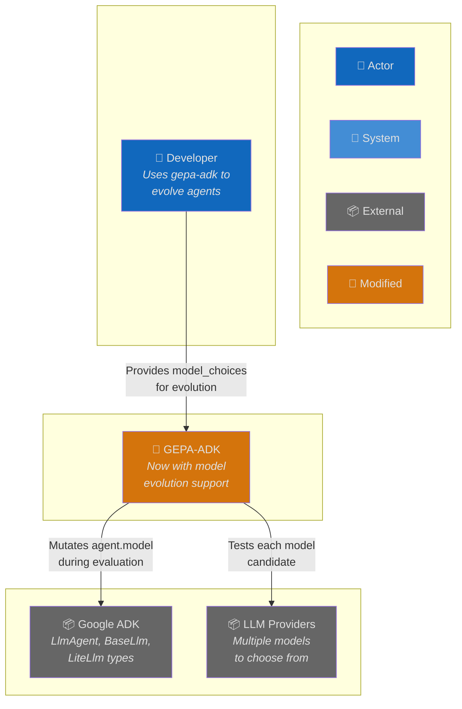
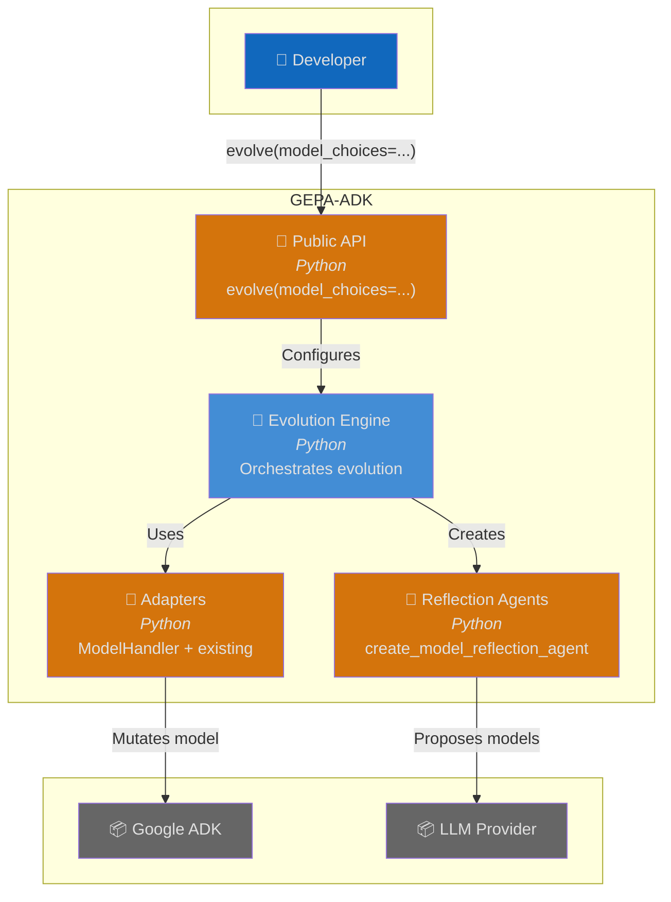
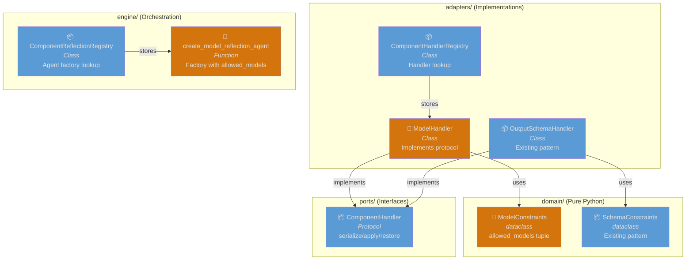
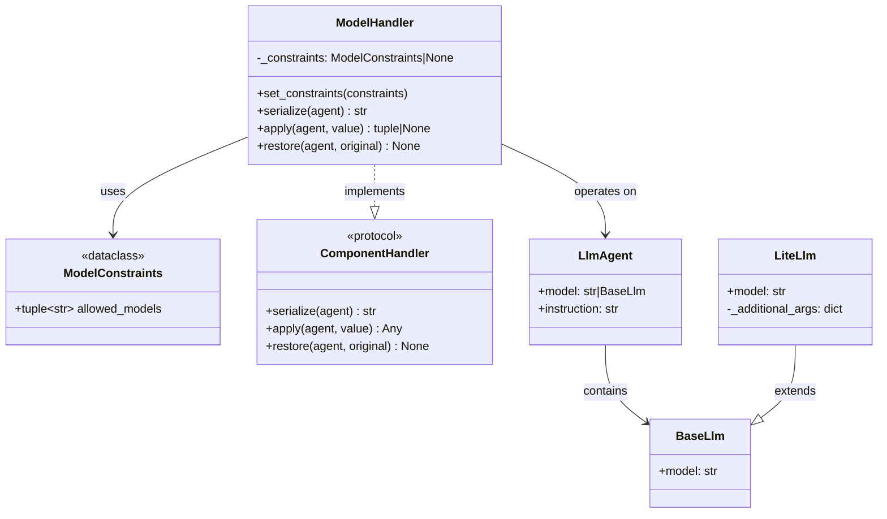
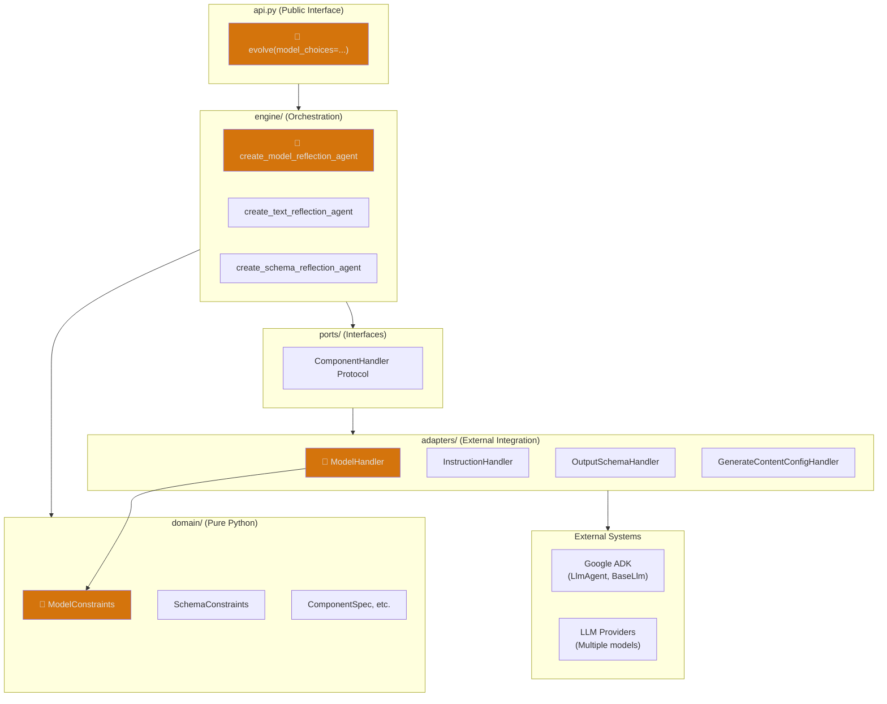
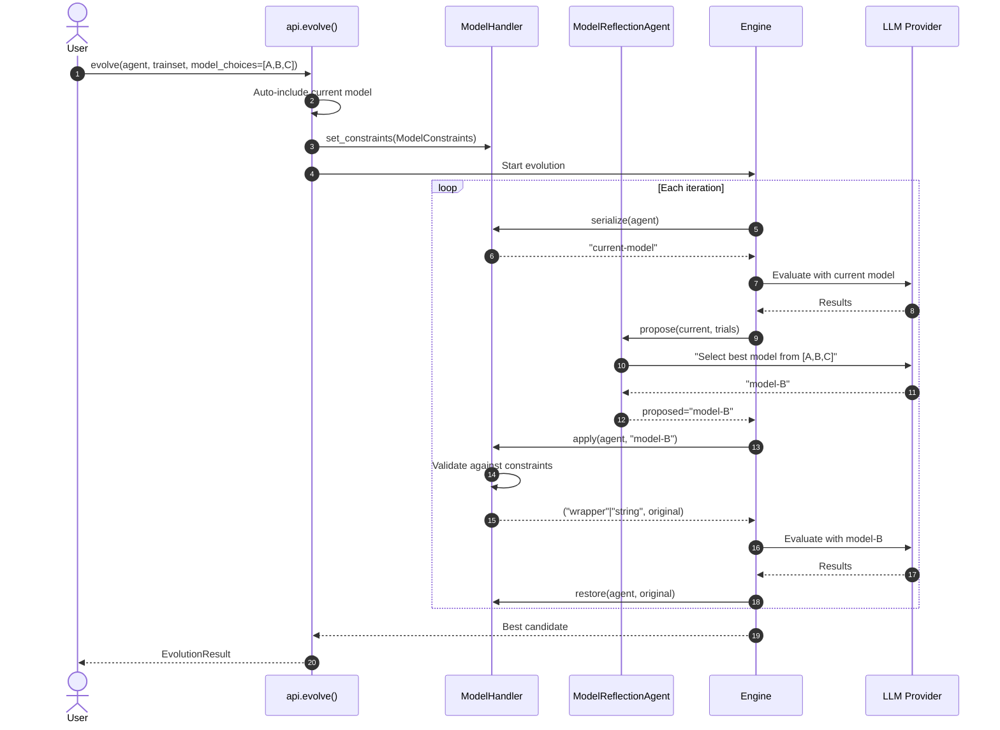
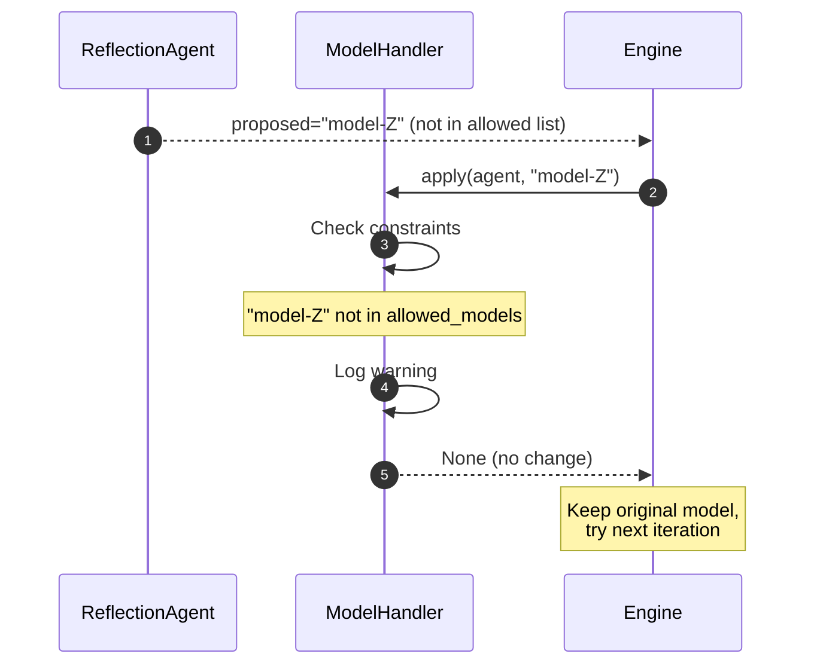
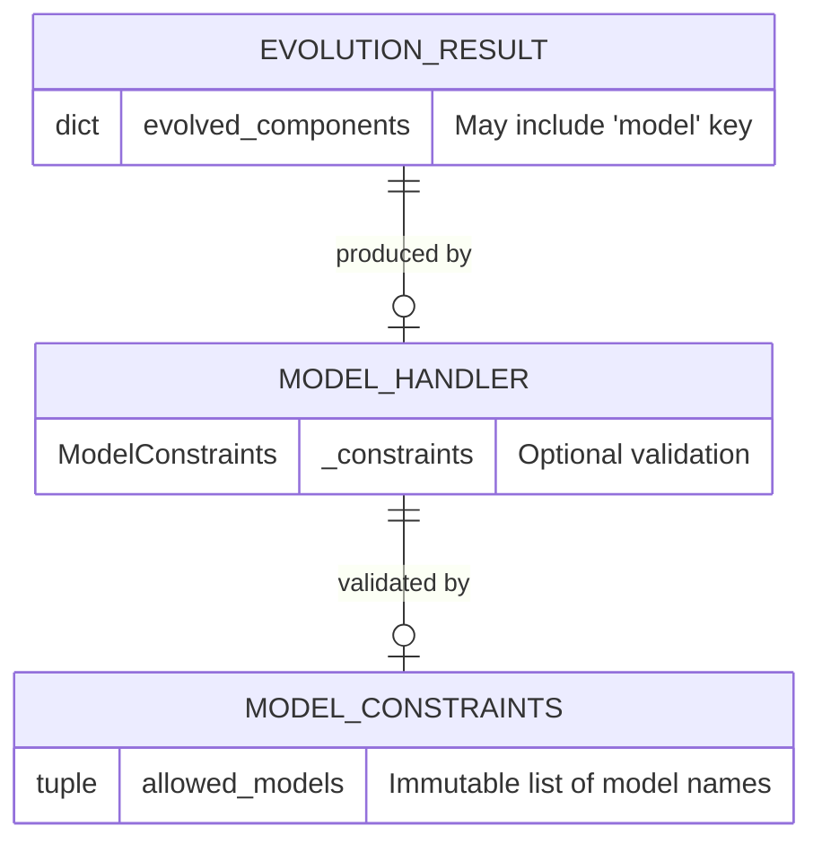

# Architecture: Model Evolution Support

**Branch**: `238-model-evolution` | **Date**: 2026-01-27 | **Status**: draft
**Spec**: [./spec.md](./spec.md) | **Plan**: [./plan.md](./plan.md) | **Tasks**: [./tasks.md](./tasks.md)

## 0. Links & References

- Feature Spec: `./spec.md`
- Implementation Plan: `./plan.md`
- Tasks: `./tasks.md` (pending)
- Related ADRs:
  - ADR-000: Hexagonal Architecture
  - ADR-002: Protocol for Interfaces
  - ADR-005: Three-Layer Testing
  - ADR-008: Structured Logging
- GitHub Issue: [#238](https://github.com/Alberto-Codes/gepa-adk/issues/238)

## 1. Purpose & Scope

### Goal

Enable evolutionary optimization of the model used by ADK agents, allowing users to discover the best-performing model from a set of allowed choices through the same process used for instruction, schema, and config evolution.

### Non-Goals

- Model performance benchmarking (separate from evolution)
- Automatic model discovery (user must provide explicit choices)
- Model cost optimization (user responsibility)
- Validation of model accessibility at configuration time

### Scope Boundaries

- **In-scope**:
  - `ModelConstraints` dataclass for allowed model choices
  - `ModelHandler` implementing `ComponentHandler` protocol
  - `create_model_reflection_agent()` factory function
  - `model_choices` parameter for `evolve()` API
  - Wrapper preservation during model mutation

- **Out-of-scope**:
  - Model cost tracking
  - Model capability analysis
  - Automatic model selection heuristics

### Constraints

- **Technical**: Python 3.12+, no new dependencies, ADK >= 1.22.0
- **Organizational**: Hexagonal architecture compliance, three-layer testing
- **Conventions**: Follow existing `SchemaConstraints` and `OutputSchemaHandler` patterns

## 2. Architecture at a Glance

- **New component type**: "model" joins existing instruction, output_schema, generate_content_config
- **Opt-in design**: Model evolution requires explicit `model_choices` parameter
- **Wrapper preservation**: Duck-typing on `.model` attribute enables in-place mutation
- **Existing integration**: Extends ComponentHandler protocol, no new protocols needed
- **Four layers touched**: domain (types), adapters (handlers), engine (reflection), api

## 3. Context Diagram (C4 Level 1)

## 4. Container Diagram (C4 Level 2)

## 5. Component Diagram (C4 Level 3)

## 6. Code Diagram (C4 Level 4)

## 7. Hexagonal Architecture View

## 8. Runtime Behavior (Sequence Diagrams)

### 8.1 Happy Path: Model Evolution

### 8.2 Error Case: Invalid Model Rejected

## 9. Data Model & Contracts

### 9.1 New Data Structure

### 9.2 API Contracts

**Public API Changes**:
- `evolve()` — New parameter: `model_choices: Sequence[str] | None = None`
- `EvolutionResult.evolved_components` — May contain `"model"` key when evolved

**Internal Protocol**: No changes to `ComponentHandler` protocol

## 10. Quality Attributes (NFRs)

| Attribute | Requirement | Verification |
|-----------|-------------|--------------|
| **Performance** | No degradation from existing evolution | Benchmark tests |
| **Reliability** | Graceful rejection of invalid models | Unit tests for constraint validation |
| **Maintainability** | Follows existing handler pattern | Code review against OutputSchemaHandler |
| **Observability** | Log model changes with structlog | Log format verification |

## 11. Testing Strategy

| Layer | Location | What to Test | Markers |
|-------|----------|--------------|---------|
| **Contract** | `tests/contracts/` | ModelHandler implements ComponentHandler | `@pytest.mark.contract` |
| **Unit** | `tests/unit/adapters/` | Handler serialize/apply/restore logic | `@pytest.mark.unit` |
| **Unit** | `tests/unit/domain/` | ModelConstraints validation | `@pytest.mark.unit` |
| **Integration** | `tests/integration/` | End-to-end model evolution | `@pytest.mark.integration` |

**Key Test Scenarios**:
1. String model serialization and mutation
2. Wrapper model mutation with preservation
3. Constraint validation (accept/reject)
4. Opt-in behavior (no model_choices = no evolution)
5. Auto-include current model

## 12. Risks & Open Questions

### Risks

| Risk | Impact | Mitigation |
|------|--------|------------|
| Wrapper mutation breaks custom subclasses | High | Duck-type on `.model` attribute, not specific types |
| Model names invalid at runtime | Medium | User responsibility; clear error messages |

### Open Questions

None - all clarified during research phase.

## 13. Decisions (ADR References)

| ADR | Title | Relevance to This Feature |
|-----|-------|---------------------------|
| ADR-000 | Hexagonal Architecture | ModelConstraints in domain, ModelHandler in adapters |
| ADR-002 | Protocol Interfaces | ModelHandler implements ComponentHandler |
| ADR-005 | Three-Layer Testing | Contract + unit + integration tests required |
| ADR-008 | Structured Logging | Log model evolution events |

**New ADRs Needed**: None - follows existing patterns.
